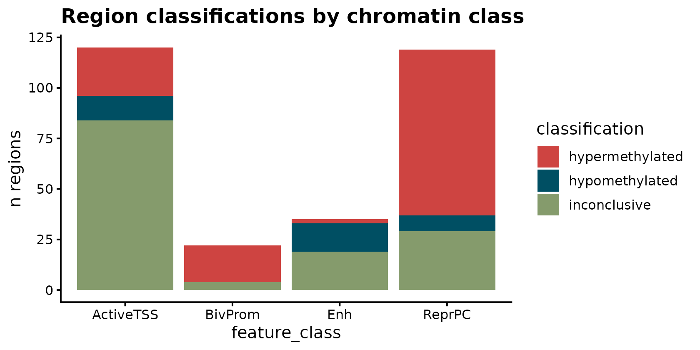
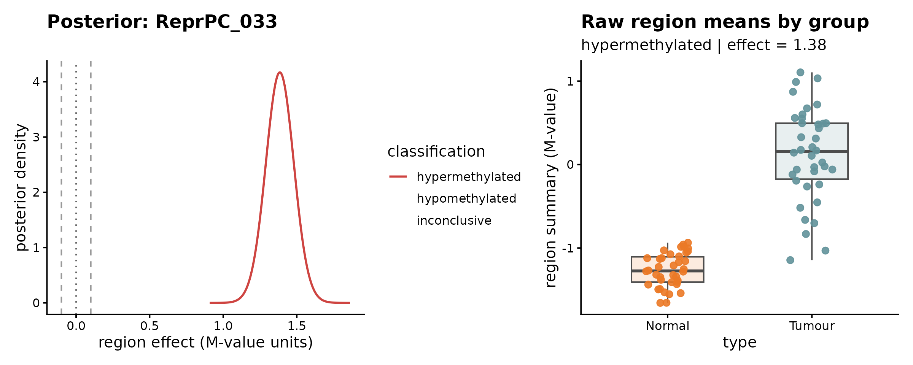
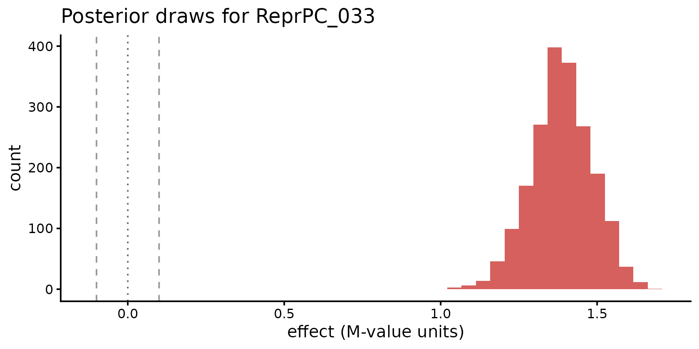

# Intro to BREAD

## Why BREAD?

Many methylation studies are not purely discovery-oriented. Instead of
asking *“which CpGs are significant genome-wide?”*, the question is
often region-centric:

- Are **bivalent promoters** hypermethylated in tumor vs. normal?
- Do **PMD-like heterochromatin regions** lose methylation in aging?
- Which of my **predefined chromatin classes** show coherent change?

BREAD answers those questions directly, returning posterior
probabilities per region at a biologically meaningful effect-size
threshold.

## A real-data demo: TCGA matched tumor–normal (HM450)

We use `HM450.76.TCGA.matched` from **`sesameData`** — 10,042 HM450
probes × 76 samples (38 patients each with matched Normal + Tumour).
This is a strong, well-understood signal: tumors show broad
hypermethylation at Polycomb targets and hypomethylation in
partially-methylated / quiescent regions.

``` r

library(BREAD)
library(sesameData)
library(knowYourCG)
library(SummarizedExperiment)
library(GenomicRanges)
library(ggplot2)
library(patchwork)
```

``` r

tcga      <- sesameData::sesameDataGet("HM450.76.TCGA.matched")
probeInfo <- sesameData::sesameDataGet("HM450.probeInfo")
```

``` r

probes <- probeInfo$mapped.probes.hg38
# keep only probes present in the TCGA beta matrix
keep   <- intersect(rownames(tcga$betas), names(probes))
se <- SummarizedExperiment(
  assays    = list(betas = tcga$betas[keep, , drop = FALSE]),
  rowRanges = probes[keep],
  colData   = tcga$sampleInfo
)
se$type <- factor(se$type, levels = c("Normal", "Tumour"))
se
#> class: RangedSummarizedExperiment 
#> dim: 9850 76 
#> metadata(0):
#> assays(1): betas
#> rownames(9850): cg00076353 cg00105628 ... ch.20.61946943R
#>   ch.20.1527371F
#> rowData names(0):
#> colnames(76): 2671-Tumour 2675-Tumour ... 6322-Normal 6625-Normal
#> colData names(2): patient type
```

## Define region sets via KnowYourCG

We use KnowYourCG’s HM450 chromHMM database to group probes by chromatin
state, then merge nearby same-state probes into intervals. This gives us
biologically meaningful feature classes with no manual annotation work.

``` r

chromhmm <- knowYourCG::getDBs("KYCG.HM450.chromHMM.20211020")
#> Selected the following database groups:
#> 1. KYCG.HM450.chromHMM.20211020
# chromhmm is a named list: state -> character vector of probe IDs
str(chromhmm, list.len = 3, give.attr = FALSE)
#> List of 15
#>  $ 5_TxWk     : chr [1:50090] "cg13869341" "cg09989996" "cg11954957" "cg20788133" ...
#>  $ 15_Quies   : chr [1:136838] "cg14008030" "cg12045430" "cg20826792" "cg00381604" ...
#>  $ 1_TssA     : chr [1:124275] "cg10037654" "cg14057946" "cg11422233" "cg16047670" ...
#>   [list output truncated]

# Keep a few interpretable classes
state_map <- c(
  BivProm   = "10_TssBiv",
  ReprPC    = "13_ReprPC",
  ActiveTSS = "1_TssA",
  Enh       = "7_Enh"
)
state_probes <- chromhmm[names(chromhmm) %in% state_map]
# Rename to friendly labels
names(state_probes) <- names(state_map)[match(names(state_probes), state_map)]

# Build regions per class: intersect with our SE probes, merge by ±2 kb
features <- do.call(c, unname(lapply(names(state_probes), function(cls) {
  pids <- intersect(state_probes[[cls]], rownames(se))
  if (length(pids) < 3L) return(GRanges())
  gr  <- rowRanges(se)[pids]
  red <- GenomicRanges::reduce(GenomicRanges::resize(gr, 4001L, fix = "center"))
  ov  <- GenomicRanges::countOverlaps(red, gr)
  red <- red[ov >= 3L]
  # Cap per class for speed
  if (length(red) > 120L) red <- sort(red[sample.int(length(red), 120L)])
  mcols(red)$feature_class <- cls
  names(red) <- sprintf("%s_%03d", cls, seq_along(red))
  red
})))
table(features$feature_class)
#> 
#> ActiveTSS   BivProm       Enh    ReprPC 
#>       120        22        35       119
```

## Fit BREAD with one call

[`fit_bread()`](https://baczemin.github.io/BREAD/reference/fit_bread.md)
auto-detects the assay (`"betas"`) and the scale (`"Beta"` from the
value range), so the minimal call is:

``` r

fit <- fit_bread(se, features, design = ~ type,
                 feature_class_col = "feature_class")
#> `contrast` not supplied; using 'typeTumour' (first non-intercept coefficient).
fit
#> <BreadFit>
#>   mode       : summary 
#>   backend    : conjugate 
#>   input_scale: Beta 
#>   assay      : betas 
#>   contrast   : typeTumour 
#>   delta      : 0.1 
#>   prob_cutoff: 0.95 
#>   n_regions  : 296 (of  296  input)
#>   classifications:
#>     hypermethylated  126
#>     hypomethylated   34
#>     inconclusive     136
```

Under the hood BREAD is running an analytic conjugate posterior per
region; 480 regions fit in well under a second on a laptop. Default
thresholds (`delta = 0.10`, `prob_cutoff = 0.95`) can be overridden if
you want to be stricter or looser.

## Results

``` r

res <- results(fit)
head(res[order(res$p_gt_delta, decreasing = TRUE),
         c("region_id", "mean_effect", "ci_lo", "ci_hi",
           "p_gt_delta", "p_lt_neg_delta", "classification")], 5)
#>      region_id mean_effect     ci_lo    ci_hi p_gt_delta p_lt_neg_delta
#> 13  ReprPC_033   1.3848617 1.1949272 1.574796          1   1.181014e-25
#> 20  ReprPC_079   0.9376099 0.7808908 1.094329          1   1.236044e-21
#> 21 BivProm_018   1.1291105 0.9491664 1.309055          1   2.318923e-22
#> 33  ReprPC_082   1.8653618 1.6605052 2.070218          1   4.751212e-31
#> 50  ReprPC_106   1.2961459 1.1230822 1.469210          1   1.878995e-26
#>     classification
#> 13 hypermethylated
#> 20 hypermethylated
#> 21 hypermethylated
#> 33 hypermethylated
#> 50 hypermethylated
```

``` r

mp <- unique(fit@mapping[, c("region_id", "feature_class")])
cls_tbl <- merge(res[, c("region_id", "classification")], mp,
                 by = "region_id")
table(cls_tbl$feature_class, cls_tbl$classification)
#>            
#>             hypermethylated hypomethylated inconclusive
#>   ActiveTSS              24             12           84
#>   BivProm                18              0            4
#>   Enh                     2             14           19
#>   ReprPC                 82              8           29
```

Classic tumor methylome signatures come through:

- **Polycomb-repressed (ReprPC)** and **bivalent promoters (BivProm)**
  hypermethylate — the classic TCGA “tumor CpG island methylator
  phenotype”-adjacent signal.
- **Active TSS** largely unchanged at region level.

## Visualize

### Classification summary

``` r

plot_feature_set(fit, feature_class_col = "feature_class") +
  ggtitle("Region classifications by chromatin class")
```



### One region: posterior density + raw beta

Pick the top hypermethylated region and inspect the posterior +
underlying values. The x-axis preserves the factor order we set on
`se$type` — Normal on the left, Tumour on the right.

``` r

top_hyper <- res[res$classification == "hypermethylated", ]
top_hyper <- top_hyper[order(top_hyper$p_gt_delta, decreasing = TRUE), ]
rid <- top_hyper$region_id[1]

p1 <- plot_region_posterior(fit, region_id = rid) +
  ggtitle(sprintf("Posterior: %s", rid))
p2 <- plot_region_data(fit, region_id = rid) +
  ggtitle("Raw region means by group")
p1 | p2
```



### Posterior draws

``` r

d <- posterior_draws(fit, region_id = rid, n = 2000L, seed = 1L)
ggplot(d, aes(x = value)) +
  geom_histogram(
    bins = 40,
    fill = bread_colors("classification")[["hypermethylated"]],
    alpha = 0.85
  ) +
  geom_vline(
    xintercept = c(-0.10, 0, 0.10),
    linetype   = c("dashed","dotted","dashed"),
    color      = c("gray60","gray40","gray60")
  ) +
  labs(x = "effect (M-value units)", y = "count",
       title = sprintf("Posterior draws for %s", rid)) +
  theme_classic(base_size = 12)
```



## Enrichment: what’s driving the hyper/hypo sets?

[`bread_kycg()`](https://baczemin.github.io/BREAD/reference/bread_kycg.md)
hands the probes in hyper- or hypo-classified regions off to
[`knowYourCG::testEnrichment()`](https://rdrr.io/pkg/knowYourCG/man/testEnrichment.html)
against curated HM450 databases (TFBS, chromHMM, tissue signatures, …).
The universe is the set of probes BREAD actually tested.

``` r

enr <- bread_kycg(
  fit,
  which    = c("hypermethylated", "hypomethylated"),
  platform = "HM450",
  databases = c(
    "KYCG.HM450.chromHMM.20211020",
    "KYCG.HM450.TFBSconsensus.20211013"
  )
)
#> Warning in phyper(nDQ - 1, m, n, k, lower.tail = FALSE, log.p = TRUE): NaNs
#> produced
#> Warning in sqrt(as.numeric(nD) * (nU - nD) * nQ * (nU - nQ)): NaNs produced
#> Warning in data.frame(estimate = log2(odds_ratio), p.value = 10^log10.p.value,
#> : NaNs produced
#> Warning in phyper(nDQ - 1, m, n, k, lower.tail = FALSE, log.p = TRUE): NaNs
#> produced
#> Warning in sqrt(as.numeric(nD) * (nU - nD) * nQ * (nU - nQ)): NaNs produced
#> Warning in data.frame(estimate = log2(odds_ratio), p.value = 10^log10.p.value,
#> : NaNs produced
#> Warning in phyper(nDQ - 1, m, n, k, lower.tail = FALSE, log.p = TRUE): NaNs
#> produced
#> Warning in sqrt(as.numeric(nD) * (nU - nD) * nQ * (nU - nQ)): NaNs produced
#> Warning in data.frame(estimate = log2(odds_ratio), p.value = 10^log10.p.value,
#> : NaNs produced
#> Warning in phyper(nDQ - 1, m, n, k, lower.tail = FALSE, log.p = TRUE): NaNs
#> produced
#> Warning in sqrt(as.numeric(nD) * (nU - nD) * nQ * (nU - nQ)): NaNs produced
#> Warning in data.frame(estimate = log2(odds_ratio), p.value = 10^log10.p.value,
#> : NaNs produced
#> Warning in phyper(nDQ - 1, m, n, k, lower.tail = FALSE, log.p = TRUE): NaNs
#> produced
#> Warning in sqrt(as.numeric(nD) * (nU - nD) * nQ * (nU - nQ)): NaNs produced
#> Warning in phyper(nDQ - 1, m, n, k, lower.tail = FALSE, log.p = TRUE): NaNs
#> produced
#> Warning in sqrt(as.numeric(nD) * (nU - nD) * nQ * (nU - nQ)): NaNs produced
#> Warning in data.frame(estimate = log2(odds_ratio), p.value = 10^log10.p.value,
#> : NaNs produced
#> Warning in phyper(nDQ - 1, m, n, k, lower.tail = FALSE, log.p = TRUE): NaNs
#> produced
#> Warning in sqrt(as.numeric(nD) * (nU - nD) * nQ * (nU - nQ)): NaNs produced
#> Warning in data.frame(estimate = log2(odds_ratio), p.value = 10^log10.p.value,
#> : NaNs produced
#> Warning in phyper(nDQ - 1, m, n, k, lower.tail = FALSE, log.p = TRUE): NaNs
#> produced
#> Warning in sqrt(as.numeric(nD) * (nU - nD) * nQ * (nU - nQ)): NaNs produced
#> Warning in data.frame(estimate = log2(odds_ratio), p.value = 10^log10.p.value,
#> : NaNs produced
#> Warning in phyper(nDQ - 1, m, n, k, lower.tail = FALSE, log.p = TRUE): NaNs
#> produced
#> Warning in sqrt(as.numeric(nD) * (nU - nD) * nQ * (nU - nQ)): NaNs produced
#> Warning in data.frame(estimate = log2(odds_ratio), p.value = 10^log10.p.value,
#> : NaNs produced
#> Warning in phyper(nDQ - 1, m, n, k, lower.tail = FALSE, log.p = TRUE): NaNs
#> produced
#> Warning in sqrt(as.numeric(nD) * (nU - nD) * nQ * (nU - nQ)): NaNs produced
#> Warning in data.frame(estimate = log2(odds_ratio), p.value = 10^log10.p.value,
#> : NaNs produced
#> Warning in phyper(nDQ - 1, m, n, k, lower.tail = FALSE, log.p = TRUE): NaNs
#> produced
#> Warning in sqrt(as.numeric(nD) * (nU - nD) * nQ * (nU - nQ)): NaNs produced
#> Warning in data.frame(estimate = log2(odds_ratio), p.value = 10^log10.p.value,
#> : NaNs produced
#> Warning in phyper(nDQ - 1, m, n, k, lower.tail = FALSE, log.p = TRUE): NaNs
#> produced
#> Warning in sqrt(as.numeric(nD) * (nU - nD) * nQ * (nU - nQ)): NaNs produced
#> Warning in data.frame(estimate = log2(odds_ratio), p.value = 10^log10.p.value,
#> : NaNs produced
#> Warning in phyper(nDQ - 1, m, n, k, lower.tail = FALSE, log.p = TRUE): NaNs
#> produced
#> Warning in sqrt(as.numeric(nD) * (nU - nD) * nQ * (nU - nQ)): NaNs produced
#> Warning in data.frame(estimate = log2(odds_ratio), p.value = 10^log10.p.value,
#> : NaNs produced
#> Warning in phyper(nDQ - 1, m, n, k, lower.tail = FALSE, log.p = TRUE): NaNs
#> produced
#> Warning in sqrt(as.numeric(nD) * (nU - nD) * nQ * (nU - nQ)): NaNs produced
#> Warning in data.frame(estimate = log2(odds_ratio), p.value = 10^log10.p.value,
#> : NaNs produced
#> Warning in phyper(nDQ - 1, m, n, k, lower.tail = FALSE, log.p = TRUE): NaNs
#> produced
#> Warning in sqrt(as.numeric(nD) * (nU - nD) * nQ * (nU - nQ)): NaNs produced
#> Warning in phyper(nDQ - 1, m, n, k, lower.tail = FALSE, log.p = TRUE): NaNs
#> produced
#> Warning in sqrt(as.numeric(nD) * (nU - nD) * nQ * (nU - nQ)): NaNs produced
#> Warning in data.frame(estimate = log2(odds_ratio), p.value = 10^log10.p.value,
#> : NaNs produced
#> Warning in phyper(nDQ - 1, m, n, k, lower.tail = FALSE, log.p = TRUE): NaNs
#> produced
#> Warning in sqrt(as.numeric(nD) * (nU - nD) * nQ * (nU - nQ)): NaNs produced
#> Warning in data.frame(estimate = log2(odds_ratio), p.value = 10^log10.p.value,
#> : NaNs produced
#> Warning in phyper(nDQ - 1, m, n, k, lower.tail = FALSE, log.p = TRUE): NaNs
#> produced
#> Warning in sqrt(as.numeric(nD) * (nU - nD) * nQ * (nU - nQ)): NaNs produced
#> Warning in data.frame(estimate = log2(odds_ratio), p.value = 10^log10.p.value,
#> : NaNs produced
#> Warning in phyper(nDQ - 1, m, n, k, lower.tail = FALSE, log.p = TRUE): NaNs
#> produced
#> Warning in sqrt(as.numeric(nD) * (nU - nD) * nQ * (nU - nQ)): NaNs produced
#> Warning in data.frame(estimate = log2(odds_ratio), p.value = 10^log10.p.value,
#> : NaNs produced
#> Warning in phyper(nDQ - 1, m, n, k, lower.tail = FALSE, log.p = TRUE): NaNs
#> produced
#> Warning in sqrt(as.numeric(nD) * (nU - nD) * nQ * (nU - nQ)): NaNs produced
#> Warning in data.frame(estimate = log2(odds_ratio), p.value = 10^log10.p.value,
#> : NaNs produced
#> Warning in phyper(nDQ - 1, m, n, k, lower.tail = FALSE, log.p = TRUE): NaNs
#> produced
#> Warning in sqrt(as.numeric(nD) * (nU - nD) * nQ * (nU - nQ)): NaNs produced
#> Warning in data.frame(estimate = log2(odds_ratio), p.value = 10^log10.p.value,
#> : NaNs produced
#> Warning in phyper(nDQ - 1, m, n, k, lower.tail = FALSE, log.p = TRUE): NaNs
#> produced
#> Warning in sqrt(as.numeric(nD) * (nU - nD) * nQ * (nU - nQ)): NaNs produced
#> Warning in data.frame(estimate = log2(odds_ratio), p.value = 10^log10.p.value,
#> : NaNs produced
#> Warning in phyper(nDQ - 1, m, n, k, lower.tail = FALSE, log.p = TRUE): NaNs
#> produced
#> Warning in sqrt(as.numeric(nD) * (nU - nD) * nQ * (nU - nQ)): NaNs produced
#> Warning in data.frame(estimate = log2(odds_ratio), p.value = 10^log10.p.value,
#> : NaNs produced
#> Warning in phyper(nDQ - 1, m, n, k, lower.tail = FALSE, log.p = TRUE): NaNs
#> produced
#> Warning in sqrt(as.numeric(nD) * (nU - nD) * nQ * (nU - nQ)): NaNs produced
#> Warning in data.frame(estimate = log2(odds_ratio), p.value = 10^log10.p.value,
#> : NaNs produced
#> Warning in phyper(nDQ - 1, m, n, k, lower.tail = FALSE, log.p = TRUE): NaNs
#> produced
#> Warning in sqrt(as.numeric(nD) * (nU - nD) * nQ * (nU - nQ)): NaNs produced
#> Warning in phyper(nDQ - 1, m, n, k, lower.tail = FALSE, log.p = TRUE): NaNs
#> produced
#> Warning in sqrt(as.numeric(nD) * (nU - nD) * nQ * (nU - nQ)): NaNs produced
#> Warning in data.frame(estimate = log2(odds_ratio), p.value = 10^log10.p.value,
#> : NaNs produced
#> Warning in phyper(nDQ - 1, m, n, k, lower.tail = FALSE, log.p = TRUE): NaNs
#> produced
#> Warning in sqrt(as.numeric(nD) * (nU - nD) * nQ * (nU - nQ)): NaNs produced
#> Warning in data.frame(estimate = log2(odds_ratio), p.value = 10^log10.p.value,
#> : NaNs produced
#> Warning in phyper(nDQ - 1, m, n, k, lower.tail = FALSE, log.p = TRUE): NaNs
#> produced
#> Warning in sqrt(as.numeric(nD) * (nU - nD) * nQ * (nU - nQ)): NaNs produced
#> Warning in data.frame(estimate = log2(odds_ratio), p.value = 10^log10.p.value,
#> : NaNs produced
#> Warning in phyper(nDQ - 1, m, n, k, lower.tail = FALSE, log.p = TRUE): NaNs
#> produced
#> Warning in sqrt(as.numeric(nD) * (nU - nD) * nQ * (nU - nQ)): NaNs produced
#> Warning in phyper(nDQ - 1, m, n, k, lower.tail = FALSE, log.p = TRUE): NaNs
#> produced
#> Warning in sqrt(as.numeric(nD) * (nU - nD) * nQ * (nU - nQ)): NaNs produced
#> Warning in data.frame(estimate = log2(odds_ratio), p.value = 10^log10.p.value,
#> : NaNs produced
#> Warning in phyper(nDQ - 1, m, n, k, lower.tail = FALSE, log.p = TRUE): NaNs
#> produced
#> Warning in sqrt(as.numeric(nD) * (nU - nD) * nQ * (nU - nQ)): NaNs produced
#> Warning in data.frame(estimate = log2(odds_ratio), p.value = 10^log10.p.value,
#> : NaNs produced
#> Warning in phyper(nDQ - 1, m, n, k, lower.tail = FALSE, log.p = TRUE): NaNs
#> produced
#> Warning in sqrt(as.numeric(nD) * (nU - nD) * nQ * (nU - nQ)): NaNs produced
#> Warning in data.frame(estimate = log2(odds_ratio), p.value = 10^log10.p.value,
#> : NaNs produced
#> Warning in phyper(nDQ - 1, m, n, k, lower.tail = FALSE, log.p = TRUE): NaNs
#> produced
#> Warning in sqrt(as.numeric(nD) * (nU - nD) * nQ * (nU - nQ)): NaNs produced
#> Warning in phyper(nDQ - 1, m, n, k, lower.tail = FALSE, log.p = TRUE): NaNs
#> produced
#> Warning in sqrt(as.numeric(nD) * (nU - nD) * nQ * (nU - nQ)): NaNs produced
#> Warning in phyper(nDQ - 1, m, n, k, lower.tail = FALSE, log.p = TRUE): NaNs
#> produced
#> Warning in sqrt(as.numeric(nD) * (nU - nD) * nQ * (nU - nQ)): NaNs produced
#> Warning in data.frame(estimate = log2(odds_ratio), p.value = 10^log10.p.value,
#> : NaNs produced
#> Warning in phyper(nDQ - 1, m, n, k, lower.tail = FALSE, log.p = TRUE): NaNs
#> produced
#> Warning in sqrt(as.numeric(nD) * (nU - nD) * nQ * (nU - nQ)): NaNs produced
#> Warning in data.frame(estimate = log2(odds_ratio), p.value = 10^log10.p.value,
#> : NaNs produced
#> Warning in phyper(nDQ - 1, m, n, k, lower.tail = FALSE, log.p = TRUE): NaNs
#> produced
#> Warning in sqrt(as.numeric(nD) * (nU - nD) * nQ * (nU - nQ)): NaNs produced
#> Warning in data.frame(estimate = log2(odds_ratio), p.value = 10^log10.p.value,
#> : NaNs produced
#> Warning in phyper(nDQ - 1, m, n, k, lower.tail = FALSE, log.p = TRUE): NaNs
#> produced
#> Warning in sqrt(as.numeric(nD) * (nU - nD) * nQ * (nU - nQ)): NaNs produced
#> Warning in data.frame(estimate = log2(odds_ratio), p.value = 10^log10.p.value,
#> : NaNs produced
#> Warning in phyper(nDQ - 1, m, n, k, lower.tail = FALSE, log.p = TRUE): NaNs
#> produced
#> Warning in sqrt(as.numeric(nD) * (nU - nD) * nQ * (nU - nQ)): NaNs produced
#> Warning in phyper(nDQ - 1, m, n, k, lower.tail = FALSE, log.p = TRUE): NaNs
#> produced
#> Warning in sqrt(as.numeric(nD) * (nU - nD) * nQ * (nU - nQ)): NaNs produced
#> Warning in data.frame(estimate = log2(odds_ratio), p.value = 10^log10.p.value,
#> : NaNs produced
#> Warning in phyper(nDQ - 1, m, n, k, lower.tail = FALSE, log.p = TRUE): NaNs
#> produced
#> Warning in sqrt(as.numeric(nD) * (nU - nD) * nQ * (nU - nQ)): NaNs produced
#> Warning in data.frame(estimate = log2(odds_ratio), p.value = 10^log10.p.value,
#> : NaNs produced
#> Warning in phyper(nDQ - 1, m, n, k, lower.tail = FALSE, log.p = TRUE): NaNs
#> produced
#> Warning in sqrt(as.numeric(nD) * (nU - nD) * nQ * (nU - nQ)): NaNs produced
#> Warning in data.frame(estimate = log2(odds_ratio), p.value = 10^log10.p.value,
#> : NaNs produced
#> Warning in phyper(nDQ - 1, m, n, k, lower.tail = FALSE, log.p = TRUE): NaNs
#> produced
#> Warning in sqrt(as.numeric(nD) * (nU - nD) * nQ * (nU - nQ)): NaNs produced
#> Warning in phyper(nDQ - 1, m, n, k, lower.tail = FALSE, log.p = TRUE): NaNs
#> produced
#> Warning in sqrt(as.numeric(nD) * (nU - nD) * nQ * (nU - nQ)): NaNs produced
#> Warning in phyper(nDQ - 1, m, n, k, lower.tail = FALSE, log.p = TRUE): NaNs
#> produced
#> Warning in sqrt(as.numeric(nD) * (nU - nD) * nQ * (nU - nQ)): NaNs produced
#> Warning in phyper(nDQ - 1, m, n, k, lower.tail = FALSE, log.p = TRUE): NaNs
#> produced
#> Warning in sqrt(as.numeric(nD) * (nU - nD) * nQ * (nU - nQ)): NaNs produced
#> Warning in data.frame(estimate = log2(odds_ratio), p.value = 10^log10.p.value,
#> : NaNs produced
#> Warning in phyper(nDQ - 1, m, n, k, lower.tail = FALSE, log.p = TRUE): NaNs
#> produced
#> Warning in sqrt(as.numeric(nD) * (nU - nD) * nQ * (nU - nQ)): NaNs produced
#> Warning in data.frame(estimate = log2(odds_ratio), p.value = 10^log10.p.value,
#> : NaNs produced
#> Warning in phyper(nDQ - 1, m, n, k, lower.tail = FALSE, log.p = TRUE): NaNs
#> produced
#> Warning in sqrt(as.numeric(nD) * (nU - nD) * nQ * (nU - nQ)): NaNs produced
#> Warning in data.frame(estimate = log2(odds_ratio), p.value = 10^log10.p.value,
#> : NaNs produced
#> Warning in phyper(nDQ - 1, m, n, k, lower.tail = FALSE, log.p = TRUE): NaNs
#> produced
#> Warning in sqrt(as.numeric(nD) * (nU - nD) * nQ * (nU - nQ)): NaNs produced
#> Warning in data.frame(estimate = log2(odds_ratio), p.value = 10^log10.p.value,
#> : NaNs produced
#> Warning in phyper(nDQ - 1, m, n, k, lower.tail = FALSE, log.p = TRUE): NaNs
#> produced
#> Warning in sqrt(as.numeric(nD) * (nU - nD) * nQ * (nU - nQ)): NaNs produced
#> Warning in phyper(nDQ - 1, m, n, k, lower.tail = FALSE, log.p = TRUE): NaNs
#> produced
#> Warning in sqrt(as.numeric(nD) * (nU - nD) * nQ * (nU - nQ)): NaNs produced
#> Warning in data.frame(estimate = log2(odds_ratio), p.value = 10^log10.p.value,
#> : NaNs produced
#> Warning in phyper(nDQ - 1, m, n, k, lower.tail = FALSE, log.p = TRUE): NaNs
#> produced
#> Warning in sqrt(as.numeric(nD) * (nU - nD) * nQ * (nU - nQ)): NaNs produced
#> Warning in phyper(nDQ - 1, m, n, k, lower.tail = FALSE, log.p = TRUE): NaNs
#> produced
#> Warning in sqrt(as.numeric(nD) * (nU - nD) * nQ * (nU - nQ)): NaNs produced
#> Warning in phyper(nDQ - 1, m, n, k, lower.tail = FALSE, log.p = TRUE): NaNs
#> produced
#> Warning in sqrt(as.numeric(nD) * (nU - nD) * nQ * (nU - nQ)): NaNs produced
#> Warning in data.frame(estimate = log2(odds_ratio), p.value = 10^log10.p.value,
#> : NaNs produced
#> Warning in phyper(nDQ - 1, m, n, k, lower.tail = FALSE, log.p = TRUE): NaNs
#> produced
#> Warning in sqrt(as.numeric(nD) * (nU - nD) * nQ * (nU - nQ)): NaNs produced
#> Warning in data.frame(estimate = log2(odds_ratio), p.value = 10^log10.p.value,
#> : NaNs produced
#> Warning in phyper(nDQ - 1, m, n, k, lower.tail = FALSE, log.p = TRUE): NaNs
#> produced
#> Warning in sqrt(as.numeric(nD) * (nU - nD) * nQ * (nU - nQ)): NaNs produced
#> Warning in data.frame(estimate = log2(odds_ratio), p.value = 10^log10.p.value,
#> : NaNs produced
#> Warning in phyper(nDQ - 1, m, n, k, lower.tail = FALSE, log.p = TRUE): NaNs
#> produced
#> Warning in sqrt(as.numeric(nD) * (nU - nD) * nQ * (nU - nQ)): NaNs produced
#> Warning in phyper(nDQ - 1, m, n, k, lower.tail = FALSE, log.p = TRUE): NaNs
#> produced
#> Warning in sqrt(as.numeric(nD) * (nU - nD) * nQ * (nU - nQ)): NaNs produced
#> Warning in data.frame(estimate = log2(odds_ratio), p.value = 10^log10.p.value,
#> : NaNs produced
#> Warning in phyper(nDQ - 1, m, n, k, lower.tail = FALSE, log.p = TRUE): NaNs
#> produced
#> Warning in sqrt(as.numeric(nD) * (nU - nD) * nQ * (nU - nQ)): NaNs produced
#> Warning in phyper(nDQ - 1, m, n, k, lower.tail = FALSE, log.p = TRUE): NaNs
#> produced
#> Warning in sqrt(as.numeric(nD) * (nU - nD) * nQ * (nU - nQ)): NaNs produced
#> Warning in data.frame(estimate = log2(odds_ratio), p.value = 10^log10.p.value,
#> : NaNs produced
#> Warning in phyper(nDQ - 1, m, n, k, lower.tail = FALSE, log.p = TRUE): NaNs
#> produced
#> Warning in sqrt(as.numeric(nD) * (nU - nD) * nQ * (nU - nQ)): NaNs produced
#> Warning in phyper(nDQ - 1, m, n, k, lower.tail = FALSE, log.p = TRUE): NaNs
#> produced
#> Warning in sqrt(as.numeric(nD) * (nU - nD) * nQ * (nU - nQ)): NaNs produced
#> Warning in data.frame(estimate = log2(odds_ratio), p.value = 10^log10.p.value,
#> : NaNs produced
#> Warning in phyper(nDQ - 1, m, n, k, lower.tail = FALSE, log.p = TRUE): NaNs
#> produced
#> Warning in sqrt(as.numeric(nD) * (nU - nD) * nQ * (nU - nQ)): NaNs produced
#> Warning in data.frame(estimate = log2(odds_ratio), p.value = 10^log10.p.value,
#> : NaNs produced
#> Warning in phyper(nDQ - 1, m, n, k, lower.tail = FALSE, log.p = TRUE): NaNs
#> produced
#> Warning in sqrt(as.numeric(nD) * (nU - nD) * nQ * (nU - nQ)): NaNs produced
#> Warning in data.frame(estimate = log2(odds_ratio), p.value = 10^log10.p.value,
#> : NaNs produced
#> Warning in phyper(nDQ - 1, m, n, k, lower.tail = FALSE, log.p = TRUE): NaNs
#> produced
#> Warning in sqrt(as.numeric(nD) * (nU - nD) * nQ * (nU - nQ)): NaNs produced
#> Warning in phyper(nDQ - 1, m, n, k, lower.tail = FALSE, log.p = TRUE): NaNs
#> produced
#> Warning in sqrt(as.numeric(nD) * (nU - nD) * nQ * (nU - nQ)): NaNs produced
#> Warning in data.frame(estimate = log2(odds_ratio), p.value = 10^log10.p.value,
#> : NaNs produced
#> Warning in phyper(nDQ - 1, m, n, k, lower.tail = FALSE, log.p = TRUE): NaNs
#> produced
#> Warning in sqrt(as.numeric(nD) * (nU - nD) * nQ * (nU - nQ)): NaNs produced
#> Warning in data.frame(estimate = log2(odds_ratio), p.value = 10^log10.p.value,
#> : NaNs produced
#> Warning in phyper(nDQ - 1, m, n, k, lower.tail = FALSE, log.p = TRUE): NaNs
#> produced
#> Warning in sqrt(as.numeric(nD) * (nU - nD) * nQ * (nU - nQ)): NaNs produced
#> Warning in data.frame(estimate = log2(odds_ratio), p.value = 10^log10.p.value,
#> : NaNs produced
#> Warning in phyper(nDQ - 1, m, n, k, lower.tail = FALSE, log.p = TRUE): NaNs
#> produced
#> Warning in sqrt(as.numeric(nD) * (nU - nD) * nQ * (nU - nQ)): NaNs produced
#> Warning in data.frame(estimate = log2(odds_ratio), p.value = 10^log10.p.value,
#> : NaNs produced
#> Warning in phyper(nDQ - 1, m, n, k, lower.tail = FALSE, log.p = TRUE): NaNs
#> produced
#> Warning in sqrt(as.numeric(nD) * (nU - nD) * nQ * (nU - nQ)): NaNs produced
#> Warning in data.frame(estimate = log2(odds_ratio), p.value = 10^log10.p.value,
#> : NaNs produced
#> Warning in phyper(nDQ - 1, m, n, k, lower.tail = FALSE, log.p = TRUE): NaNs
#> produced
#> Warning in sqrt(as.numeric(nD) * (nU - nD) * nQ * (nU - nQ)): NaNs produced
#> Warning in data.frame(estimate = log2(odds_ratio), p.value = 10^log10.p.value,
#> : NaNs produced
#> Warning in phyper(nDQ - 1, m, n, k, lower.tail = FALSE, log.p = TRUE): NaNs
#> produced
#> Warning in sqrt(as.numeric(nD) * (nU - nD) * nQ * (nU - nQ)): NaNs produced
#> Warning in data.frame(estimate = log2(odds_ratio), p.value = 10^log10.p.value,
#> : NaNs produced
#> Warning in phyper(nDQ - 1, m, n, k, lower.tail = FALSE, log.p = TRUE): NaNs
#> produced
#> Warning in sqrt(as.numeric(nD) * (nU - nD) * nQ * (nU - nQ)): NaNs produced
#> Warning in data.frame(estimate = log2(odds_ratio), p.value = 10^log10.p.value,
#> : NaNs produced
#> Warning in phyper(nDQ - 1, m, n, k, lower.tail = FALSE, log.p = TRUE): NaNs
#> produced
#> Warning in sqrt(as.numeric(nD) * (nU - nD) * nQ * (nU - nQ)): NaNs produced
#> Warning in data.frame(estimate = log2(odds_ratio), p.value = 10^log10.p.value,
#> : NaNs produced
#> Warning in phyper(nDQ - 1, m, n, k, lower.tail = FALSE, log.p = TRUE): NaNs
#> produced
#> Warning in sqrt(as.numeric(nD) * (nU - nD) * nQ * (nU - nQ)): NaNs produced
#> Warning in data.frame(estimate = log2(odds_ratio), p.value = 10^log10.p.value,
#> : NaNs produced
#> Warning in phyper(nDQ - 1, m, n, k, lower.tail = FALSE, log.p = TRUE): NaNs
#> produced
#> Warning in sqrt(as.numeric(nD) * (nU - nD) * nQ * (nU - nQ)): NaNs produced
#> Warning in phyper(nDQ - 1, m, n, k, lower.tail = FALSE, log.p = TRUE): NaNs
#> produced
#> Warning in sqrt(as.numeric(nD) * (nU - nD) * nQ * (nU - nQ)): NaNs produced
#> Warning in data.frame(estimate = log2(odds_ratio), p.value = 10^log10.p.value,
#> : NaNs produced
#> Warning in phyper(nDQ - 1, m, n, k, lower.tail = FALSE, log.p = TRUE): NaNs
#> produced
#> Warning in sqrt(as.numeric(nD) * (nU - nD) * nQ * (nU - nQ)): NaNs produced
#> Warning in data.frame(estimate = log2(odds_ratio), p.value = 10^log10.p.value,
#> : NaNs produced
#> Warning in phyper(nDQ - 1, m, n, k, lower.tail = FALSE, log.p = TRUE): NaNs
#> produced
#> Warning in sqrt(as.numeric(nD) * (nU - nD) * nQ * (nU - nQ)): NaNs produced
#> Warning in data.frame(estimate = log2(odds_ratio), p.value = 10^log10.p.value,
#> : NaNs produced
#> Warning in phyper(nDQ - 1, m, n, k, lower.tail = FALSE, log.p = TRUE): NaNs
#> produced
#> Warning in sqrt(as.numeric(nD) * (nU - nD) * nQ * (nU - nQ)): NaNs produced
#> Warning in data.frame(estimate = log2(odds_ratio), p.value = 10^log10.p.value,
#> : NaNs produced
#> Warning in phyper(nDQ - 1, m, n, k, lower.tail = FALSE, log.p = TRUE): NaNs
#> produced
#> Warning in sqrt(as.numeric(nD) * (nU - nD) * nQ * (nU - nQ)): NaNs produced
#> Warning in data.frame(estimate = log2(odds_ratio), p.value = 10^log10.p.value,
#> : NaNs produced
#> Warning in phyper(nDQ - 1, m, n, k, lower.tail = FALSE, log.p = TRUE): NaNs
#> produced
#> Warning in sqrt(as.numeric(nD) * (nU - nD) * nQ * (nU - nQ)): NaNs produced
#> Warning in data.frame(estimate = log2(odds_ratio), p.value = 10^log10.p.value,
#> : NaNs produced
#> Warning in phyper(nDQ - 1, m, n, k, lower.tail = FALSE, log.p = TRUE): NaNs
#> produced
#> Warning in sqrt(as.numeric(nD) * (nU - nD) * nQ * (nU - nQ)): NaNs produced
#> Warning in data.frame(estimate = log2(odds_ratio), p.value = 10^log10.p.value,
#> : NaNs produced
#> Warning in phyper(nDQ - 1, m, n, k, lower.tail = FALSE, log.p = TRUE): NaNs
#> produced
#> Warning in sqrt(as.numeric(nD) * (nU - nD) * nQ * (nU - nQ)): NaNs produced
#> Warning in phyper(nDQ - 1, m, n, k, lower.tail = FALSE, log.p = TRUE): NaNs
#> produced
#> Warning in sqrt(as.numeric(nD) * (nU - nD) * nQ * (nU - nQ)): NaNs produced
#> Warning in data.frame(estimate = log2(odds_ratio), p.value = 10^log10.p.value,
#> : NaNs produced
#> Warning in phyper(nDQ - 1, m, n, k, lower.tail = FALSE, log.p = TRUE): NaNs
#> produced
#> Warning in sqrt(as.numeric(nD) * (nU - nD) * nQ * (nU - nQ)): NaNs produced
#> Warning in data.frame(estimate = log2(odds_ratio), p.value = 10^log10.p.value,
#> : NaNs produced
#> Warning in phyper(nDQ - 1, m, n, k, lower.tail = FALSE, log.p = TRUE): NaNs
#> produced
#> Warning in sqrt(as.numeric(nD) * (nU - nD) * nQ * (nU - nQ)): NaNs produced
#> Warning in data.frame(estimate = log2(odds_ratio), p.value = 10^log10.p.value,
#> : NaNs produced
#> Warning in phyper(nDQ - 1, m, n, k, lower.tail = FALSE, log.p = TRUE): NaNs
#> produced
#> Warning in sqrt(as.numeric(nD) * (nU - nD) * nQ * (nU - nQ)): NaNs produced
#> Warning in data.frame(estimate = log2(odds_ratio), p.value = 10^log10.p.value,
#> : NaNs produced
#> Warning in phyper(nDQ - 1, m, n, k, lower.tail = FALSE, log.p = TRUE): NaNs
#> produced
#> Warning in sqrt(as.numeric(nD) * (nU - nD) * nQ * (nU - nQ)): NaNs produced
#> Warning in data.frame(estimate = log2(odds_ratio), p.value = 10^log10.p.value,
#> : NaNs produced
#> Warning in phyper(nDQ - 1, m, n, k, lower.tail = FALSE, log.p = TRUE): NaNs
#> produced
#> Warning in sqrt(as.numeric(nD) * (nU - nD) * nQ * (nU - nQ)): NaNs produced
#> Warning in phyper(nDQ - 1, m, n, k, lower.tail = FALSE, log.p = TRUE): NaNs
#> produced
#> Warning in sqrt(as.numeric(nD) * (nU - nD) * nQ * (nU - nQ)): NaNs produced
#> Warning in data.frame(estimate = log2(odds_ratio), p.value = 10^log10.p.value,
#> : NaNs produced
#> Warning in phyper(nDQ - 1, m, n, k, lower.tail = FALSE, log.p = TRUE): NaNs
#> produced
#> Warning in sqrt(as.numeric(nD) * (nU - nD) * nQ * (nU - nQ)): NaNs produced
#> Warning in phyper(nDQ - 1, m, n, k, lower.tail = FALSE, log.p = TRUE): NaNs
#> produced
#> Warning in sqrt(as.numeric(nD) * (nU - nD) * nQ * (nU - nQ)): NaNs produced
#> Warning in data.frame(estimate = log2(odds_ratio), p.value = 10^log10.p.value,
#> : NaNs produced
#> Warning in phyper(nDQ - 1, m, n, k, lower.tail = FALSE, log.p = TRUE): NaNs
#> produced
#> Warning in sqrt(as.numeric(nD) * (nU - nD) * nQ * (nU - nQ)): NaNs produced
#> Warning in data.frame(estimate = log2(odds_ratio), p.value = 10^log10.p.value,
#> : NaNs produced
#> Warning in phyper(nDQ - 1, m, n, k, lower.tail = FALSE, log.p = TRUE): NaNs
#> produced
#> Warning in sqrt(as.numeric(nD) * (nU - nD) * nQ * (nU - nQ)): NaNs produced
#> Warning in data.frame(estimate = log2(odds_ratio), p.value = 10^log10.p.value,
#> : NaNs produced
#> Warning in phyper(nDQ - 1, m, n, k, lower.tail = FALSE, log.p = TRUE): NaNs
#> produced
#> Warning in sqrt(as.numeric(nD) * (nU - nD) * nQ * (nU - nQ)): NaNs produced
#> Warning in data.frame(estimate = log2(odds_ratio), p.value = 10^log10.p.value,
#> : NaNs produced
#> Warning in phyper(nDQ - 1, m, n, k, lower.tail = FALSE, log.p = TRUE): NaNs
#> produced
#> Warning in sqrt(as.numeric(nD) * (nU - nD) * nQ * (nU - nQ)): NaNs produced
#> Warning in phyper(nDQ - 1, m, n, k, lower.tail = FALSE, log.p = TRUE): NaNs
#> produced
#> Warning in sqrt(as.numeric(nD) * (nU - nD) * nQ * (nU - nQ)): NaNs produced
#> Warning in data.frame(estimate = log2(odds_ratio), p.value = 10^log10.p.value,
#> : NaNs produced
#> Warning in phyper(nDQ - 1, m, n, k, lower.tail = FALSE, log.p = TRUE): NaNs
#> produced
#> Warning in sqrt(as.numeric(nD) * (nU - nD) * nQ * (nU - nQ)): NaNs produced
#> Warning in data.frame(estimate = log2(odds_ratio), p.value = 10^log10.p.value,
#> : NaNs produced
#> Warning in phyper(nDQ - 1, m, n, k, lower.tail = FALSE, log.p = TRUE): NaNs
#> produced
#> Warning in sqrt(as.numeric(nD) * (nU - nD) * nQ * (nU - nQ)): NaNs produced
#> Warning in data.frame(estimate = log2(odds_ratio), p.value = 10^log10.p.value,
#> : NaNs produced
#> Warning in phyper(nDQ - 1, m, n, k, lower.tail = FALSE, log.p = TRUE): NaNs
#> produced
#> Warning in sqrt(as.numeric(nD) * (nU - nD) * nQ * (nU - nQ)): NaNs produced
#> Warning in data.frame(estimate = log2(odds_ratio), p.value = 10^log10.p.value,
#> : NaNs produced
#> Warning in phyper(nDQ - 1, m, n, k, lower.tail = FALSE, log.p = TRUE): NaNs
#> produced
#> Warning in sqrt(as.numeric(nD) * (nU - nD) * nQ * (nU - nQ)): NaNs produced
#> Warning in data.frame(estimate = log2(odds_ratio), p.value = 10^log10.p.value,
#> : NaNs produced
#> Warning in phyper(nDQ - 1, m, n, k, lower.tail = FALSE, log.p = TRUE): NaNs
#> produced
#> Warning in sqrt(as.numeric(nD) * (nU - nD) * nQ * (nU - nQ)): NaNs produced
#> Warning in phyper(nDQ - 1, m, n, k, lower.tail = FALSE, log.p = TRUE): NaNs
#> produced
#> Warning in sqrt(as.numeric(nD) * (nU - nD) * nQ * (nU - nQ)): NaNs produced
#> Warning in data.frame(estimate = log2(odds_ratio), p.value = 10^log10.p.value,
#> : NaNs produced
#> Warning in phyper(nDQ - 1, m, n, k, lower.tail = FALSE, log.p = TRUE): NaNs
#> produced
#> Warning in sqrt(as.numeric(nD) * (nU - nD) * nQ * (nU - nQ)): NaNs produced
#> Warning in phyper(nDQ - 1, m, n, k, lower.tail = FALSE, log.p = TRUE): NaNs
#> produced
#> Warning in sqrt(as.numeric(nD) * (nU - nD) * nQ * (nU - nQ)): NaNs produced
#> Warning in data.frame(estimate = log2(odds_ratio), p.value = 10^log10.p.value,
#> : NaNs produced
#> Warning in phyper(nDQ - 1, m, n, k, lower.tail = FALSE, log.p = TRUE): NaNs
#> produced
#> Warning in sqrt(as.numeric(nD) * (nU - nD) * nQ * (nU - nQ)): NaNs produced
#> Warning in data.frame(estimate = log2(odds_ratio), p.value = 10^log10.p.value,
#> : NaNs produced
#> Warning in phyper(nDQ - 1, m, n, k, lower.tail = FALSE, log.p = TRUE): NaNs
#> produced
#> Warning in sqrt(as.numeric(nD) * (nU - nD) * nQ * (nU - nQ)): NaNs produced
#> Warning in data.frame(estimate = log2(odds_ratio), p.value = 10^log10.p.value,
#> : NaNs produced
#> Warning in phyper(nDQ - 1, m, n, k, lower.tail = FALSE, log.p = TRUE): NaNs
#> produced
#> Warning in sqrt(as.numeric(nD) * (nU - nD) * nQ * (nU - nQ)): NaNs produced
#> Warning in data.frame(estimate = log2(odds_ratio), p.value = 10^log10.p.value,
#> : NaNs produced
#> Warning in phyper(nDQ - 1, m, n, k, lower.tail = FALSE, log.p = TRUE): NaNs
#> produced
#> Warning in sqrt(as.numeric(nD) * (nU - nD) * nQ * (nU - nQ)): NaNs produced
#> Warning in data.frame(estimate = log2(odds_ratio), p.value = 10^log10.p.value,
#> : NaNs produced
#> Warning in phyper(nDQ - 1, m, n, k, lower.tail = FALSE, log.p = TRUE): NaNs
#> produced
#> Warning in sqrt(as.numeric(nD) * (nU - nD) * nQ * (nU - nQ)): NaNs produced
#> Warning in data.frame(estimate = log2(odds_ratio), p.value = 10^log10.p.value,
#> : NaNs produced
#> Warning in phyper(nDQ - 1, m, n, k, lower.tail = FALSE, log.p = TRUE): NaNs
#> produced
#> Warning in sqrt(as.numeric(nD) * (nU - nD) * nQ * (nU - nQ)): NaNs produced
#> Warning in data.frame(estimate = log2(odds_ratio), p.value = 10^log10.p.value,
#> : NaNs produced
#> Warning in phyper(nDQ - 1, m, n, k, lower.tail = FALSE, log.p = TRUE): NaNs
#> produced
#> Warning in sqrt(as.numeric(nD) * (nU - nD) * nQ * (nU - nQ)): NaNs produced
#> Warning in data.frame(estimate = log2(odds_ratio), p.value = 10^log10.p.value,
#> : NaNs produced
#> Warning in phyper(nDQ - 1, m, n, k, lower.tail = FALSE, log.p = TRUE): NaNs
#> produced
#> Warning in sqrt(as.numeric(nD) * (nU - nD) * nQ * (nU - nQ)): NaNs produced
#> Warning in data.frame(estimate = log2(odds_ratio), p.value = 10^log10.p.value,
#> : NaNs produced
#> Warning in phyper(nDQ - 1, m, n, k, lower.tail = FALSE, log.p = TRUE): NaNs
#> produced
#> Warning in sqrt(as.numeric(nD) * (nU - nD) * nQ * (nU - nQ)): NaNs produced
#> Warning in data.frame(estimate = log2(odds_ratio), p.value = 10^log10.p.value,
#> : NaNs produced
#> Warning in phyper(nDQ - 1, m, n, k, lower.tail = FALSE, log.p = TRUE): NaNs
#> produced
#> Warning in sqrt(as.numeric(nD) * (nU - nD) * nQ * (nU - nQ)): NaNs produced
#> Warning in data.frame(estimate = log2(odds_ratio), p.value = 10^log10.p.value,
#> : NaNs produced
#> Warning in phyper(nDQ - 1, m, n, k, lower.tail = FALSE, log.p = TRUE): NaNs
#> produced
#> Warning in sqrt(as.numeric(nD) * (nU - nD) * nQ * (nU - nQ)): NaNs produced
#> Warning in data.frame(estimate = log2(odds_ratio), p.value = 10^log10.p.value,
#> : NaNs produced
#> Warning in phyper(nDQ - 1, m, n, k, lower.tail = FALSE, log.p = TRUE): NaNs
#> produced
#> Warning in sqrt(as.numeric(nD) * (nU - nD) * nQ * (nU - nQ)): NaNs produced
#> Warning in phyper(nDQ - 1, m, n, k, lower.tail = FALSE, log.p = TRUE): NaNs
#> produced
#> Warning in sqrt(as.numeric(nD) * (nU - nD) * nQ * (nU - nQ)): NaNs produced
#> Warning in data.frame(estimate = log2(odds_ratio), p.value = 10^log10.p.value,
#> : NaNs produced
#> Warning in phyper(nDQ - 1, m, n, k, lower.tail = FALSE, log.p = TRUE): NaNs
#> produced
#> Warning in sqrt(as.numeric(nD) * (nU - nD) * nQ * (nU - nQ)): NaNs produced
#> Warning in data.frame(estimate = log2(odds_ratio), p.value = 10^log10.p.value,
#> : NaNs produced
#> Warning in phyper(nDQ - 1, m, n, k, lower.tail = FALSE, log.p = TRUE): NaNs
#> produced
#> Warning in sqrt(as.numeric(nD) * (nU - nD) * nQ * (nU - nQ)): NaNs produced
#> Warning in data.frame(estimate = log2(odds_ratio), p.value = 10^log10.p.value,
#> : NaNs produced
#> Warning in phyper(nDQ - 1, m, n, k, lower.tail = FALSE, log.p = TRUE): NaNs
#> produced
#> Warning in sqrt(as.numeric(nD) * (nU - nD) * nQ * (nU - nQ)): NaNs produced
#> Warning in data.frame(estimate = log2(odds_ratio), p.value = 10^log10.p.value,
#> : NaNs produced
#> Warning in phyper(nDQ - 1, m, n, k, lower.tail = FALSE, log.p = TRUE): NaNs
#> produced
#> Warning in sqrt(as.numeric(nD) * (nU - nD) * nQ * (nU - nQ)): NaNs produced
#> Warning in data.frame(estimate = log2(odds_ratio), p.value = 10^log10.p.value,
#> : NaNs produced
#> Warning in phyper(nDQ - 1, m, n, k, lower.tail = FALSE, log.p = TRUE): NaNs
#> produced
#> Warning in sqrt(as.numeric(nD) * (nU - nD) * nQ * (nU - nQ)): NaNs produced
#> Warning in data.frame(estimate = log2(odds_ratio), p.value = 10^log10.p.value,
#> : NaNs produced
#> Warning in phyper(nDQ - 1, m, n, k, lower.tail = FALSE, log.p = TRUE): NaNs
#> produced
#> Warning in sqrt(as.numeric(nD) * (nU - nD) * nQ * (nU - nQ)): NaNs produced
#> Warning in data.frame(estimate = log2(odds_ratio), p.value = 10^log10.p.value,
#> : NaNs produced
#> Warning in phyper(nDQ - 1, m, n, k, lower.tail = FALSE, log.p = TRUE): NaNs
#> produced
#> Warning in sqrt(as.numeric(nD) * (nU - nD) * nQ * (nU - nQ)): NaNs produced
#> Warning in data.frame(estimate = log2(odds_ratio), p.value = 10^log10.p.value,
#> : NaNs produced
#> Warning in phyper(nDQ - 1, m, n, k, lower.tail = FALSE, log.p = TRUE): NaNs
#> produced
#> Warning in sqrt(as.numeric(nD) * (nU - nD) * nQ * (nU - nQ)): NaNs produced
#> Warning in data.frame(estimate = log2(odds_ratio), p.value = 10^log10.p.value,
#> : NaNs produced
#> Warning in phyper(nDQ - 1, m, n, k, lower.tail = FALSE, log.p = TRUE): NaNs
#> produced
#> Warning in sqrt(as.numeric(nD) * (nU - nD) * nQ * (nU - nQ)): NaNs produced
#> Warning in data.frame(estimate = log2(odds_ratio), p.value = 10^log10.p.value,
#> : NaNs produced
#> Warning in phyper(nDQ - 1, m, n, k, lower.tail = FALSE, log.p = TRUE): NaNs
#> produced
#> Warning in sqrt(as.numeric(nD) * (nU - nD) * nQ * (nU - nQ)): NaNs produced
#> Warning in data.frame(estimate = log2(odds_ratio), p.value = 10^log10.p.value,
#> : NaNs produced
#> Warning in phyper(nDQ - 1, m, n, k, lower.tail = FALSE, log.p = TRUE): NaNs
#> produced
#> Warning in sqrt(as.numeric(nD) * (nU - nD) * nQ * (nU - nQ)): NaNs produced
#> Warning in data.frame(estimate = log2(odds_ratio), p.value = 10^log10.p.value,
#> : NaNs produced
#> Warning in phyper(nDQ - 1, m, n, k, lower.tail = FALSE, log.p = TRUE): NaNs
#> produced
#> Warning in sqrt(as.numeric(nD) * (nU - nD) * nQ * (nU - nQ)): NaNs produced
#> Warning in data.frame(estimate = log2(odds_ratio), p.value = 10^log10.p.value,
#> : NaNs produced
#> Warning in phyper(nDQ - 1, m, n, k, lower.tail = FALSE, log.p = TRUE): NaNs
#> produced
#> Warning in sqrt(as.numeric(nD) * (nU - nD) * nQ * (nU - nQ)): NaNs produced
#> Warning in data.frame(estimate = log2(odds_ratio), p.value = 10^log10.p.value,
#> : NaNs produced
#> Warning in phyper(nDQ - 1, m, n, k, lower.tail = FALSE, log.p = TRUE): NaNs
#> produced
#> Warning in sqrt(as.numeric(nD) * (nU - nD) * nQ * (nU - nQ)): NaNs produced
#> Warning in phyper(nDQ - 1, m, n, k, lower.tail = FALSE, log.p = TRUE): NaNs
#> produced
#> Warning in sqrt(as.numeric(nD) * (nU - nD) * nQ * (nU - nQ)): NaNs produced
#> Warning in data.frame(estimate = log2(odds_ratio), p.value = 10^log10.p.value,
#> : NaNs produced
#> Warning in phyper(nDQ - 1, m, n, k, lower.tail = FALSE, log.p = TRUE): NaNs
#> produced
#> Warning in sqrt(as.numeric(nD) * (nU - nD) * nQ * (nU - nQ)): NaNs produced
#> Warning in data.frame(estimate = log2(odds_ratio), p.value = 10^log10.p.value,
#> : NaNs produced
#> Warning in phyper(nDQ - 1, m, n, k, lower.tail = FALSE, log.p = TRUE): NaNs
#> produced
#> Warning in sqrt(as.numeric(nD) * (nU - nD) * nQ * (nU - nQ)): NaNs produced
#> Warning in data.frame(estimate = log2(odds_ratio), p.value = 10^log10.p.value,
#> : NaNs produced
#> Warning in phyper(nDQ - 1, m, n, k, lower.tail = FALSE, log.p = TRUE): NaNs
#> produced
#> Warning in sqrt(as.numeric(nD) * (nU - nD) * nQ * (nU - nQ)): NaNs produced
#> Warning in phyper(nDQ - 1, m, n, k, lower.tail = FALSE, log.p = TRUE): NaNs
#> produced
#> Warning in sqrt(as.numeric(nD) * (nU - nD) * nQ * (nU - nQ)): NaNs produced
#> Warning in phyper(nDQ - 1, m, n, k, lower.tail = FALSE, log.p = TRUE): NaNs
#> produced
#> Warning in sqrt(as.numeric(nD) * (nU - nD) * nQ * (nU - nQ)): NaNs produced
#> Warning in phyper(nDQ - 1, m, n, k, lower.tail = FALSE, log.p = TRUE): NaNs
#> produced
#> Warning in sqrt(as.numeric(nD) * (nU - nD) * nQ * (nU - nQ)): NaNs produced
#> Warning in data.frame(estimate = log2(odds_ratio), p.value = 10^log10.p.value,
#> : NaNs produced
#> Warning in phyper(nDQ - 1, m, n, k, lower.tail = FALSE, log.p = TRUE): NaNs
#> produced
#> Warning in sqrt(as.numeric(nD) * (nU - nD) * nQ * (nU - nQ)): NaNs produced
#> Warning in data.frame(estimate = log2(odds_ratio), p.value = 10^log10.p.value,
#> : NaNs produced
#> Warning in phyper(nDQ - 1, m, n, k, lower.tail = FALSE, log.p = TRUE): NaNs
#> produced
#> Warning in sqrt(as.numeric(nD) * (nU - nD) * nQ * (nU - nQ)): NaNs produced
#> Warning in data.frame(estimate = log2(odds_ratio), p.value = 10^log10.p.value,
#> : NaNs produced
#> Warning in phyper(nDQ - 1, m, n, k, lower.tail = FALSE, log.p = TRUE): NaNs
#> produced
#> Warning in sqrt(as.numeric(nD) * (nU - nD) * nQ * (nU - nQ)): NaNs produced
#> Warning in data.frame(estimate = log2(odds_ratio), p.value = 10^log10.p.value,
#> : NaNs produced
#> Warning in phyper(nDQ - 1, m, n, k, lower.tail = FALSE, log.p = TRUE): NaNs
#> produced
#> Warning in sqrt(as.numeric(nD) * (nU - nD) * nQ * (nU - nQ)): NaNs produced
#> Warning in data.frame(estimate = log2(odds_ratio), p.value = 10^log10.p.value,
#> : NaNs produced
#> Warning in phyper(nDQ - 1, m, n, k, lower.tail = FALSE, log.p = TRUE): NaNs
#> produced
#> Warning in sqrt(as.numeric(nD) * (nU - nD) * nQ * (nU - nQ)): NaNs produced
#> Warning in data.frame(estimate = log2(odds_ratio), p.value = 10^log10.p.value,
#> : NaNs produced
#> Warning in phyper(nDQ - 1, m, n, k, lower.tail = FALSE, log.p = TRUE): NaNs
#> produced
#> Warning in sqrt(as.numeric(nD) * (nU - nD) * nQ * (nU - nQ)): NaNs produced
#> Warning in data.frame(estimate = log2(odds_ratio), p.value = 10^log10.p.value,
#> : NaNs produced
#> Warning in phyper(nDQ - 1, m, n, k, lower.tail = FALSE, log.p = TRUE): NaNs
#> produced
#> Warning in sqrt(as.numeric(nD) * (nU - nD) * nQ * (nU - nQ)): NaNs produced
#> Warning in data.frame(estimate = log2(odds_ratio), p.value = 10^log10.p.value,
#> : NaNs produced
#> Warning in phyper(nDQ - 1, m, n, k, lower.tail = FALSE, log.p = TRUE): NaNs
#> produced
#> Warning in sqrt(as.numeric(nD) * (nU - nD) * nQ * (nU - nQ)): NaNs produced
#> Warning in data.frame(estimate = log2(odds_ratio), p.value = 10^log10.p.value,
#> : NaNs produced
#> Warning in phyper(nDQ - 1, m, n, k, lower.tail = FALSE, log.p = TRUE): NaNs
#> produced
#> Warning in sqrt(as.numeric(nD) * (nU - nD) * nQ * (nU - nQ)): NaNs produced
#> Warning in data.frame(estimate = log2(odds_ratio), p.value = 10^log10.p.value,
#> : NaNs produced
#> Warning in phyper(nDQ - 1, m, n, k, lower.tail = FALSE, log.p = TRUE): NaNs
#> produced
#> Warning in sqrt(as.numeric(nD) * (nU - nD) * nQ * (nU - nQ)): NaNs produced
#> Warning in phyper(nDQ - 1, m, n, k, lower.tail = FALSE, log.p = TRUE): NaNs
#> produced
#> Warning in sqrt(as.numeric(nD) * (nU - nD) * nQ * (nU - nQ)): NaNs produced
#> Warning in phyper(nDQ - 1, m, n, k, lower.tail = FALSE, log.p = TRUE): NaNs
#> produced
#> Warning in sqrt(as.numeric(nD) * (nU - nD) * nQ * (nU - nQ)): NaNs produced
#> Warning in data.frame(estimate = log2(odds_ratio), p.value = 10^log10.p.value,
#> : NaNs produced
#> Warning in phyper(nDQ - 1, m, n, k, lower.tail = FALSE, log.p = TRUE): NaNs
#> produced
#> Warning in sqrt(as.numeric(nD) * (nU - nD) * nQ * (nU - nQ)): NaNs produced
#> Warning in phyper(nDQ - 1, m, n, k, lower.tail = FALSE, log.p = TRUE): NaNs
#> produced
#> Warning in sqrt(as.numeric(nD) * (nU - nD) * nQ * (nU - nQ)): NaNs produced
#> Warning in data.frame(estimate = log2(odds_ratio), p.value = 10^log10.p.value,
#> : NaNs produced
#> Warning in phyper(nDQ - 1, m, n, k, lower.tail = FALSE, log.p = TRUE): NaNs
#> produced
#> Warning in sqrt(as.numeric(nD) * (nU - nD) * nQ * (nU - nQ)): NaNs produced
#> Warning in phyper(nDQ - 1, m, n, k, lower.tail = FALSE, log.p = TRUE): NaNs
#> produced
#> Warning in sqrt(as.numeric(nD) * (nU - nD) * nQ * (nU - nQ)): NaNs produced
#> Warning in phyper(nDQ - 1, m, n, k, lower.tail = FALSE, log.p = TRUE): NaNs
#> produced
#> Warning in sqrt(as.numeric(nD) * (nU - nD) * nQ * (nU - nQ)): NaNs produced
#> Warning in phyper(nDQ - 1, m, n, k, lower.tail = FALSE, log.p = TRUE): NaNs
#> produced
#> Warning in sqrt(as.numeric(nD) * (nU - nD) * nQ * (nU - nQ)): NaNs produced
#> Warning in data.frame(estimate = log2(odds_ratio), p.value = 10^log10.p.value,
#> : NaNs produced
#> Warning in phyper(nDQ - 1, m, n, k, lower.tail = FALSE, log.p = TRUE): NaNs
#> produced
#> Warning in sqrt(as.numeric(nD) * (nU - nD) * nQ * (nU - nQ)): NaNs produced
#> Warning in data.frame(estimate = log2(odds_ratio), p.value = 10^log10.p.value,
#> : NaNs produced
#> Warning in phyper(nDQ - 1, m, n, k, lower.tail = FALSE, log.p = TRUE): NaNs
#> produced
#> Warning in sqrt(as.numeric(nD) * (nU - nD) * nQ * (nU - nQ)): NaNs produced
#> Warning in phyper(nDQ - 1, m, n, k, lower.tail = FALSE, log.p = TRUE): NaNs
#> produced
#> Warning in sqrt(as.numeric(nD) * (nU - nD) * nQ * (nU - nQ)): NaNs produced
#> Warning in data.frame(estimate = log2(odds_ratio), p.value = 10^log10.p.value,
#> : NaNs produced
#> Warning in phyper(nDQ - 1, m, n, k, lower.tail = FALSE, log.p = TRUE): NaNs
#> produced
#> Warning in sqrt(as.numeric(nD) * (nU - nD) * nQ * (nU - nQ)): NaNs produced
#> Warning in data.frame(estimate = log2(odds_ratio), p.value = 10^log10.p.value,
#> : NaNs produced
#> Warning in phyper(nDQ - 1, m, n, k, lower.tail = FALSE, log.p = TRUE): NaNs
#> produced
#> Warning in sqrt(as.numeric(nD) * (nU - nD) * nQ * (nU - nQ)): NaNs produced
#> Warning in data.frame(estimate = log2(odds_ratio), p.value = 10^log10.p.value,
#> : NaNs produced
#> Warning in phyper(nDQ - 1, m, n, k, lower.tail = FALSE, log.p = TRUE): NaNs
#> produced
#> Warning in sqrt(as.numeric(nD) * (nU - nD) * nQ * (nU - nQ)): NaNs produced
#> Warning in data.frame(estimate = log2(odds_ratio), p.value = 10^log10.p.value,
#> : NaNs produced
#> Warning in phyper(nDQ - 1, m, n, k, lower.tail = FALSE, log.p = TRUE): NaNs
#> produced
#> Warning in sqrt(as.numeric(nD) * (nU - nD) * nQ * (nU - nQ)): NaNs produced
#> Warning in data.frame(estimate = log2(odds_ratio), p.value = 10^log10.p.value,
#> : NaNs produced
#> Warning in phyper(nDQ - 1, m, n, k, lower.tail = FALSE, log.p = TRUE): NaNs
#> produced
#> Warning in sqrt(as.numeric(nD) * (nU - nD) * nQ * (nU - nQ)): NaNs produced
#> Warning in data.frame(estimate = log2(odds_ratio), p.value = 10^log10.p.value,
#> : NaNs produced
#> Warning in phyper(nDQ - 1, m, n, k, lower.tail = FALSE, log.p = TRUE): NaNs
#> produced
#> Warning in sqrt(as.numeric(nD) * (nU - nD) * nQ * (nU - nQ)): NaNs produced
#> Warning in data.frame(estimate = log2(odds_ratio), p.value = 10^log10.p.value,
#> : NaNs produced
#> Warning in phyper(nDQ - 1, m, n, k, lower.tail = FALSE, log.p = TRUE): NaNs
#> produced
#> Warning in sqrt(as.numeric(nD) * (nU - nD) * nQ * (nU - nQ)): NaNs produced
#> Warning in data.frame(estimate = log2(odds_ratio), p.value = 10^log10.p.value,
#> : NaNs produced
#> Warning in phyper(nDQ - 1, m, n, k, lower.tail = FALSE, log.p = TRUE): NaNs
#> produced
#> Warning in sqrt(as.numeric(nD) * (nU - nD) * nQ * (nU - nQ)): NaNs produced
#> Warning in data.frame(estimate = log2(odds_ratio), p.value = 10^log10.p.value,
#> : NaNs produced
#> Warning in phyper(nDQ - 1, m, n, k, lower.tail = FALSE, log.p = TRUE): NaNs
#> produced
#> Warning in sqrt(as.numeric(nD) * (nU - nD) * nQ * (nU - nQ)): NaNs produced
#> Warning in data.frame(estimate = log2(odds_ratio), p.value = 10^log10.p.value,
#> : NaNs produced
#> Warning in phyper(nDQ - 1, m, n, k, lower.tail = FALSE, log.p = TRUE): NaNs
#> produced
#> Warning in sqrt(as.numeric(nD) * (nU - nD) * nQ * (nU - nQ)): NaNs produced
#> Warning in phyper(nDQ - 1, m, n, k, lower.tail = FALSE, log.p = TRUE): NaNs
#> produced
#> Warning in sqrt(as.numeric(nD) * (nU - nD) * nQ * (nU - nQ)): NaNs produced
#> Warning in data.frame(estimate = log2(odds_ratio), p.value = 10^log10.p.value,
#> : NaNs produced
#> Warning in phyper(nDQ - 1, m, n, k, lower.tail = FALSE, log.p = TRUE): NaNs
#> produced
#> Warning in sqrt(as.numeric(nD) * (nU - nD) * nQ * (nU - nQ)): NaNs produced
#> Warning in data.frame(estimate = log2(odds_ratio), p.value = 10^log10.p.value,
#> : NaNs produced
#> Warning in phyper(nDQ - 1, m, n, k, lower.tail = FALSE, log.p = TRUE): NaNs
#> produced
#> Warning in sqrt(as.numeric(nD) * (nU - nD) * nQ * (nU - nQ)): NaNs produced
#> Warning in data.frame(estimate = log2(odds_ratio), p.value = 10^log10.p.value,
#> : NaNs produced
#> Warning in phyper(nDQ - 1, m, n, k, lower.tail = FALSE, log.p = TRUE): NaNs
#> produced
#> Warning in sqrt(as.numeric(nD) * (nU - nD) * nQ * (nU - nQ)): NaNs produced
#> Warning in data.frame(estimate = log2(odds_ratio), p.value = 10^log10.p.value,
#> : NaNs produced
#> Warning in phyper(nDQ - 1, m, n, k, lower.tail = FALSE, log.p = TRUE): NaNs
#> produced
#> Warning in sqrt(as.numeric(nD) * (nU - nD) * nQ * (nU - nQ)): NaNs produced
#> Warning in data.frame(estimate = log2(odds_ratio), p.value = 10^log10.p.value,
#> : NaNs produced
#> Warning in phyper(nDQ - 1, m, n, k, lower.tail = FALSE, log.p = TRUE): NaNs
#> produced
#> Warning in sqrt(as.numeric(nD) * (nU - nD) * nQ * (nU - nQ)): NaNs produced
#> Warning in phyper(nDQ - 1, m, n, k, lower.tail = FALSE, log.p = TRUE): NaNs
#> produced
#> Warning in sqrt(as.numeric(nD) * (nU - nD) * nQ * (nU - nQ)): NaNs produced
#> Warning in data.frame(estimate = log2(odds_ratio), p.value = 10^log10.p.value,
#> : NaNs produced
#> Warning in phyper(nDQ - 1, m, n, k, lower.tail = FALSE, log.p = TRUE): NaNs
#> produced
#> Warning in sqrt(as.numeric(nD) * (nU - nD) * nQ * (nU - nQ)): NaNs produced
#> Warning in data.frame(estimate = log2(odds_ratio), p.value = 10^log10.p.value,
#> : NaNs produced
#> Warning in phyper(nDQ - 1, m, n, k, lower.tail = FALSE, log.p = TRUE): NaNs
#> produced
#> Warning in sqrt(as.numeric(nD) * (nU - nD) * nQ * (nU - nQ)): NaNs produced
#> Warning in data.frame(estimate = log2(odds_ratio), p.value = 10^log10.p.value,
#> : NaNs produced
#> Warning in phyper(nDQ - 1, m, n, k, lower.tail = FALSE, log.p = TRUE): NaNs
#> produced
#> Warning in sqrt(as.numeric(nD) * (nU - nD) * nQ * (nU - nQ)): NaNs produced
#> Warning in phyper(nDQ - 1, m, n, k, lower.tail = FALSE, log.p = TRUE): NaNs
#> produced
#> Warning in sqrt(as.numeric(nD) * (nU - nD) * nQ * (nU - nQ)): NaNs produced
#> Warning in data.frame(estimate = log2(odds_ratio), p.value = 10^log10.p.value,
#> : NaNs produced
#> Warning in phyper(nDQ - 1, m, n, k, lower.tail = FALSE, log.p = TRUE): NaNs
#> produced
#> Warning in sqrt(as.numeric(nD) * (nU - nD) * nQ * (nU - nQ)): NaNs produced
#> Warning in data.frame(estimate = log2(odds_ratio), p.value = 10^log10.p.value,
#> : NaNs produced
#> Warning in phyper(nDQ - 1, m, n, k, lower.tail = FALSE, log.p = TRUE): NaNs
#> produced
#> Warning in sqrt(as.numeric(nD) * (nU - nD) * nQ * (nU - nQ)): NaNs produced
#> Warning in data.frame(estimate = log2(odds_ratio), p.value = 10^log10.p.value,
#> : NaNs produced
#> Warning in phyper(nDQ - 1, m, n, k, lower.tail = FALSE, log.p = TRUE): NaNs
#> produced
#> Warning in sqrt(as.numeric(nD) * (nU - nD) * nQ * (nU - nQ)): NaNs produced
#> Warning in data.frame(estimate = log2(odds_ratio), p.value = 10^log10.p.value,
#> : NaNs produced
#> Warning in phyper(nDQ - 1, m, n, k, lower.tail = FALSE, log.p = TRUE): NaNs
#> produced
#> Warning in sqrt(as.numeric(nD) * (nU - nD) * nQ * (nU - nQ)): NaNs produced
#> Warning in data.frame(estimate = log2(odds_ratio), p.value = 10^log10.p.value,
#> : NaNs produced
#> Warning in phyper(nDQ - 1, m, n, k, lower.tail = FALSE, log.p = TRUE): NaNs
#> produced
#> Warning in sqrt(as.numeric(nD) * (nU - nD) * nQ * (nU - nQ)): NaNs produced
#> Warning in data.frame(estimate = log2(odds_ratio), p.value = 10^log10.p.value,
#> : NaNs produced
#> Warning in phyper(nDQ - 1, m, n, k, lower.tail = FALSE, log.p = TRUE): NaNs
#> produced
#> Warning in sqrt(as.numeric(nD) * (nU - nD) * nQ * (nU - nQ)): NaNs produced
#> Warning in data.frame(estimate = log2(odds_ratio), p.value = 10^log10.p.value,
#> : NaNs produced
#> Warning in phyper(nDQ - 1, m, n, k, lower.tail = FALSE, log.p = TRUE): NaNs
#> produced
#> Warning in sqrt(as.numeric(nD) * (nU - nD) * nQ * (nU - nQ)): NaNs produced
#> Warning in phyper(nDQ - 1, m, n, k, lower.tail = FALSE, log.p = TRUE): NaNs
#> produced
#> Warning in sqrt(as.numeric(nD) * (nU - nD) * nQ * (nU - nQ)): NaNs produced
#> Warning in phyper(nDQ - 1, m, n, k, lower.tail = FALSE, log.p = TRUE): NaNs
#> produced
#> Warning in sqrt(as.numeric(nD) * (nU - nD) * nQ * (nU - nQ)): NaNs produced
#> Warning in data.frame(estimate = log2(odds_ratio), p.value = 10^log10.p.value,
#> : NaNs produced
#> Warning in phyper(nDQ - 1, m, n, k, lower.tail = FALSE, log.p = TRUE): NaNs
#> produced
#> Warning in sqrt(as.numeric(nD) * (nU - nD) * nQ * (nU - nQ)): NaNs produced
#> Warning in data.frame(estimate = log2(odds_ratio), p.value = 10^log10.p.value,
#> : NaNs produced
#> Warning in phyper(nDQ - 1, m, n, k, lower.tail = FALSE, log.p = TRUE): NaNs
#> produced
#> Warning in sqrt(as.numeric(nD) * (nU - nD) * nQ * (nU - nQ)): NaNs produced
#> Warning in data.frame(estimate = log2(odds_ratio), p.value = 10^log10.p.value,
#> : NaNs produced
#> Warning in phyper(nDQ - 1, m, n, k, lower.tail = FALSE, log.p = TRUE): NaNs
#> produced
#> Warning in sqrt(as.numeric(nD) * (nU - nD) * nQ * (nU - nQ)): NaNs produced
#> Warning in data.frame(estimate = log2(odds_ratio), p.value = 10^log10.p.value,
#> : NaNs produced
#> Warning in phyper(nDQ - 1, m, n, k, lower.tail = FALSE, log.p = TRUE): NaNs
#> produced
#> Warning in sqrt(as.numeric(nD) * (nU - nD) * nQ * (nU - nQ)): NaNs produced
#> Warning in data.frame(estimate = log2(odds_ratio), p.value = 10^log10.p.value,
#> : NaNs produced
#> Warning in phyper(nDQ - 1, m, n, k, lower.tail = FALSE, log.p = TRUE): NaNs
#> produced
#> Warning in sqrt(as.numeric(nD) * (nU - nD) * nQ * (nU - nQ)): NaNs produced
#> Warning in data.frame(estimate = log2(odds_ratio), p.value = 10^log10.p.value,
#> : NaNs produced
#> Warning in phyper(nDQ - 1, m, n, k, lower.tail = FALSE, log.p = TRUE): NaNs
#> produced
#> Warning in sqrt(as.numeric(nD) * (nU - nD) * nQ * (nU - nQ)): NaNs produced
#> Warning in data.frame(estimate = log2(odds_ratio), p.value = 10^log10.p.value,
#> : NaNs produced
#> Warning in phyper(nDQ - 1, m, n, k, lower.tail = FALSE, log.p = TRUE): NaNs
#> produced
#> Warning in sqrt(as.numeric(nD) * (nU - nD) * nQ * (nU - nQ)): NaNs produced
#> Warning in data.frame(estimate = log2(odds_ratio), p.value = 10^log10.p.value,
#> : NaNs produced
#> Warning in phyper(nDQ - 1, m, n, k, lower.tail = FALSE, log.p = TRUE): NaNs
#> produced
#> Warning in sqrt(as.numeric(nD) * (nU - nD) * nQ * (nU - nQ)): NaNs produced
#> Warning in phyper(nDQ - 1, m, n, k, lower.tail = FALSE, log.p = TRUE): NaNs
#> produced
#> Warning in sqrt(as.numeric(nD) * (nU - nD) * nQ * (nU - nQ)): NaNs produced
#> Warning in data.frame(estimate = log2(odds_ratio), p.value = 10^log10.p.value,
#> : NaNs produced
#> Warning in phyper(nDQ - 1, m, n, k, lower.tail = FALSE, log.p = TRUE): NaNs
#> produced
#> Warning in sqrt(as.numeric(nD) * (nU - nD) * nQ * (nU - nQ)): NaNs produced
#> Warning in phyper(nDQ - 1, m, n, k, lower.tail = FALSE, log.p = TRUE): NaNs
#> produced
#> Warning in sqrt(as.numeric(nD) * (nU - nD) * nQ * (nU - nQ)): NaNs produced
#> Warning in data.frame(estimate = log2(odds_ratio), p.value = 10^log10.p.value,
#> : NaNs produced
#> Warning in phyper(nDQ - 1, m, n, k, lower.tail = FALSE, log.p = TRUE): NaNs
#> produced
#> Warning in sqrt(as.numeric(nD) * (nU - nD) * nQ * (nU - nQ)): NaNs produced
#> Warning in data.frame(estimate = log2(odds_ratio), p.value = 10^log10.p.value,
#> : NaNs produced
#> Warning in phyper(nDQ - 1, m, n, k, lower.tail = FALSE, log.p = TRUE): NaNs
#> produced
#> Warning in sqrt(as.numeric(nD) * (nU - nD) * nQ * (nU - nQ)): NaNs produced
#> Warning in data.frame(estimate = log2(odds_ratio), p.value = 10^log10.p.value,
#> : NaNs produced
#> Warning in phyper(nDQ - 1, m, n, k, lower.tail = FALSE, log.p = TRUE): NaNs
#> produced
#> Warning in sqrt(as.numeric(nD) * (nU - nD) * nQ * (nU - nQ)): NaNs produced
#> Warning in data.frame(estimate = log2(odds_ratio), p.value = 10^log10.p.value,
#> : NaNs produced
#> Warning in phyper(nDQ - 1, m, n, k, lower.tail = FALSE, log.p = TRUE): NaNs
#> produced
#> Warning in sqrt(as.numeric(nD) * (nU - nD) * nQ * (nU - nQ)): NaNs produced
#> Warning in phyper(nDQ - 1, m, n, k, lower.tail = FALSE, log.p = TRUE): NaNs
#> produced
#> Warning in sqrt(as.numeric(nD) * (nU - nD) * nQ * (nU - nQ)): NaNs produced
#> Warning in data.frame(estimate = log2(odds_ratio), p.value = 10^log10.p.value,
#> : NaNs produced
#> Warning in phyper(nDQ - 1, m, n, k, lower.tail = FALSE, log.p = TRUE): NaNs
#> produced
#> Warning in sqrt(as.numeric(nD) * (nU - nD) * nQ * (nU - nQ)): NaNs produced
#> Warning in data.frame(estimate = log2(odds_ratio), p.value = 10^log10.p.value,
#> : NaNs produced
#> Warning in phyper(nDQ - 1, m, n, k, lower.tail = FALSE, log.p = TRUE): NaNs
#> produced
#> Warning in sqrt(as.numeric(nD) * (nU - nD) * nQ * (nU - nQ)): NaNs produced
#> Warning in data.frame(estimate = log2(odds_ratio), p.value = 10^log10.p.value,
#> : NaNs produced
#> Warning in phyper(nDQ - 1, m, n, k, lower.tail = FALSE, log.p = TRUE): NaNs
#> produced
#> Warning in sqrt(as.numeric(nD) * (nU - nD) * nQ * (nU - nQ)): NaNs produced
#> Warning in phyper(nDQ - 1, m, n, k, lower.tail = FALSE, log.p = TRUE): NaNs
#> produced
#> Warning in sqrt(as.numeric(nD) * (nU - nD) * nQ * (nU - nQ)): NaNs produced
#> Warning in data.frame(estimate = log2(odds_ratio), p.value = 10^log10.p.value,
#> : NaNs produced
#> Warning in phyper(nDQ - 1, m, n, k, lower.tail = FALSE, log.p = TRUE): NaNs
#> produced
#> Warning in sqrt(as.numeric(nD) * (nU - nD) * nQ * (nU - nQ)): NaNs produced
#> Warning in phyper(nDQ - 1, m, n, k, lower.tail = FALSE, log.p = TRUE): NaNs
#> produced
#> Warning in sqrt(as.numeric(nD) * (nU - nD) * nQ * (nU - nQ)): NaNs produced
#> Warning in data.frame(estimate = log2(odds_ratio), p.value = 10^log10.p.value,
#> : NaNs produced
#> Warning in phyper(nDQ - 1, m, n, k, lower.tail = FALSE, log.p = TRUE): NaNs
#> produced
#> Warning in sqrt(as.numeric(nD) * (nU - nD) * nQ * (nU - nQ)): NaNs produced
#> Warning in data.frame(estimate = log2(odds_ratio), p.value = 10^log10.p.value,
#> : NaNs produced
#> Warning in phyper(nDQ - 1, m, n, k, lower.tail = FALSE, log.p = TRUE): NaNs
#> produced
#> Warning in sqrt(as.numeric(nD) * (nU - nD) * nQ * (nU - nQ)): NaNs produced
#> Warning in data.frame(estimate = log2(odds_ratio), p.value = 10^log10.p.value,
#> : NaNs produced
#> Warning in phyper(nDQ - 1, m, n, k, lower.tail = FALSE, log.p = TRUE): NaNs
#> produced
#> Warning in sqrt(as.numeric(nD) * (nU - nD) * nQ * (nU - nQ)): NaNs produced
#> Warning in data.frame(estimate = log2(odds_ratio), p.value = 10^log10.p.value,
#> : NaNs produced
#> Warning in phyper(nDQ - 1, m, n, k, lower.tail = FALSE, log.p = TRUE): NaNs
#> produced
#> Warning in sqrt(as.numeric(nD) * (nU - nD) * nQ * (nU - nQ)): NaNs produced
#> Warning in data.frame(estimate = log2(odds_ratio), p.value = 10^log10.p.value,
#> : NaNs produced
#> Warning in phyper(nDQ - 1, m, n, k, lower.tail = FALSE, log.p = TRUE): NaNs
#> produced
#> Warning in sqrt(as.numeric(nD) * (nU - nD) * nQ * (nU - nQ)): NaNs produced
#> Warning in data.frame(estimate = log2(odds_ratio), p.value = 10^log10.p.value,
#> : NaNs produced
#> Warning in phyper(nDQ - 1, m, n, k, lower.tail = FALSE, log.p = TRUE): NaNs
#> produced
#> Warning in sqrt(as.numeric(nD) * (nU - nD) * nQ * (nU - nQ)): NaNs produced
#> Warning in phyper(nDQ - 1, m, n, k, lower.tail = FALSE, log.p = TRUE): NaNs
#> produced
#> Warning in sqrt(as.numeric(nD) * (nU - nD) * nQ * (nU - nQ)): NaNs produced
#> Warning in phyper(nDQ - 1, m, n, k, lower.tail = FALSE, log.p = TRUE): NaNs
#> produced
#> Warning in sqrt(as.numeric(nD) * (nU - nD) * nQ * (nU - nQ)): NaNs produced
#> Warning in data.frame(estimate = log2(odds_ratio), p.value = 10^log10.p.value,
#> : NaNs produced
#> Warning in phyper(nDQ - 1, m, n, k, lower.tail = FALSE, log.p = TRUE): NaNs
#> produced
#> Warning in sqrt(as.numeric(nD) * (nU - nD) * nQ * (nU - nQ)): NaNs produced
#> Warning in data.frame(estimate = log2(odds_ratio), p.value = 10^log10.p.value,
#> : NaNs produced
#> Warning in phyper(nDQ - 1, m, n, k, lower.tail = FALSE, log.p = TRUE): NaNs
#> produced
#> Warning in sqrt(as.numeric(nD) * (nU - nD) * nQ * (nU - nQ)): NaNs produced
#> Warning in data.frame(estimate = log2(odds_ratio), p.value = 10^log10.p.value,
#> : NaNs produced
#> Warning in phyper(nDQ - 1, m, n, k, lower.tail = FALSE, log.p = TRUE): NaNs
#> produced
#> Warning in sqrt(as.numeric(nD) * (nU - nD) * nQ * (nU - nQ)): NaNs produced
#> Warning in data.frame(estimate = log2(odds_ratio), p.value = 10^log10.p.value,
#> : NaNs produced
#> Warning in phyper(nDQ - 1, m, n, k, lower.tail = FALSE, log.p = TRUE): NaNs
#> produced
#> Warning in sqrt(as.numeric(nD) * (nU - nD) * nQ * (nU - nQ)): NaNs produced
#> Warning in phyper(nDQ - 1, m, n, k, lower.tail = FALSE, log.p = TRUE): NaNs
#> produced
#> Warning in sqrt(as.numeric(nD) * (nU - nD) * nQ * (nU - nQ)): NaNs produced
#> Warning in data.frame(estimate = log2(odds_ratio), p.value = 10^log10.p.value,
#> : NaNs produced
#> Warning in phyper(nDQ - 1, m, n, k, lower.tail = FALSE, log.p = TRUE): NaNs
#> produced
#> Warning in sqrt(as.numeric(nD) * (nU - nD) * nQ * (nU - nQ)): NaNs produced
#> Warning in data.frame(estimate = log2(odds_ratio), p.value = 10^log10.p.value,
#> : NaNs produced
#> Warning in phyper(nDQ - 1, m, n, k, lower.tail = FALSE, log.p = TRUE): NaNs
#> produced
#> Warning in sqrt(as.numeric(nD) * (nU - nD) * nQ * (nU - nQ)): NaNs produced
#> Warning in data.frame(estimate = log2(odds_ratio), p.value = 10^log10.p.value,
#> : NaNs produced
#> Warning in phyper(nDQ - 1, m, n, k, lower.tail = FALSE, log.p = TRUE): NaNs
#> produced
#> Warning in sqrt(as.numeric(nD) * (nU - nD) * nQ * (nU - nQ)): NaNs produced
#> Warning in data.frame(estimate = log2(odds_ratio), p.value = 10^log10.p.value,
#> : NaNs produced
#> Warning in phyper(nDQ - 1, m, n, k, lower.tail = FALSE, log.p = TRUE): NaNs
#> produced
#> Warning in sqrt(as.numeric(nD) * (nU - nD) * nQ * (nU - nQ)): NaNs produced
#> Warning in data.frame(estimate = log2(odds_ratio), p.value = 10^log10.p.value,
#> : NaNs produced
#> Warning in phyper(nDQ - 1, m, n, k, lower.tail = FALSE, log.p = TRUE): NaNs
#> produced
#> Warning in sqrt(as.numeric(nD) * (nU - nD) * nQ * (nU - nQ)): NaNs produced
#> Warning in data.frame(estimate = log2(odds_ratio), p.value = 10^log10.p.value,
#> : NaNs produced
#> Warning in phyper(nDQ - 1, m, n, k, lower.tail = FALSE, log.p = TRUE): NaNs
#> produced
#> Warning in sqrt(as.numeric(nD) * (nU - nD) * nQ * (nU - nQ)): NaNs produced
#> Warning in phyper(nDQ - 1, m, n, k, lower.tail = FALSE, log.p = TRUE): NaNs
#> produced
#> Warning in sqrt(as.numeric(nD) * (nU - nD) * nQ * (nU - nQ)): NaNs produced
#> Warning in data.frame(estimate = log2(odds_ratio), p.value = 10^log10.p.value,
#> : NaNs produced
#> Warning in phyper(nDQ - 1, m, n, k, lower.tail = FALSE, log.p = TRUE): NaNs
#> produced
#> Warning in sqrt(as.numeric(nD) * (nU - nD) * nQ * (nU - nQ)): NaNs produced
#> Warning in phyper(nDQ - 1, m, n, k, lower.tail = FALSE, log.p = TRUE): NaNs
#> produced
#> Warning in sqrt(as.numeric(nD) * (nU - nD) * nQ * (nU - nQ)): NaNs produced
#> Warning in data.frame(estimate = log2(odds_ratio), p.value = 10^log10.p.value,
#> : NaNs produced
#> Warning in phyper(nDQ - 1, m, n, k, lower.tail = FALSE, log.p = TRUE): NaNs
#> produced
#> Warning in sqrt(as.numeric(nD) * (nU - nD) * nQ * (nU - nQ)): NaNs produced
#> Warning in data.frame(estimate = log2(odds_ratio), p.value = 10^log10.p.value,
#> : NaNs produced
#> Warning in phyper(nDQ - 1, m, n, k, lower.tail = FALSE, log.p = TRUE): NaNs
#> produced
#> Warning in sqrt(as.numeric(nD) * (nU - nD) * nQ * (nU - nQ)): NaNs produced
#> Warning in data.frame(estimate = log2(odds_ratio), p.value = 10^log10.p.value,
#> : NaNs produced
#> Warning in phyper(nDQ - 1, m, n, k, lower.tail = FALSE, log.p = TRUE): NaNs
#> produced
#> Warning in sqrt(as.numeric(nD) * (nU - nD) * nQ * (nU - nQ)): NaNs produced
#> Warning in data.frame(estimate = log2(odds_ratio), p.value = 10^log10.p.value,
#> : NaNs produced
#> Warning in phyper(nDQ - 1, m, n, k, lower.tail = FALSE, log.p = TRUE): NaNs
#> produced
#> Warning in sqrt(as.numeric(nD) * (nU - nD) * nQ * (nU - nQ)): NaNs produced
#> Warning in data.frame(estimate = log2(odds_ratio), p.value = 10^log10.p.value,
#> : NaNs produced
#> Warning in phyper(nDQ - 1, m, n, k, lower.tail = FALSE, log.p = TRUE): NaNs
#> produced
#> Warning in sqrt(as.numeric(nD) * (nU - nD) * nQ * (nU - nQ)): NaNs produced
#> Warning in data.frame(estimate = log2(odds_ratio), p.value = 10^log10.p.value,
#> : NaNs produced
#> Warning in phyper(nDQ - 1, m, n, k, lower.tail = FALSE, log.p = TRUE): NaNs
#> produced
#> Warning in sqrt(as.numeric(nD) * (nU - nD) * nQ * (nU - nQ)): NaNs produced
#> Warning in data.frame(estimate = log2(odds_ratio), p.value = 10^log10.p.value,
#> : NaNs produced
#> Warning in phyper(nDQ - 1, m, n, k, lower.tail = FALSE, log.p = TRUE): NaNs
#> produced
#> Warning in sqrt(as.numeric(nD) * (nU - nD) * nQ * (nU - nQ)): NaNs produced
#> Warning in data.frame(estimate = log2(odds_ratio), p.value = 10^log10.p.value,
#> : NaNs produced
#> Warning in phyper(nDQ - 1, m, n, k, lower.tail = FALSE, log.p = TRUE): NaNs
#> produced
#> Warning in sqrt(as.numeric(nD) * (nU - nD) * nQ * (nU - nQ)): NaNs produced
#> Warning in data.frame(estimate = log2(odds_ratio), p.value = 10^log10.p.value,
#> : NaNs produced
#> Warning in phyper(nDQ - 1, m, n, k, lower.tail = FALSE, log.p = TRUE): NaNs
#> produced
#> Warning in sqrt(as.numeric(nD) * (nU - nD) * nQ * (nU - nQ)): NaNs produced
#> Warning in data.frame(estimate = log2(odds_ratio), p.value = 10^log10.p.value,
#> : NaNs produced
#> Warning in phyper(nDQ - 1, m, n, k, lower.tail = FALSE, log.p = TRUE): NaNs
#> produced
#> Warning in sqrt(as.numeric(nD) * (nU - nD) * nQ * (nU - nQ)): NaNs produced
#> Warning in data.frame(estimate = log2(odds_ratio), p.value = 10^log10.p.value,
#> : NaNs produced
#> Warning in phyper(nDQ - 1, m, n, k, lower.tail = FALSE, log.p = TRUE): NaNs
#> produced
#> Warning in sqrt(as.numeric(nD) * (nU - nD) * nQ * (nU - nQ)): NaNs produced
#> Warning in data.frame(estimate = log2(odds_ratio), p.value = 10^log10.p.value,
#> : NaNs produced
#> Warning in phyper(nDQ - 1, m, n, k, lower.tail = FALSE, log.p = TRUE): NaNs
#> produced
#> Warning in sqrt(as.numeric(nD) * (nU - nD) * nQ * (nU - nQ)): NaNs produced
#> Warning in data.frame(estimate = log2(odds_ratio), p.value = 10^log10.p.value,
#> : NaNs produced
#> Warning in phyper(nDQ - 1, m, n, k, lower.tail = FALSE, log.p = TRUE): NaNs
#> produced
#> Warning in sqrt(as.numeric(nD) * (nU - nD) * nQ * (nU - nQ)): NaNs produced
#> Warning in phyper(nDQ - 1, m, n, k, lower.tail = FALSE, log.p = TRUE): NaNs
#> produced
#> Warning in sqrt(as.numeric(nD) * (nU - nD) * nQ * (nU - nQ)): NaNs produced
#> Warning in data.frame(estimate = log2(odds_ratio), p.value = 10^log10.p.value,
#> : NaNs produced
#> Warning in phyper(nDQ - 1, m, n, k, lower.tail = FALSE, log.p = TRUE): NaNs
#> produced
#> Warning in sqrt(as.numeric(nD) * (nU - nD) * nQ * (nU - nQ)): NaNs produced
#> Warning in data.frame(estimate = log2(odds_ratio), p.value = 10^log10.p.value,
#> : NaNs produced
#> Warning in phyper(nDQ - 1, m, n, k, lower.tail = FALSE, log.p = TRUE): NaNs
#> produced
#> Warning in sqrt(as.numeric(nD) * (nU - nD) * nQ * (nU - nQ)): NaNs produced
#> Warning in data.frame(estimate = log2(odds_ratio), p.value = 10^log10.p.value,
#> : NaNs produced
#> Warning in phyper(nDQ - 1, m, n, k, lower.tail = FALSE, log.p = TRUE): NaNs
#> produced
#> Warning in sqrt(as.numeric(nD) * (nU - nD) * nQ * (nU - nQ)): NaNs produced
#> Warning in data.frame(estimate = log2(odds_ratio), p.value = 10^log10.p.value,
#> : NaNs produced
#> Warning in phyper(nDQ - 1, m, n, k, lower.tail = FALSE, log.p = TRUE): NaNs
#> produced
#> Warning in sqrt(as.numeric(nD) * (nU - nD) * nQ * (nU - nQ)): NaNs produced
#> Warning in data.frame(estimate = log2(odds_ratio), p.value = 10^log10.p.value,
#> : NaNs produced
#> Warning in phyper(nDQ - 1, m, n, k, lower.tail = FALSE, log.p = TRUE): NaNs
#> produced
#> Warning in sqrt(as.numeric(nD) * (nU - nD) * nQ * (nU - nQ)): NaNs produced
#> Warning in data.frame(estimate = log2(odds_ratio), p.value = 10^log10.p.value,
#> : NaNs produced
#> Warning in phyper(nDQ - 1, m, n, k, lower.tail = FALSE, log.p = TRUE): NaNs
#> produced
#> Warning in sqrt(as.numeric(nD) * (nU - nD) * nQ * (nU - nQ)): NaNs produced
#> Warning in data.frame(estimate = log2(odds_ratio), p.value = 10^log10.p.value,
#> : NaNs produced
#> Warning in phyper(nDQ - 1, m, n, k, lower.tail = FALSE, log.p = TRUE): NaNs
#> produced
#> Warning in sqrt(as.numeric(nD) * (nU - nD) * nQ * (nU - nQ)): NaNs produced
#> Warning in data.frame(estimate = log2(odds_ratio), p.value = 10^log10.p.value,
#> : NaNs produced
#> Warning in phyper(nDQ - 1, m, n, k, lower.tail = FALSE, log.p = TRUE): NaNs
#> produced
#> Warning in sqrt(as.numeric(nD) * (nU - nD) * nQ * (nU - nQ)): NaNs produced
#> Warning in data.frame(estimate = log2(odds_ratio), p.value = 10^log10.p.value,
#> : NaNs produced
#> Warning in phyper(nDQ - 1, m, n, k, lower.tail = FALSE, log.p = TRUE): NaNs
#> produced
#> Warning in sqrt(as.numeric(nD) * (nU - nD) * nQ * (nU - nQ)): NaNs produced
#> Warning in data.frame(estimate = log2(odds_ratio), p.value = 10^log10.p.value,
#> : NaNs produced
#> Warning in phyper(nDQ - 1, m, n, k, lower.tail = FALSE, log.p = TRUE): NaNs
#> produced
#> Warning in sqrt(as.numeric(nD) * (nU - nD) * nQ * (nU - nQ)): NaNs produced
#> Warning in data.frame(estimate = log2(odds_ratio), p.value = 10^log10.p.value,
#> : NaNs produced
#> Warning in phyper(nDQ - 1, m, n, k, lower.tail = FALSE, log.p = TRUE): NaNs
#> produced
#> Warning in sqrt(as.numeric(nD) * (nU - nD) * nQ * (nU - nQ)): NaNs produced
#> Warning in phyper(nDQ - 1, m, n, k, lower.tail = FALSE, log.p = TRUE): NaNs
#> produced
#> Warning in sqrt(as.numeric(nD) * (nU - nD) * nQ * (nU - nQ)): NaNs produced
#> Warning in data.frame(estimate = log2(odds_ratio), p.value = 10^log10.p.value,
#> : NaNs produced
#> Warning in phyper(nDQ - 1, m, n, k, lower.tail = FALSE, log.p = TRUE): NaNs
#> produced
#> Warning in sqrt(as.numeric(nD) * (nU - nD) * nQ * (nU - nQ)): NaNs produced
#> Warning in data.frame(estimate = log2(odds_ratio), p.value = 10^log10.p.value,
#> : NaNs produced
#> Warning in phyper(nDQ - 1, m, n, k, lower.tail = FALSE, log.p = TRUE): NaNs
#> produced
#> Warning in sqrt(as.numeric(nD) * (nU - nD) * nQ * (nU - nQ)): NaNs produced
#> Warning in data.frame(estimate = log2(odds_ratio), p.value = 10^log10.p.value,
#> : NaNs produced
#> Warning in phyper(nDQ - 1, m, n, k, lower.tail = FALSE, log.p = TRUE): NaNs
#> produced
#> Warning in sqrt(as.numeric(nD) * (nU - nD) * nQ * (nU - nQ)): NaNs produced
#> Warning in data.frame(estimate = log2(odds_ratio), p.value = 10^log10.p.value,
#> : NaNs produced
#> Warning in phyper(nDQ - 1, m, n, k, lower.tail = FALSE, log.p = TRUE): NaNs
#> produced
#> Warning in sqrt(as.numeric(nD) * (nU - nD) * nQ * (nU - nQ)): NaNs produced
#> Warning in data.frame(estimate = log2(odds_ratio), p.value = 10^log10.p.value,
#> : NaNs produced
#> Warning in phyper(nDQ - 1, m, n, k, lower.tail = FALSE, log.p = TRUE): NaNs
#> produced
#> Warning in sqrt(as.numeric(nD) * (nU - nD) * nQ * (nU - nQ)): NaNs produced
#> Warning in data.frame(estimate = log2(odds_ratio), p.value = 10^log10.p.value,
#> : NaNs produced
#> Warning in phyper(nDQ - 1, m, n, k, lower.tail = FALSE, log.p = TRUE): NaNs
#> produced
#> Warning in sqrt(as.numeric(nD) * (nU - nD) * nQ * (nU - nQ)): NaNs produced
#> Warning in data.frame(estimate = log2(odds_ratio), p.value = 10^log10.p.value,
#> : NaNs produced
#> Warning in phyper(nDQ - 1, m, n, k, lower.tail = FALSE, log.p = TRUE): NaNs
#> produced
#> Warning in sqrt(as.numeric(nD) * (nU - nD) * nQ * (nU - nQ)): NaNs produced
#> Warning in data.frame(estimate = log2(odds_ratio), p.value = 10^log10.p.value,
#> : NaNs produced
#> Warning in phyper(nDQ - 1, m, n, k, lower.tail = FALSE, log.p = TRUE): NaNs
#> produced
#> Warning in sqrt(as.numeric(nD) * (nU - nD) * nQ * (nU - nQ)): NaNs produced
#> Warning in data.frame(estimate = log2(odds_ratio), p.value = 10^log10.p.value,
#> : NaNs produced
#> Warning in phyper(nDQ - 1, m, n, k, lower.tail = FALSE, log.p = TRUE): NaNs
#> produced
#> Warning in sqrt(as.numeric(nD) * (nU - nD) * nQ * (nU - nQ)): NaNs produced
#> Warning in data.frame(estimate = log2(odds_ratio), p.value = 10^log10.p.value,
#> : NaNs produced
#> Warning in phyper(nDQ - 1, m, n, k, lower.tail = FALSE, log.p = TRUE): NaNs
#> produced
#> Warning in sqrt(as.numeric(nD) * (nU - nD) * nQ * (nU - nQ)): NaNs produced
#> Warning in data.frame(estimate = log2(odds_ratio), p.value = 10^log10.p.value,
#> : NaNs produced
#> Warning in phyper(nDQ - 1, m, n, k, lower.tail = FALSE, log.p = TRUE): NaNs
#> produced
#> Warning in sqrt(as.numeric(nD) * (nU - nD) * nQ * (nU - nQ)): NaNs produced
#> Warning in data.frame(estimate = log2(odds_ratio), p.value = 10^log10.p.value,
#> : NaNs produced
#> Warning in phyper(nDQ - 1, m, n, k, lower.tail = FALSE, log.p = TRUE): NaNs
#> produced
#> Warning in sqrt(as.numeric(nD) * (nU - nD) * nQ * (nU - nQ)): NaNs produced
#> Warning in data.frame(estimate = log2(odds_ratio), p.value = 10^log10.p.value,
#> : NaNs produced
#> Warning in phyper(nDQ - 1, m, n, k, lower.tail = FALSE, log.p = TRUE): NaNs
#> produced
#> Warning in sqrt(as.numeric(nD) * (nU - nD) * nQ * (nU - nQ)): NaNs produced
#> Warning in data.frame(estimate = log2(odds_ratio), p.value = 10^log10.p.value,
#> : NaNs produced
#> Warning in phyper(nDQ - 1, m, n, k, lower.tail = FALSE, log.p = TRUE): NaNs
#> produced
#> Warning in sqrt(as.numeric(nD) * (nU - nD) * nQ * (nU - nQ)): NaNs produced
#> Warning in data.frame(estimate = log2(odds_ratio), p.value = 10^log10.p.value,
#> : NaNs produced
#> Warning in phyper(nDQ - 1, m, n, k, lower.tail = FALSE, log.p = TRUE): NaNs
#> produced
#> Warning in sqrt(as.numeric(nD) * (nU - nD) * nQ * (nU - nQ)): NaNs produced
#> Warning in data.frame(estimate = log2(odds_ratio), p.value = 10^log10.p.value,
#> : NaNs produced
#> Warning in phyper(nDQ - 1, m, n, k, lower.tail = FALSE, log.p = TRUE): NaNs
#> produced
#> Warning in sqrt(as.numeric(nD) * (nU - nD) * nQ * (nU - nQ)): NaNs produced
#> Warning in data.frame(estimate = log2(odds_ratio), p.value = 10^log10.p.value,
#> : NaNs produced
#> Warning in phyper(nDQ - 1, m, n, k, lower.tail = FALSE, log.p = TRUE): NaNs
#> produced
#> Warning in sqrt(as.numeric(nD) * (nU - nD) * nQ * (nU - nQ)): NaNs produced
#> Warning in data.frame(estimate = log2(odds_ratio), p.value = 10^log10.p.value,
#> : NaNs produced
#> Warning in phyper(nDQ - 1, m, n, k, lower.tail = FALSE, log.p = TRUE): NaNs
#> produced
#> Warning in sqrt(as.numeric(nD) * (nU - nD) * nQ * (nU - nQ)): NaNs produced
#> Warning in phyper(nDQ - 1, m, n, k, lower.tail = FALSE, log.p = TRUE): NaNs
#> produced
#> Warning in sqrt(as.numeric(nD) * (nU - nD) * nQ * (nU - nQ)): NaNs produced
#> Warning in phyper(nDQ - 1, m, n, k, lower.tail = FALSE, log.p = TRUE): NaNs
#> produced
#> Warning in sqrt(as.numeric(nD) * (nU - nD) * nQ * (nU - nQ)): NaNs produced
#> Warning in data.frame(estimate = log2(odds_ratio), p.value = 10^log10.p.value,
#> : NaNs produced
#> Warning in phyper(nDQ - 1, m, n, k, lower.tail = FALSE, log.p = TRUE): NaNs
#> produced
#> Warning in sqrt(as.numeric(nD) * (nU - nD) * nQ * (nU - nQ)): NaNs produced
#> Warning in data.frame(estimate = log2(odds_ratio), p.value = 10^log10.p.value,
#> : NaNs produced
#> Warning in phyper(nDQ - 1, m, n, k, lower.tail = FALSE, log.p = TRUE): NaNs
#> produced
#> Warning in sqrt(as.numeric(nD) * (nU - nD) * nQ * (nU - nQ)): NaNs produced
#> Warning in data.frame(estimate = log2(odds_ratio), p.value = 10^log10.p.value,
#> : NaNs produced
#> Warning in phyper(nDQ - 1, m, n, k, lower.tail = FALSE, log.p = TRUE): NaNs
#> produced
#> Warning in sqrt(as.numeric(nD) * (nU - nD) * nQ * (nU - nQ)): NaNs produced
#> Warning in data.frame(estimate = log2(odds_ratio), p.value = 10^log10.p.value,
#> : NaNs produced
#> Warning in phyper(nDQ - 1, m, n, k, lower.tail = FALSE, log.p = TRUE): NaNs
#> produced
#> Warning in sqrt(as.numeric(nD) * (nU - nD) * nQ * (nU - nQ)): NaNs produced
#> Warning in data.frame(estimate = log2(odds_ratio), p.value = 10^log10.p.value,
#> : NaNs produced
#> Warning in phyper(nDQ - 1, m, n, k, lower.tail = FALSE, log.p = TRUE): NaNs
#> produced
#> Warning in sqrt(as.numeric(nD) * (nU - nD) * nQ * (nU - nQ)): NaNs produced
#> Warning in data.frame(estimate = log2(odds_ratio), p.value = 10^log10.p.value,
#> : NaNs produced
#> Warning in phyper(nDQ - 1, m, n, k, lower.tail = FALSE, log.p = TRUE): NaNs
#> produced
#> Warning in sqrt(as.numeric(nD) * (nU - nD) * nQ * (nU - nQ)): NaNs produced
#> Warning in data.frame(estimate = log2(odds_ratio), p.value = 10^log10.p.value,
#> : NaNs produced
#> Warning in phyper(nDQ - 1, m, n, k, lower.tail = FALSE, log.p = TRUE): NaNs
#> produced
#> Warning in sqrt(as.numeric(nD) * (nU - nD) * nQ * (nU - nQ)): NaNs produced
#> Warning in phyper(nDQ - 1, m, n, k, lower.tail = FALSE, log.p = TRUE): NaNs
#> produced
#> Warning in sqrt(as.numeric(nD) * (nU - nD) * nQ * (nU - nQ)): NaNs produced
#> Warning in phyper(nDQ - 1, m, n, k, lower.tail = FALSE, log.p = TRUE): NaNs
#> produced
#> Warning in sqrt(as.numeric(nD) * (nU - nD) * nQ * (nU - nQ)): NaNs produced
#> Warning in data.frame(estimate = log2(odds_ratio), p.value = 10^log10.p.value,
#> : NaNs produced
#> Warning in phyper(nDQ - 1, m, n, k, lower.tail = FALSE, log.p = TRUE): NaNs
#> produced
#> Warning in sqrt(as.numeric(nD) * (nU - nD) * nQ * (nU - nQ)): NaNs produced
#> Warning in phyper(nDQ - 1, m, n, k, lower.tail = FALSE, log.p = TRUE): NaNs
#> produced
#> Warning in sqrt(as.numeric(nD) * (nU - nD) * nQ * (nU - nQ)): NaNs produced
#> Warning in data.frame(estimate = log2(odds_ratio), p.value = 10^log10.p.value,
#> : NaNs produced
#> Warning in phyper(nDQ - 1, m, n, k, lower.tail = FALSE, log.p = TRUE): NaNs
#> produced
#> Warning in sqrt(as.numeric(nD) * (nU - nD) * nQ * (nU - nQ)): NaNs produced
#> Warning in phyper(nDQ - 1, m, n, k, lower.tail = FALSE, log.p = TRUE): NaNs
#> produced
#> Warning in sqrt(as.numeric(nD) * (nU - nD) * nQ * (nU - nQ)): NaNs produced
#> Warning in data.frame(estimate = log2(odds_ratio), p.value = 10^log10.p.value,
#> : NaNs produced
#> Warning in phyper(nDQ - 1, m, n, k, lower.tail = FALSE, log.p = TRUE): NaNs
#> produced
#> Warning in sqrt(as.numeric(nD) * (nU - nD) * nQ * (nU - nQ)): NaNs produced
#> Warning in data.frame(estimate = log2(odds_ratio), p.value = 10^log10.p.value,
#> : NaNs produced
#> Warning in phyper(nDQ - 1, m, n, k, lower.tail = FALSE, log.p = TRUE): NaNs
#> produced
#> Warning in sqrt(as.numeric(nD) * (nU - nD) * nQ * (nU - nQ)): NaNs produced
#> Warning in data.frame(estimate = log2(odds_ratio), p.value = 10^log10.p.value,
#> : NaNs produced
#> Warning in phyper(nDQ - 1, m, n, k, lower.tail = FALSE, log.p = TRUE): NaNs
#> produced
#> Warning in sqrt(as.numeric(nD) * (nU - nD) * nQ * (nU - nQ)): NaNs produced
#> Warning in data.frame(estimate = log2(odds_ratio), p.value = 10^log10.p.value,
#> : NaNs produced
#> Warning in phyper(nDQ - 1, m, n, k, lower.tail = FALSE, log.p = TRUE): NaNs
#> produced
#> Warning in sqrt(as.numeric(nD) * (nU - nD) * nQ * (nU - nQ)): NaNs produced
#> Warning in data.frame(estimate = log2(odds_ratio), p.value = 10^log10.p.value,
#> : NaNs produced
#> Warning in phyper(nDQ - 1, m, n, k, lower.tail = FALSE, log.p = TRUE): NaNs
#> produced
#> Warning in sqrt(as.numeric(nD) * (nU - nD) * nQ * (nU - nQ)): NaNs produced
#> Warning in phyper(nDQ - 1, m, n, k, lower.tail = FALSE, log.p = TRUE): NaNs
#> produced
#> Warning in sqrt(as.numeric(nD) * (nU - nD) * nQ * (nU - nQ)): NaNs produced
#> Warning in data.frame(estimate = log2(odds_ratio), p.value = 10^log10.p.value,
#> : NaNs produced
#> Warning in phyper(nDQ - 1, m, n, k, lower.tail = FALSE, log.p = TRUE): NaNs
#> produced
#> Warning in sqrt(as.numeric(nD) * (nU - nD) * nQ * (nU - nQ)): NaNs produced
#> Warning in phyper(nDQ - 1, m, n, k, lower.tail = FALSE, log.p = TRUE): NaNs
#> produced
#> Warning in sqrt(as.numeric(nD) * (nU - nD) * nQ * (nU - nQ)): NaNs produced
#> Warning in data.frame(estimate = log2(odds_ratio), p.value = 10^log10.p.value,
#> : NaNs produced
#> Warning in phyper(nDQ - 1, m, n, k, lower.tail = FALSE, log.p = TRUE): NaNs
#> produced
#> Warning in sqrt(as.numeric(nD) * (nU - nD) * nQ * (nU - nQ)): NaNs produced
#> Warning in data.frame(estimate = log2(odds_ratio), p.value = 10^log10.p.value,
#> : NaNs produced
#> Warning in phyper(nDQ - 1, m, n, k, lower.tail = FALSE, log.p = TRUE): NaNs
#> produced
#> Warning in sqrt(as.numeric(nD) * (nU - nD) * nQ * (nU - nQ)): NaNs produced
#> Warning in data.frame(estimate = log2(odds_ratio), p.value = 10^log10.p.value,
#> : NaNs produced
#> Warning in phyper(nDQ - 1, m, n, k, lower.tail = FALSE, log.p = TRUE): NaNs
#> produced
#> Warning in sqrt(as.numeric(nD) * (nU - nD) * nQ * (nU - nQ)): NaNs produced
#> Warning in data.frame(estimate = log2(odds_ratio), p.value = 10^log10.p.value,
#> : NaNs produced
#> Warning in phyper(nDQ - 1, m, n, k, lower.tail = FALSE, log.p = TRUE): NaNs
#> produced
#> Warning in sqrt(as.numeric(nD) * (nU - nD) * nQ * (nU - nQ)): NaNs produced
#> Warning in data.frame(estimate = log2(odds_ratio), p.value = 10^log10.p.value,
#> : NaNs produced
#> Warning in phyper(nDQ - 1, m, n, k, lower.tail = FALSE, log.p = TRUE): NaNs
#> produced
#> Warning in sqrt(as.numeric(nD) * (nU - nD) * nQ * (nU - nQ)): NaNs produced
#> Warning in phyper(nDQ - 1, m, n, k, lower.tail = FALSE, log.p = TRUE): NaNs
#> produced
#> Warning in sqrt(as.numeric(nD) * (nU - nD) * nQ * (nU - nQ)): NaNs produced
#> Warning in data.frame(estimate = log2(odds_ratio), p.value = 10^log10.p.value,
#> : NaNs produced
#> Warning in phyper(nDQ - 1, m, n, k, lower.tail = FALSE, log.p = TRUE): NaNs
#> produced
#> Warning in sqrt(as.numeric(nD) * (nU - nD) * nQ * (nU - nQ)): NaNs produced
#> Warning in data.frame(estimate = log2(odds_ratio), p.value = 10^log10.p.value,
#> : NaNs produced
#> Warning in phyper(nDQ - 1, m, n, k, lower.tail = FALSE, log.p = TRUE): NaNs
#> produced
#> Warning in sqrt(as.numeric(nD) * (nU - nD) * nQ * (nU - nQ)): NaNs produced
#> Warning in data.frame(estimate = log2(odds_ratio), p.value = 10^log10.p.value,
#> : NaNs produced
#> Warning in phyper(nDQ - 1, m, n, k, lower.tail = FALSE, log.p = TRUE): NaNs
#> produced
#> Warning in sqrt(as.numeric(nD) * (nU - nD) * nQ * (nU - nQ)): NaNs produced
#> Warning in data.frame(estimate = log2(odds_ratio), p.value = 10^log10.p.value,
#> : NaNs produced
#> Warning in phyper(nDQ - 1, m, n, k, lower.tail = FALSE, log.p = TRUE): NaNs
#> produced
#> Warning in sqrt(as.numeric(nD) * (nU - nD) * nQ * (nU - nQ)): NaNs produced
#> Warning in data.frame(estimate = log2(odds_ratio), p.value = 10^log10.p.value,
#> : NaNs produced
#> Warning in phyper(nDQ - 1, m, n, k, lower.tail = FALSE, log.p = TRUE): NaNs
#> produced
#> Warning in sqrt(as.numeric(nD) * (nU - nD) * nQ * (nU - nQ)): NaNs produced
#> Warning in data.frame(estimate = log2(odds_ratio), p.value = 10^log10.p.value,
#> : NaNs produced
#> Warning in phyper(nDQ - 1, m, n, k, lower.tail = FALSE, log.p = TRUE): NaNs
#> produced
#> Warning in sqrt(as.numeric(nD) * (nU - nD) * nQ * (nU - nQ)): NaNs produced
#> Warning in data.frame(estimate = log2(odds_ratio), p.value = 10^log10.p.value,
#> : NaNs produced
#> Warning in phyper(nDQ - 1, m, n, k, lower.tail = FALSE, log.p = TRUE): NaNs
#> produced
#> Warning in sqrt(as.numeric(nD) * (nU - nD) * nQ * (nU - nQ)): NaNs produced
#> Warning in data.frame(estimate = log2(odds_ratio), p.value = 10^log10.p.value,
#> : NaNs produced
#> Warning in phyper(nDQ - 1, m, n, k, lower.tail = FALSE, log.p = TRUE): NaNs
#> produced
#> Warning in sqrt(as.numeric(nD) * (nU - nD) * nQ * (nU - nQ)): NaNs produced
#> Warning in data.frame(estimate = log2(odds_ratio), p.value = 10^log10.p.value,
#> : NaNs produced
#> Warning in phyper(nDQ - 1, m, n, k, lower.tail = FALSE, log.p = TRUE): NaNs
#> produced
#> Warning in sqrt(as.numeric(nD) * (nU - nD) * nQ * (nU - nQ)): NaNs produced
#> Warning in data.frame(estimate = log2(odds_ratio), p.value = 10^log10.p.value,
#> : NaNs produced
#> Warning in phyper(nDQ - 1, m, n, k, lower.tail = FALSE, log.p = TRUE): NaNs
#> produced
#> Warning in sqrt(as.numeric(nD) * (nU - nD) * nQ * (nU - nQ)): NaNs produced
#> Warning in data.frame(estimate = log2(odds_ratio), p.value = 10^log10.p.value,
#> : NaNs produced
#> Warning in phyper(nDQ - 1, m, n, k, lower.tail = FALSE, log.p = TRUE): NaNs
#> produced
#> Warning in sqrt(as.numeric(nD) * (nU - nD) * nQ * (nU - nQ)): NaNs produced
#> Warning in data.frame(estimate = log2(odds_ratio), p.value = 10^log10.p.value,
#> : NaNs produced
#> Warning in phyper(nDQ - 1, m, n, k, lower.tail = FALSE, log.p = TRUE): NaNs
#> produced
#> Warning in sqrt(as.numeric(nD) * (nU - nD) * nQ * (nU - nQ)): NaNs produced
#> Warning in data.frame(estimate = log2(odds_ratio), p.value = 10^log10.p.value,
#> : NaNs produced
#> Warning in phyper(nDQ - 1, m, n, k, lower.tail = FALSE, log.p = TRUE): NaNs
#> produced
#> Warning in sqrt(as.numeric(nD) * (nU - nD) * nQ * (nU - nQ)): NaNs produced
#> Warning in data.frame(estimate = log2(odds_ratio), p.value = 10^log10.p.value,
#> : NaNs produced
#> Warning in phyper(nDQ - 1, m, n, k, lower.tail = FALSE, log.p = TRUE): NaNs
#> produced
#> Warning in sqrt(as.numeric(nD) * (nU - nD) * nQ * (nU - nQ)): NaNs produced
#> Warning in phyper(nDQ - 1, m, n, k, lower.tail = FALSE, log.p = TRUE): NaNs
#> produced
#> Warning in sqrt(as.numeric(nD) * (nU - nD) * nQ * (nU - nQ)): NaNs produced
#> Warning in data.frame(estimate = log2(odds_ratio), p.value = 10^log10.p.value,
#> : NaNs produced
#> Warning in phyper(nDQ - 1, m, n, k, lower.tail = FALSE, log.p = TRUE): NaNs
#> produced
#> Warning in sqrt(as.numeric(nD) * (nU - nD) * nQ * (nU - nQ)): NaNs produced
#> Warning in data.frame(estimate = log2(odds_ratio), p.value = 10^log10.p.value,
#> : NaNs produced
#> Warning in phyper(nDQ - 1, m, n, k, lower.tail = FALSE, log.p = TRUE): NaNs
#> produced
#> Warning in sqrt(as.numeric(nD) * (nU - nD) * nQ * (nU - nQ)): NaNs produced
#> Warning in data.frame(estimate = log2(odds_ratio), p.value = 10^log10.p.value,
#> : NaNs produced
#> Warning in phyper(nDQ - 1, m, n, k, lower.tail = FALSE, log.p = TRUE): NaNs
#> produced
#> Warning in sqrt(as.numeric(nD) * (nU - nD) * nQ * (nU - nQ)): NaNs produced
#> Warning in data.frame(estimate = log2(odds_ratio), p.value = 10^log10.p.value,
#> : NaNs produced
#> Warning in phyper(nDQ - 1, m, n, k, lower.tail = FALSE, log.p = TRUE): NaNs
#> produced
#> Warning in sqrt(as.numeric(nD) * (nU - nD) * nQ * (nU - nQ)): NaNs produced
#> Warning in data.frame(estimate = log2(odds_ratio), p.value = 10^log10.p.value,
#> : NaNs produced
#> Warning in phyper(nDQ - 1, m, n, k, lower.tail = FALSE, log.p = TRUE): NaNs
#> produced
#> Warning in sqrt(as.numeric(nD) * (nU - nD) * nQ * (nU - nQ)): NaNs produced
#> Warning in phyper(nDQ - 1, m, n, k, lower.tail = FALSE, log.p = TRUE): NaNs
#> produced
#> Warning in sqrt(as.numeric(nD) * (nU - nD) * nQ * (nU - nQ)): NaNs produced
#> Warning in data.frame(estimate = log2(odds_ratio), p.value = 10^log10.p.value,
#> : NaNs produced
#> Warning in phyper(nDQ - 1, m, n, k, lower.tail = FALSE, log.p = TRUE): NaNs
#> produced
#> Warning in sqrt(as.numeric(nD) * (nU - nD) * nQ * (nU - nQ)): NaNs produced
#> Warning in phyper(nDQ - 1, m, n, k, lower.tail = FALSE, log.p = TRUE): NaNs
#> produced
#> Warning in sqrt(as.numeric(nD) * (nU - nD) * nQ * (nU - nQ)): NaNs produced
#> Warning in data.frame(estimate = log2(odds_ratio), p.value = 10^log10.p.value,
#> : NaNs produced
#> Warning in phyper(nDQ - 1, m, n, k, lower.tail = FALSE, log.p = TRUE): NaNs
#> produced
#> Warning in sqrt(as.numeric(nD) * (nU - nD) * nQ * (nU - nQ)): NaNs produced
#> Warning in data.frame(estimate = log2(odds_ratio), p.value = 10^log10.p.value,
#> : NaNs produced
#> Warning in phyper(nDQ - 1, m, n, k, lower.tail = FALSE, log.p = TRUE): NaNs
#> produced
#> Warning in sqrt(as.numeric(nD) * (nU - nD) * nQ * (nU - nQ)): NaNs produced
#> Warning in data.frame(estimate = log2(odds_ratio), p.value = 10^log10.p.value,
#> : NaNs produced
#> Warning in phyper(nDQ - 1, m, n, k, lower.tail = FALSE, log.p = TRUE): NaNs
#> produced
#> Warning in sqrt(as.numeric(nD) * (nU - nD) * nQ * (nU - nQ)): NaNs produced
#> Warning in data.frame(estimate = log2(odds_ratio), p.value = 10^log10.p.value,
#> : NaNs produced
#> Warning in phyper(nDQ - 1, m, n, k, lower.tail = FALSE, log.p = TRUE): NaNs
#> produced
#> Warning in sqrt(as.numeric(nD) * (nU - nD) * nQ * (nU - nQ)): NaNs produced
#> Warning in data.frame(estimate = log2(odds_ratio), p.value = 10^log10.p.value,
#> : NaNs produced
#> Warning in phyper(nDQ - 1, m, n, k, lower.tail = FALSE, log.p = TRUE): NaNs
#> produced
#> Warning in sqrt(as.numeric(nD) * (nU - nD) * nQ * (nU - nQ)): NaNs produced
#> Warning in data.frame(estimate = log2(odds_ratio), p.value = 10^log10.p.value,
#> : NaNs produced
#> Warning in phyper(nDQ - 1, m, n, k, lower.tail = FALSE, log.p = TRUE): NaNs
#> produced
#> Warning in sqrt(as.numeric(nD) * (nU - nD) * nQ * (nU - nQ)): NaNs produced
#> Warning in data.frame(estimate = log2(odds_ratio), p.value = 10^log10.p.value,
#> : NaNs produced
#> Warning in phyper(nDQ - 1, m, n, k, lower.tail = FALSE, log.p = TRUE): NaNs
#> produced
#> Warning in sqrt(as.numeric(nD) * (nU - nD) * nQ * (nU - nQ)): NaNs produced
#> Warning in data.frame(estimate = log2(odds_ratio), p.value = 10^log10.p.value,
#> : NaNs produced
#> Warning in phyper(nDQ - 1, m, n, k, lower.tail = FALSE, log.p = TRUE): NaNs
#> produced
#> Warning in sqrt(as.numeric(nD) * (nU - nD) * nQ * (nU - nQ)): NaNs produced
#> Warning in data.frame(estimate = log2(odds_ratio), p.value = 10^log10.p.value,
#> : NaNs produced
#> Warning in phyper(nDQ - 1, m, n, k, lower.tail = FALSE, log.p = TRUE): NaNs
#> produced
#> Warning in sqrt(as.numeric(nD) * (nU - nD) * nQ * (nU - nQ)): NaNs produced
#> Warning in data.frame(estimate = log2(odds_ratio), p.value = 10^log10.p.value,
#> : NaNs produced
#> Warning in phyper(nDQ - 1, m, n, k, lower.tail = FALSE, log.p = TRUE): NaNs
#> produced
#> Warning in sqrt(as.numeric(nD) * (nU - nD) * nQ * (nU - nQ)): NaNs produced
#> Warning in data.frame(estimate = log2(odds_ratio), p.value = 10^log10.p.value,
#> : NaNs produced
#> Warning in phyper(nDQ - 1, m, n, k, lower.tail = FALSE, log.p = TRUE): NaNs
#> produced
#> Warning in sqrt(as.numeric(nD) * (nU - nD) * nQ * (nU - nQ)): NaNs produced
#> Warning in data.frame(estimate = log2(odds_ratio), p.value = 10^log10.p.value,
#> : NaNs produced
#> Warning in phyper(nDQ - 1, m, n, k, lower.tail = FALSE, log.p = TRUE): NaNs
#> produced
#> Warning in sqrt(as.numeric(nD) * (nU - nD) * nQ * (nU - nQ)): NaNs produced
#> Warning in phyper(nDQ - 1, m, n, k, lower.tail = FALSE, log.p = TRUE): NaNs
#> produced
#> Warning in sqrt(as.numeric(nD) * (nU - nD) * nQ * (nU - nQ)): NaNs produced
#> Warning in data.frame(estimate = log2(odds_ratio), p.value = 10^log10.p.value,
#> : NaNs produced
#> Warning in phyper(nDQ - 1, m, n, k, lower.tail = FALSE, log.p = TRUE): NaNs
#> produced
#> Warning in sqrt(as.numeric(nD) * (nU - nD) * nQ * (nU - nQ)): NaNs produced
#> Warning in data.frame(estimate = log2(odds_ratio), p.value = 10^log10.p.value,
#> : NaNs produced
#> Warning in phyper(nDQ - 1, m, n, k, lower.tail = FALSE, log.p = TRUE): NaNs
#> produced
#> Warning in sqrt(as.numeric(nD) * (nU - nD) * nQ * (nU - nQ)): NaNs produced
#> Warning in data.frame(estimate = log2(odds_ratio), p.value = 10^log10.p.value,
#> : NaNs produced
#> Warning in phyper(nDQ - 1, m, n, k, lower.tail = FALSE, log.p = TRUE): NaNs
#> produced
#> Warning in sqrt(as.numeric(nD) * (nU - nD) * nQ * (nU - nQ)): NaNs produced
#> Warning in data.frame(estimate = log2(odds_ratio), p.value = 10^log10.p.value,
#> : NaNs produced
#> Warning in phyper(nDQ - 1, m, n, k, lower.tail = FALSE, log.p = TRUE): NaNs
#> produced
#> Warning in sqrt(as.numeric(nD) * (nU - nD) * nQ * (nU - nQ)): NaNs produced
#> Warning in data.frame(estimate = log2(odds_ratio), p.value = 10^log10.p.value,
#> : NaNs produced
#> Warning in phyper(nDQ - 1, m, n, k, lower.tail = FALSE, log.p = TRUE): NaNs
#> produced
#> Warning in sqrt(as.numeric(nD) * (nU - nD) * nQ * (nU - nQ)): NaNs produced
#> Warning in data.frame(estimate = log2(odds_ratio), p.value = 10^log10.p.value,
#> : NaNs produced
#> Warning in phyper(nDQ - 1, m, n, k, lower.tail = FALSE, log.p = TRUE): NaNs
#> produced
#> Warning in sqrt(as.numeric(nD) * (nU - nD) * nQ * (nU - nQ)): NaNs produced
#> Warning in data.frame(estimate = log2(odds_ratio), p.value = 10^log10.p.value,
#> : NaNs produced
#> Warning in phyper(nDQ - 1, m, n, k, lower.tail = FALSE, log.p = TRUE): NaNs
#> produced
#> Warning in sqrt(as.numeric(nD) * (nU - nD) * nQ * (nU - nQ)): NaNs produced
#> Warning in data.frame(estimate = log2(odds_ratio), p.value = 10^log10.p.value,
#> : NaNs produced
#> Warning in phyper(nDQ - 1, m, n, k, lower.tail = FALSE, log.p = TRUE): NaNs
#> produced
#> Warning in sqrt(as.numeric(nD) * (nU - nD) * nQ * (nU - nQ)): NaNs produced
#> Warning in data.frame(estimate = log2(odds_ratio), p.value = 10^log10.p.value,
#> : NaNs produced
#> Warning in phyper(nDQ - 1, m, n, k, lower.tail = FALSE, log.p = TRUE): NaNs
#> produced
#> Warning in sqrt(as.numeric(nD) * (nU - nD) * nQ * (nU - nQ)): NaNs produced
#> Warning in data.frame(estimate = log2(odds_ratio), p.value = 10^log10.p.value,
#> : NaNs produced
#> Warning in phyper(nDQ - 1, m, n, k, lower.tail = FALSE, log.p = TRUE): NaNs
#> produced
#> Warning in sqrt(as.numeric(nD) * (nU - nD) * nQ * (nU - nQ)): NaNs produced
#> Warning in data.frame(estimate = log2(odds_ratio), p.value = 10^log10.p.value,
#> : NaNs produced
#> Warning in phyper(nDQ - 1, m, n, k, lower.tail = FALSE, log.p = TRUE): NaNs
#> produced
#> Warning in sqrt(as.numeric(nD) * (nU - nD) * nQ * (nU - nQ)): NaNs produced
#> Warning in phyper(nDQ - 1, m, n, k, lower.tail = FALSE, log.p = TRUE): NaNs
#> produced
#> Warning in sqrt(as.numeric(nD) * (nU - nD) * nQ * (nU - nQ)): NaNs produced
#> Warning in phyper(nDQ - 1, m, n, k, lower.tail = FALSE, log.p = TRUE): NaNs
#> produced
#> Warning in sqrt(as.numeric(nD) * (nU - nD) * nQ * (nU - nQ)): NaNs produced
#> Warning in phyper(nDQ - 1, m, n, k, lower.tail = FALSE, log.p = TRUE): NaNs
#> produced
#> Warning in sqrt(as.numeric(nD) * (nU - nD) * nQ * (nU - nQ)): NaNs produced
#> Warning in data.frame(estimate = log2(odds_ratio), p.value = 10^log10.p.value,
#> : NaNs produced
#> Warning in phyper(nDQ - 1, m, n, k, lower.tail = FALSE, log.p = TRUE): NaNs
#> produced
#> Warning in sqrt(as.numeric(nD) * (nU - nD) * nQ * (nU - nQ)): NaNs produced
#> Warning in phyper(nDQ - 1, m, n, k, lower.tail = FALSE, log.p = TRUE): NaNs
#> produced
#> Warning in sqrt(as.numeric(nD) * (nU - nD) * nQ * (nU - nQ)): NaNs produced
#> Warning in data.frame(estimate = log2(odds_ratio), p.value = 10^log10.p.value,
#> : NaNs produced
#> Warning in phyper(nDQ - 1, m, n, k, lower.tail = FALSE, log.p = TRUE): NaNs
#> produced
#> Warning in sqrt(as.numeric(nD) * (nU - nD) * nQ * (nU - nQ)): NaNs produced
#> Warning in data.frame(estimate = log2(odds_ratio), p.value = 10^log10.p.value,
#> : NaNs produced
#> Warning in phyper(nDQ - 1, m, n, k, lower.tail = FALSE, log.p = TRUE): NaNs
#> produced
#> Warning in sqrt(as.numeric(nD) * (nU - nD) * nQ * (nU - nQ)): NaNs produced
#> Warning in data.frame(estimate = log2(odds_ratio), p.value = 10^log10.p.value,
#> : NaNs produced
#> Warning in phyper(nDQ - 1, m, n, k, lower.tail = FALSE, log.p = TRUE): NaNs
#> produced
#> Warning in sqrt(as.numeric(nD) * (nU - nD) * nQ * (nU - nQ)): NaNs produced
#> Warning in data.frame(estimate = log2(odds_ratio), p.value = 10^log10.p.value,
#> : NaNs produced
#> Warning in phyper(nDQ - 1, m, n, k, lower.tail = FALSE, log.p = TRUE): NaNs
#> produced
#> Warning in sqrt(as.numeric(nD) * (nU - nD) * nQ * (nU - nQ)): NaNs produced
#> Warning in data.frame(estimate = log2(odds_ratio), p.value = 10^log10.p.value,
#> : NaNs produced
#> Warning in phyper(nDQ - 1, m, n, k, lower.tail = FALSE, log.p = TRUE): NaNs
#> produced
#> Warning in sqrt(as.numeric(nD) * (nU - nD) * nQ * (nU - nQ)): NaNs produced
#> Warning in data.frame(estimate = log2(odds_ratio), p.value = 10^log10.p.value,
#> : NaNs produced
#> Warning in phyper(nDQ - 1, m, n, k, lower.tail = FALSE, log.p = TRUE): NaNs
#> produced
#> Warning in sqrt(as.numeric(nD) * (nU - nD) * nQ * (nU - nQ)): NaNs produced
#> Warning in data.frame(estimate = log2(odds_ratio), p.value = 10^log10.p.value,
#> : NaNs produced
#> Warning in phyper(nDQ - 1, m, n, k, lower.tail = FALSE, log.p = TRUE): NaNs
#> produced
#> Warning in sqrt(as.numeric(nD) * (nU - nD) * nQ * (nU - nQ)): NaNs produced
#> Warning in data.frame(estimate = log2(odds_ratio), p.value = 10^log10.p.value,
#> : NaNs produced
#> Warning in phyper(nDQ - 1, m, n, k, lower.tail = FALSE, log.p = TRUE): NaNs
#> produced
#> Warning in sqrt(as.numeric(nD) * (nU - nD) * nQ * (nU - nQ)): NaNs produced
#> Warning in phyper(nDQ - 1, m, n, k, lower.tail = FALSE, log.p = TRUE): NaNs
#> produced
#> Warning in sqrt(as.numeric(nD) * (nU - nD) * nQ * (nU - nQ)): NaNs produced
#> Warning in phyper(nDQ - 1, m, n, k, lower.tail = FALSE, log.p = TRUE): NaNs
#> produced
#> Warning in sqrt(as.numeric(nD) * (nU - nD) * nQ * (nU - nQ)): NaNs produced
#> Warning in data.frame(estimate = log2(odds_ratio), p.value = 10^log10.p.value,
#> : NaNs produced
#> Warning in phyper(nDQ - 1, m, n, k, lower.tail = FALSE, log.p = TRUE): NaNs
#> produced
#> Warning in sqrt(as.numeric(nD) * (nU - nD) * nQ * (nU - nQ)): NaNs produced
#> Warning in phyper(nDQ - 1, m, n, k, lower.tail = FALSE, log.p = TRUE): NaNs
#> produced
#> Warning in sqrt(as.numeric(nD) * (nU - nD) * nQ * (nU - nQ)): NaNs produced
#> Warning in data.frame(estimate = log2(odds_ratio), p.value = 10^log10.p.value,
#> : NaNs produced
#> Warning in phyper(nDQ - 1, m, n, k, lower.tail = FALSE, log.p = TRUE): NaNs
#> produced
#> Warning in sqrt(as.numeric(nD) * (nU - nD) * nQ * (nU - nQ)): NaNs produced
#> Warning in data.frame(estimate = log2(odds_ratio), p.value = 10^log10.p.value,
#> : NaNs produced
#> Warning in phyper(nDQ - 1, m, n, k, lower.tail = FALSE, log.p = TRUE): NaNs
#> produced
#> Warning in sqrt(as.numeric(nD) * (nU - nD) * nQ * (nU - nQ)): NaNs produced
#> Warning in data.frame(estimate = log2(odds_ratio), p.value = 10^log10.p.value,
#> : NaNs produced
#> Warning in phyper(nDQ - 1, m, n, k, lower.tail = FALSE, log.p = TRUE): NaNs
#> produced
#> Warning in sqrt(as.numeric(nD) * (nU - nD) * nQ * (nU - nQ)): NaNs produced
#> Warning in data.frame(estimate = log2(odds_ratio), p.value = 10^log10.p.value,
#> : NaNs produced
#> Warning in phyper(nDQ - 1, m, n, k, lower.tail = FALSE, log.p = TRUE): NaNs
#> produced
#> Warning in sqrt(as.numeric(nD) * (nU - nD) * nQ * (nU - nQ)): NaNs produced
#> Warning in data.frame(estimate = log2(odds_ratio), p.value = 10^log10.p.value,
#> : NaNs produced
#> Warning in phyper(nDQ - 1, m, n, k, lower.tail = FALSE, log.p = TRUE): NaNs
#> produced
#> Warning in sqrt(as.numeric(nD) * (nU - nD) * nQ * (nU - nQ)): NaNs produced
#> Warning in phyper(nDQ - 1, m, n, k, lower.tail = FALSE, log.p = TRUE): NaNs
#> produced
#> Warning in sqrt(as.numeric(nD) * (nU - nD) * nQ * (nU - nQ)): NaNs produced
#> Warning in data.frame(estimate = log2(odds_ratio), p.value = 10^log10.p.value,
#> : NaNs produced
#> Warning in phyper(nDQ - 1, m, n, k, lower.tail = FALSE, log.p = TRUE): NaNs
#> produced
#> Warning in sqrt(as.numeric(nD) * (nU - nD) * nQ * (nU - nQ)): NaNs produced
#> Warning in phyper(nDQ - 1, m, n, k, lower.tail = FALSE, log.p = TRUE): NaNs
#> produced
#> Warning in sqrt(as.numeric(nD) * (nU - nD) * nQ * (nU - nQ)): NaNs produced
#> Warning in phyper(nDQ - 1, m, n, k, lower.tail = FALSE, log.p = TRUE): NaNs
#> produced
#> Warning in sqrt(as.numeric(nD) * (nU - nD) * nQ * (nU - nQ)): NaNs produced
#> Warning in data.frame(estimate = log2(odds_ratio), p.value = 10^log10.p.value,
#> : NaNs produced
#> Warning in phyper(nDQ - 1, m, n, k, lower.tail = FALSE, log.p = TRUE): NaNs
#> produced
#> Warning in sqrt(as.numeric(nD) * (nU - nD) * nQ * (nU - nQ)): NaNs produced
#> Warning in data.frame(estimate = log2(odds_ratio), p.value = 10^log10.p.value,
#> : NaNs produced
#> Warning in phyper(nDQ - 1, m, n, k, lower.tail = FALSE, log.p = TRUE): NaNs
#> produced
#> Warning in sqrt(as.numeric(nD) * (nU - nD) * nQ * (nU - nQ)): NaNs produced
#> Warning in phyper(nDQ - 1, m, n, k, lower.tail = FALSE, log.p = TRUE): NaNs
#> produced
#> Warning in sqrt(as.numeric(nD) * (nU - nD) * nQ * (nU - nQ)): NaNs produced
#> Warning in data.frame(estimate = log2(odds_ratio), p.value = 10^log10.p.value,
#> : NaNs produced
#> Warning in phyper(nDQ - 1, m, n, k, lower.tail = FALSE, log.p = TRUE): NaNs
#> produced
#> Warning in sqrt(as.numeric(nD) * (nU - nD) * nQ * (nU - nQ)): NaNs produced
#> Warning in data.frame(estimate = log2(odds_ratio), p.value = 10^log10.p.value,
#> : NaNs produced
#> Warning in phyper(nDQ - 1, m, n, k, lower.tail = FALSE, log.p = TRUE): NaNs
#> produced
#> Warning in sqrt(as.numeric(nD) * (nU - nD) * nQ * (nU - nQ)): NaNs produced
#> Warning in data.frame(estimate = log2(odds_ratio), p.value = 10^log10.p.value,
#> : NaNs produced
#> Warning in phyper(nDQ - 1, m, n, k, lower.tail = FALSE, log.p = TRUE): NaNs
#> produced
#> Warning in sqrt(as.numeric(nD) * (nU - nD) * nQ * (nU - nQ)): NaNs produced
#> Warning in data.frame(estimate = log2(odds_ratio), p.value = 10^log10.p.value,
#> : NaNs produced
#> Warning in phyper(nDQ - 1, m, n, k, lower.tail = FALSE, log.p = TRUE): NaNs
#> produced
#> Warning in sqrt(as.numeric(nD) * (nU - nD) * nQ * (nU - nQ)): NaNs produced
#> Warning in data.frame(estimate = log2(odds_ratio), p.value = 10^log10.p.value,
#> : NaNs produced
#> Warning in phyper(nDQ - 1, m, n, k, lower.tail = FALSE, log.p = TRUE): NaNs
#> produced
#> Warning in sqrt(as.numeric(nD) * (nU - nD) * nQ * (nU - nQ)): NaNs produced
#> Warning in data.frame(estimate = log2(odds_ratio), p.value = 10^log10.p.value,
#> : NaNs produced
#> Warning in phyper(nDQ - 1, m, n, k, lower.tail = FALSE, log.p = TRUE): NaNs
#> produced
#> Warning in sqrt(as.numeric(nD) * (nU - nD) * nQ * (nU - nQ)): NaNs produced
#> Warning in data.frame(estimate = log2(odds_ratio), p.value = 10^log10.p.value,
#> : NaNs produced
#> Warning in phyper(nDQ - 1, m, n, k, lower.tail = FALSE, log.p = TRUE): NaNs
#> produced
#> Warning in sqrt(as.numeric(nD) * (nU - nD) * nQ * (nU - nQ)): NaNs produced
#> Warning in phyper(nDQ - 1, m, n, k, lower.tail = FALSE, log.p = TRUE): NaNs
#> produced
#> Warning in sqrt(as.numeric(nD) * (nU - nD) * nQ * (nU - nQ)): NaNs produced
#> Warning in data.frame(estimate = log2(odds_ratio), p.value = 10^log10.p.value,
#> : NaNs produced
#> Warning in phyper(nDQ - 1, m, n, k, lower.tail = FALSE, log.p = TRUE): NaNs
#> produced
#> Warning in sqrt(as.numeric(nD) * (nU - nD) * nQ * (nU - nQ)): NaNs produced
#> Warning in phyper(nDQ - 1, m, n, k, lower.tail = FALSE, log.p = TRUE): NaNs
#> produced
#> Warning in sqrt(as.numeric(nD) * (nU - nD) * nQ * (nU - nQ)): NaNs produced
#> Warning in phyper(nDQ - 1, m, n, k, lower.tail = FALSE, log.p = TRUE): NaNs
#> produced
#> Warning in sqrt(as.numeric(nD) * (nU - nD) * nQ * (nU - nQ)): NaNs produced
#> Warning in data.frame(estimate = log2(odds_ratio), p.value = 10^log10.p.value,
#> : NaNs produced
#> Warning in phyper(nDQ - 1, m, n, k, lower.tail = FALSE, log.p = TRUE): NaNs
#> produced
#> Warning in sqrt(as.numeric(nD) * (nU - nD) * nQ * (nU - nQ)): NaNs produced
#> Warning in data.frame(estimate = log2(odds_ratio), p.value = 10^log10.p.value,
#> : NaNs produced
#> Warning in phyper(nDQ - 1, m, n, k, lower.tail = FALSE, log.p = TRUE): NaNs
#> produced
#> Warning in sqrt(as.numeric(nD) * (nU - nD) * nQ * (nU - nQ)): NaNs produced
#> Warning in data.frame(estimate = log2(odds_ratio), p.value = 10^log10.p.value,
#> : NaNs produced
#> Warning in phyper(nDQ - 1, m, n, k, lower.tail = FALSE, log.p = TRUE): NaNs
#> produced
#> Warning in sqrt(as.numeric(nD) * (nU - nD) * nQ * (nU - nQ)): NaNs produced
#> Warning in data.frame(estimate = log2(odds_ratio), p.value = 10^log10.p.value,
#> : NaNs produced
#> Warning in phyper(nDQ - 1, m, n, k, lower.tail = FALSE, log.p = TRUE): NaNs
#> produced
#> Warning in sqrt(as.numeric(nD) * (nU - nD) * nQ * (nU - nQ)): NaNs produced
#> Warning in data.frame(estimate = log2(odds_ratio), p.value = 10^log10.p.value,
#> : NaNs produced
#> Warning in phyper(nDQ - 1, m, n, k, lower.tail = FALSE, log.p = TRUE): NaNs
#> produced
#> Warning in sqrt(as.numeric(nD) * (nU - nD) * nQ * (nU - nQ)): NaNs produced
#> Warning in data.frame(estimate = log2(odds_ratio), p.value = 10^log10.p.value,
#> : NaNs produced
#> Warning in phyper(nDQ - 1, m, n, k, lower.tail = FALSE, log.p = TRUE): NaNs
#> produced
#> Warning in sqrt(as.numeric(nD) * (nU - nD) * nQ * (nU - nQ)): NaNs produced
#> Warning in phyper(nDQ - 1, m, n, k, lower.tail = FALSE, log.p = TRUE): NaNs
#> produced
#> Warning in sqrt(as.numeric(nD) * (nU - nD) * nQ * (nU - nQ)): NaNs produced
#> Warning in data.frame(estimate = log2(odds_ratio), p.value = 10^log10.p.value,
#> : NaNs produced
#> Warning in phyper(nDQ - 1, m, n, k, lower.tail = FALSE, log.p = TRUE): NaNs
#> produced
#> Warning in sqrt(as.numeric(nD) * (nU - nD) * nQ * (nU - nQ)): NaNs produced
#> Warning in data.frame(estimate = log2(odds_ratio), p.value = 10^log10.p.value,
#> : NaNs produced
#> Warning in phyper(nDQ - 1, m, n, k, lower.tail = FALSE, log.p = TRUE): NaNs
#> produced
#> Warning in sqrt(as.numeric(nD) * (nU - nD) * nQ * (nU - nQ)): NaNs produced
#> Warning in data.frame(estimate = log2(odds_ratio), p.value = 10^log10.p.value,
#> : NaNs produced
#> Warning in phyper(nDQ - 1, m, n, k, lower.tail = FALSE, log.p = TRUE): NaNs
#> produced
#> Warning in sqrt(as.numeric(nD) * (nU - nD) * nQ * (nU - nQ)): NaNs produced
#> Warning in data.frame(estimate = log2(odds_ratio), p.value = 10^log10.p.value,
#> : NaNs produced
#> Warning in phyper(nDQ - 1, m, n, k, lower.tail = FALSE, log.p = TRUE): NaNs
#> produced
#> Warning in sqrt(as.numeric(nD) * (nU - nD) * nQ * (nU - nQ)): NaNs produced
#> Warning in data.frame(estimate = log2(odds_ratio), p.value = 10^log10.p.value,
#> : NaNs produced
#> Warning in phyper(nDQ - 1, m, n, k, lower.tail = FALSE, log.p = TRUE): NaNs
#> produced
#> Warning in sqrt(as.numeric(nD) * (nU - nD) * nQ * (nU - nQ)): NaNs produced
#> Warning in phyper(nDQ - 1, m, n, k, lower.tail = FALSE, log.p = TRUE): NaNs
#> produced
#> Warning in sqrt(as.numeric(nD) * (nU - nD) * nQ * (nU - nQ)): NaNs produced
#> Warning in data.frame(estimate = log2(odds_ratio), p.value = 10^log10.p.value,
#> : NaNs produced
#> Warning in phyper(nDQ - 1, m, n, k, lower.tail = FALSE, log.p = TRUE): NaNs
#> produced
#> Warning in sqrt(as.numeric(nD) * (nU - nD) * nQ * (nU - nQ)): NaNs produced
#> Warning in data.frame(estimate = log2(odds_ratio), p.value = 10^log10.p.value,
#> : NaNs produced
#> Warning in phyper(nDQ - 1, m, n, k, lower.tail = FALSE, log.p = TRUE): NaNs
#> produced
#> Warning in sqrt(as.numeric(nD) * (nU - nD) * nQ * (nU - nQ)): NaNs produced
#> Warning in phyper(nDQ - 1, m, n, k, lower.tail = FALSE, log.p = TRUE): NaNs
#> produced
#> Warning in sqrt(as.numeric(nD) * (nU - nD) * nQ * (nU - nQ)): NaNs produced
#> Warning in data.frame(estimate = log2(odds_ratio), p.value = 10^log10.p.value,
#> : NaNs produced
#> Warning in phyper(nDQ - 1, m, n, k, lower.tail = FALSE, log.p = TRUE): NaNs
#> produced
#> Warning in sqrt(as.numeric(nD) * (nU - nD) * nQ * (nU - nQ)): NaNs produced
#> Warning in data.frame(estimate = log2(odds_ratio), p.value = 10^log10.p.value,
#> : NaNs produced
#> Warning in phyper(nDQ - 1, m, n, k, lower.tail = FALSE, log.p = TRUE): NaNs
#> produced
#> Warning in sqrt(as.numeric(nD) * (nU - nD) * nQ * (nU - nQ)): NaNs produced
#> Warning in data.frame(estimate = log2(odds_ratio), p.value = 10^log10.p.value,
#> : NaNs produced
#> Warning in phyper(nDQ - 1, m, n, k, lower.tail = FALSE, log.p = TRUE): NaNs
#> produced
#> Warning in sqrt(as.numeric(nD) * (nU - nD) * nQ * (nU - nQ)): NaNs produced
#> Warning in phyper(nDQ - 1, m, n, k, lower.tail = FALSE, log.p = TRUE): NaNs
#> produced
#> Warning in sqrt(as.numeric(nD) * (nU - nD) * nQ * (nU - nQ)): NaNs produced
#> Warning in data.frame(estimate = log2(odds_ratio), p.value = 10^log10.p.value,
#> : NaNs produced
#> Warning in phyper(nDQ - 1, m, n, k, lower.tail = FALSE, log.p = TRUE): NaNs
#> produced
#> Warning in sqrt(as.numeric(nD) * (nU - nD) * nQ * (nU - nQ)): NaNs produced
#> Warning in data.frame(estimate = log2(odds_ratio), p.value = 10^log10.p.value,
#> : NaNs produced
#> Warning in phyper(nDQ - 1, m, n, k, lower.tail = FALSE, log.p = TRUE): NaNs
#> produced
#> Warning in sqrt(as.numeric(nD) * (nU - nD) * nQ * (nU - nQ)): NaNs produced
#> Warning in data.frame(estimate = log2(odds_ratio), p.value = 10^log10.p.value,
#> : NaNs produced
#> Warning in phyper(nDQ - 1, m, n, k, lower.tail = FALSE, log.p = TRUE): NaNs
#> produced
#> Warning in sqrt(as.numeric(nD) * (nU - nD) * nQ * (nU - nQ)): NaNs produced
#> Warning in data.frame(estimate = log2(odds_ratio), p.value = 10^log10.p.value,
#> : NaNs produced
#> Warning in phyper(nDQ - 1, m, n, k, lower.tail = FALSE, log.p = TRUE): NaNs
#> produced
#> Warning in sqrt(as.numeric(nD) * (nU - nD) * nQ * (nU - nQ)): NaNs produced
#> Warning in phyper(nDQ - 1, m, n, k, lower.tail = FALSE, log.p = TRUE): NaNs
#> produced
#> Warning in sqrt(as.numeric(nD) * (nU - nD) * nQ * (nU - nQ)): NaNs produced
#> Warning in data.frame(estimate = log2(odds_ratio), p.value = 10^log10.p.value,
#> : NaNs produced
#> Warning in phyper(nDQ - 1, m, n, k, lower.tail = FALSE, log.p = TRUE): NaNs
#> produced
#> Warning in sqrt(as.numeric(nD) * (nU - nD) * nQ * (nU - nQ)): NaNs produced
#> Warning in phyper(nDQ - 1, m, n, k, lower.tail = FALSE, log.p = TRUE): NaNs
#> produced
#> Warning in sqrt(as.numeric(nD) * (nU - nD) * nQ * (nU - nQ)): NaNs produced
#> Warning in data.frame(estimate = log2(odds_ratio), p.value = 10^log10.p.value,
#> : NaNs produced
#> Warning in phyper(nDQ - 1, m, n, k, lower.tail = FALSE, log.p = TRUE): NaNs
#> produced
#> Warning in sqrt(as.numeric(nD) * (nU - nD) * nQ * (nU - nQ)): NaNs produced
#> Warning in phyper(nDQ - 1, m, n, k, lower.tail = FALSE, log.p = TRUE): NaNs
#> produced
#> Warning in sqrt(as.numeric(nD) * (nU - nD) * nQ * (nU - nQ)): NaNs produced
#> Warning in phyper(nDQ - 1, m, n, k, lower.tail = FALSE, log.p = TRUE): NaNs
#> produced
#> Warning in sqrt(as.numeric(nD) * (nU - nD) * nQ * (nU - nQ)): NaNs produced
#> Warning in data.frame(estimate = log2(odds_ratio), p.value = 10^log10.p.value,
#> : NaNs produced
#> Warning in phyper(nDQ - 1, m, n, k, lower.tail = FALSE, log.p = TRUE): NaNs
#> produced
#> Warning in sqrt(as.numeric(nD) * (nU - nD) * nQ * (nU - nQ)): NaNs produced
#> Warning in data.frame(estimate = log2(odds_ratio), p.value = 10^log10.p.value,
#> : NaNs produced
#> Warning in phyper(nDQ - 1, m, n, k, lower.tail = FALSE, log.p = TRUE): NaNs
#> produced
#> Warning in sqrt(as.numeric(nD) * (nU - nD) * nQ * (nU - nQ)): NaNs produced
#> Warning in phyper(nDQ - 1, m, n, k, lower.tail = FALSE, log.p = TRUE): NaNs
#> produced
#> Warning in sqrt(as.numeric(nD) * (nU - nD) * nQ * (nU - nQ)): NaNs produced
#> Warning in data.frame(estimate = log2(odds_ratio), p.value = 10^log10.p.value,
#> : NaNs produced
#> Warning in phyper(nDQ - 1, m, n, k, lower.tail = FALSE, log.p = TRUE): NaNs
#> produced
#> Warning in sqrt(as.numeric(nD) * (nU - nD) * nQ * (nU - nQ)): NaNs produced
#> Warning in data.frame(estimate = log2(odds_ratio), p.value = 10^log10.p.value,
#> : NaNs produced
#> Warning in phyper(nDQ - 1, m, n, k, lower.tail = FALSE, log.p = TRUE): NaNs
#> produced
#> Warning in sqrt(as.numeric(nD) * (nU - nD) * nQ * (nU - nQ)): NaNs produced
#> Warning in data.frame(estimate = log2(odds_ratio), p.value = 10^log10.p.value,
#> : NaNs produced
#> Warning in phyper(nDQ - 1, m, n, k, lower.tail = FALSE, log.p = TRUE): NaNs
#> produced
#> Warning in sqrt(as.numeric(nD) * (nU - nD) * nQ * (nU - nQ)): NaNs produced
#> Warning in data.frame(estimate = log2(odds_ratio), p.value = 10^log10.p.value,
#> : NaNs produced
#> Warning in phyper(nDQ - 1, m, n, k, lower.tail = FALSE, log.p = TRUE): NaNs
#> produced
#> Warning in sqrt(as.numeric(nD) * (nU - nD) * nQ * (nU - nQ)): NaNs produced
#> Warning in phyper(nDQ - 1, m, n, k, lower.tail = FALSE, log.p = TRUE): NaNs
#> produced
#> Warning in sqrt(as.numeric(nD) * (nU - nD) * nQ * (nU - nQ)): NaNs produced
#> Warning in data.frame(estimate = log2(odds_ratio), p.value = 10^log10.p.value,
#> : NaNs produced
#> Warning in phyper(nDQ - 1, m, n, k, lower.tail = FALSE, log.p = TRUE): NaNs
#> produced
#> Warning in sqrt(as.numeric(nD) * (nU - nD) * nQ * (nU - nQ)): NaNs produced
#> Warning in data.frame(estimate = log2(odds_ratio), p.value = 10^log10.p.value,
#> : NaNs produced
#> Warning in phyper(nDQ - 1, m, n, k, lower.tail = FALSE, log.p = TRUE): NaNs
#> produced
#> Warning in sqrt(as.numeric(nD) * (nU - nD) * nQ * (nU - nQ)): NaNs produced
#> Warning in data.frame(estimate = log2(odds_ratio), p.value = 10^log10.p.value,
#> : NaNs produced
#> Warning in phyper(nDQ - 1, m, n, k, lower.tail = FALSE, log.p = TRUE): NaNs
#> produced
#> Warning in sqrt(as.numeric(nD) * (nU - nD) * nQ * (nU - nQ)): NaNs produced
#> Warning in data.frame(estimate = log2(odds_ratio), p.value = 10^log10.p.value,
#> : NaNs produced
#> Warning in phyper(nDQ - 1, m, n, k, lower.tail = FALSE, log.p = TRUE): NaNs
#> produced
#> Warning in sqrt(as.numeric(nD) * (nU - nD) * nQ * (nU - nQ)): NaNs produced
#> Warning in data.frame(estimate = log2(odds_ratio), p.value = 10^log10.p.value,
#> : NaNs produced
#> Warning in phyper(nDQ - 1, m, n, k, lower.tail = FALSE, log.p = TRUE): NaNs
#> produced
#> Warning in sqrt(as.numeric(nD) * (nU - nD) * nQ * (nU - nQ)): NaNs produced
#> Warning in data.frame(estimate = log2(odds_ratio), p.value = 10^log10.p.value,
#> : NaNs produced
#> Warning in phyper(nDQ - 1, m, n, k, lower.tail = FALSE, log.p = TRUE): NaNs
#> produced
#> Warning in sqrt(as.numeric(nD) * (nU - nD) * nQ * (nU - nQ)): NaNs produced
#> Warning in data.frame(estimate = log2(odds_ratio), p.value = 10^log10.p.value,
#> : NaNs produced
#> Warning in phyper(nDQ - 1, m, n, k, lower.tail = FALSE, log.p = TRUE): NaNs
#> produced
#> Warning in sqrt(as.numeric(nD) * (nU - nD) * nQ * (nU - nQ)): NaNs produced
#> Warning in data.frame(estimate = log2(odds_ratio), p.value = 10^log10.p.value,
#> : NaNs produced
#> Warning in phyper(nDQ - 1, m, n, k, lower.tail = FALSE, log.p = TRUE): NaNs
#> produced
#> Warning in sqrt(as.numeric(nD) * (nU - nD) * nQ * (nU - nQ)): NaNs produced
#> Warning in data.frame(estimate = log2(odds_ratio), p.value = 10^log10.p.value,
#> : NaNs produced
#> Warning in phyper(nDQ - 1, m, n, k, lower.tail = FALSE, log.p = TRUE): NaNs
#> produced
#> Warning in sqrt(as.numeric(nD) * (nU - nD) * nQ * (nU - nQ)): NaNs produced
#> Warning in data.frame(estimate = log2(odds_ratio), p.value = 10^log10.p.value,
#> : NaNs produced
#> Warning in phyper(nDQ - 1, m, n, k, lower.tail = FALSE, log.p = TRUE): NaNs
#> produced
#> Warning in sqrt(as.numeric(nD) * (nU - nD) * nQ * (nU - nQ)): NaNs produced
#> Warning in phyper(nDQ - 1, m, n, k, lower.tail = FALSE, log.p = TRUE): NaNs
#> produced
#> Warning in sqrt(as.numeric(nD) * (nU - nD) * nQ * (nU - nQ)): NaNs produced
#> Warning in data.frame(estimate = log2(odds_ratio), p.value = 10^log10.p.value,
#> : NaNs produced
#> Warning in phyper(nDQ - 1, m, n, k, lower.tail = FALSE, log.p = TRUE): NaNs
#> produced
#> Warning in sqrt(as.numeric(nD) * (nU - nD) * nQ * (nU - nQ)): NaNs produced
#> Warning in data.frame(estimate = log2(odds_ratio), p.value = 10^log10.p.value,
#> : NaNs produced
#> Warning in phyper(nDQ - 1, m, n, k, lower.tail = FALSE, log.p = TRUE): NaNs
#> produced
#> Warning in sqrt(as.numeric(nD) * (nU - nD) * nQ * (nU - nQ)): NaNs produced
#> Warning in data.frame(estimate = log2(odds_ratio), p.value = 10^log10.p.value,
#> : NaNs produced
#> Warning in phyper(nDQ - 1, m, n, k, lower.tail = FALSE, log.p = TRUE): NaNs
#> produced
#> Warning in sqrt(as.numeric(nD) * (nU - nD) * nQ * (nU - nQ)): NaNs produced
#> Warning in data.frame(estimate = log2(odds_ratio), p.value = 10^log10.p.value,
#> : NaNs produced
#> Warning in phyper(nDQ - 1, m, n, k, lower.tail = FALSE, log.p = TRUE): NaNs
#> produced
#> Warning in sqrt(as.numeric(nD) * (nU - nD) * nQ * (nU - nQ)): NaNs produced
#> Warning in phyper(nDQ - 1, m, n, k, lower.tail = FALSE, log.p = TRUE): NaNs
#> produced
#> Warning in sqrt(as.numeric(nD) * (nU - nD) * nQ * (nU - nQ)): NaNs produced
#> Warning in phyper(nDQ - 1, m, n, k, lower.tail = FALSE, log.p = TRUE): NaNs
#> produced
#> Warning in sqrt(as.numeric(nD) * (nU - nD) * nQ * (nU - nQ)): NaNs produced
#> Warning in data.frame(estimate = log2(odds_ratio), p.value = 10^log10.p.value,
#> : NaNs produced
#> Warning in phyper(nDQ - 1, m, n, k, lower.tail = FALSE, log.p = TRUE): NaNs
#> produced
#> Warning in sqrt(as.numeric(nD) * (nU - nD) * nQ * (nU - nQ)): NaNs produced
#> Warning in data.frame(estimate = log2(odds_ratio), p.value = 10^log10.p.value,
#> : NaNs produced
#> Warning in phyper(nDQ - 1, m, n, k, lower.tail = FALSE, log.p = TRUE): NaNs
#> produced
#> Warning in sqrt(as.numeric(nD) * (nU - nD) * nQ * (nU - nQ)): NaNs produced
#> Warning in data.frame(estimate = log2(odds_ratio), p.value = 10^log10.p.value,
#> : NaNs produced
#> Warning in phyper(nDQ - 1, m, n, k, lower.tail = FALSE, log.p = TRUE): NaNs
#> produced
#> Warning in sqrt(as.numeric(nD) * (nU - nD) * nQ * (nU - nQ)): NaNs produced
#> Warning in data.frame(estimate = log2(odds_ratio), p.value = 10^log10.p.value,
#> : NaNs produced
#> Warning in phyper(nDQ - 1, m, n, k, lower.tail = FALSE, log.p = TRUE): NaNs
#> produced
#> Warning in sqrt(as.numeric(nD) * (nU - nD) * nQ * (nU - nQ)): NaNs produced
#> Warning in data.frame(estimate = log2(odds_ratio), p.value = 10^log10.p.value,
#> : NaNs produced
#> Warning in phyper(nDQ - 1, m, n, k, lower.tail = FALSE, log.p = TRUE): NaNs
#> produced
#> Warning in sqrt(as.numeric(nD) * (nU - nD) * nQ * (nU - nQ)): NaNs produced
#> Warning in phyper(nDQ - 1, m, n, k, lower.tail = FALSE, log.p = TRUE): NaNs
#> produced
#> Warning in sqrt(as.numeric(nD) * (nU - nD) * nQ * (nU - nQ)): NaNs produced
#> Warning in data.frame(estimate = log2(odds_ratio), p.value = 10^log10.p.value,
#> : NaNs produced
#> Warning in phyper(nDQ - 1, m, n, k, lower.tail = FALSE, log.p = TRUE): NaNs
#> produced
#> Warning in sqrt(as.numeric(nD) * (nU - nD) * nQ * (nU - nQ)): NaNs produced
#> Warning in data.frame(estimate = log2(odds_ratio), p.value = 10^log10.p.value,
#> : NaNs produced
#> Warning in phyper(nDQ - 1, m, n, k, lower.tail = FALSE, log.p = TRUE): NaNs
#> produced
#> Warning in sqrt(as.numeric(nD) * (nU - nD) * nQ * (nU - nQ)): NaNs produced
#> Warning in data.frame(estimate = log2(odds_ratio), p.value = 10^log10.p.value,
#> : NaNs produced
#> Warning in phyper(nDQ - 1, m, n, k, lower.tail = FALSE, log.p = TRUE): NaNs
#> produced
#> Warning in sqrt(as.numeric(nD) * (nU - nD) * nQ * (nU - nQ)): NaNs produced
#> Warning in data.frame(estimate = log2(odds_ratio), p.value = 10^log10.p.value,
#> : NaNs produced
#> Warning in phyper(nDQ - 1, m, n, k, lower.tail = FALSE, log.p = TRUE): NaNs
#> produced
#> Warning in sqrt(as.numeric(nD) * (nU - nD) * nQ * (nU - nQ)): NaNs produced
#> Warning in data.frame(estimate = log2(odds_ratio), p.value = 10^log10.p.value,
#> : NaNs produced
#> Warning in phyper(nDQ - 1, m, n, k, lower.tail = FALSE, log.p = TRUE): NaNs
#> produced
#> Warning in sqrt(as.numeric(nD) * (nU - nD) * nQ * (nU - nQ)): NaNs produced
#> Warning in phyper(nDQ - 1, m, n, k, lower.tail = FALSE, log.p = TRUE): NaNs
#> produced
#> Warning in sqrt(as.numeric(nD) * (nU - nD) * nQ * (nU - nQ)): NaNs produced
#> Warning in data.frame(estimate = log2(odds_ratio), p.value = 10^log10.p.value,
#> : NaNs produced
#> Warning in phyper(nDQ - 1, m, n, k, lower.tail = FALSE, log.p = TRUE): NaNs
#> produced
#> Warning in sqrt(as.numeric(nD) * (nU - nD) * nQ * (nU - nQ)): NaNs produced
#> Warning in data.frame(estimate = log2(odds_ratio), p.value = 10^log10.p.value,
#> : NaNs produced
#> Warning in phyper(nDQ - 1, m, n, k, lower.tail = FALSE, log.p = TRUE): NaNs
#> produced
#> Warning in sqrt(as.numeric(nD) * (nU - nD) * nQ * (nU - nQ)): NaNs produced
#> Warning in data.frame(estimate = log2(odds_ratio), p.value = 10^log10.p.value,
#> : NaNs produced
#> Warning in phyper(nDQ - 1, m, n, k, lower.tail = FALSE, log.p = TRUE): NaNs
#> produced
#> Warning in sqrt(as.numeric(nD) * (nU - nD) * nQ * (nU - nQ)): NaNs produced
#> Warning in data.frame(estimate = log2(odds_ratio), p.value = 10^log10.p.value,
#> : NaNs produced
#> Warning in phyper(nDQ - 1, m, n, k, lower.tail = FALSE, log.p = TRUE): NaNs
#> produced
#> Warning in sqrt(as.numeric(nD) * (nU - nD) * nQ * (nU - nQ)): NaNs produced
#> Warning in data.frame(estimate = log2(odds_ratio), p.value = 10^log10.p.value,
#> : NaNs produced
#> Warning in phyper(nDQ - 1, m, n, k, lower.tail = FALSE, log.p = TRUE): NaNs
#> produced
#> Warning in sqrt(as.numeric(nD) * (nU - nD) * nQ * (nU - nQ)): NaNs produced
#> Warning in data.frame(estimate = log2(odds_ratio), p.value = 10^log10.p.value,
#> : NaNs produced
#> Warning in phyper(nDQ - 1, m, n, k, lower.tail = FALSE, log.p = TRUE): NaNs
#> produced
#> Warning in sqrt(as.numeric(nD) * (nU - nD) * nQ * (nU - nQ)): NaNs produced
#> Warning in data.frame(estimate = log2(odds_ratio), p.value = 10^log10.p.value,
#> : NaNs produced
#> Warning in phyper(nDQ - 1, m, n, k, lower.tail = FALSE, log.p = TRUE): NaNs
#> produced
#> Warning in sqrt(as.numeric(nD) * (nU - nD) * nQ * (nU - nQ)): NaNs produced
#> Warning in data.frame(estimate = log2(odds_ratio), p.value = 10^log10.p.value,
#> : NaNs produced
#> Warning in phyper(nDQ - 1, m, n, k, lower.tail = FALSE, log.p = TRUE): NaNs
#> produced
#> Warning in sqrt(as.numeric(nD) * (nU - nD) * nQ * (nU - nQ)): NaNs produced
#> Warning in data.frame(estimate = log2(odds_ratio), p.value = 10^log10.p.value,
#> : NaNs produced
#> Warning in phyper(nDQ - 1, m, n, k, lower.tail = FALSE, log.p = TRUE): NaNs
#> produced
#> Warning in sqrt(as.numeric(nD) * (nU - nD) * nQ * (nU - nQ)): NaNs produced
#> Warning in data.frame(estimate = log2(odds_ratio), p.value = 10^log10.p.value,
#> : NaNs produced
#> Warning in phyper(nDQ - 1, m, n, k, lower.tail = FALSE, log.p = TRUE): NaNs
#> produced
#> Warning in sqrt(as.numeric(nD) * (nU - nD) * nQ * (nU - nQ)): NaNs produced
#> Warning in data.frame(estimate = log2(odds_ratio), p.value = 10^log10.p.value,
#> : NaNs produced
#> Warning in phyper(nDQ - 1, m, n, k, lower.tail = FALSE, log.p = TRUE): NaNs
#> produced
#> Warning in sqrt(as.numeric(nD) * (nU - nD) * nQ * (nU - nQ)): NaNs produced
#> Warning in data.frame(estimate = log2(odds_ratio), p.value = 10^log10.p.value,
#> : NaNs produced
#> Warning in phyper(nDQ - 1, m, n, k, lower.tail = FALSE, log.p = TRUE): NaNs
#> produced
#> Warning in sqrt(as.numeric(nD) * (nU - nD) * nQ * (nU - nQ)): NaNs produced
#> Warning in data.frame(estimate = log2(odds_ratio), p.value = 10^log10.p.value,
#> : NaNs produced
#> Warning in phyper(nDQ - 1, m, n, k, lower.tail = FALSE, log.p = TRUE): NaNs
#> produced
#> Warning in sqrt(as.numeric(nD) * (nU - nD) * nQ * (nU - nQ)): NaNs produced
#> Warning in data.frame(estimate = log2(odds_ratio), p.value = 10^log10.p.value,
#> : NaNs produced
#> Warning in phyper(nDQ - 1, m, n, k, lower.tail = FALSE, log.p = TRUE): NaNs
#> produced
#> Warning in sqrt(as.numeric(nD) * (nU - nD) * nQ * (nU - nQ)): NaNs produced
#> Warning in data.frame(estimate = log2(odds_ratio), p.value = 10^log10.p.value,
#> : NaNs produced
#> Warning in phyper(nDQ - 1, m, n, k, lower.tail = FALSE, log.p = TRUE): NaNs
#> produced
#> Warning in sqrt(as.numeric(nD) * (nU - nD) * nQ * (nU - nQ)): NaNs produced
#> Warning in data.frame(estimate = log2(odds_ratio), p.value = 10^log10.p.value,
#> : NaNs produced
#> Warning in phyper(nDQ - 1, m, n, k, lower.tail = FALSE, log.p = TRUE): NaNs
#> produced
#> Warning in sqrt(as.numeric(nD) * (nU - nD) * nQ * (nU - nQ)): NaNs produced
#> Warning in data.frame(estimate = log2(odds_ratio), p.value = 10^log10.p.value,
#> : NaNs produced
#> Warning in phyper(nDQ - 1, m, n, k, lower.tail = FALSE, log.p = TRUE): NaNs
#> produced
#> Warning in sqrt(as.numeric(nD) * (nU - nD) * nQ * (nU - nQ)): NaNs produced
#> Warning in data.frame(estimate = log2(odds_ratio), p.value = 10^log10.p.value,
#> : NaNs produced
#> Warning in phyper(nDQ - 1, m, n, k, lower.tail = FALSE, log.p = TRUE): NaNs
#> produced
#> Warning in sqrt(as.numeric(nD) * (nU - nD) * nQ * (nU - nQ)): NaNs produced
#> Warning in data.frame(estimate = log2(odds_ratio), p.value = 10^log10.p.value,
#> : NaNs produced
#> Warning in phyper(nDQ - 1, m, n, k, lower.tail = FALSE, log.p = TRUE): NaNs
#> produced
#> Warning in sqrt(as.numeric(nD) * (nU - nD) * nQ * (nU - nQ)): NaNs produced
#> Warning in phyper(nDQ - 1, m, n, k, lower.tail = FALSE, log.p = TRUE): NaNs
#> produced
#> Warning in sqrt(as.numeric(nD) * (nU - nD) * nQ * (nU - nQ)): NaNs produced
#> Warning in data.frame(estimate = log2(odds_ratio), p.value = 10^log10.p.value,
#> : NaNs produced
#> Warning in phyper(nDQ - 1, m, n, k, lower.tail = FALSE, log.p = TRUE): NaNs
#> produced
#> Warning in sqrt(as.numeric(nD) * (nU - nD) * nQ * (nU - nQ)): NaNs produced
#> Warning in data.frame(estimate = log2(odds_ratio), p.value = 10^log10.p.value,
#> : NaNs produced
#> Warning in phyper(nDQ - 1, m, n, k, lower.tail = FALSE, log.p = TRUE): NaNs
#> produced
#> Warning in sqrt(as.numeric(nD) * (nU - nD) * nQ * (nU - nQ)): NaNs produced
#> Warning in phyper(nDQ - 1, m, n, k, lower.tail = FALSE, log.p = TRUE): NaNs
#> produced
#> Warning in sqrt(as.numeric(nD) * (nU - nD) * nQ * (nU - nQ)): NaNs produced
#> Warning in phyper(nDQ - 1, m, n, k, lower.tail = FALSE, log.p = TRUE): NaNs
#> produced
#> Warning in sqrt(as.numeric(nD) * (nU - nD) * nQ * (nU - nQ)): NaNs produced
#> Warning in phyper(nDQ - 1, m, n, k, lower.tail = FALSE, log.p = TRUE): NaNs
#> produced
#> Warning in sqrt(as.numeric(nD) * (nU - nD) * nQ * (nU - nQ)): NaNs produced
#> Warning in data.frame(estimate = log2(odds_ratio), p.value = 10^log10.p.value,
#> : NaNs produced
#> Warning in phyper(nDQ - 1, m, n, k, lower.tail = FALSE, log.p = TRUE): NaNs
#> produced
#> Warning in sqrt(as.numeric(nD) * (nU - nD) * nQ * (nU - nQ)): NaNs produced
#> Warning in data.frame(estimate = log2(odds_ratio), p.value = 10^log10.p.value,
#> : NaNs produced
#> Warning in phyper(nDQ - 1, m, n, k, lower.tail = FALSE, log.p = TRUE): NaNs
#> produced
#> Warning in sqrt(as.numeric(nD) * (nU - nD) * nQ * (nU - nQ)): NaNs produced
#> Warning in data.frame(estimate = log2(odds_ratio), p.value = 10^log10.p.value,
#> : NaNs produced
#> Warning in phyper(nDQ - 1, m, n, k, lower.tail = FALSE, log.p = TRUE): NaNs
#> produced
#> Warning in sqrt(as.numeric(nD) * (nU - nD) * nQ * (nU - nQ)): NaNs produced
#> Warning in data.frame(estimate = log2(odds_ratio), p.value = 10^log10.p.value,
#> : NaNs produced
#> Warning in phyper(nDQ - 1, m, n, k, lower.tail = FALSE, log.p = TRUE): NaNs
#> produced
#> Warning in sqrt(as.numeric(nD) * (nU - nD) * nQ * (nU - nQ)): NaNs produced
#> Warning in data.frame(estimate = log2(odds_ratio), p.value = 10^log10.p.value,
#> : NaNs produced
#> Warning in phyper(nDQ - 1, m, n, k, lower.tail = FALSE, log.p = TRUE): NaNs
#> produced
#> Warning in sqrt(as.numeric(nD) * (nU - nD) * nQ * (nU - nQ)): NaNs produced
#> Warning in data.frame(estimate = log2(odds_ratio), p.value = 10^log10.p.value,
#> : NaNs produced
#> Warning in phyper(nDQ - 1, m, n, k, lower.tail = FALSE, log.p = TRUE): NaNs
#> produced
#> Warning in sqrt(as.numeric(nD) * (nU - nD) * nQ * (nU - nQ)): NaNs produced
#> Warning in phyper(nDQ - 1, m, n, k, lower.tail = FALSE, log.p = TRUE): NaNs
#> produced
#> Warning in sqrt(as.numeric(nD) * (nU - nD) * nQ * (nU - nQ)): NaNs produced
#> Warning in data.frame(estimate = log2(odds_ratio), p.value = 10^log10.p.value,
#> : NaNs produced
#> Warning in phyper(nDQ - 1, m, n, k, lower.tail = FALSE, log.p = TRUE): NaNs
#> produced
#> Warning in sqrt(as.numeric(nD) * (nU - nD) * nQ * (nU - nQ)): NaNs produced
#> Warning in phyper(nDQ - 1, m, n, k, lower.tail = FALSE, log.p = TRUE): NaNs
#> produced
#> Warning in sqrt(as.numeric(nD) * (nU - nD) * nQ * (nU - nQ)): NaNs produced
#> Warning in data.frame(estimate = log2(odds_ratio), p.value = 10^log10.p.value,
#> : NaNs produced
#> Warning in phyper(nDQ - 1, m, n, k, lower.tail = FALSE, log.p = TRUE): NaNs
#> produced
#> Warning in sqrt(as.numeric(nD) * (nU - nD) * nQ * (nU - nQ)): NaNs produced
#> Warning in phyper(nDQ - 1, m, n, k, lower.tail = FALSE, log.p = TRUE): NaNs
#> produced
#> Warning in sqrt(as.numeric(nD) * (nU - nD) * nQ * (nU - nQ)): NaNs produced
#> Warning in data.frame(estimate = log2(odds_ratio), p.value = 10^log10.p.value,
#> : NaNs produced
#> Warning in phyper(nDQ - 1, m, n, k, lower.tail = FALSE, log.p = TRUE): NaNs
#> produced
#> Warning in sqrt(as.numeric(nD) * (nU - nD) * nQ * (nU - nQ)): NaNs produced
#> Warning in data.frame(estimate = log2(odds_ratio), p.value = 10^log10.p.value,
#> : NaNs produced
#> Warning in phyper(nDQ - 1, m, n, k, lower.tail = FALSE, log.p = TRUE): NaNs
#> produced
#> Warning in sqrt(as.numeric(nD) * (nU - nD) * nQ * (nU - nQ)): NaNs produced
#> Warning in data.frame(estimate = log2(odds_ratio), p.value = 10^log10.p.value,
#> : NaNs produced
#> Warning in phyper(nDQ - 1, m, n, k, lower.tail = FALSE, log.p = TRUE): NaNs
#> produced
#> Warning in sqrt(as.numeric(nD) * (nU - nD) * nQ * (nU - nQ)): NaNs produced
#> Warning in data.frame(estimate = log2(odds_ratio), p.value = 10^log10.p.value,
#> : NaNs produced
#> Warning in phyper(nDQ - 1, m, n, k, lower.tail = FALSE, log.p = TRUE): NaNs
#> produced
#> Warning in sqrt(as.numeric(nD) * (nU - nD) * nQ * (nU - nQ)): NaNs produced
#> Warning in data.frame(estimate = log2(odds_ratio), p.value = 10^log10.p.value,
#> : NaNs produced
#> Warning in phyper(nDQ - 1, m, n, k, lower.tail = FALSE, log.p = TRUE): NaNs
#> produced
#> Warning in sqrt(as.numeric(nD) * (nU - nD) * nQ * (nU - nQ)): NaNs produced
#> Warning in data.frame(estimate = log2(odds_ratio), p.value = 10^log10.p.value,
#> : NaNs produced
#> Warning in phyper(nDQ - 1, m, n, k, lower.tail = FALSE, log.p = TRUE): NaNs
#> produced
#> Warning in sqrt(as.numeric(nD) * (nU - nD) * nQ * (nU - nQ)): NaNs produced
#> Warning in data.frame(estimate = log2(odds_ratio), p.value = 10^log10.p.value,
#> : NaNs produced
#> Warning in phyper(nDQ - 1, m, n, k, lower.tail = FALSE, log.p = TRUE): NaNs
#> produced
#> Warning in sqrt(as.numeric(nD) * (nU - nD) * nQ * (nU - nQ)): NaNs produced
#> Warning in data.frame(estimate = log2(odds_ratio), p.value = 10^log10.p.value,
#> : NaNs produced
#> Warning in phyper(nDQ - 1, m, n, k, lower.tail = FALSE, log.p = TRUE): NaNs
#> produced
#> Warning in sqrt(as.numeric(nD) * (nU - nD) * nQ * (nU - nQ)): NaNs produced
#> Warning in data.frame(estimate = log2(odds_ratio), p.value = 10^log10.p.value,
#> : NaNs produced
#> Warning in phyper(nDQ - 1, m, n, k, lower.tail = FALSE, log.p = TRUE): NaNs
#> produced
#> Warning in sqrt(as.numeric(nD) * (nU - nD) * nQ * (nU - nQ)): NaNs produced
#> Warning in data.frame(estimate = log2(odds_ratio), p.value = 10^log10.p.value,
#> : NaNs produced
#> Warning in phyper(nDQ - 1, m, n, k, lower.tail = FALSE, log.p = TRUE): NaNs
#> produced
#> Warning in sqrt(as.numeric(nD) * (nU - nD) * nQ * (nU - nQ)): NaNs produced
#> Warning in data.frame(estimate = log2(odds_ratio), p.value = 10^log10.p.value,
#> : NaNs produced
#> Warning in phyper(nDQ - 1, m, n, k, lower.tail = FALSE, log.p = TRUE): NaNs
#> produced
#> Warning in sqrt(as.numeric(nD) * (nU - nD) * nQ * (nU - nQ)): NaNs produced
#> Warning in data.frame(estimate = log2(odds_ratio), p.value = 10^log10.p.value,
#> : NaNs produced
#> Warning in phyper(nDQ - 1, m, n, k, lower.tail = FALSE, log.p = TRUE): NaNs
#> produced
#> Warning in sqrt(as.numeric(nD) * (nU - nD) * nQ * (nU - nQ)): NaNs produced
#> Warning in data.frame(estimate = log2(odds_ratio), p.value = 10^log10.p.value,
#> : NaNs produced
#> Warning in phyper(nDQ - 1, m, n, k, lower.tail = FALSE, log.p = TRUE): NaNs
#> produced
#> Warning in sqrt(as.numeric(nD) * (nU - nD) * nQ * (nU - nQ)): NaNs produced
#> Warning in data.frame(estimate = log2(odds_ratio), p.value = 10^log10.p.value,
#> : NaNs produced
#> Warning in phyper(nDQ - 1, m, n, k, lower.tail = FALSE, log.p = TRUE): NaNs
#> produced
#> Warning in sqrt(as.numeric(nD) * (nU - nD) * nQ * (nU - nQ)): NaNs produced
#> Warning in data.frame(estimate = log2(odds_ratio), p.value = 10^log10.p.value,
#> : NaNs produced
#> Warning in phyper(nDQ - 1, m, n, k, lower.tail = FALSE, log.p = TRUE): NaNs
#> produced
#> Warning in sqrt(as.numeric(nD) * (nU - nD) * nQ * (nU - nQ)): NaNs produced
#> Warning in phyper(nDQ - 1, m, n, k, lower.tail = FALSE, log.p = TRUE): NaNs
#> produced
#> Warning in sqrt(as.numeric(nD) * (nU - nD) * nQ * (nU - nQ)): NaNs produced
#> Warning in data.frame(estimate = log2(odds_ratio), p.value = 10^log10.p.value,
#> : NaNs produced
#> Warning in phyper(nDQ - 1, m, n, k, lower.tail = FALSE, log.p = TRUE): NaNs
#> produced
#> Warning in sqrt(as.numeric(nD) * (nU - nD) * nQ * (nU - nQ)): NaNs produced
#> Warning in data.frame(estimate = log2(odds_ratio), p.value = 10^log10.p.value,
#> : NaNs produced
#> Warning in phyper(nDQ - 1, m, n, k, lower.tail = FALSE, log.p = TRUE): NaNs
#> produced
#> Warning in sqrt(as.numeric(nD) * (nU - nD) * nQ * (nU - nQ)): NaNs produced
#> Warning in data.frame(estimate = log2(odds_ratio), p.value = 10^log10.p.value,
#> : NaNs produced
#> Warning in phyper(nDQ - 1, m, n, k, lower.tail = FALSE, log.p = TRUE): NaNs
#> produced
#> Warning in sqrt(as.numeric(nD) * (nU - nD) * nQ * (nU - nQ)): NaNs produced
#> Warning in phyper(nDQ - 1, m, n, k, lower.tail = FALSE, log.p = TRUE): NaNs
#> produced
#> Warning in sqrt(as.numeric(nD) * (nU - nD) * nQ * (nU - nQ)): NaNs produced
#> Warning in data.frame(estimate = log2(odds_ratio), p.value = 10^log10.p.value,
#> : NaNs produced
#> Warning in phyper(nDQ - 1, m, n, k, lower.tail = FALSE, log.p = TRUE): NaNs
#> produced
#> Warning in sqrt(as.numeric(nD) * (nU - nD) * nQ * (nU - nQ)): NaNs produced
#> Warning in data.frame(estimate = log2(odds_ratio), p.value = 10^log10.p.value,
#> : NaNs produced
#> Warning in phyper(nDQ - 1, m, n, k, lower.tail = FALSE, log.p = TRUE): NaNs
#> produced
#> Warning in sqrt(as.numeric(nD) * (nU - nD) * nQ * (nU - nQ)): NaNs produced
#> Warning in phyper(nDQ - 1, m, n, k, lower.tail = FALSE, log.p = TRUE): NaNs
#> produced
#> Warning in sqrt(as.numeric(nD) * (nU - nD) * nQ * (nU - nQ)): NaNs produced
#> Warning in data.frame(estimate = log2(odds_ratio), p.value = 10^log10.p.value,
#> : NaNs produced
#> Warning in phyper(nDQ - 1, m, n, k, lower.tail = FALSE, log.p = TRUE): NaNs
#> produced
#> Warning in sqrt(as.numeric(nD) * (nU - nD) * nQ * (nU - nQ)): NaNs produced
#> Warning in data.frame(estimate = log2(odds_ratio), p.value = 10^log10.p.value,
#> : NaNs produced
#> Warning in phyper(nDQ - 1, m, n, k, lower.tail = FALSE, log.p = TRUE): NaNs
#> produced
#> Warning in sqrt(as.numeric(nD) * (nU - nD) * nQ * (nU - nQ)): NaNs produced
#> Warning in data.frame(estimate = log2(odds_ratio), p.value = 10^log10.p.value,
#> : NaNs produced
#> Warning in phyper(nDQ - 1, m, n, k, lower.tail = FALSE, log.p = TRUE): NaNs
#> produced
#> Warning in sqrt(as.numeric(nD) * (nU - nD) * nQ * (nU - nQ)): NaNs produced
#> Warning in data.frame(estimate = log2(odds_ratio), p.value = 10^log10.p.value,
#> : NaNs produced
#> Warning in phyper(nDQ - 1, m, n, k, lower.tail = FALSE, log.p = TRUE): NaNs
#> produced
#> Warning in sqrt(as.numeric(nD) * (nU - nD) * nQ * (nU - nQ)): NaNs produced
#> Warning in data.frame(estimate = log2(odds_ratio), p.value = 10^log10.p.value,
#> : NaNs produced
#> Warning in phyper(nDQ - 1, m, n, k, lower.tail = FALSE, log.p = TRUE): NaNs
#> produced
#> Warning in sqrt(as.numeric(nD) * (nU - nD) * nQ * (nU - nQ)): NaNs produced
#> Warning in data.frame(estimate = log2(odds_ratio), p.value = 10^log10.p.value,
#> : NaNs produced
#> Warning in phyper(nDQ - 1, m, n, k, lower.tail = FALSE, log.p = TRUE): NaNs
#> produced
#> Warning in sqrt(as.numeric(nD) * (nU - nD) * nQ * (nU - nQ)): NaNs produced
#> Warning in data.frame(estimate = log2(odds_ratio), p.value = 10^log10.p.value,
#> : NaNs produced
#> Warning in phyper(nDQ - 1, m, n, k, lower.tail = FALSE, log.p = TRUE): NaNs
#> produced
#> Warning in sqrt(as.numeric(nD) * (nU - nD) * nQ * (nU - nQ)): NaNs produced
#> Warning in data.frame(estimate = log2(odds_ratio), p.value = 10^log10.p.value,
#> : NaNs produced
#> Warning in phyper(nDQ - 1, m, n, k, lower.tail = FALSE, log.p = TRUE): NaNs
#> produced
#> Warning in sqrt(as.numeric(nD) * (nU - nD) * nQ * (nU - nQ)): NaNs produced
#> Warning in data.frame(estimate = log2(odds_ratio), p.value = 10^log10.p.value,
#> : NaNs produced
#> Warning in phyper(nDQ - 1, m, n, k, lower.tail = FALSE, log.p = TRUE): NaNs
#> produced
#> Warning in sqrt(as.numeric(nD) * (nU - nD) * nQ * (nU - nQ)): NaNs produced
#> Warning in data.frame(estimate = log2(odds_ratio), p.value = 10^log10.p.value,
#> : NaNs produced
#> Warning in phyper(nDQ - 1, m, n, k, lower.tail = FALSE, log.p = TRUE): NaNs
#> produced
#> Warning in sqrt(as.numeric(nD) * (nU - nD) * nQ * (nU - nQ)): NaNs produced
#> Warning in data.frame(estimate = log2(odds_ratio), p.value = 10^log10.p.value,
#> : NaNs produced
#> Warning in phyper(nDQ - 1, m, n, k, lower.tail = FALSE, log.p = TRUE): NaNs
#> produced
#> Warning in sqrt(as.numeric(nD) * (nU - nD) * nQ * (nU - nQ)): NaNs produced
#> Warning in data.frame(estimate = log2(odds_ratio), p.value = 10^log10.p.value,
#> : NaNs produced
#> Warning in phyper(nDQ - 1, m, n, k, lower.tail = FALSE, log.p = TRUE): NaNs
#> produced
#> Warning in sqrt(as.numeric(nD) * (nU - nD) * nQ * (nU - nQ)): NaNs produced
#> Warning in data.frame(estimate = log2(odds_ratio), p.value = 10^log10.p.value,
#> : NaNs produced
#> Warning in phyper(nDQ - 1, m, n, k, lower.tail = FALSE, log.p = TRUE): NaNs
#> produced
#> Warning in sqrt(as.numeric(nD) * (nU - nD) * nQ * (nU - nQ)): NaNs produced
#> Warning in data.frame(estimate = log2(odds_ratio), p.value = 10^log10.p.value,
#> : NaNs produced
#> Warning in phyper(nDQ - 1, m, n, k, lower.tail = FALSE, log.p = TRUE): NaNs
#> produced
#> Warning in sqrt(as.numeric(nD) * (nU - nD) * nQ * (nU - nQ)): NaNs produced
#> Warning in data.frame(estimate = log2(odds_ratio), p.value = 10^log10.p.value,
#> : NaNs produced
#> Warning in phyper(nDQ - 1, m, n, k, lower.tail = FALSE, log.p = TRUE): NaNs
#> produced
#> Warning in sqrt(as.numeric(nD) * (nU - nD) * nQ * (nU - nQ)): NaNs produced
#> Warning in phyper(nDQ - 1, m, n, k, lower.tail = FALSE, log.p = TRUE): NaNs
#> produced
#> Warning in sqrt(as.numeric(nD) * (nU - nD) * nQ * (nU - nQ)): NaNs produced
#> Warning in data.frame(estimate = log2(odds_ratio), p.value = 10^log10.p.value,
#> : NaNs produced
#> Warning in phyper(nDQ - 1, m, n, k, lower.tail = FALSE, log.p = TRUE): NaNs
#> produced
#> Warning in sqrt(as.numeric(nD) * (nU - nD) * nQ * (nU - nQ)): NaNs produced
#> Warning in phyper(nDQ - 1, m, n, k, lower.tail = FALSE, log.p = TRUE): NaNs
#> produced
#> Warning in sqrt(as.numeric(nD) * (nU - nD) * nQ * (nU - nQ)): NaNs produced
#> Warning in data.frame(estimate = log2(odds_ratio), p.value = 10^log10.p.value,
#> : NaNs produced
#> Warning in phyper(nDQ - 1, m, n, k, lower.tail = FALSE, log.p = TRUE): NaNs
#> produced
#> Warning in sqrt(as.numeric(nD) * (nU - nD) * nQ * (nU - nQ)): NaNs produced
#> Warning in data.frame(estimate = log2(odds_ratio), p.value = 10^log10.p.value,
#> : NaNs produced
#> Warning in phyper(nDQ - 1, m, n, k, lower.tail = FALSE, log.p = TRUE): NaNs
#> produced
#> Warning in sqrt(as.numeric(nD) * (nU - nD) * nQ * (nU - nQ)): NaNs produced
#> Warning in data.frame(estimate = log2(odds_ratio), p.value = 10^log10.p.value,
#> : NaNs produced
#> Warning in phyper(nDQ - 1, m, n, k, lower.tail = FALSE, log.p = TRUE): NaNs
#> produced
#> Warning in sqrt(as.numeric(nD) * (nU - nD) * nQ * (nU - nQ)): NaNs produced
#> Warning in phyper(nDQ - 1, m, n, k, lower.tail = FALSE, log.p = TRUE): NaNs
#> produced
#> Warning in sqrt(as.numeric(nD) * (nU - nD) * nQ * (nU - nQ)): NaNs produced
#> Warning in phyper(nDQ - 1, m, n, k, lower.tail = FALSE, log.p = TRUE): NaNs
#> produced
#> Warning in sqrt(as.numeric(nD) * (nU - nD) * nQ * (nU - nQ)): NaNs produced
#> Warning in phyper(nDQ - 1, m, n, k, lower.tail = FALSE, log.p = TRUE): NaNs
#> produced
#> Warning in sqrt(as.numeric(nD) * (nU - nD) * nQ * (nU - nQ)): NaNs produced
#> Warning in data.frame(estimate = log2(odds_ratio), p.value = 10^log10.p.value,
#> : NaNs produced
#> Warning in phyper(nDQ - 1, m, n, k, lower.tail = FALSE, log.p = TRUE): NaNs
#> produced
#> Warning in sqrt(as.numeric(nD) * (nU - nD) * nQ * (nU - nQ)): NaNs produced
#> Warning in data.frame(estimate = log2(odds_ratio), p.value = 10^log10.p.value,
#> : NaNs produced
#> Warning in phyper(nDQ - 1, m, n, k, lower.tail = FALSE, log.p = TRUE): NaNs
#> produced
#> Warning in sqrt(as.numeric(nD) * (nU - nD) * nQ * (nU - nQ)): NaNs produced
#> Warning in data.frame(estimate = log2(odds_ratio), p.value = 10^log10.p.value,
#> : NaNs produced
#> Warning in phyper(nDQ - 1, m, n, k, lower.tail = FALSE, log.p = TRUE): NaNs
#> produced
#> Warning in sqrt(as.numeric(nD) * (nU - nD) * nQ * (nU - nQ)): NaNs produced
#> Warning in data.frame(estimate = log2(odds_ratio), p.value = 10^log10.p.value,
#> : NaNs produced
#> Warning in phyper(nDQ - 1, m, n, k, lower.tail = FALSE, log.p = TRUE): NaNs
#> produced
#> Warning in sqrt(as.numeric(nD) * (nU - nD) * nQ * (nU - nQ)): NaNs produced
#> Warning in data.frame(estimate = log2(odds_ratio), p.value = 10^log10.p.value,
#> : NaNs produced
#> Warning in phyper(nDQ - 1, m, n, k, lower.tail = FALSE, log.p = TRUE): NaNs
#> produced
#> Warning in sqrt(as.numeric(nD) * (nU - nD) * nQ * (nU - nQ)): NaNs produced
#> Warning in data.frame(estimate = log2(odds_ratio), p.value = 10^log10.p.value,
#> : NaNs produced
#> Warning in phyper(nDQ - 1, m, n, k, lower.tail = FALSE, log.p = TRUE): NaNs
#> produced
#> Warning in sqrt(as.numeric(nD) * (nU - nD) * nQ * (nU - nQ)): NaNs produced
#> Warning in data.frame(estimate = log2(odds_ratio), p.value = 10^log10.p.value,
#> : NaNs produced
#> Warning in phyper(nDQ - 1, m, n, k, lower.tail = FALSE, log.p = TRUE): NaNs
#> produced
#> Warning in sqrt(as.numeric(nD) * (nU - nD) * nQ * (nU - nQ)): NaNs produced
#> Warning in data.frame(estimate = log2(odds_ratio), p.value = 10^log10.p.value,
#> : NaNs produced
#> Warning in phyper(nDQ - 1, m, n, k, lower.tail = FALSE, log.p = TRUE): NaNs
#> produced
#> Warning in sqrt(as.numeric(nD) * (nU - nD) * nQ * (nU - nQ)): NaNs produced
#> Warning in data.frame(estimate = log2(odds_ratio), p.value = 10^log10.p.value,
#> : NaNs produced
#> Warning in phyper(nDQ - 1, m, n, k, lower.tail = FALSE, log.p = TRUE): NaNs
#> produced
#> Warning in sqrt(as.numeric(nD) * (nU - nD) * nQ * (nU - nQ)): NaNs produced
#> Warning in data.frame(estimate = log2(odds_ratio), p.value = 10^log10.p.value,
#> : NaNs produced
#> Warning in phyper(nDQ - 1, m, n, k, lower.tail = FALSE, log.p = TRUE): NaNs
#> produced
#> Warning in sqrt(as.numeric(nD) * (nU - nD) * nQ * (nU - nQ)): NaNs produced
#> Warning in data.frame(estimate = log2(odds_ratio), p.value = 10^log10.p.value,
#> : NaNs produced
#> Warning in phyper(nDQ - 1, m, n, k, lower.tail = FALSE, log.p = TRUE): NaNs
#> produced
#> Warning in sqrt(as.numeric(nD) * (nU - nD) * nQ * (nU - nQ)): NaNs produced
#> Warning in data.frame(estimate = log2(odds_ratio), p.value = 10^log10.p.value,
#> : NaNs produced
#> Warning in phyper(nDQ - 1, m, n, k, lower.tail = FALSE, log.p = TRUE): NaNs
#> produced
#> Warning in sqrt(as.numeric(nD) * (nU - nD) * nQ * (nU - nQ)): NaNs produced
#> Warning in data.frame(estimate = log2(odds_ratio), p.value = 10^log10.p.value,
#> : NaNs produced
#> Warning in phyper(nDQ - 1, m, n, k, lower.tail = FALSE, log.p = TRUE): NaNs
#> produced
#> Warning in sqrt(as.numeric(nD) * (nU - nD) * nQ * (nU - nQ)): NaNs produced
#> Warning in data.frame(estimate = log2(odds_ratio), p.value = 10^log10.p.value,
#> : NaNs produced
#> Warning in phyper(nDQ - 1, m, n, k, lower.tail = FALSE, log.p = TRUE): NaNs
#> produced
#> Warning in sqrt(as.numeric(nD) * (nU - nD) * nQ * (nU - nQ)): NaNs produced
#> Warning in data.frame(estimate = log2(odds_ratio), p.value = 10^log10.p.value,
#> : NaNs produced
#> Warning in phyper(nDQ - 1, m, n, k, lower.tail = FALSE, log.p = TRUE): NaNs
#> produced
#> Warning in sqrt(as.numeric(nD) * (nU - nD) * nQ * (nU - nQ)): NaNs produced
#> Warning in data.frame(estimate = log2(odds_ratio), p.value = 10^log10.p.value,
#> : NaNs produced
#> Warning in phyper(nDQ - 1, m, n, k, lower.tail = FALSE, log.p = TRUE): NaNs
#> produced
#> Warning in sqrt(as.numeric(nD) * (nU - nD) * nQ * (nU - nQ)): NaNs produced
#> Warning in phyper(nDQ - 1, m, n, k, lower.tail = FALSE, log.p = TRUE): NaNs
#> produced
#> Warning in sqrt(as.numeric(nD) * (nU - nD) * nQ * (nU - nQ)): NaNs produced
#> Warning in phyper(nDQ - 1, m, n, k, lower.tail = FALSE, log.p = TRUE): NaNs
#> produced
#> Warning in sqrt(as.numeric(nD) * (nU - nD) * nQ * (nU - nQ)): NaNs produced
#> Warning in phyper(nDQ - 1, m, n, k, lower.tail = FALSE, log.p = TRUE): NaNs
#> produced
#> Warning in sqrt(as.numeric(nD) * (nU - nD) * nQ * (nU - nQ)): NaNs produced
#> Warning in data.frame(estimate = log2(odds_ratio), p.value = 10^log10.p.value,
#> : NaNs produced
#> Warning in phyper(nDQ - 1, m, n, k, lower.tail = FALSE, log.p = TRUE): NaNs
#> produced
#> Warning in sqrt(as.numeric(nD) * (nU - nD) * nQ * (nU - nQ)): NaNs produced
#> Warning in phyper(nDQ - 1, m, n, k, lower.tail = FALSE, log.p = TRUE): NaNs
#> produced
#> Warning in sqrt(as.numeric(nD) * (nU - nD) * nQ * (nU - nQ)): NaNs produced
#> Warning in data.frame(estimate = log2(odds_ratio), p.value = 10^log10.p.value,
#> : NaNs produced
#> Warning in phyper(nDQ - 1, m, n, k, lower.tail = FALSE, log.p = TRUE): NaNs
#> produced
#> Warning in sqrt(as.numeric(nD) * (nU - nD) * nQ * (nU - nQ)): NaNs produced
#> Warning in data.frame(estimate = log2(odds_ratio), p.value = 10^log10.p.value,
#> : NaNs produced
#> Warning in phyper(nDQ - 1, m, n, k, lower.tail = FALSE, log.p = TRUE): NaNs
#> produced
#> Warning in sqrt(as.numeric(nD) * (nU - nD) * nQ * (nU - nQ)): NaNs produced
#> Warning in data.frame(estimate = log2(odds_ratio), p.value = 10^log10.p.value,
#> : NaNs produced
#> Warning in phyper(nDQ - 1, m, n, k, lower.tail = FALSE, log.p = TRUE): NaNs
#> produced
#> Warning in sqrt(as.numeric(nD) * (nU - nD) * nQ * (nU - nQ)): NaNs produced
#> Warning in phyper(nDQ - 1, m, n, k, lower.tail = FALSE, log.p = TRUE): NaNs
#> produced
#> Warning in sqrt(as.numeric(nD) * (nU - nD) * nQ * (nU - nQ)): NaNs produced
#> Warning in phyper(nDQ - 1, m, n, k, lower.tail = FALSE, log.p = TRUE): NaNs
#> produced
#> Warning in sqrt(as.numeric(nD) * (nU - nD) * nQ * (nU - nQ)): NaNs produced
#> Warning in data.frame(estimate = log2(odds_ratio), p.value = 10^log10.p.value,
#> : NaNs produced
#> Warning in phyper(nDQ - 1, m, n, k, lower.tail = FALSE, log.p = TRUE): NaNs
#> produced
#> Warning in sqrt(as.numeric(nD) * (nU - nD) * nQ * (nU - nQ)): NaNs produced
#> Warning in data.frame(estimate = log2(odds_ratio), p.value = 10^log10.p.value,
#> : NaNs produced
#> Warning in phyper(nDQ - 1, m, n, k, lower.tail = FALSE, log.p = TRUE): NaNs
#> produced
#> Warning in sqrt(as.numeric(nD) * (nU - nD) * nQ * (nU - nQ)): NaNs produced
#> Warning in data.frame(estimate = log2(odds_ratio), p.value = 10^log10.p.value,
#> : NaNs produced
#> Warning in phyper(nDQ - 1, m, n, k, lower.tail = FALSE, log.p = TRUE): NaNs
#> produced
#> Warning in sqrt(as.numeric(nD) * (nU - nD) * nQ * (nU - nQ)): NaNs produced
#> Warning in data.frame(estimate = log2(odds_ratio), p.value = 10^log10.p.value,
#> : NaNs produced
#> Warning in phyper(nDQ - 1, m, n, k, lower.tail = FALSE, log.p = TRUE): NaNs
#> produced
#> Warning in sqrt(as.numeric(nD) * (nU - nD) * nQ * (nU - nQ)): NaNs produced
#> Warning in phyper(nDQ - 1, m, n, k, lower.tail = FALSE, log.p = TRUE): NaNs
#> produced
#> Warning in sqrt(as.numeric(nD) * (nU - nD) * nQ * (nU - nQ)): NaNs produced
#> Warning in phyper(nDQ - 1, m, n, k, lower.tail = FALSE, log.p = TRUE): NaNs
#> produced
#> Warning in sqrt(as.numeric(nD) * (nU - nD) * nQ * (nU - nQ)): NaNs produced
#> Warning in data.frame(estimate = log2(odds_ratio), p.value = 10^log10.p.value,
#> : NaNs produced
#> Warning in phyper(nDQ - 1, m, n, k, lower.tail = FALSE, log.p = TRUE): NaNs
#> produced
#> Warning in sqrt(as.numeric(nD) * (nU - nD) * nQ * (nU - nQ)): NaNs produced
#> Warning in data.frame(estimate = log2(odds_ratio), p.value = 10^log10.p.value,
#> : NaNs produced
#> Warning in phyper(nDQ - 1, m, n, k, lower.tail = FALSE, log.p = TRUE): NaNs
#> produced
#> Warning in sqrt(as.numeric(nD) * (nU - nD) * nQ * (nU - nQ)): NaNs produced
#> Warning in data.frame(estimate = log2(odds_ratio), p.value = 10^log10.p.value,
#> : NaNs produced
#> Warning in phyper(nDQ - 1, m, n, k, lower.tail = FALSE, log.p = TRUE): NaNs
#> produced
#> Warning in sqrt(as.numeric(nD) * (nU - nD) * nQ * (nU - nQ)): NaNs produced
#> Warning in phyper(nDQ - 1, m, n, k, lower.tail = FALSE, log.p = TRUE): NaNs
#> produced
#> Warning in sqrt(as.numeric(nD) * (nU - nD) * nQ * (nU - nQ)): NaNs produced
#> Warning in phyper(nDQ - 1, m, n, k, lower.tail = FALSE, log.p = TRUE): NaNs
#> produced
#> Warning in sqrt(as.numeric(nD) * (nU - nD) * nQ * (nU - nQ)): NaNs produced
#> Warning in phyper(nDQ - 1, m, n, k, lower.tail = FALSE, log.p = TRUE): NaNs
#> produced
#> Warning in sqrt(as.numeric(nD) * (nU - nD) * nQ * (nU - nQ)): NaNs produced
#> Warning in data.frame(estimate = log2(odds_ratio), p.value = 10^log10.p.value,
#> : NaNs produced
#> Warning in phyper(nDQ - 1, m, n, k, lower.tail = FALSE, log.p = TRUE): NaNs
#> produced
#> Warning in sqrt(as.numeric(nD) * (nU - nD) * nQ * (nU - nQ)): NaNs produced
#> Warning in phyper(nDQ - 1, m, n, k, lower.tail = FALSE, log.p = TRUE): NaNs
#> produced
#> Warning in sqrt(as.numeric(nD) * (nU - nD) * nQ * (nU - nQ)): NaNs produced
#> Warning in data.frame(estimate = log2(odds_ratio), p.value = 10^log10.p.value,
#> : NaNs produced
#> Warning in phyper(nDQ - 1, m, n, k, lower.tail = FALSE, log.p = TRUE): NaNs
#> produced
#> Warning in sqrt(as.numeric(nD) * (nU - nD) * nQ * (nU - nQ)): NaNs produced
#> Warning in data.frame(estimate = log2(odds_ratio), p.value = 10^log10.p.value,
#> : NaNs produced
#> Warning in phyper(nDQ - 1, m, n, k, lower.tail = FALSE, log.p = TRUE): NaNs
#> produced
#> Warning in sqrt(as.numeric(nD) * (nU - nD) * nQ * (nU - nQ)): NaNs produced
#> Warning in data.frame(estimate = log2(odds_ratio), p.value = 10^log10.p.value,
#> : NaNs produced
#> Warning in phyper(nDQ - 1, m, n, k, lower.tail = FALSE, log.p = TRUE): NaNs
#> produced
#> Warning in sqrt(as.numeric(nD) * (nU - nD) * nQ * (nU - nQ)): NaNs produced
#> Warning in data.frame(estimate = log2(odds_ratio), p.value = 10^log10.p.value,
#> : NaNs produced
#> Warning in phyper(nDQ - 1, m, n, k, lower.tail = FALSE, log.p = TRUE): NaNs
#> produced
#> Warning in sqrt(as.numeric(nD) * (nU - nD) * nQ * (nU - nQ)): NaNs produced
#> Warning in phyper(nDQ - 1, m, n, k, lower.tail = FALSE, log.p = TRUE): NaNs
#> produced
#> Warning in sqrt(as.numeric(nD) * (nU - nD) * nQ * (nU - nQ)): NaNs produced
#> Warning in data.frame(estimate = log2(odds_ratio), p.value = 10^log10.p.value,
#> : NaNs produced
#> Warning in phyper(nDQ - 1, m, n, k, lower.tail = FALSE, log.p = TRUE): NaNs
#> produced
#> Warning in sqrt(as.numeric(nD) * (nU - nD) * nQ * (nU - nQ)): NaNs produced
#> Warning in data.frame(estimate = log2(odds_ratio), p.value = 10^log10.p.value,
#> : NaNs produced
#> Warning in phyper(nDQ - 1, m, n, k, lower.tail = FALSE, log.p = TRUE): NaNs
#> produced
#> Warning in sqrt(as.numeric(nD) * (nU - nD) * nQ * (nU - nQ)): NaNs produced
#> Warning in data.frame(estimate = log2(odds_ratio), p.value = 10^log10.p.value,
#> : NaNs produced
#> Warning in phyper(nDQ - 1, m, n, k, lower.tail = FALSE, log.p = TRUE): NaNs
#> produced
#> Warning in sqrt(as.numeric(nD) * (nU - nD) * nQ * (nU - nQ)): NaNs produced
#> Warning in data.frame(estimate = log2(odds_ratio), p.value = 10^log10.p.value,
#> : NaNs produced
#> Warning in phyper(nDQ - 1, m, n, k, lower.tail = FALSE, log.p = TRUE): NaNs
#> produced
#> Warning in sqrt(as.numeric(nD) * (nU - nD) * nQ * (nU - nQ)): NaNs produced
#> Warning in data.frame(estimate = log2(odds_ratio), p.value = 10^log10.p.value,
#> : NaNs produced
#> Warning in phyper(nDQ - 1, m, n, k, lower.tail = FALSE, log.p = TRUE): NaNs
#> produced
#> Warning in sqrt(as.numeric(nD) * (nU - nD) * nQ * (nU - nQ)): NaNs produced
#> Warning in data.frame(estimate = log2(odds_ratio), p.value = 10^log10.p.value,
#> : NaNs produced
#> Warning in phyper(nDQ - 1, m, n, k, lower.tail = FALSE, log.p = TRUE): NaNs
#> produced
#> Warning in sqrt(as.numeric(nD) * (nU - nD) * nQ * (nU - nQ)): NaNs produced
#> Warning in phyper(nDQ - 1, m, n, k, lower.tail = FALSE, log.p = TRUE): NaNs
#> produced
#> Warning in sqrt(as.numeric(nD) * (nU - nD) * nQ * (nU - nQ)): NaNs produced
#> Warning in data.frame(estimate = log2(odds_ratio), p.value = 10^log10.p.value,
#> : NaNs produced
#> Warning in phyper(nDQ - 1, m, n, k, lower.tail = FALSE, log.p = TRUE): NaNs
#> produced
#> Warning in sqrt(as.numeric(nD) * (nU - nD) * nQ * (nU - nQ)): NaNs produced
#> Warning in data.frame(estimate = log2(odds_ratio), p.value = 10^log10.p.value,
#> : NaNs produced
#> Warning in phyper(nDQ - 1, m, n, k, lower.tail = FALSE, log.p = TRUE): NaNs
#> produced
#> Warning in sqrt(as.numeric(nD) * (nU - nD) * nQ * (nU - nQ)): NaNs produced
#> Warning in data.frame(estimate = log2(odds_ratio), p.value = 10^log10.p.value,
#> : NaNs produced
#> Warning in phyper(nDQ - 1, m, n, k, lower.tail = FALSE, log.p = TRUE): NaNs
#> produced
#> Warning in sqrt(as.numeric(nD) * (nU - nD) * nQ * (nU - nQ)): NaNs produced
#> Warning in data.frame(estimate = log2(odds_ratio), p.value = 10^log10.p.value,
#> : NaNs produced
#> Warning in phyper(nDQ - 1, m, n, k, lower.tail = FALSE, log.p = TRUE): NaNs
#> produced
#> Warning in sqrt(as.numeric(nD) * (nU - nD) * nQ * (nU - nQ)): NaNs produced
#> Warning in data.frame(estimate = log2(odds_ratio), p.value = 10^log10.p.value,
#> : NaNs produced
#> Warning in phyper(nDQ - 1, m, n, k, lower.tail = FALSE, log.p = TRUE): NaNs
#> produced
#> Warning in sqrt(as.numeric(nD) * (nU - nD) * nQ * (nU - nQ)): NaNs produced
#> Warning in data.frame(estimate = log2(odds_ratio), p.value = 10^log10.p.value,
#> : NaNs produced
#> Warning in phyper(nDQ - 1, m, n, k, lower.tail = FALSE, log.p = TRUE): NaNs
#> produced
#> Warning in sqrt(as.numeric(nD) * (nU - nD) * nQ * (nU - nQ)): NaNs produced
#> Warning in phyper(nDQ - 1, m, n, k, lower.tail = FALSE, log.p = TRUE): NaNs
#> produced
#> Warning in sqrt(as.numeric(nD) * (nU - nD) * nQ * (nU - nQ)): NaNs produced
#> Warning in data.frame(estimate = log2(odds_ratio), p.value = 10^log10.p.value,
#> : NaNs produced
#> Warning in phyper(nDQ - 1, m, n, k, lower.tail = FALSE, log.p = TRUE): NaNs
#> produced
#> Warning in sqrt(as.numeric(nD) * (nU - nD) * nQ * (nU - nQ)): NaNs produced
#> Warning in data.frame(estimate = log2(odds_ratio), p.value = 10^log10.p.value,
#> : NaNs produced
#> Warning in phyper(nDQ - 1, m, n, k, lower.tail = FALSE, log.p = TRUE): NaNs
#> produced
#> Warning in sqrt(as.numeric(nD) * (nU - nD) * nQ * (nU - nQ)): NaNs produced
#> Warning in data.frame(estimate = log2(odds_ratio), p.value = 10^log10.p.value,
#> : NaNs produced
#> Warning in phyper(nDQ - 1, m, n, k, lower.tail = FALSE, log.p = TRUE): NaNs
#> produced
#> Warning in sqrt(as.numeric(nD) * (nU - nD) * nQ * (nU - nQ)): NaNs produced
#> Warning in data.frame(estimate = log2(odds_ratio), p.value = 10^log10.p.value,
#> : NaNs produced
#> Warning in phyper(nDQ - 1, m, n, k, lower.tail = FALSE, log.p = TRUE): NaNs
#> produced
#> Warning in sqrt(as.numeric(nD) * (nU - nD) * nQ * (nU - nQ)): NaNs produced
#> Warning in data.frame(estimate = log2(odds_ratio), p.value = 10^log10.p.value,
#> : NaNs produced
#> Warning in phyper(nDQ - 1, m, n, k, lower.tail = FALSE, log.p = TRUE): NaNs
#> produced
#> Warning in sqrt(as.numeric(nD) * (nU - nD) * nQ * (nU - nQ)): NaNs produced
#> Warning in data.frame(estimate = log2(odds_ratio), p.value = 10^log10.p.value,
#> : NaNs produced
#> Warning in phyper(nDQ - 1, m, n, k, lower.tail = FALSE, log.p = TRUE): NaNs
#> produced
#> Warning in sqrt(as.numeric(nD) * (nU - nD) * nQ * (nU - nQ)): NaNs produced
#> Warning in data.frame(estimate = log2(odds_ratio), p.value = 10^log10.p.value,
#> : NaNs produced
#> Warning in phyper(nDQ - 1, m, n, k, lower.tail = FALSE, log.p = TRUE): NaNs
#> produced
#> Warning in sqrt(as.numeric(nD) * (nU - nD) * nQ * (nU - nQ)): NaNs produced
#> Warning in data.frame(estimate = log2(odds_ratio), p.value = 10^log10.p.value,
#> : NaNs produced
#> Warning in phyper(nDQ - 1, m, n, k, lower.tail = FALSE, log.p = TRUE): NaNs
#> produced
#> Warning in sqrt(as.numeric(nD) * (nU - nD) * nQ * (nU - nQ)): NaNs produced
#> Warning in data.frame(estimate = log2(odds_ratio), p.value = 10^log10.p.value,
#> : NaNs produced
#> Warning in phyper(nDQ - 1, m, n, k, lower.tail = FALSE, log.p = TRUE): NaNs
#> produced
#> Warning in sqrt(as.numeric(nD) * (nU - nD) * nQ * (nU - nQ)): NaNs produced
#> Warning in data.frame(estimate = log2(odds_ratio), p.value = 10^log10.p.value,
#> : NaNs produced
#> Warning in phyper(nDQ - 1, m, n, k, lower.tail = FALSE, log.p = TRUE): NaNs
#> produced
#> Warning in sqrt(as.numeric(nD) * (nU - nD) * nQ * (nU - nQ)): NaNs produced
#> Warning in data.frame(estimate = log2(odds_ratio), p.value = 10^log10.p.value,
#> : NaNs produced
#> Warning in phyper(nDQ - 1, m, n, k, lower.tail = FALSE, log.p = TRUE): NaNs
#> produced
#> Warning in sqrt(as.numeric(nD) * (nU - nD) * nQ * (nU - nQ)): NaNs produced
#> Warning in data.frame(estimate = log2(odds_ratio), p.value = 10^log10.p.value,
#> : NaNs produced
#> Warning in phyper(nDQ - 1, m, n, k, lower.tail = FALSE, log.p = TRUE): NaNs
#> produced
#> Warning in sqrt(as.numeric(nD) * (nU - nD) * nQ * (nU - nQ)): NaNs produced
#> Warning in data.frame(estimate = log2(odds_ratio), p.value = 10^log10.p.value,
#> : NaNs produced
#> Warning in phyper(nDQ - 1, m, n, k, lower.tail = FALSE, log.p = TRUE): NaNs
#> produced
#> Warning in sqrt(as.numeric(nD) * (nU - nD) * nQ * (nU - nQ)): NaNs produced
#> Warning in data.frame(estimate = log2(odds_ratio), p.value = 10^log10.p.value,
#> : NaNs produced
#> Warning in phyper(nDQ - 1, m, n, k, lower.tail = FALSE, log.p = TRUE): NaNs
#> produced
#> Warning in sqrt(as.numeric(nD) * (nU - nD) * nQ * (nU - nQ)): NaNs produced
#> Warning in data.frame(estimate = log2(odds_ratio), p.value = 10^log10.p.value,
#> : NaNs produced
#> Warning in phyper(nDQ - 1, m, n, k, lower.tail = FALSE, log.p = TRUE): NaNs
#> produced
#> Warning in sqrt(as.numeric(nD) * (nU - nD) * nQ * (nU - nQ)): NaNs produced
#> Warning in data.frame(estimate = log2(odds_ratio), p.value = 10^log10.p.value,
#> : NaNs produced
#> Warning in phyper(nDQ - 1, m, n, k, lower.tail = FALSE, log.p = TRUE): NaNs
#> produced
#> Warning in sqrt(as.numeric(nD) * (nU - nD) * nQ * (nU - nQ)): NaNs produced
#> Warning in data.frame(estimate = log2(odds_ratio), p.value = 10^log10.p.value,
#> : NaNs produced
#> Warning in phyper(nDQ - 1, m, n, k, lower.tail = FALSE, log.p = TRUE): NaNs
#> produced
#> Warning in sqrt(as.numeric(nD) * (nU - nD) * nQ * (nU - nQ)): NaNs produced
#> Warning in data.frame(estimate = log2(odds_ratio), p.value = 10^log10.p.value,
#> : NaNs produced
#> Warning in phyper(nDQ - 1, m, n, k, lower.tail = FALSE, log.p = TRUE): NaNs
#> produced
#> Warning in sqrt(as.numeric(nD) * (nU - nD) * nQ * (nU - nQ)): NaNs produced
#> Warning in data.frame(estimate = log2(odds_ratio), p.value = 10^log10.p.value,
#> : NaNs produced
#> Warning in phyper(nDQ - 1, m, n, k, lower.tail = FALSE, log.p = TRUE): NaNs
#> produced
#> Warning in sqrt(as.numeric(nD) * (nU - nD) * nQ * (nU - nQ)): NaNs produced
#> Warning in data.frame(estimate = log2(odds_ratio), p.value = 10^log10.p.value,
#> : NaNs produced
#> Warning in phyper(nDQ - 1, m, n, k, lower.tail = FALSE, log.p = TRUE): NaNs
#> produced
#> Warning in sqrt(as.numeric(nD) * (nU - nD) * nQ * (nU - nQ)): NaNs produced
#> Warning in data.frame(estimate = log2(odds_ratio), p.value = 10^log10.p.value,
#> : NaNs produced
#> Warning in phyper(nDQ - 1, m, n, k, lower.tail = FALSE, log.p = TRUE): NaNs
#> produced
#> Warning in sqrt(as.numeric(nD) * (nU - nD) * nQ * (nU - nQ)): NaNs produced
#> Warning in phyper(nDQ - 1, m, n, k, lower.tail = FALSE, log.p = TRUE): NaNs
#> produced
#> Warning in sqrt(as.numeric(nD) * (nU - nD) * nQ * (nU - nQ)): NaNs produced
#> Warning in phyper(nDQ - 1, m, n, k, lower.tail = FALSE, log.p = TRUE): NaNs
#> produced
#> Warning in sqrt(as.numeric(nD) * (nU - nD) * nQ * (nU - nQ)): NaNs produced
#> Warning in phyper(nDQ - 1, m, n, k, lower.tail = FALSE, log.p = TRUE): NaNs
#> produced
#> Warning in sqrt(as.numeric(nD) * (nU - nD) * nQ * (nU - nQ)): NaNs produced
#> Warning in data.frame(estimate = log2(odds_ratio), p.value = 10^log10.p.value,
#> : NaNs produced
#> Warning in phyper(nDQ - 1, m, n, k, lower.tail = FALSE, log.p = TRUE): NaNs
#> produced
#> Warning in sqrt(as.numeric(nD) * (nU - nD) * nQ * (nU - nQ)): NaNs produced
#> Warning in data.frame(estimate = log2(odds_ratio), p.value = 10^log10.p.value,
#> : NaNs produced
#> Warning in phyper(nDQ - 1, m, n, k, lower.tail = FALSE, log.p = TRUE): NaNs
#> produced
#> Warning in sqrt(as.numeric(nD) * (nU - nD) * nQ * (nU - nQ)): NaNs produced
#> Warning in phyper(nDQ - 1, m, n, k, lower.tail = FALSE, log.p = TRUE): NaNs
#> produced
#> Warning in sqrt(as.numeric(nD) * (nU - nD) * nQ * (nU - nQ)): NaNs produced
#> Warning in data.frame(estimate = log2(odds_ratio), p.value = 10^log10.p.value,
#> : NaNs produced
#> Warning in phyper(nDQ - 1, m, n, k, lower.tail = FALSE, log.p = TRUE): NaNs
#> produced
#> Warning in sqrt(as.numeric(nD) * (nU - nD) * nQ * (nU - nQ)): NaNs produced
#> Warning in data.frame(estimate = log2(odds_ratio), p.value = 10^log10.p.value,
#> : NaNs produced
#> Warning in phyper(nDQ - 1, m, n, k, lower.tail = FALSE, log.p = TRUE): NaNs
#> produced
#> Warning in sqrt(as.numeric(nD) * (nU - nD) * nQ * (nU - nQ)): NaNs produced
#> Warning in data.frame(estimate = log2(odds_ratio), p.value = 10^log10.p.value,
#> : NaNs produced
#> Warning in phyper(nDQ - 1, m, n, k, lower.tail = FALSE, log.p = TRUE): NaNs
#> produced
#> Warning in sqrt(as.numeric(nD) * (nU - nD) * nQ * (nU - nQ)): NaNs produced
#> Warning in phyper(nDQ - 1, m, n, k, lower.tail = FALSE, log.p = TRUE): NaNs
#> produced
#> Warning in sqrt(as.numeric(nD) * (nU - nD) * nQ * (nU - nQ)): NaNs produced
#> Warning in data.frame(estimate = log2(odds_ratio), p.value = 10^log10.p.value,
#> : NaNs produced
#> Warning in phyper(nDQ - 1, m, n, k, lower.tail = FALSE, log.p = TRUE): NaNs
#> produced
#> Warning in sqrt(as.numeric(nD) * (nU - nD) * nQ * (nU - nQ)): NaNs produced
#> Warning in data.frame(estimate = log2(odds_ratio), p.value = 10^log10.p.value,
#> : NaNs produced
#> Warning in phyper(nDQ - 1, m, n, k, lower.tail = FALSE, log.p = TRUE): NaNs
#> produced
#> Warning in sqrt(as.numeric(nD) * (nU - nD) * nQ * (nU - nQ)): NaNs produced
#> Warning in data.frame(estimate = log2(odds_ratio), p.value = 10^log10.p.value,
#> : NaNs produced
#> Warning in phyper(nDQ - 1, m, n, k, lower.tail = FALSE, log.p = TRUE): NaNs
#> produced
#> Warning in sqrt(as.numeric(nD) * (nU - nD) * nQ * (nU - nQ)): NaNs produced
#> Warning in data.frame(estimate = log2(odds_ratio), p.value = 10^log10.p.value,
#> : NaNs produced
#> Warning in phyper(nDQ - 1, m, n, k, lower.tail = FALSE, log.p = TRUE): NaNs
#> produced
#> Warning in sqrt(as.numeric(nD) * (nU - nD) * nQ * (nU - nQ)): NaNs produced
#> Warning in phyper(nDQ - 1, m, n, k, lower.tail = FALSE, log.p = TRUE): NaNs
#> produced
#> Warning in sqrt(as.numeric(nD) * (nU - nD) * nQ * (nU - nQ)): NaNs produced
#> Warning in data.frame(estimate = log2(odds_ratio), p.value = 10^log10.p.value,
#> : NaNs produced
#> Warning in phyper(nDQ - 1, m, n, k, lower.tail = FALSE, log.p = TRUE): NaNs
#> produced
#> Warning in sqrt(as.numeric(nD) * (nU - nD) * nQ * (nU - nQ)): NaNs produced
#> Warning in data.frame(estimate = log2(odds_ratio), p.value = 10^log10.p.value,
#> : NaNs produced
#> Warning in phyper(nDQ - 1, m, n, k, lower.tail = FALSE, log.p = TRUE): NaNs
#> produced
#> Warning in sqrt(as.numeric(nD) * (nU - nD) * nQ * (nU - nQ)): NaNs produced
#> Warning in phyper(nDQ - 1, m, n, k, lower.tail = FALSE, log.p = TRUE): NaNs
#> produced
#> Warning in sqrt(as.numeric(nD) * (nU - nD) * nQ * (nU - nQ)): NaNs produced
#> Warning in phyper(nDQ - 1, m, n, k, lower.tail = FALSE, log.p = TRUE): NaNs
#> produced
#> Warning in sqrt(as.numeric(nD) * (nU - nD) * nQ * (nU - nQ)): NaNs produced
#> Warning in data.frame(estimate = log2(odds_ratio), p.value = 10^log10.p.value,
#> : NaNs produced
#> Warning in phyper(nDQ - 1, m, n, k, lower.tail = FALSE, log.p = TRUE): NaNs
#> produced
#> Warning in sqrt(as.numeric(nD) * (nU - nD) * nQ * (nU - nQ)): NaNs produced
#> Warning in data.frame(estimate = log2(odds_ratio), p.value = 10^log10.p.value,
#> : NaNs produced
#> Warning in phyper(nDQ - 1, m, n, k, lower.tail = FALSE, log.p = TRUE): NaNs
#> produced
#> Warning in sqrt(as.numeric(nD) * (nU - nD) * nQ * (nU - nQ)): NaNs produced
#> Warning in data.frame(estimate = log2(odds_ratio), p.value = 10^log10.p.value,
#> : NaNs produced
#> Warning in phyper(nDQ - 1, m, n, k, lower.tail = FALSE, log.p = TRUE): NaNs
#> produced
#> Warning in sqrt(as.numeric(nD) * (nU - nD) * nQ * (nU - nQ)): NaNs produced
#> Warning in data.frame(estimate = log2(odds_ratio), p.value = 10^log10.p.value,
#> : NaNs produced
#> Warning in phyper(nDQ - 1, m, n, k, lower.tail = FALSE, log.p = TRUE): NaNs
#> produced
#> Warning in sqrt(as.numeric(nD) * (nU - nD) * nQ * (nU - nQ)): NaNs produced
#> Warning in data.frame(estimate = log2(odds_ratio), p.value = 10^log10.p.value,
#> : NaNs produced
#> Warning in phyper(nDQ - 1, m, n, k, lower.tail = FALSE, log.p = TRUE): NaNs
#> produced
#> Warning in sqrt(as.numeric(nD) * (nU - nD) * nQ * (nU - nQ)): NaNs produced
#> Warning in phyper(nDQ - 1, m, n, k, lower.tail = FALSE, log.p = TRUE): NaNs
#> produced
#> Warning in sqrt(as.numeric(nD) * (nU - nD) * nQ * (nU - nQ)): NaNs produced
#> Warning in phyper(nDQ - 1, m, n, k, lower.tail = FALSE, log.p = TRUE): NaNs
#> produced
#> Warning in sqrt(as.numeric(nD) * (nU - nD) * nQ * (nU - nQ)): NaNs produced
#> Warning in data.frame(estimate = log2(odds_ratio), p.value = 10^log10.p.value,
#> : NaNs produced
#> Warning in phyper(nDQ - 1, m, n, k, lower.tail = FALSE, log.p = TRUE): NaNs
#> produced
#> Warning in sqrt(as.numeric(nD) * (nU - nD) * nQ * (nU - nQ)): NaNs produced
#> Warning in data.frame(estimate = log2(odds_ratio), p.value = 10^log10.p.value,
#> : NaNs produced
#> Warning in phyper(nDQ - 1, m, n, k, lower.tail = FALSE, log.p = TRUE): NaNs
#> produced
#> Warning in sqrt(as.numeric(nD) * (nU - nD) * nQ * (nU - nQ)): NaNs produced
#> Warning in data.frame(estimate = log2(odds_ratio), p.value = 10^log10.p.value,
#> : NaNs produced
#> Warning in phyper(nDQ - 1, m, n, k, lower.tail = FALSE, log.p = TRUE): NaNs
#> produced
#> Warning in sqrt(as.numeric(nD) * (nU - nD) * nQ * (nU - nQ)): NaNs produced
#> Warning in data.frame(estimate = log2(odds_ratio), p.value = 10^log10.p.value,
#> : NaNs produced
#> Warning in phyper(nDQ - 1, m, n, k, lower.tail = FALSE, log.p = TRUE): NaNs
#> produced
#> Warning in sqrt(as.numeric(nD) * (nU - nD) * nQ * (nU - nQ)): NaNs produced
#> Warning in data.frame(estimate = log2(odds_ratio), p.value = 10^log10.p.value,
#> : NaNs produced
#> Warning in phyper(nDQ - 1, m, n, k, lower.tail = FALSE, log.p = TRUE): NaNs
#> produced
#> Warning in sqrt(as.numeric(nD) * (nU - nD) * nQ * (nU - nQ)): NaNs produced
#> Warning in data.frame(estimate = log2(odds_ratio), p.value = 10^log10.p.value,
#> : NaNs produced
#> Warning in phyper(nDQ - 1, m, n, k, lower.tail = FALSE, log.p = TRUE): NaNs
#> produced
#> Warning in sqrt(as.numeric(nD) * (nU - nD) * nQ * (nU - nQ)): NaNs produced
#> Warning in data.frame(estimate = log2(odds_ratio), p.value = 10^log10.p.value,
#> : NaNs produced
#> Warning in phyper(nDQ - 1, m, n, k, lower.tail = FALSE, log.p = TRUE): NaNs
#> produced
#> Warning in sqrt(as.numeric(nD) * (nU - nD) * nQ * (nU - nQ)): NaNs produced
#> Warning in data.frame(estimate = log2(odds_ratio), p.value = 10^log10.p.value,
#> : NaNs produced
#> Warning in phyper(nDQ - 1, m, n, k, lower.tail = FALSE, log.p = TRUE): NaNs
#> produced
#> Warning in sqrt(as.numeric(nD) * (nU - nD) * nQ * (nU - nQ)): NaNs produced
#> Warning in data.frame(estimate = log2(odds_ratio), p.value = 10^log10.p.value,
#> : NaNs produced
#> Warning in phyper(nDQ - 1, m, n, k, lower.tail = FALSE, log.p = TRUE): NaNs
#> produced
#> Warning in sqrt(as.numeric(nD) * (nU - nD) * nQ * (nU - nQ)): NaNs produced
#> Warning in data.frame(estimate = log2(odds_ratio), p.value = 10^log10.p.value,
#> : NaNs produced
#> Warning in phyper(nDQ - 1, m, n, k, lower.tail = FALSE, log.p = TRUE): NaNs
#> produced
#> Warning in sqrt(as.numeric(nD) * (nU - nD) * nQ * (nU - nQ)): NaNs produced
#> Warning in data.frame(estimate = log2(odds_ratio), p.value = 10^log10.p.value,
#> : NaNs produced
#> Warning in phyper(nDQ - 1, m, n, k, lower.tail = FALSE, log.p = TRUE): NaNs
#> produced
#> Warning in sqrt(as.numeric(nD) * (nU - nD) * nQ * (nU - nQ)): NaNs produced
#> Warning in data.frame(estimate = log2(odds_ratio), p.value = 10^log10.p.value,
#> : NaNs produced
#> Warning in phyper(nDQ - 1, m, n, k, lower.tail = FALSE, log.p = TRUE): NaNs
#> produced
#> Warning in sqrt(as.numeric(nD) * (nU - nD) * nQ * (nU - nQ)): NaNs produced
#> Warning in data.frame(estimate = log2(odds_ratio), p.value = 10^log10.p.value,
#> : NaNs produced
#> Warning in phyper(nDQ - 1, m, n, k, lower.tail = FALSE, log.p = TRUE): NaNs
#> produced
#> Warning in sqrt(as.numeric(nD) * (nU - nD) * nQ * (nU - nQ)): NaNs produced
#> Warning in data.frame(estimate = log2(odds_ratio), p.value = 10^log10.p.value,
#> : NaNs produced
#> Warning in phyper(nDQ - 1, m, n, k, lower.tail = FALSE, log.p = TRUE): NaNs
#> produced
#> Warning in sqrt(as.numeric(nD) * (nU - nD) * nQ * (nU - nQ)): NaNs produced
#> Warning in data.frame(estimate = log2(odds_ratio), p.value = 10^log10.p.value,
#> : NaNs produced
#> Warning in phyper(nDQ - 1, m, n, k, lower.tail = FALSE, log.p = TRUE): NaNs
#> produced
#> Warning in sqrt(as.numeric(nD) * (nU - nD) * nQ * (nU - nQ)): NaNs produced
#> Warning in data.frame(estimate = log2(odds_ratio), p.value = 10^log10.p.value,
#> : NaNs produced
#> Warning in phyper(nDQ - 1, m, n, k, lower.tail = FALSE, log.p = TRUE): NaNs
#> produced
#> Warning in sqrt(as.numeric(nD) * (nU - nD) * nQ * (nU - nQ)): NaNs produced
#> Warning in phyper(nDQ - 1, m, n, k, lower.tail = FALSE, log.p = TRUE): NaNs
#> produced
#> Warning in sqrt(as.numeric(nD) * (nU - nD) * nQ * (nU - nQ)): NaNs produced
#> Warning in data.frame(estimate = log2(odds_ratio), p.value = 10^log10.p.value,
#> : NaNs produced
#> Warning in phyper(nDQ - 1, m, n, k, lower.tail = FALSE, log.p = TRUE): NaNs
#> produced
#> Warning in sqrt(as.numeric(nD) * (nU - nD) * nQ * (nU - nQ)): NaNs produced
#> Warning in data.frame(estimate = log2(odds_ratio), p.value = 10^log10.p.value,
#> : NaNs produced
#> Warning in phyper(nDQ - 1, m, n, k, lower.tail = FALSE, log.p = TRUE): NaNs
#> produced
#> Warning in sqrt(as.numeric(nD) * (nU - nD) * nQ * (nU - nQ)): NaNs produced
#> Warning in data.frame(estimate = log2(odds_ratio), p.value = 10^log10.p.value,
#> : NaNs produced
#> Warning in phyper(nDQ - 1, m, n, k, lower.tail = FALSE, log.p = TRUE): NaNs
#> produced
#> Warning in sqrt(as.numeric(nD) * (nU - nD) * nQ * (nU - nQ)): NaNs produced
#> Warning in data.frame(estimate = log2(odds_ratio), p.value = 10^log10.p.value,
#> : NaNs produced
#> Warning in phyper(nDQ - 1, m, n, k, lower.tail = FALSE, log.p = TRUE): NaNs
#> produced
#> Warning in sqrt(as.numeric(nD) * (nU - nD) * nQ * (nU - nQ)): NaNs produced
#> Warning in data.frame(estimate = log2(odds_ratio), p.value = 10^log10.p.value,
#> : NaNs produced
#> Warning in phyper(nDQ - 1, m, n, k, lower.tail = FALSE, log.p = TRUE): NaNs
#> produced
#> Warning in sqrt(as.numeric(nD) * (nU - nD) * nQ * (nU - nQ)): NaNs produced
#> Warning in data.frame(estimate = log2(odds_ratio), p.value = 10^log10.p.value,
#> : NaNs produced
#> Warning in phyper(nDQ - 1, m, n, k, lower.tail = FALSE, log.p = TRUE): NaNs
#> produced
#> Warning in sqrt(as.numeric(nD) * (nU - nD) * nQ * (nU - nQ)): NaNs produced
#> Warning in data.frame(estimate = log2(odds_ratio), p.value = 10^log10.p.value,
#> : NaNs produced
#> Warning in phyper(nDQ - 1, m, n, k, lower.tail = FALSE, log.p = TRUE): NaNs
#> produced
#> Warning in sqrt(as.numeric(nD) * (nU - nD) * nQ * (nU - nQ)): NaNs produced
#> Warning in phyper(nDQ - 1, m, n, k, lower.tail = FALSE, log.p = TRUE): NaNs
#> produced
#> Warning in sqrt(as.numeric(nD) * (nU - nD) * nQ * (nU - nQ)): NaNs produced
#> Warning in phyper(nDQ - 1, m, n, k, lower.tail = FALSE, log.p = TRUE): NaNs
#> produced
#> Warning in sqrt(as.numeric(nD) * (nU - nD) * nQ * (nU - nQ)): NaNs produced
#> Warning in data.frame(estimate = log2(odds_ratio), p.value = 10^log10.p.value,
#> : NaNs produced
#> Warning in phyper(nDQ - 1, m, n, k, lower.tail = FALSE, log.p = TRUE): NaNs
#> produced
#> Warning in sqrt(as.numeric(nD) * (nU - nD) * nQ * (nU - nQ)): NaNs produced
#> Warning in data.frame(estimate = log2(odds_ratio), p.value = 10^log10.p.value,
#> : NaNs produced
#> Warning in phyper(nDQ - 1, m, n, k, lower.tail = FALSE, log.p = TRUE): NaNs
#> produced
#> Warning in sqrt(as.numeric(nD) * (nU - nD) * nQ * (nU - nQ)): NaNs produced
#> Warning in phyper(nDQ - 1, m, n, k, lower.tail = FALSE, log.p = TRUE): NaNs
#> produced
#> Warning in sqrt(as.numeric(nD) * (nU - nD) * nQ * (nU - nQ)): NaNs produced
#> Warning in data.frame(estimate = log2(odds_ratio), p.value = 10^log10.p.value,
#> : NaNs produced
#> Warning in phyper(nDQ - 1, m, n, k, lower.tail = FALSE, log.p = TRUE): NaNs
#> produced
#> Warning in sqrt(as.numeric(nD) * (nU - nD) * nQ * (nU - nQ)): NaNs produced
#> Warning in data.frame(estimate = log2(odds_ratio), p.value = 10^log10.p.value,
#> : NaNs produced
#> Warning in phyper(nDQ - 1, m, n, k, lower.tail = FALSE, log.p = TRUE): NaNs
#> produced
#> Warning in sqrt(as.numeric(nD) * (nU - nD) * nQ * (nU - nQ)): NaNs produced
#> Warning in data.frame(estimate = log2(odds_ratio), p.value = 10^log10.p.value,
#> : NaNs produced
#> Warning in phyper(nDQ - 1, m, n, k, lower.tail = FALSE, log.p = TRUE): NaNs
#> produced
#> Warning in sqrt(as.numeric(nD) * (nU - nD) * nQ * (nU - nQ)): NaNs produced
#> Warning in data.frame(estimate = log2(odds_ratio), p.value = 10^log10.p.value,
#> : NaNs produced
#> Warning in phyper(nDQ - 1, m, n, k, lower.tail = FALSE, log.p = TRUE): NaNs
#> produced
#> Warning in sqrt(as.numeric(nD) * (nU - nD) * nQ * (nU - nQ)): NaNs produced
#> Warning in data.frame(estimate = log2(odds_ratio), p.value = 10^log10.p.value,
#> : NaNs produced
#> Warning in phyper(nDQ - 1, m, n, k, lower.tail = FALSE, log.p = TRUE): NaNs
#> produced
#> Warning in sqrt(as.numeric(nD) * (nU - nD) * nQ * (nU - nQ)): NaNs produced
#> Warning in data.frame(estimate = log2(odds_ratio), p.value = 10^log10.p.value,
#> : NaNs produced
#> Warning in phyper(nDQ - 1, m, n, k, lower.tail = FALSE, log.p = TRUE): NaNs
#> produced
#> Warning in sqrt(as.numeric(nD) * (nU - nD) * nQ * (nU - nQ)): NaNs produced
#> Warning in data.frame(estimate = log2(odds_ratio), p.value = 10^log10.p.value,
#> : NaNs produced
#> Warning in phyper(nDQ - 1, m, n, k, lower.tail = FALSE, log.p = TRUE): NaNs
#> produced
#> Warning in sqrt(as.numeric(nD) * (nU - nD) * nQ * (nU - nQ)): NaNs produced
#> Warning in data.frame(estimate = log2(odds_ratio), p.value = 10^log10.p.value,
#> : NaNs produced
#> Warning in phyper(nDQ - 1, m, n, k, lower.tail = FALSE, log.p = TRUE): NaNs
#> produced
#> Warning in sqrt(as.numeric(nD) * (nU - nD) * nQ * (nU - nQ)): NaNs produced
#> Warning in data.frame(estimate = log2(odds_ratio), p.value = 10^log10.p.value,
#> : NaNs produced
#> Warning in phyper(nDQ - 1, m, n, k, lower.tail = FALSE, log.p = TRUE): NaNs
#> produced
#> Warning in sqrt(as.numeric(nD) * (nU - nD) * nQ * (nU - nQ)): NaNs produced
#> Warning in data.frame(estimate = log2(odds_ratio), p.value = 10^log10.p.value,
#> : NaNs produced
#> Warning in phyper(nDQ - 1, m, n, k, lower.tail = FALSE, log.p = TRUE): NaNs
#> produced
#> Warning in sqrt(as.numeric(nD) * (nU - nD) * nQ * (nU - nQ)): NaNs produced
#> Warning in data.frame(estimate = log2(odds_ratio), p.value = 10^log10.p.value,
#> : NaNs produced
#> Warning in phyper(nDQ - 1, m, n, k, lower.tail = FALSE, log.p = TRUE): NaNs
#> produced
#> Warning in sqrt(as.numeric(nD) * (nU - nD) * nQ * (nU - nQ)): NaNs produced
#> Warning in data.frame(estimate = log2(odds_ratio), p.value = 10^log10.p.value,
#> : NaNs produced
#> Warning in phyper(nDQ - 1, m, n, k, lower.tail = FALSE, log.p = TRUE): NaNs
#> produced
#> Warning in sqrt(as.numeric(nD) * (nU - nD) * nQ * (nU - nQ)): NaNs produced
#> Warning in data.frame(estimate = log2(odds_ratio), p.value = 10^log10.p.value,
#> : NaNs produced
#> Warning in phyper(nDQ - 1, m, n, k, lower.tail = FALSE, log.p = TRUE): NaNs
#> produced
#> Warning in sqrt(as.numeric(nD) * (nU - nD) * nQ * (nU - nQ)): NaNs produced
#> Warning in data.frame(estimate = log2(odds_ratio), p.value = 10^log10.p.value,
#> : NaNs produced
#> Warning in phyper(nDQ - 1, m, n, k, lower.tail = FALSE, log.p = TRUE): NaNs
#> produced
#> Warning in sqrt(as.numeric(nD) * (nU - nD) * nQ * (nU - nQ)): NaNs produced
#> Warning in data.frame(estimate = log2(odds_ratio), p.value = 10^log10.p.value,
#> : NaNs produced
#> Warning in phyper(nDQ - 1, m, n, k, lower.tail = FALSE, log.p = TRUE): NaNs
#> produced
#> Warning in sqrt(as.numeric(nD) * (nU - nD) * nQ * (nU - nQ)): NaNs produced
#> Warning in data.frame(estimate = log2(odds_ratio), p.value = 10^log10.p.value,
#> : NaNs produced
#> Warning in phyper(nDQ - 1, m, n, k, lower.tail = FALSE, log.p = TRUE): NaNs
#> produced
#> Warning in sqrt(as.numeric(nD) * (nU - nD) * nQ * (nU - nQ)): NaNs produced
#> Warning in data.frame(estimate = log2(odds_ratio), p.value = 10^log10.p.value,
#> : NaNs produced
#> Warning in phyper(nDQ - 1, m, n, k, lower.tail = FALSE, log.p = TRUE): NaNs
#> produced
#> Warning in sqrt(as.numeric(nD) * (nU - nD) * nQ * (nU - nQ)): NaNs produced
#> Warning in data.frame(estimate = log2(odds_ratio), p.value = 10^log10.p.value,
#> : NaNs produced
#> Warning in phyper(nDQ - 1, m, n, k, lower.tail = FALSE, log.p = TRUE): NaNs
#> produced
#> Warning in sqrt(as.numeric(nD) * (nU - nD) * nQ * (nU - nQ)): NaNs produced
#> Warning in data.frame(estimate = log2(odds_ratio), p.value = 10^log10.p.value,
#> : NaNs produced
#> Warning in phyper(nDQ - 1, m, n, k, lower.tail = FALSE, log.p = TRUE): NaNs
#> produced
#> Warning in sqrt(as.numeric(nD) * (nU - nD) * nQ * (nU - nQ)): NaNs produced
#> Warning in data.frame(estimate = log2(odds_ratio), p.value = 10^log10.p.value,
#> : NaNs produced
#> Warning in phyper(nDQ - 1, m, n, k, lower.tail = FALSE, log.p = TRUE): NaNs
#> produced
#> Warning in sqrt(as.numeric(nD) * (nU - nD) * nQ * (nU - nQ)): NaNs produced
#> Warning in data.frame(estimate = log2(odds_ratio), p.value = 10^log10.p.value,
#> : NaNs produced
#> Warning in phyper(nDQ - 1, m, n, k, lower.tail = FALSE, log.p = TRUE): NaNs
#> produced
#> Warning in sqrt(as.numeric(nD) * (nU - nD) * nQ * (nU - nQ)): NaNs produced
#> Warning in data.frame(estimate = log2(odds_ratio), p.value = 10^log10.p.value,
#> : NaNs produced
#> Warning in phyper(nDQ - 1, m, n, k, lower.tail = FALSE, log.p = TRUE): NaNs
#> produced
#> Warning in sqrt(as.numeric(nD) * (nU - nD) * nQ * (nU - nQ)): NaNs produced
#> Warning in data.frame(estimate = log2(odds_ratio), p.value = 10^log10.p.value,
#> : NaNs produced
#> Warning in phyper(nDQ - 1, m, n, k, lower.tail = FALSE, log.p = TRUE): NaNs
#> produced
#> Warning in sqrt(as.numeric(nD) * (nU - nD) * nQ * (nU - nQ)): NaNs produced
#> Warning in data.frame(estimate = log2(odds_ratio), p.value = 10^log10.p.value,
#> : NaNs produced
#> Warning in phyper(nDQ - 1, m, n, k, lower.tail = FALSE, log.p = TRUE): NaNs
#> produced
#> Warning in sqrt(as.numeric(nD) * (nU - nD) * nQ * (nU - nQ)): NaNs produced
#> Warning in data.frame(estimate = log2(odds_ratio), p.value = 10^log10.p.value,
#> : NaNs produced
#> Warning in phyper(nDQ - 1, m, n, k, lower.tail = FALSE, log.p = TRUE): NaNs
#> produced
#> Warning in sqrt(as.numeric(nD) * (nU - nD) * nQ * (nU - nQ)): NaNs produced
#> Warning in data.frame(estimate = log2(odds_ratio), p.value = 10^log10.p.value,
#> : NaNs produced
#> Warning in phyper(nDQ - 1, m, n, k, lower.tail = FALSE, log.p = TRUE): NaNs
#> produced
#> Warning in sqrt(as.numeric(nD) * (nU - nD) * nQ * (nU - nQ)): NaNs produced
#> Warning in data.frame(estimate = log2(odds_ratio), p.value = 10^log10.p.value,
#> : NaNs produced
#> Warning in phyper(nDQ - 1, m, n, k, lower.tail = FALSE, log.p = TRUE): NaNs
#> produced
#> Warning in sqrt(as.numeric(nD) * (nU - nD) * nQ * (nU - nQ)): NaNs produced
#> Warning in data.frame(estimate = log2(odds_ratio), p.value = 10^log10.p.value,
#> : NaNs produced
#> Warning in phyper(nDQ - 1, m, n, k, lower.tail = FALSE, log.p = TRUE): NaNs
#> produced
#> Warning in sqrt(as.numeric(nD) * (nU - nD) * nQ * (nU - nQ)): NaNs produced
#> Warning in data.frame(estimate = log2(odds_ratio), p.value = 10^log10.p.value,
#> : NaNs produced
#> Warning in phyper(nDQ - 1, m, n, k, lower.tail = FALSE, log.p = TRUE): NaNs
#> produced
#> Warning in sqrt(as.numeric(nD) * (nU - nD) * nQ * (nU - nQ)): NaNs produced
#> Warning in data.frame(estimate = log2(odds_ratio), p.value = 10^log10.p.value,
#> : NaNs produced
#> Warning in phyper(nDQ - 1, m, n, k, lower.tail = FALSE, log.p = TRUE): NaNs
#> produced
#> Warning in sqrt(as.numeric(nD) * (nU - nD) * nQ * (nU - nQ)): NaNs produced
#> Warning in data.frame(estimate = log2(odds_ratio), p.value = 10^log10.p.value,
#> : NaNs produced
#> Warning in phyper(nDQ - 1, m, n, k, lower.tail = FALSE, log.p = TRUE): NaNs
#> produced
#> Warning in sqrt(as.numeric(nD) * (nU - nD) * nQ * (nU - nQ)): NaNs produced
#> Warning in data.frame(estimate = log2(odds_ratio), p.value = 10^log10.p.value,
#> : NaNs produced
#> Warning in phyper(nDQ - 1, m, n, k, lower.tail = FALSE, log.p = TRUE): NaNs
#> produced
#> Warning in sqrt(as.numeric(nD) * (nU - nD) * nQ * (nU - nQ)): NaNs produced
#> Warning in data.frame(estimate = log2(odds_ratio), p.value = 10^log10.p.value,
#> : NaNs produced
#> Warning in phyper(nDQ - 1, m, n, k, lower.tail = FALSE, log.p = TRUE): NaNs
#> produced
#> Warning in sqrt(as.numeric(nD) * (nU - nD) * nQ * (nU - nQ)): NaNs produced
#> Warning in data.frame(estimate = log2(odds_ratio), p.value = 10^log10.p.value,
#> : NaNs produced
#> Warning in phyper(nDQ - 1, m, n, k, lower.tail = FALSE, log.p = TRUE): NaNs
#> produced
#> Warning in sqrt(as.numeric(nD) * (nU - nD) * nQ * (nU - nQ)): NaNs produced
#> Warning in data.frame(estimate = log2(odds_ratio), p.value = 10^log10.p.value,
#> : NaNs produced
#> Warning in phyper(nDQ - 1, m, n, k, lower.tail = FALSE, log.p = TRUE): NaNs
#> produced
#> Warning in sqrt(as.numeric(nD) * (nU - nD) * nQ * (nU - nQ)): NaNs produced
#> Warning in data.frame(estimate = log2(odds_ratio), p.value = 10^log10.p.value,
#> : NaNs produced
#> Warning in phyper(nDQ - 1, m, n, k, lower.tail = FALSE, log.p = TRUE): NaNs
#> produced
#> Warning in sqrt(as.numeric(nD) * (nU - nD) * nQ * (nU - nQ)): NaNs produced
#> Warning in data.frame(estimate = log2(odds_ratio), p.value = 10^log10.p.value,
#> : NaNs produced
#> Warning in phyper(nDQ - 1, m, n, k, lower.tail = FALSE, log.p = TRUE): NaNs
#> produced
#> Warning in sqrt(as.numeric(nD) * (nU - nD) * nQ * (nU - nQ)): NaNs produced
#> Warning in data.frame(estimate = log2(odds_ratio), p.value = 10^log10.p.value,
#> : NaNs produced
#> Warning in phyper(nDQ - 1, m, n, k, lower.tail = FALSE, log.p = TRUE): NaNs
#> produced
#> Warning in sqrt(as.numeric(nD) * (nU - nD) * nQ * (nU - nQ)): NaNs produced
#> Warning in data.frame(estimate = log2(odds_ratio), p.value = 10^log10.p.value,
#> : NaNs produced
#> Warning in phyper(nDQ - 1, m, n, k, lower.tail = FALSE, log.p = TRUE): NaNs
#> produced
#> Warning in sqrt(as.numeric(nD) * (nU - nD) * nQ * (nU - nQ)): NaNs produced
#> Warning in data.frame(estimate = log2(odds_ratio), p.value = 10^log10.p.value,
#> : NaNs produced
#> Warning in phyper(nDQ - 1, m, n, k, lower.tail = FALSE, log.p = TRUE): NaNs
#> produced
#> Warning in sqrt(as.numeric(nD) * (nU - nD) * nQ * (nU - nQ)): NaNs produced
#> Warning in data.frame(estimate = log2(odds_ratio), p.value = 10^log10.p.value,
#> : NaNs produced
#> Warning in phyper(nDQ - 1, m, n, k, lower.tail = FALSE, log.p = TRUE): NaNs
#> produced
#> Warning in sqrt(as.numeric(nD) * (nU - nD) * nQ * (nU - nQ)): NaNs produced
#> Warning in data.frame(estimate = log2(odds_ratio), p.value = 10^log10.p.value,
#> : NaNs produced
#> Warning in phyper(nDQ - 1, m, n, k, lower.tail = FALSE, log.p = TRUE): NaNs
#> produced
#> Warning in sqrt(as.numeric(nD) * (nU - nD) * nQ * (nU - nQ)): NaNs produced
#> Warning in data.frame(estimate = log2(odds_ratio), p.value = 10^log10.p.value,
#> : NaNs produced
#> Warning in phyper(nDQ - 1, m, n, k, lower.tail = FALSE, log.p = TRUE): NaNs
#> produced
#> Warning in sqrt(as.numeric(nD) * (nU - nD) * nQ * (nU - nQ)): NaNs produced
#> Warning in data.frame(estimate = log2(odds_ratio), p.value = 10^log10.p.value,
#> : NaNs produced
#> Warning in phyper(nDQ - 1, m, n, k, lower.tail = FALSE, log.p = TRUE): NaNs
#> produced
#> Warning in sqrt(as.numeric(nD) * (nU - nD) * nQ * (nU - nQ)): NaNs produced
#> Warning in data.frame(estimate = log2(odds_ratio), p.value = 10^log10.p.value,
#> : NaNs produced
#> Warning in phyper(nDQ - 1, m, n, k, lower.tail = FALSE, log.p = TRUE): NaNs
#> produced
#> Warning in sqrt(as.numeric(nD) * (nU - nD) * nQ * (nU - nQ)): NaNs produced
#> Warning in data.frame(estimate = log2(odds_ratio), p.value = 10^log10.p.value,
#> : NaNs produced
#> Warning in phyper(nDQ - 1, m, n, k, lower.tail = FALSE, log.p = TRUE): NaNs
#> produced
#> Warning in sqrt(as.numeric(nD) * (nU - nD) * nQ * (nU - nQ)): NaNs produced
#> Warning in data.frame(estimate = log2(odds_ratio), p.value = 10^log10.p.value,
#> : NaNs produced
#> Warning in phyper(nDQ - 1, m, n, k, lower.tail = FALSE, log.p = TRUE): NaNs
#> produced
#> Warning in sqrt(as.numeric(nD) * (nU - nD) * nQ * (nU - nQ)): NaNs produced
#> Warning in data.frame(estimate = log2(odds_ratio), p.value = 10^log10.p.value,
#> : NaNs produced
#> Warning in phyper(nDQ - 1, m, n, k, lower.tail = FALSE, log.p = TRUE): NaNs
#> produced
#> Warning in sqrt(as.numeric(nD) * (nU - nD) * nQ * (nU - nQ)): NaNs produced
#> Warning in data.frame(estimate = log2(odds_ratio), p.value = 10^log10.p.value,
#> : NaNs produced
#> Warning in phyper(nDQ - 1, m, n, k, lower.tail = FALSE, log.p = TRUE): NaNs
#> produced
#> Warning in sqrt(as.numeric(nD) * (nU - nD) * nQ * (nU - nQ)): NaNs produced
#> Warning in data.frame(estimate = log2(odds_ratio), p.value = 10^log10.p.value,
#> : NaNs produced
#> Warning in phyper(nDQ - 1, m, n, k, lower.tail = FALSE, log.p = TRUE): NaNs
#> produced
#> Warning in sqrt(as.numeric(nD) * (nU - nD) * nQ * (nU - nQ)): NaNs produced
#> Warning in phyper(nDQ - 1, m, n, k, lower.tail = FALSE, log.p = TRUE): NaNs
#> produced
#> Warning in sqrt(as.numeric(nD) * (nU - nD) * nQ * (nU - nQ)): NaNs produced
#> Warning in data.frame(estimate = log2(odds_ratio), p.value = 10^log10.p.value,
#> : NaNs produced
#> Warning in phyper(nDQ - 1, m, n, k, lower.tail = FALSE, log.p = TRUE): NaNs
#> produced
#> Warning in sqrt(as.numeric(nD) * (nU - nD) * nQ * (nU - nQ)): NaNs produced
#> Warning in data.frame(estimate = log2(odds_ratio), p.value = 10^log10.p.value,
#> : NaNs produced
#> Warning in phyper(nDQ - 1, m, n, k, lower.tail = FALSE, log.p = TRUE): NaNs
#> produced
#> Warning in sqrt(as.numeric(nD) * (nU - nD) * nQ * (nU - nQ)): NaNs produced
#> Warning in data.frame(estimate = log2(odds_ratio), p.value = 10^log10.p.value,
#> : NaNs produced
#> Warning in phyper(nDQ - 1, m, n, k, lower.tail = FALSE, log.p = TRUE): NaNs
#> produced
#> Warning in sqrt(as.numeric(nD) * (nU - nD) * nQ * (nU - nQ)): NaNs produced
#> Warning in data.frame(estimate = log2(odds_ratio), p.value = 10^log10.p.value,
#> : NaNs produced
#> Warning in phyper(nDQ - 1, m, n, k, lower.tail = FALSE, log.p = TRUE): NaNs
#> produced
#> Warning in sqrt(as.numeric(nD) * (nU - nD) * nQ * (nU - nQ)): NaNs produced
#> Warning in data.frame(estimate = log2(odds_ratio), p.value = 10^log10.p.value,
#> : NaNs produced
#> Warning in phyper(nDQ - 1, m, n, k, lower.tail = FALSE, log.p = TRUE): NaNs
#> produced
#> Warning in sqrt(as.numeric(nD) * (nU - nD) * nQ * (nU - nQ)): NaNs produced
#> Warning in data.frame(estimate = log2(odds_ratio), p.value = 10^log10.p.value,
#> : NaNs produced
#> Warning in phyper(nDQ - 1, m, n, k, lower.tail = FALSE, log.p = TRUE): NaNs
#> produced
#> Warning in sqrt(as.numeric(nD) * (nU - nD) * nQ * (nU - nQ)): NaNs produced
#> Warning in data.frame(estimate = log2(odds_ratio), p.value = 10^log10.p.value,
#> : NaNs produced
#> Warning in phyper(nDQ - 1, m, n, k, lower.tail = FALSE, log.p = TRUE): NaNs
#> produced
#> Warning in sqrt(as.numeric(nD) * (nU - nD) * nQ * (nU - nQ)): NaNs produced
#> Warning in data.frame(estimate = log2(odds_ratio), p.value = 10^log10.p.value,
#> : NaNs produced
#> Warning in phyper(nDQ - 1, m, n, k, lower.tail = FALSE, log.p = TRUE): NaNs
#> produced
#> Warning in sqrt(as.numeric(nD) * (nU - nD) * nQ * (nU - nQ)): NaNs produced
#> Warning in data.frame(estimate = log2(odds_ratio), p.value = 10^log10.p.value,
#> : NaNs produced
#> Warning in phyper(nDQ - 1, m, n, k, lower.tail = FALSE, log.p = TRUE): NaNs
#> produced
#> Warning in sqrt(as.numeric(nD) * (nU - nD) * nQ * (nU - nQ)): NaNs produced
#> Warning in data.frame(estimate = log2(odds_ratio), p.value = 10^log10.p.value,
#> : NaNs produced
#> Warning in phyper(nDQ - 1, m, n, k, lower.tail = FALSE, log.p = TRUE): NaNs
#> produced
#> Warning in sqrt(as.numeric(nD) * (nU - nD) * nQ * (nU - nQ)): NaNs produced
#> Warning in data.frame(estimate = log2(odds_ratio), p.value = 10^log10.p.value,
#> : NaNs produced
#> Warning in phyper(nDQ - 1, m, n, k, lower.tail = FALSE, log.p = TRUE): NaNs
#> produced
#> Warning in sqrt(as.numeric(nD) * (nU - nD) * nQ * (nU - nQ)): NaNs produced
#> Warning in data.frame(estimate = log2(odds_ratio), p.value = 10^log10.p.value,
#> : NaNs produced
#> Warning in phyper(nDQ - 1, m, n, k, lower.tail = FALSE, log.p = TRUE): NaNs
#> produced
#> Warning in sqrt(as.numeric(nD) * (nU - nD) * nQ * (nU - nQ)): NaNs produced
#> Warning in data.frame(estimate = log2(odds_ratio), p.value = 10^log10.p.value,
#> : NaNs produced
#> Warning in phyper(nDQ - 1, m, n, k, lower.tail = FALSE, log.p = TRUE): NaNs
#> produced
#> Warning in sqrt(as.numeric(nD) * (nU - nD) * nQ * (nU - nQ)): NaNs produced
#> Warning in data.frame(estimate = log2(odds_ratio), p.value = 10^log10.p.value,
#> : NaNs produced
#> Warning in phyper(nDQ - 1, m, n, k, lower.tail = FALSE, log.p = TRUE): NaNs
#> produced
#> Warning in sqrt(as.numeric(nD) * (nU - nD) * nQ * (nU - nQ)): NaNs produced
#> Warning in data.frame(estimate = log2(odds_ratio), p.value = 10^log10.p.value,
#> : NaNs produced
#> Warning in phyper(nDQ - 1, m, n, k, lower.tail = FALSE, log.p = TRUE): NaNs
#> produced
#> Warning in sqrt(as.numeric(nD) * (nU - nD) * nQ * (nU - nQ)): NaNs produced
#> Warning in phyper(nDQ - 1, m, n, k, lower.tail = FALSE, log.p = TRUE): NaNs
#> produced
#> Warning in sqrt(as.numeric(nD) * (nU - nD) * nQ * (nU - nQ)): NaNs produced
#> Warning in data.frame(estimate = log2(odds_ratio), p.value = 10^log10.p.value,
#> : NaNs produced
#> Warning in phyper(nDQ - 1, m, n, k, lower.tail = FALSE, log.p = TRUE): NaNs
#> produced
#> Warning in sqrt(as.numeric(nD) * (nU - nD) * nQ * (nU - nQ)): NaNs produced
#> Warning in data.frame(estimate = log2(odds_ratio), p.value = 10^log10.p.value,
#> : NaNs produced
#> Warning in phyper(nDQ - 1, m, n, k, lower.tail = FALSE, log.p = TRUE): NaNs
#> produced
#> Warning in sqrt(as.numeric(nD) * (nU - nD) * nQ * (nU - nQ)): NaNs produced
#> Warning in data.frame(estimate = log2(odds_ratio), p.value = 10^log10.p.value,
#> : NaNs produced
#> Warning in phyper(nDQ - 1, m, n, k, lower.tail = FALSE, log.p = TRUE): NaNs
#> produced
#> Warning in sqrt(as.numeric(nD) * (nU - nD) * nQ * (nU - nQ)): NaNs produced
#> Warning in data.frame(estimate = log2(odds_ratio), p.value = 10^log10.p.value,
#> : NaNs produced
#> Warning in phyper(nDQ - 1, m, n, k, lower.tail = FALSE, log.p = TRUE): NaNs
#> produced
#> Warning in sqrt(as.numeric(nD) * (nU - nD) * nQ * (nU - nQ)): NaNs produced
#> Warning in data.frame(estimate = log2(odds_ratio), p.value = 10^log10.p.value,
#> : NaNs produced
#> Warning in phyper(nDQ - 1, m, n, k, lower.tail = FALSE, log.p = TRUE): NaNs
#> produced
#> Warning in sqrt(as.numeric(nD) * (nU - nD) * nQ * (nU - nQ)): NaNs produced
#> Warning in data.frame(estimate = log2(odds_ratio), p.value = 10^log10.p.value,
#> : NaNs produced
#> Warning in phyper(nDQ - 1, m, n, k, lower.tail = FALSE, log.p = TRUE): NaNs
#> produced
#> Warning in sqrt(as.numeric(nD) * (nU - nD) * nQ * (nU - nQ)): NaNs produced
#> Warning in data.frame(estimate = log2(odds_ratio), p.value = 10^log10.p.value,
#> : NaNs produced
#> Warning in phyper(nDQ - 1, m, n, k, lower.tail = FALSE, log.p = TRUE): NaNs
#> produced
#> Warning in sqrt(as.numeric(nD) * (nU - nD) * nQ * (nU - nQ)): NaNs produced
#> Warning in phyper(nDQ - 1, m, n, k, lower.tail = FALSE, log.p = TRUE): NaNs
#> produced
#> Warning in sqrt(as.numeric(nD) * (nU - nD) * nQ * (nU - nQ)): NaNs produced
#> Warning in data.frame(estimate = log2(odds_ratio), p.value = 10^log10.p.value,
#> : NaNs produced
#> Warning in phyper(nDQ - 1, m, n, k, lower.tail = FALSE, log.p = TRUE): NaNs
#> produced
#> Warning in sqrt(as.numeric(nD) * (nU - nD) * nQ * (nU - nQ)): NaNs produced
#> Warning in data.frame(estimate = log2(odds_ratio), p.value = 10^log10.p.value,
#> : NaNs produced
#> Warning in phyper(nDQ - 1, m, n, k, lower.tail = FALSE, log.p = TRUE): NaNs
#> produced
#> Warning in sqrt(as.numeric(nD) * (nU - nD) * nQ * (nU - nQ)): NaNs produced
#> Warning in data.frame(estimate = log2(odds_ratio), p.value = 10^log10.p.value,
#> : NaNs produced
#> Warning in phyper(nDQ - 1, m, n, k, lower.tail = FALSE, log.p = TRUE): NaNs
#> produced
#> Warning in sqrt(as.numeric(nD) * (nU - nD) * nQ * (nU - nQ)): NaNs produced
#> Warning in data.frame(estimate = log2(odds_ratio), p.value = 10^log10.p.value,
#> : NaNs produced
#> Warning in phyper(nDQ - 1, m, n, k, lower.tail = FALSE, log.p = TRUE): NaNs
#> produced
#> Warning in sqrt(as.numeric(nD) * (nU - nD) * nQ * (nU - nQ)): NaNs produced
#> Warning in data.frame(estimate = log2(odds_ratio), p.value = 10^log10.p.value,
#> : NaNs produced
#> Warning in phyper(nDQ - 1, m, n, k, lower.tail = FALSE, log.p = TRUE): NaNs
#> produced
#> Warning in sqrt(as.numeric(nD) * (nU - nD) * nQ * (nU - nQ)): NaNs produced
#> Warning in data.frame(estimate = log2(odds_ratio), p.value = 10^log10.p.value,
#> : NaNs produced
#> Warning in phyper(nDQ - 1, m, n, k, lower.tail = FALSE, log.p = TRUE): NaNs
#> produced
#> Warning in sqrt(as.numeric(nD) * (nU - nD) * nQ * (nU - nQ)): NaNs produced
#> Warning in data.frame(estimate = log2(odds_ratio), p.value = 10^log10.p.value,
#> : NaNs produced
#> Warning in phyper(nDQ - 1, m, n, k, lower.tail = FALSE, log.p = TRUE): NaNs
#> produced
#> Warning in sqrt(as.numeric(nD) * (nU - nD) * nQ * (nU - nQ)): NaNs produced
#> Warning in data.frame(estimate = log2(odds_ratio), p.value = 10^log10.p.value,
#> : NaNs produced
#> Warning in phyper(nDQ - 1, m, n, k, lower.tail = FALSE, log.p = TRUE): NaNs
#> produced
#> Warning in sqrt(as.numeric(nD) * (nU - nD) * nQ * (nU - nQ)): NaNs produced
#> Warning in data.frame(estimate = log2(odds_ratio), p.value = 10^log10.p.value,
#> : NaNs produced
#> Warning in phyper(nDQ - 1, m, n, k, lower.tail = FALSE, log.p = TRUE): NaNs
#> produced
#> Warning in sqrt(as.numeric(nD) * (nU - nD) * nQ * (nU - nQ)): NaNs produced
#> Warning in data.frame(estimate = log2(odds_ratio), p.value = 10^log10.p.value,
#> : NaNs produced
#> Warning in phyper(nDQ - 1, m, n, k, lower.tail = FALSE, log.p = TRUE): NaNs
#> produced
#> Warning in sqrt(as.numeric(nD) * (nU - nD) * nQ * (nU - nQ)): NaNs produced
#> Warning in data.frame(estimate = log2(odds_ratio), p.value = 10^log10.p.value,
#> : NaNs produced
#> Warning in phyper(nDQ - 1, m, n, k, lower.tail = FALSE, log.p = TRUE): NaNs
#> produced
#> Warning in sqrt(as.numeric(nD) * (nU - nD) * nQ * (nU - nQ)): NaNs produced
#> Warning in data.frame(estimate = log2(odds_ratio), p.value = 10^log10.p.value,
#> : NaNs produced
#> Warning in phyper(nDQ - 1, m, n, k, lower.tail = FALSE, log.p = TRUE): NaNs
#> produced
#> Warning in sqrt(as.numeric(nD) * (nU - nD) * nQ * (nU - nQ)): NaNs produced
#> Warning in data.frame(estimate = log2(odds_ratio), p.value = 10^log10.p.value,
#> : NaNs produced
#> Warning in phyper(nDQ - 1, m, n, k, lower.tail = FALSE, log.p = TRUE): NaNs
#> produced
#> Warning in sqrt(as.numeric(nD) * (nU - nD) * nQ * (nU - nQ)): NaNs produced
#> Warning in data.frame(estimate = log2(odds_ratio), p.value = 10^log10.p.value,
#> : NaNs produced
#> Warning in phyper(nDQ - 1, m, n, k, lower.tail = FALSE, log.p = TRUE): NaNs
#> produced
#> Warning in sqrt(as.numeric(nD) * (nU - nD) * nQ * (nU - nQ)): NaNs produced
#> Warning in data.frame(estimate = log2(odds_ratio), p.value = 10^log10.p.value,
#> : NaNs produced
#> Warning in phyper(nDQ - 1, m, n, k, lower.tail = FALSE, log.p = TRUE): NaNs
#> produced
#> Warning in sqrt(as.numeric(nD) * (nU - nD) * nQ * (nU - nQ)): NaNs produced
#> Warning in data.frame(estimate = log2(odds_ratio), p.value = 10^log10.p.value,
#> : NaNs produced
#> Warning in phyper(nDQ - 1, m, n, k, lower.tail = FALSE, log.p = TRUE): NaNs
#> produced
#> Warning in sqrt(as.numeric(nD) * (nU - nD) * nQ * (nU - nQ)): NaNs produced
#> Warning in data.frame(estimate = log2(odds_ratio), p.value = 10^log10.p.value,
#> : NaNs produced
#> Warning in phyper(nDQ - 1, m, n, k, lower.tail = FALSE, log.p = TRUE): NaNs
#> produced
#> Warning in sqrt(as.numeric(nD) * (nU - nD) * nQ * (nU - nQ)): NaNs produced
#> Warning in data.frame(estimate = log2(odds_ratio), p.value = 10^log10.p.value,
#> : NaNs produced
#> Warning in phyper(nDQ - 1, m, n, k, lower.tail = FALSE, log.p = TRUE): NaNs
#> produced
#> Warning in sqrt(as.numeric(nD) * (nU - nD) * nQ * (nU - nQ)): NaNs produced
#> Warning in data.frame(estimate = log2(odds_ratio), p.value = 10^log10.p.value,
#> : NaNs produced
#> Warning in phyper(nDQ - 1, m, n, k, lower.tail = FALSE, log.p = TRUE): NaNs
#> produced
#> Warning in sqrt(as.numeric(nD) * (nU - nD) * nQ * (nU - nQ)): NaNs produced
#> Warning in data.frame(estimate = log2(odds_ratio), p.value = 10^log10.p.value,
#> : NaNs produced
#> Warning in phyper(nDQ - 1, m, n, k, lower.tail = FALSE, log.p = TRUE): NaNs
#> produced
#> Warning in sqrt(as.numeric(nD) * (nU - nD) * nQ * (nU - nQ)): NaNs produced
#> Warning in data.frame(estimate = log2(odds_ratio), p.value = 10^log10.p.value,
#> : NaNs produced
#> Warning in phyper(nDQ - 1, m, n, k, lower.tail = FALSE, log.p = TRUE): NaNs
#> produced
#> Warning in sqrt(as.numeric(nD) * (nU - nD) * nQ * (nU - nQ)): NaNs produced
#> Warning in data.frame(estimate = log2(odds_ratio), p.value = 10^log10.p.value,
#> : NaNs produced
#> Warning in phyper(nDQ - 1, m, n, k, lower.tail = FALSE, log.p = TRUE): NaNs
#> produced
#> Warning in sqrt(as.numeric(nD) * (nU - nD) * nQ * (nU - nQ)): NaNs produced
#> Warning in data.frame(estimate = log2(odds_ratio), p.value = 10^log10.p.value,
#> : NaNs produced
#> Warning in phyper(nDQ - 1, m, n, k, lower.tail = FALSE, log.p = TRUE): NaNs
#> produced
#> Warning in sqrt(as.numeric(nD) * (nU - nD) * nQ * (nU - nQ)): NaNs produced
#> Warning in data.frame(estimate = log2(odds_ratio), p.value = 10^log10.p.value,
#> : NaNs produced
#> Warning in phyper(nDQ - 1, m, n, k, lower.tail = FALSE, log.p = TRUE): NaNs
#> produced
#> Warning in sqrt(as.numeric(nD) * (nU - nD) * nQ * (nU - nQ)): NaNs produced
#> Warning in data.frame(estimate = log2(odds_ratio), p.value = 10^log10.p.value,
#> : NaNs produced
#> Warning in phyper(nDQ - 1, m, n, k, lower.tail = FALSE, log.p = TRUE): NaNs
#> produced
#> Warning in sqrt(as.numeric(nD) * (nU - nD) * nQ * (nU - nQ)): NaNs produced
#> Warning in data.frame(estimate = log2(odds_ratio), p.value = 10^log10.p.value,
#> : NaNs produced
#> Warning in phyper(nDQ - 1, m, n, k, lower.tail = FALSE, log.p = TRUE): NaNs
#> produced
#> Warning in sqrt(as.numeric(nD) * (nU - nD) * nQ * (nU - nQ)): NaNs produced
#> Warning in data.frame(estimate = log2(odds_ratio), p.value = 10^log10.p.value,
#> : NaNs produced
#> Warning in phyper(nDQ - 1, m, n, k, lower.tail = FALSE, log.p = TRUE): NaNs
#> produced
#> Warning in sqrt(as.numeric(nD) * (nU - nD) * nQ * (nU - nQ)): NaNs produced
#> Warning in data.frame(estimate = log2(odds_ratio), p.value = 10^log10.p.value,
#> : NaNs produced
#> Warning in phyper(nDQ - 1, m, n, k, lower.tail = FALSE, log.p = TRUE): NaNs
#> produced
#> Warning in sqrt(as.numeric(nD) * (nU - nD) * nQ * (nU - nQ)): NaNs produced
#> Warning in data.frame(estimate = log2(odds_ratio), p.value = 10^log10.p.value,
#> : NaNs produced
#> Warning in phyper(nDQ - 1, m, n, k, lower.tail = FALSE, log.p = TRUE): NaNs
#> produced
#> Warning in sqrt(as.numeric(nD) * (nU - nD) * nQ * (nU - nQ)): NaNs produced
#> Warning in data.frame(estimate = log2(odds_ratio), p.value = 10^log10.p.value,
#> : NaNs produced
#> Warning in phyper(nDQ - 1, m, n, k, lower.tail = FALSE, log.p = TRUE): NaNs
#> produced
#> Warning in sqrt(as.numeric(nD) * (nU - nD) * nQ * (nU - nQ)): NaNs produced
#> Warning in data.frame(estimate = log2(odds_ratio), p.value = 10^log10.p.value,
#> : NaNs produced
#> Warning in phyper(nDQ - 1, m, n, k, lower.tail = FALSE, log.p = TRUE): NaNs
#> produced
#> Warning in sqrt(as.numeric(nD) * (nU - nD) * nQ * (nU - nQ)): NaNs produced
#> Warning in data.frame(estimate = log2(odds_ratio), p.value = 10^log10.p.value,
#> : NaNs produced
#> Warning in phyper(nDQ - 1, m, n, k, lower.tail = FALSE, log.p = TRUE): NaNs
#> produced
#> Warning in sqrt(as.numeric(nD) * (nU - nD) * nQ * (nU - nQ)): NaNs produced
#> Warning in data.frame(estimate = log2(odds_ratio), p.value = 10^log10.p.value,
#> : NaNs produced
#> Warning in phyper(nDQ - 1, m, n, k, lower.tail = FALSE, log.p = TRUE): NaNs
#> produced
#> Warning in sqrt(as.numeric(nD) * (nU - nD) * nQ * (nU - nQ)): NaNs produced
#> Warning in data.frame(estimate = log2(odds_ratio), p.value = 10^log10.p.value,
#> : NaNs produced
#> Warning in phyper(nDQ - 1, m, n, k, lower.tail = FALSE, log.p = TRUE): NaNs
#> produced
#> Warning in sqrt(as.numeric(nD) * (nU - nD) * nQ * (nU - nQ)): NaNs produced
#> Warning in data.frame(estimate = log2(odds_ratio), p.value = 10^log10.p.value,
#> : NaNs produced
#> Warning in phyper(nDQ - 1, m, n, k, lower.tail = FALSE, log.p = TRUE): NaNs
#> produced
#> Warning in sqrt(as.numeric(nD) * (nU - nD) * nQ * (nU - nQ)): NaNs produced
#> Warning in data.frame(estimate = log2(odds_ratio), p.value = 10^log10.p.value,
#> : NaNs produced
#> Warning in phyper(nDQ - 1, m, n, k, lower.tail = FALSE, log.p = TRUE): NaNs
#> produced
#> Warning in sqrt(as.numeric(nD) * (nU - nD) * nQ * (nU - nQ)): NaNs produced
#> Warning in data.frame(estimate = log2(odds_ratio), p.value = 10^log10.p.value,
#> : NaNs produced
#> Warning in phyper(nDQ - 1, m, n, k, lower.tail = FALSE, log.p = TRUE): NaNs
#> produced
#> Warning in sqrt(as.numeric(nD) * (nU - nD) * nQ * (nU - nQ)): NaNs produced
#> Warning in data.frame(estimate = log2(odds_ratio), p.value = 10^log10.p.value,
#> : NaNs produced
#> Warning in phyper(nDQ - 1, m, n, k, lower.tail = FALSE, log.p = TRUE): NaNs
#> produced
#> Warning in sqrt(as.numeric(nD) * (nU - nD) * nQ * (nU - nQ)): NaNs produced
#> Warning in data.frame(estimate = log2(odds_ratio), p.value = 10^log10.p.value,
#> : NaNs produced
#> Warning in phyper(nDQ - 1, m, n, k, lower.tail = FALSE, log.p = TRUE): NaNs
#> produced
#> Warning in sqrt(as.numeric(nD) * (nU - nD) * nQ * (nU - nQ)): NaNs produced
#> Warning in data.frame(estimate = log2(odds_ratio), p.value = 10^log10.p.value,
#> : NaNs produced
#> Warning in phyper(nDQ - 1, m, n, k, lower.tail = FALSE, log.p = TRUE): NaNs
#> produced
#> Warning in sqrt(as.numeric(nD) * (nU - nD) * nQ * (nU - nQ)): NaNs produced
#> Warning in phyper(nDQ - 1, m, n, k, lower.tail = FALSE, log.p = TRUE): NaNs
#> produced
#> Warning in sqrt(as.numeric(nD) * (nU - nD) * nQ * (nU - nQ)): NaNs produced
#> Warning in data.frame(estimate = log2(odds_ratio), p.value = 10^log10.p.value,
#> : NaNs produced
#> Warning in phyper(nDQ - 1, m, n, k, lower.tail = FALSE, log.p = TRUE): NaNs
#> produced
#> Warning in sqrt(as.numeric(nD) * (nU - nD) * nQ * (nU - nQ)): NaNs produced
#> Warning in data.frame(estimate = log2(odds_ratio), p.value = 10^log10.p.value,
#> : NaNs produced
#> Warning in phyper(nDQ - 1, m, n, k, lower.tail = FALSE, log.p = TRUE): NaNs
#> produced
#> Warning in sqrt(as.numeric(nD) * (nU - nD) * nQ * (nU - nQ)): NaNs produced
#> Warning in data.frame(estimate = log2(odds_ratio), p.value = 10^log10.p.value,
#> : NaNs produced
#> Warning in phyper(nDQ - 1, m, n, k, lower.tail = FALSE, log.p = TRUE): NaNs
#> produced
#> Warning in sqrt(as.numeric(nD) * (nU - nD) * nQ * (nU - nQ)): NaNs produced
#> Warning in data.frame(estimate = log2(odds_ratio), p.value = 10^log10.p.value,
#> : NaNs produced
#> Warning in phyper(nDQ - 1, m, n, k, lower.tail = FALSE, log.p = TRUE): NaNs
#> produced
#> Warning in sqrt(as.numeric(nD) * (nU - nD) * nQ * (nU - nQ)): NaNs produced
#> Warning in data.frame(estimate = log2(odds_ratio), p.value = 10^log10.p.value,
#> : NaNs produced
#> Warning in phyper(nDQ - 1, m, n, k, lower.tail = FALSE, log.p = TRUE): NaNs
#> produced
#> Warning in sqrt(as.numeric(nD) * (nU - nD) * nQ * (nU - nQ)): NaNs produced
#> Warning in data.frame(estimate = log2(odds_ratio), p.value = 10^log10.p.value,
#> : NaNs produced
#> Warning in phyper(nDQ - 1, m, n, k, lower.tail = FALSE, log.p = TRUE): NaNs
#> produced
#> Warning in sqrt(as.numeric(nD) * (nU - nD) * nQ * (nU - nQ)): NaNs produced
#> Warning in data.frame(estimate = log2(odds_ratio), p.value = 10^log10.p.value,
#> : NaNs produced
#> Warning in phyper(nDQ - 1, m, n, k, lower.tail = FALSE, log.p = TRUE): NaNs
#> produced
#> Warning in sqrt(as.numeric(nD) * (nU - nD) * nQ * (nU - nQ)): NaNs produced
#> Warning in data.frame(estimate = log2(odds_ratio), p.value = 10^log10.p.value,
#> : NaNs produced
#> Warning in phyper(nDQ - 1, m, n, k, lower.tail = FALSE, log.p = TRUE): NaNs
#> produced
#> Warning in sqrt(as.numeric(nD) * (nU - nD) * nQ * (nU - nQ)): NaNs produced
#> Warning in data.frame(estimate = log2(odds_ratio), p.value = 10^log10.p.value,
#> : NaNs produced
#> Warning in phyper(nDQ - 1, m, n, k, lower.tail = FALSE, log.p = TRUE): NaNs
#> produced
#> Warning in sqrt(as.numeric(nD) * (nU - nD) * nQ * (nU - nQ)): NaNs produced
#> Warning in data.frame(estimate = log2(odds_ratio), p.value = 10^log10.p.value,
#> : NaNs produced
#> Warning in phyper(nDQ - 1, m, n, k, lower.tail = FALSE, log.p = TRUE): NaNs
#> produced
#> Warning in sqrt(as.numeric(nD) * (nU - nD) * nQ * (nU - nQ)): NaNs produced
#> Warning in data.frame(estimate = log2(odds_ratio), p.value = 10^log10.p.value,
#> : NaNs produced
#> Warning in phyper(nDQ - 1, m, n, k, lower.tail = FALSE, log.p = TRUE): NaNs
#> produced
#> Warning in sqrt(as.numeric(nD) * (nU - nD) * nQ * (nU - nQ)): NaNs produced
#> Warning in phyper(nDQ - 1, m, n, k, lower.tail = FALSE, log.p = TRUE): NaNs
#> produced
#> Warning in sqrt(as.numeric(nD) * (nU - nD) * nQ * (nU - nQ)): NaNs produced
#> Warning in data.frame(estimate = log2(odds_ratio), p.value = 10^log10.p.value,
#> : NaNs produced
#> Warning in phyper(nDQ - 1, m, n, k, lower.tail = FALSE, log.p = TRUE): NaNs
#> produced
#> Warning in sqrt(as.numeric(nD) * (nU - nD) * nQ * (nU - nQ)): NaNs produced
#> Warning in data.frame(estimate = log2(odds_ratio), p.value = 10^log10.p.value,
#> : NaNs produced
#> Warning in phyper(nDQ - 1, m, n, k, lower.tail = FALSE, log.p = TRUE): NaNs
#> produced
#> Warning in sqrt(as.numeric(nD) * (nU - nD) * nQ * (nU - nQ)): NaNs produced
#> Warning in data.frame(estimate = log2(odds_ratio), p.value = 10^log10.p.value,
#> : NaNs produced
#> Warning in phyper(nDQ - 1, m, n, k, lower.tail = FALSE, log.p = TRUE): NaNs
#> produced
#> Warning in sqrt(as.numeric(nD) * (nU - nD) * nQ * (nU - nQ)): NaNs produced
#> Warning in data.frame(estimate = log2(odds_ratio), p.value = 10^log10.p.value,
#> : NaNs produced
#> Warning in phyper(nDQ - 1, m, n, k, lower.tail = FALSE, log.p = TRUE): NaNs
#> produced
#> Warning in sqrt(as.numeric(nD) * (nU - nD) * nQ * (nU - nQ)): NaNs produced
#> Warning in data.frame(estimate = log2(odds_ratio), p.value = 10^log10.p.value,
#> : NaNs produced
#> Warning in phyper(nDQ - 1, m, n, k, lower.tail = FALSE, log.p = TRUE): NaNs
#> produced
#> Warning in sqrt(as.numeric(nD) * (nU - nD) * nQ * (nU - nQ)): NaNs produced
#> Warning in data.frame(estimate = log2(odds_ratio), p.value = 10^log10.p.value,
#> : NaNs produced
#> Warning in phyper(nDQ - 1, m, n, k, lower.tail = FALSE, log.p = TRUE): NaNs
#> produced
#> Warning in sqrt(as.numeric(nD) * (nU - nD) * nQ * (nU - nQ)): NaNs produced
#> Warning in data.frame(estimate = log2(odds_ratio), p.value = 10^log10.p.value,
#> : NaNs produced
#> Warning in phyper(nDQ - 1, m, n, k, lower.tail = FALSE, log.p = TRUE): NaNs
#> produced
#> Warning in sqrt(as.numeric(nD) * (nU - nD) * nQ * (nU - nQ)): NaNs produced
#> Warning in data.frame(estimate = log2(odds_ratio), p.value = 10^log10.p.value,
#> : NaNs produced
#> Warning in phyper(nDQ - 1, m, n, k, lower.tail = FALSE, log.p = TRUE): NaNs
#> produced
#> Warning in sqrt(as.numeric(nD) * (nU - nD) * nQ * (nU - nQ)): NaNs produced
#> Warning in data.frame(estimate = log2(odds_ratio), p.value = 10^log10.p.value,
#> : NaNs produced
#> Warning in phyper(nDQ - 1, m, n, k, lower.tail = FALSE, log.p = TRUE): NaNs
#> produced
#> Warning in sqrt(as.numeric(nD) * (nU - nD) * nQ * (nU - nQ)): NaNs produced
#> Warning in data.frame(estimate = log2(odds_ratio), p.value = 10^log10.p.value,
#> : NaNs produced
#> Warning in phyper(nDQ - 1, m, n, k, lower.tail = FALSE, log.p = TRUE): NaNs
#> produced
#> Warning in sqrt(as.numeric(nD) * (nU - nD) * nQ * (nU - nQ)): NaNs produced
#> Warning in phyper(nDQ - 1, m, n, k, lower.tail = FALSE, log.p = TRUE): NaNs
#> produced
#> Warning in sqrt(as.numeric(nD) * (nU - nD) * nQ * (nU - nQ)): NaNs produced
#> Warning in data.frame(estimate = log2(odds_ratio), p.value = 10^log10.p.value,
#> : NaNs produced
#> Warning in phyper(nDQ - 1, m, n, k, lower.tail = FALSE, log.p = TRUE): NaNs
#> produced
#> Warning in sqrt(as.numeric(nD) * (nU - nD) * nQ * (nU - nQ)): NaNs produced
#> Warning in data.frame(estimate = log2(odds_ratio), p.value = 10^log10.p.value,
#> : NaNs produced
#> Warning in phyper(nDQ - 1, m, n, k, lower.tail = FALSE, log.p = TRUE): NaNs
#> produced
#> Warning in sqrt(as.numeric(nD) * (nU - nD) * nQ * (nU - nQ)): NaNs produced
#> Warning in data.frame(estimate = log2(odds_ratio), p.value = 10^log10.p.value,
#> : NaNs produced
#> Warning in phyper(nDQ - 1, m, n, k, lower.tail = FALSE, log.p = TRUE): NaNs
#> produced
#> Warning in sqrt(as.numeric(nD) * (nU - nD) * nQ * (nU - nQ)): NaNs produced
#> Warning in data.frame(estimate = log2(odds_ratio), p.value = 10^log10.p.value,
#> : NaNs produced
#> Warning in phyper(nDQ - 1, m, n, k, lower.tail = FALSE, log.p = TRUE): NaNs
#> produced
#> Warning in sqrt(as.numeric(nD) * (nU - nD) * nQ * (nU - nQ)): NaNs produced
#> Warning in data.frame(estimate = log2(odds_ratio), p.value = 10^log10.p.value,
#> : NaNs produced
#> Warning in phyper(nDQ - 1, m, n, k, lower.tail = FALSE, log.p = TRUE): NaNs
#> produced
#> Warning in sqrt(as.numeric(nD) * (nU - nD) * nQ * (nU - nQ)): NaNs produced
#> Warning in data.frame(estimate = log2(odds_ratio), p.value = 10^log10.p.value,
#> : NaNs produced
#> Warning in phyper(nDQ - 1, m, n, k, lower.tail = FALSE, log.p = TRUE): NaNs
#> produced
#> Warning in sqrt(as.numeric(nD) * (nU - nD) * nQ * (nU - nQ)): NaNs produced
#> Warning in data.frame(estimate = log2(odds_ratio), p.value = 10^log10.p.value,
#> : NaNs produced
#> Warning in phyper(nDQ - 1, m, n, k, lower.tail = FALSE, log.p = TRUE): NaNs
#> produced
#> Warning in sqrt(as.numeric(nD) * (nU - nD) * nQ * (nU - nQ)): NaNs produced
#> Warning in data.frame(estimate = log2(odds_ratio), p.value = 10^log10.p.value,
#> : NaNs produced
#> Warning in phyper(nDQ - 1, m, n, k, lower.tail = FALSE, log.p = TRUE): NaNs
#> produced
#> Warning in sqrt(as.numeric(nD) * (nU - nD) * nQ * (nU - nQ)): NaNs produced
#> Warning in data.frame(estimate = log2(odds_ratio), p.value = 10^log10.p.value,
#> : NaNs produced
#> Warning in phyper(nDQ - 1, m, n, k, lower.tail = FALSE, log.p = TRUE): NaNs
#> produced
#> Warning in sqrt(as.numeric(nD) * (nU - nD) * nQ * (nU - nQ)): NaNs produced
#> Warning in data.frame(estimate = log2(odds_ratio), p.value = 10^log10.p.value,
#> : NaNs produced
#> Warning in phyper(nDQ - 1, m, n, k, lower.tail = FALSE, log.p = TRUE): NaNs
#> produced
#> Warning in sqrt(as.numeric(nD) * (nU - nD) * nQ * (nU - nQ)): NaNs produced
#> Warning in data.frame(estimate = log2(odds_ratio), p.value = 10^log10.p.value,
#> : NaNs produced
#> Warning in phyper(nDQ - 1, m, n, k, lower.tail = FALSE, log.p = TRUE): NaNs
#> produced
#> Warning in sqrt(as.numeric(nD) * (nU - nD) * nQ * (nU - nQ)): NaNs produced
#> Warning in data.frame(estimate = log2(odds_ratio), p.value = 10^log10.p.value,
#> : NaNs produced
#> Warning in phyper(nDQ - 1, m, n, k, lower.tail = FALSE, log.p = TRUE): NaNs
#> produced
#> Warning in sqrt(as.numeric(nD) * (nU - nD) * nQ * (nU - nQ)): NaNs produced
#> Warning in data.frame(estimate = log2(odds_ratio), p.value = 10^log10.p.value,
#> : NaNs produced
#> Warning in phyper(nDQ - 1, m, n, k, lower.tail = FALSE, log.p = TRUE): NaNs
#> produced
#> Warning in sqrt(as.numeric(nD) * (nU - nD) * nQ * (nU - nQ)): NaNs produced
#> Warning in data.frame(estimate = log2(odds_ratio), p.value = 10^log10.p.value,
#> : NaNs produced
#> Warning in phyper(nDQ - 1, m, n, k, lower.tail = FALSE, log.p = TRUE): NaNs
#> produced
#> Warning in sqrt(as.numeric(nD) * (nU - nD) * nQ * (nU - nQ)): NaNs produced
#> Warning in data.frame(estimate = log2(odds_ratio), p.value = 10^log10.p.value,
#> : NaNs produced
#> Warning in phyper(nDQ - 1, m, n, k, lower.tail = FALSE, log.p = TRUE): NaNs
#> produced
#> Warning in sqrt(as.numeric(nD) * (nU - nD) * nQ * (nU - nQ)): NaNs produced
#> Warning in data.frame(estimate = log2(odds_ratio), p.value = 10^log10.p.value,
#> : NaNs produced
#> Warning in phyper(nDQ - 1, m, n, k, lower.tail = FALSE, log.p = TRUE): NaNs
#> produced
#> Warning in sqrt(as.numeric(nD) * (nU - nD) * nQ * (nU - nQ)): NaNs produced
#> Warning in data.frame(estimate = log2(odds_ratio), p.value = 10^log10.p.value,
#> : NaNs produced
#> Warning in phyper(nDQ - 1, m, n, k, lower.tail = FALSE, log.p = TRUE): NaNs
#> produced
#> Warning in sqrt(as.numeric(nD) * (nU - nD) * nQ * (nU - nQ)): NaNs produced
#> Warning in data.frame(estimate = log2(odds_ratio), p.value = 10^log10.p.value,
#> : NaNs produced
#> Warning in phyper(nDQ - 1, m, n, k, lower.tail = FALSE, log.p = TRUE): NaNs
#> produced
#> Warning in sqrt(as.numeric(nD) * (nU - nD) * nQ * (nU - nQ)): NaNs produced
#> Warning in data.frame(estimate = log2(odds_ratio), p.value = 10^log10.p.value,
#> : NaNs produced
#> Warning in phyper(nDQ - 1, m, n, k, lower.tail = FALSE, log.p = TRUE): NaNs
#> produced
#> Warning in sqrt(as.numeric(nD) * (nU - nD) * nQ * (nU - nQ)): NaNs produced
#> Warning in data.frame(estimate = log2(odds_ratio), p.value = 10^log10.p.value,
#> : NaNs produced
#> Warning in phyper(nDQ - 1, m, n, k, lower.tail = FALSE, log.p = TRUE): NaNs
#> produced
#> Warning in sqrt(as.numeric(nD) * (nU - nD) * nQ * (nU - nQ)): NaNs produced
#> Warning in data.frame(estimate = log2(odds_ratio), p.value = 10^log10.p.value,
#> : NaNs produced
#> Warning in phyper(nDQ - 1, m, n, k, lower.tail = FALSE, log.p = TRUE): NaNs
#> produced
#> Warning in sqrt(as.numeric(nD) * (nU - nD) * nQ * (nU - nQ)): NaNs produced
#> Warning in data.frame(estimate = log2(odds_ratio), p.value = 10^log10.p.value,
#> : NaNs produced
#> Warning in phyper(nDQ - 1, m, n, k, lower.tail = FALSE, log.p = TRUE): NaNs
#> produced
#> Warning in sqrt(as.numeric(nD) * (nU - nD) * nQ * (nU - nQ)): NaNs produced
#> Warning in data.frame(estimate = log2(odds_ratio), p.value = 10^log10.p.value,
#> : NaNs produced
#> Warning in phyper(nDQ - 1, m, n, k, lower.tail = FALSE, log.p = TRUE): NaNs
#> produced
#> Warning in sqrt(as.numeric(nD) * (nU - nD) * nQ * (nU - nQ)): NaNs produced
#> Warning in data.frame(estimate = log2(odds_ratio), p.value = 10^log10.p.value,
#> : NaNs produced
#> Warning in phyper(nDQ - 1, m, n, k, lower.tail = FALSE, log.p = TRUE): NaNs
#> produced
#> Warning in sqrt(as.numeric(nD) * (nU - nD) * nQ * (nU - nQ)): NaNs produced
#> Warning in data.frame(estimate = log2(odds_ratio), p.value = 10^log10.p.value,
#> : NaNs produced
#> Warning in phyper(nDQ - 1, m, n, k, lower.tail = FALSE, log.p = TRUE): NaNs
#> produced
#> Warning in sqrt(as.numeric(nD) * (nU - nD) * nQ * (nU - nQ)): NaNs produced
#> Warning in data.frame(estimate = log2(odds_ratio), p.value = 10^log10.p.value,
#> : NaNs produced
#> Warning in phyper(nDQ - 1, m, n, k, lower.tail = FALSE, log.p = TRUE): NaNs
#> produced
#> Warning in sqrt(as.numeric(nD) * (nU - nD) * nQ * (nU - nQ)): NaNs produced
#> Warning in data.frame(estimate = log2(odds_ratio), p.value = 10^log10.p.value,
#> : NaNs produced
#> Warning in phyper(nDQ - 1, m, n, k, lower.tail = FALSE, log.p = TRUE): NaNs
#> produced
#> Warning in sqrt(as.numeric(nD) * (nU - nD) * nQ * (nU - nQ)): NaNs produced
#> Warning in data.frame(estimate = log2(odds_ratio), p.value = 10^log10.p.value,
#> : NaNs produced
#> Warning in phyper(nDQ - 1, m, n, k, lower.tail = FALSE, log.p = TRUE): NaNs
#> produced
#> Warning in sqrt(as.numeric(nD) * (nU - nD) * nQ * (nU - nQ)): NaNs produced
#> Warning in data.frame(estimate = log2(odds_ratio), p.value = 10^log10.p.value,
#> : NaNs produced
#> Warning in phyper(nDQ - 1, m, n, k, lower.tail = FALSE, log.p = TRUE): NaNs
#> produced
#> Warning in sqrt(as.numeric(nD) * (nU - nD) * nQ * (nU - nQ)): NaNs produced
#> Warning in data.frame(estimate = log2(odds_ratio), p.value = 10^log10.p.value,
#> : NaNs produced
#> Warning in phyper(nDQ - 1, m, n, k, lower.tail = FALSE, log.p = TRUE): NaNs
#> produced
#> Warning in sqrt(as.numeric(nD) * (nU - nD) * nQ * (nU - nQ)): NaNs produced
#> Warning in data.frame(estimate = log2(odds_ratio), p.value = 10^log10.p.value,
#> : NaNs produced
#> Warning in phyper(nDQ - 1, m, n, k, lower.tail = FALSE, log.p = TRUE): NaNs
#> produced
#> Warning in sqrt(as.numeric(nD) * (nU - nD) * nQ * (nU - nQ)): NaNs produced
#> Warning in data.frame(estimate = log2(odds_ratio), p.value = 10^log10.p.value,
#> : NaNs produced
#> Warning in phyper(nDQ - 1, m, n, k, lower.tail = FALSE, log.p = TRUE): NaNs
#> produced
#> Warning in sqrt(as.numeric(nD) * (nU - nD) * nQ * (nU - nQ)): NaNs produced
#> Warning in data.frame(estimate = log2(odds_ratio), p.value = 10^log10.p.value,
#> : NaNs produced
#> Warning in phyper(nDQ - 1, m, n, k, lower.tail = FALSE, log.p = TRUE): NaNs
#> produced
#> Warning in sqrt(as.numeric(nD) * (nU - nD) * nQ * (nU - nQ)): NaNs produced
#> Warning in data.frame(estimate = log2(odds_ratio), p.value = 10^log10.p.value,
#> : NaNs produced
#> Warning in phyper(nDQ - 1, m, n, k, lower.tail = FALSE, log.p = TRUE): NaNs
#> produced
#> Warning in sqrt(as.numeric(nD) * (nU - nD) * nQ * (nU - nQ)): NaNs produced
#> Warning in data.frame(estimate = log2(odds_ratio), p.value = 10^log10.p.value,
#> : NaNs produced
#> Warning in phyper(nDQ - 1, m, n, k, lower.tail = FALSE, log.p = TRUE): NaNs
#> produced
#> Warning in sqrt(as.numeric(nD) * (nU - nD) * nQ * (nU - nQ)): NaNs produced
#> Warning in data.frame(estimate = log2(odds_ratio), p.value = 10^log10.p.value,
#> : NaNs produced
#> Warning in phyper(nDQ - 1, m, n, k, lower.tail = FALSE, log.p = TRUE): NaNs
#> produced
#> Warning in sqrt(as.numeric(nD) * (nU - nD) * nQ * (nU - nQ)): NaNs produced
#> Warning in data.frame(estimate = log2(odds_ratio), p.value = 10^log10.p.value,
#> : NaNs produced
#> Warning in phyper(nDQ - 1, m, n, k, lower.tail = FALSE, log.p = TRUE): NaNs
#> produced
#> Warning in sqrt(as.numeric(nD) * (nU - nD) * nQ * (nU - nQ)): NaNs produced
#> Warning in data.frame(estimate = log2(odds_ratio), p.value = 10^log10.p.value,
#> : NaNs produced
#> Warning in phyper(nDQ - 1, m, n, k, lower.tail = FALSE, log.p = TRUE): NaNs
#> produced
#> Warning in sqrt(as.numeric(nD) * (nU - nD) * nQ * (nU - nQ)): NaNs produced
#> Warning in data.frame(estimate = log2(odds_ratio), p.value = 10^log10.p.value,
#> : NaNs produced
#> Warning in phyper(nDQ - 1, m, n, k, lower.tail = FALSE, log.p = TRUE): NaNs
#> produced
#> Warning in sqrt(as.numeric(nD) * (nU - nD) * nQ * (nU - nQ)): NaNs produced
#> Warning in data.frame(estimate = log2(odds_ratio), p.value = 10^log10.p.value,
#> : NaNs produced
#> Warning in phyper(nDQ - 1, m, n, k, lower.tail = FALSE, log.p = TRUE): NaNs
#> produced
#> Warning in sqrt(as.numeric(nD) * (nU - nD) * nQ * (nU - nQ)): NaNs produced
#> Warning in data.frame(estimate = log2(odds_ratio), p.value = 10^log10.p.value,
#> : NaNs produced
#> Warning in phyper(nDQ - 1, m, n, k, lower.tail = FALSE, log.p = TRUE): NaNs
#> produced
#> Warning in sqrt(as.numeric(nD) * (nU - nD) * nQ * (nU - nQ)): NaNs produced
#> Warning in data.frame(estimate = log2(odds_ratio), p.value = 10^log10.p.value,
#> : NaNs produced
#> Warning in phyper(nDQ - 1, m, n, k, lower.tail = FALSE, log.p = TRUE): NaNs
#> produced
#> Warning in sqrt(as.numeric(nD) * (nU - nD) * nQ * (nU - nQ)): NaNs produced
#> Warning in data.frame(estimate = log2(odds_ratio), p.value = 10^log10.p.value,
#> : NaNs produced
#> Warning in phyper(nDQ - 1, m, n, k, lower.tail = FALSE, log.p = TRUE): NaNs
#> produced
#> Warning in sqrt(as.numeric(nD) * (nU - nD) * nQ * (nU - nQ)): NaNs produced
#> Warning in data.frame(estimate = log2(odds_ratio), p.value = 10^log10.p.value,
#> : NaNs produced
#> Warning in phyper(nDQ - 1, m, n, k, lower.tail = FALSE, log.p = TRUE): NaNs
#> produced
#> Warning in sqrt(as.numeric(nD) * (nU - nD) * nQ * (nU - nQ)): NaNs produced
#> Warning in data.frame(estimate = log2(odds_ratio), p.value = 10^log10.p.value,
#> : NaNs produced
#> Warning in phyper(nDQ - 1, m, n, k, lower.tail = FALSE, log.p = TRUE): NaNs
#> produced
#> Warning in sqrt(as.numeric(nD) * (nU - nD) * nQ * (nU - nQ)): NaNs produced
#> Warning in data.frame(estimate = log2(odds_ratio), p.value = 10^log10.p.value,
#> : NaNs produced
#> Warning in phyper(nDQ - 1, m, n, k, lower.tail = FALSE, log.p = TRUE): NaNs
#> produced
#> Warning in sqrt(as.numeric(nD) * (nU - nD) * nQ * (nU - nQ)): NaNs produced
#> Warning in data.frame(estimate = log2(odds_ratio), p.value = 10^log10.p.value,
#> : NaNs produced
#> Warning in phyper(nDQ - 1, m, n, k, lower.tail = FALSE, log.p = TRUE): NaNs
#> produced
#> Warning in sqrt(as.numeric(nD) * (nU - nD) * nQ * (nU - nQ)): NaNs produced
#> Warning in data.frame(estimate = log2(odds_ratio), p.value = 10^log10.p.value,
#> : NaNs produced
#> Warning in phyper(nDQ - 1, m, n, k, lower.tail = FALSE, log.p = TRUE): NaNs
#> produced
#> Warning in sqrt(as.numeric(nD) * (nU - nD) * nQ * (nU - nQ)): NaNs produced
#> Warning in data.frame(estimate = log2(odds_ratio), p.value = 10^log10.p.value,
#> : NaNs produced
#> Warning in phyper(nDQ - 1, m, n, k, lower.tail = FALSE, log.p = TRUE): NaNs
#> produced
#> Warning in sqrt(as.numeric(nD) * (nU - nD) * nQ * (nU - nQ)): NaNs produced
#> Warning in data.frame(estimate = log2(odds_ratio), p.value = 10^log10.p.value,
#> : NaNs produced
#> Warning in phyper(nDQ - 1, m, n, k, lower.tail = FALSE, log.p = TRUE): NaNs
#> produced
#> Warning in sqrt(as.numeric(nD) * (nU - nD) * nQ * (nU - nQ)): NaNs produced
#> Warning in data.frame(estimate = log2(odds_ratio), p.value = 10^log10.p.value,
#> : NaNs produced
#> Warning in phyper(nDQ - 1, m, n, k, lower.tail = FALSE, log.p = TRUE): NaNs
#> produced
#> Warning in sqrt(as.numeric(nD) * (nU - nD) * nQ * (nU - nQ)): NaNs produced
#> Warning in data.frame(estimate = log2(odds_ratio), p.value = 10^log10.p.value,
#> : NaNs produced
#> Warning in phyper(nDQ - 1, m, n, k, lower.tail = FALSE, log.p = TRUE): NaNs
#> produced
#> Warning in sqrt(as.numeric(nD) * (nU - nD) * nQ * (nU - nQ)): NaNs produced
#> Warning in data.frame(estimate = log2(odds_ratio), p.value = 10^log10.p.value,
#> : NaNs produced
#> Warning in phyper(nDQ - 1, m, n, k, lower.tail = FALSE, log.p = TRUE): NaNs
#> produced
#> Warning in sqrt(as.numeric(nD) * (nU - nD) * nQ * (nU - nQ)): NaNs produced
#> Warning in data.frame(estimate = log2(odds_ratio), p.value = 10^log10.p.value,
#> : NaNs produced
#> Warning in phyper(nDQ - 1, m, n, k, lower.tail = FALSE, log.p = TRUE): NaNs
#> produced
#> Warning in sqrt(as.numeric(nD) * (nU - nD) * nQ * (nU - nQ)): NaNs produced
#> Warning in data.frame(estimate = log2(odds_ratio), p.value = 10^log10.p.value,
#> : NaNs produced
#> Warning in phyper(nDQ - 1, m, n, k, lower.tail = FALSE, log.p = TRUE): NaNs
#> produced
#> Warning in sqrt(as.numeric(nD) * (nU - nD) * nQ * (nU - nQ)): NaNs produced
#> Warning in data.frame(estimate = log2(odds_ratio), p.value = 10^log10.p.value,
#> : NaNs produced
#> Warning in phyper(nDQ - 1, m, n, k, lower.tail = FALSE, log.p = TRUE): NaNs
#> produced
#> Warning in sqrt(as.numeric(nD) * (nU - nD) * nQ * (nU - nQ)): NaNs produced
#> Warning in data.frame(estimate = log2(odds_ratio), p.value = 10^log10.p.value,
#> : NaNs produced
#> Warning in phyper(nDQ - 1, m, n, k, lower.tail = FALSE, log.p = TRUE): NaNs
#> produced
#> Warning in sqrt(as.numeric(nD) * (nU - nD) * nQ * (nU - nQ)): NaNs produced
#> Warning in data.frame(estimate = log2(odds_ratio), p.value = 10^log10.p.value,
#> : NaNs produced
#> Warning in phyper(nDQ - 1, m, n, k, lower.tail = FALSE, log.p = TRUE): NaNs
#> produced
#> Warning in sqrt(as.numeric(nD) * (nU - nD) * nQ * (nU - nQ)): NaNs produced
#> Warning in data.frame(estimate = log2(odds_ratio), p.value = 10^log10.p.value,
#> : NaNs produced
#> Warning in phyper(nDQ - 1, m, n, k, lower.tail = FALSE, log.p = TRUE): NaNs
#> produced
#> Warning in sqrt(as.numeric(nD) * (nU - nD) * nQ * (nU - nQ)): NaNs produced
#> Warning in data.frame(estimate = log2(odds_ratio), p.value = 10^log10.p.value,
#> : NaNs produced
#> Warning in phyper(nDQ - 1, m, n, k, lower.tail = FALSE, log.p = TRUE): NaNs
#> produced
#> Warning in sqrt(as.numeric(nD) * (nU - nD) * nQ * (nU - nQ)): NaNs produced
#> Warning in data.frame(estimate = log2(odds_ratio), p.value = 10^log10.p.value,
#> : NaNs produced
#> Warning in phyper(nDQ - 1, m, n, k, lower.tail = FALSE, log.p = TRUE): NaNs
#> produced
#> Warning in sqrt(as.numeric(nD) * (nU - nD) * nQ * (nU - nQ)): NaNs produced
#> Warning in data.frame(estimate = log2(odds_ratio), p.value = 10^log10.p.value,
#> : NaNs produced
#> Warning in phyper(nDQ - 1, m, n, k, lower.tail = FALSE, log.p = TRUE): NaNs
#> produced
#> Warning in sqrt(as.numeric(nD) * (nU - nD) * nQ * (nU - nQ)): NaNs produced
#> Warning in data.frame(estimate = log2(odds_ratio), p.value = 10^log10.p.value,
#> : NaNs produced
#> Warning in phyper(nDQ - 1, m, n, k, lower.tail = FALSE, log.p = TRUE): NaNs
#> produced
#> Warning in sqrt(as.numeric(nD) * (nU - nD) * nQ * (nU - nQ)): NaNs produced
#> Warning in data.frame(estimate = log2(odds_ratio), p.value = 10^log10.p.value,
#> : NaNs produced
#> Warning in phyper(nDQ - 1, m, n, k, lower.tail = FALSE, log.p = TRUE): NaNs
#> produced
#> Warning in sqrt(as.numeric(nD) * (nU - nD) * nQ * (nU - nQ)): NaNs produced
#> Warning in data.frame(estimate = log2(odds_ratio), p.value = 10^log10.p.value,
#> : NaNs produced
#> Warning in phyper(nDQ - 1, m, n, k, lower.tail = FALSE, log.p = TRUE): NaNs
#> produced
#> Warning in sqrt(as.numeric(nD) * (nU - nD) * nQ * (nU - nQ)): NaNs produced
#> Warning in data.frame(estimate = log2(odds_ratio), p.value = 10^log10.p.value,
#> : NaNs produced
#> Warning in phyper(nDQ - 1, m, n, k, lower.tail = FALSE, log.p = TRUE): NaNs
#> produced
#> Warning in sqrt(as.numeric(nD) * (nU - nD) * nQ * (nU - nQ)): NaNs produced
#> Warning in data.frame(estimate = log2(odds_ratio), p.value = 10^log10.p.value,
#> : NaNs produced
#> Warning in phyper(nDQ - 1, m, n, k, lower.tail = FALSE, log.p = TRUE): NaNs
#> produced
#> Warning in sqrt(as.numeric(nD) * (nU - nD) * nQ * (nU - nQ)): NaNs produced
#> Warning in data.frame(estimate = log2(odds_ratio), p.value = 10^log10.p.value,
#> : NaNs produced
#> Warning in phyper(nDQ - 1, m, n, k, lower.tail = FALSE, log.p = TRUE): NaNs
#> produced
#> Warning in sqrt(as.numeric(nD) * (nU - nD) * nQ * (nU - nQ)): NaNs produced
#> Warning in data.frame(estimate = log2(odds_ratio), p.value = 10^log10.p.value,
#> : NaNs produced
#> Warning in phyper(nDQ - 1, m, n, k, lower.tail = FALSE, log.p = TRUE): NaNs
#> produced
#> Warning in sqrt(as.numeric(nD) * (nU - nD) * nQ * (nU - nQ)): NaNs produced
#> Warning in data.frame(estimate = log2(odds_ratio), p.value = 10^log10.p.value,
#> : NaNs produced
#> Warning in phyper(nDQ - 1, m, n, k, lower.tail = FALSE, log.p = TRUE): NaNs
#> produced
#> Warning in sqrt(as.numeric(nD) * (nU - nD) * nQ * (nU - nQ)): NaNs produced
#> Warning in data.frame(estimate = log2(odds_ratio), p.value = 10^log10.p.value,
#> : NaNs produced
#> Warning in phyper(nDQ - 1, m, n, k, lower.tail = FALSE, log.p = TRUE): NaNs
#> produced
#> Warning in sqrt(as.numeric(nD) * (nU - nD) * nQ * (nU - nQ)): NaNs produced
#> Warning in data.frame(estimate = log2(odds_ratio), p.value = 10^log10.p.value,
#> : NaNs produced
#> Warning in phyper(nDQ - 1, m, n, k, lower.tail = FALSE, log.p = TRUE): NaNs
#> produced
#> Warning in sqrt(as.numeric(nD) * (nU - nD) * nQ * (nU - nQ)): NaNs produced
#> Warning in data.frame(estimate = log2(odds_ratio), p.value = 10^log10.p.value,
#> : NaNs produced
#> Warning in phyper(nDQ - 1, m, n, k, lower.tail = FALSE, log.p = TRUE): NaNs
#> produced
#> Warning in sqrt(as.numeric(nD) * (nU - nD) * nQ * (nU - nQ)): NaNs produced
#> Warning in data.frame(estimate = log2(odds_ratio), p.value = 10^log10.p.value,
#> : NaNs produced
#> Warning in phyper(nDQ - 1, m, n, k, lower.tail = FALSE, log.p = TRUE): NaNs
#> produced
#> Warning in sqrt(as.numeric(nD) * (nU - nD) * nQ * (nU - nQ)): NaNs produced
#> Warning in data.frame(estimate = log2(odds_ratio), p.value = 10^log10.p.value,
#> : NaNs produced
#> Warning in phyper(nDQ - 1, m, n, k, lower.tail = FALSE, log.p = TRUE): NaNs
#> produced
#> Warning in sqrt(as.numeric(nD) * (nU - nD) * nQ * (nU - nQ)): NaNs produced
#> Warning in data.frame(estimate = log2(odds_ratio), p.value = 10^log10.p.value,
#> : NaNs produced
#> Warning in phyper(nDQ - 1, m, n, k, lower.tail = FALSE, log.p = TRUE): NaNs
#> produced
#> Warning in sqrt(as.numeric(nD) * (nU - nD) * nQ * (nU - nQ)): NaNs produced
#> Warning in phyper(nDQ - 1, m, n, k, lower.tail = FALSE, log.p = TRUE): NaNs
#> produced
#> Warning in sqrt(as.numeric(nD) * (nU - nD) * nQ * (nU - nQ)): NaNs produced
#> Warning in data.frame(estimate = log2(odds_ratio), p.value = 10^log10.p.value,
#> : NaNs produced
#> Warning in phyper(nDQ - 1, m, n, k, lower.tail = FALSE, log.p = TRUE): NaNs
#> produced
#> Warning in sqrt(as.numeric(nD) * (nU - nD) * nQ * (nU - nQ)): NaNs produced
#> Warning in data.frame(estimate = log2(odds_ratio), p.value = 10^log10.p.value,
#> : NaNs produced
#> Warning in phyper(nDQ - 1, m, n, k, lower.tail = FALSE, log.p = TRUE): NaNs
#> produced
#> Warning in sqrt(as.numeric(nD) * (nU - nD) * nQ * (nU - nQ)): NaNs produced
#> Warning in data.frame(estimate = log2(odds_ratio), p.value = 10^log10.p.value,
#> : NaNs produced
#> Warning in phyper(nDQ - 1, m, n, k, lower.tail = FALSE, log.p = TRUE): NaNs
#> produced
#> Warning in sqrt(as.numeric(nD) * (nU - nD) * nQ * (nU - nQ)): NaNs produced
#> Warning in data.frame(estimate = log2(odds_ratio), p.value = 10^log10.p.value,
#> : NaNs produced
#> Warning in phyper(nDQ - 1, m, n, k, lower.tail = FALSE, log.p = TRUE): NaNs
#> produced
#> Warning in sqrt(as.numeric(nD) * (nU - nD) * nQ * (nU - nQ)): NaNs produced
#> Warning in data.frame(estimate = log2(odds_ratio), p.value = 10^log10.p.value,
#> : NaNs produced
#> Warning in phyper(nDQ - 1, m, n, k, lower.tail = FALSE, log.p = TRUE): NaNs
#> produced
#> Warning in sqrt(as.numeric(nD) * (nU - nD) * nQ * (nU - nQ)): NaNs produced
#> Warning in data.frame(estimate = log2(odds_ratio), p.value = 10^log10.p.value,
#> : NaNs produced
#> Warning in phyper(nDQ - 1, m, n, k, lower.tail = FALSE, log.p = TRUE): NaNs
#> produced
#> Warning in sqrt(as.numeric(nD) * (nU - nD) * nQ * (nU - nQ)): NaNs produced
#> Warning in data.frame(estimate = log2(odds_ratio), p.value = 10^log10.p.value,
#> : NaNs produced
#> Warning in phyper(nDQ - 1, m, n, k, lower.tail = FALSE, log.p = TRUE): NaNs
#> produced
#> Warning in sqrt(as.numeric(nD) * (nU - nD) * nQ * (nU - nQ)): NaNs produced
#> Warning in data.frame(estimate = log2(odds_ratio), p.value = 10^log10.p.value,
#> : NaNs produced
#> Warning in phyper(nDQ - 1, m, n, k, lower.tail = FALSE, log.p = TRUE): NaNs
#> produced
#> Warning in sqrt(as.numeric(nD) * (nU - nD) * nQ * (nU - nQ)): NaNs produced
#> Warning in data.frame(estimate = log2(odds_ratio), p.value = 10^log10.p.value,
#> : NaNs produced
#> Warning in phyper(nDQ - 1, m, n, k, lower.tail = FALSE, log.p = TRUE): NaNs
#> produced
#> Warning in sqrt(as.numeric(nD) * (nU - nD) * nQ * (nU - nQ)): NaNs produced
#> Warning in data.frame(estimate = log2(odds_ratio), p.value = 10^log10.p.value,
#> : NaNs produced
#> Warning in phyper(nDQ - 1, m, n, k, lower.tail = FALSE, log.p = TRUE): NaNs
#> produced
#> Warning in sqrt(as.numeric(nD) * (nU - nD) * nQ * (nU - nQ)): NaNs produced
#> Warning in data.frame(estimate = log2(odds_ratio), p.value = 10^log10.p.value,
#> : NaNs produced
#> Warning in phyper(nDQ - 1, m, n, k, lower.tail = FALSE, log.p = TRUE): NaNs
#> produced
#> Warning in sqrt(as.numeric(nD) * (nU - nD) * nQ * (nU - nQ)): NaNs produced
#> Warning in data.frame(estimate = log2(odds_ratio), p.value = 10^log10.p.value,
#> : NaNs produced
#> Warning in phyper(nDQ - 1, m, n, k, lower.tail = FALSE, log.p = TRUE): NaNs
#> produced
#> Warning in sqrt(as.numeric(nD) * (nU - nD) * nQ * (nU - nQ)): NaNs produced
#> Warning in data.frame(estimate = log2(odds_ratio), p.value = 10^log10.p.value,
#> : NaNs produced
#> Warning in phyper(nDQ - 1, m, n, k, lower.tail = FALSE, log.p = TRUE): NaNs
#> produced
#> Warning in sqrt(as.numeric(nD) * (nU - nD) * nQ * (nU - nQ)): NaNs produced
#> Warning in data.frame(estimate = log2(odds_ratio), p.value = 10^log10.p.value,
#> : NaNs produced
#> Warning in phyper(nDQ - 1, m, n, k, lower.tail = FALSE, log.p = TRUE): NaNs
#> produced
#> Warning in sqrt(as.numeric(nD) * (nU - nD) * nQ * (nU - nQ)): NaNs produced
#> Warning in data.frame(estimate = log2(odds_ratio), p.value = 10^log10.p.value,
#> : NaNs produced
#> Warning in phyper(nDQ - 1, m, n, k, lower.tail = FALSE, log.p = TRUE): NaNs
#> produced
#> Warning in sqrt(as.numeric(nD) * (nU - nD) * nQ * (nU - nQ)): NaNs produced
#> Warning in data.frame(estimate = log2(odds_ratio), p.value = 10^log10.p.value,
#> : NaNs produced
#> Warning in phyper(nDQ - 1, m, n, k, lower.tail = FALSE, log.p = TRUE): NaNs
#> produced
#> Warning in sqrt(as.numeric(nD) * (nU - nD) * nQ * (nU - nQ)): NaNs produced
#> Warning in data.frame(estimate = log2(odds_ratio), p.value = 10^log10.p.value,
#> : NaNs produced
#> Warning in phyper(nDQ - 1, m, n, k, lower.tail = FALSE, log.p = TRUE): NaNs
#> produced
#> Warning in sqrt(as.numeric(nD) * (nU - nD) * nQ * (nU - nQ)): NaNs produced
#> Warning in data.frame(estimate = log2(odds_ratio), p.value = 10^log10.p.value,
#> : NaNs produced
#> Warning in phyper(nDQ - 1, m, n, k, lower.tail = FALSE, log.p = TRUE): NaNs
#> produced
#> Warning in sqrt(as.numeric(nD) * (nU - nD) * nQ * (nU - nQ)): NaNs produced
#> Warning in data.frame(estimate = log2(odds_ratio), p.value = 10^log10.p.value,
#> : NaNs produced
#> Warning in phyper(nDQ - 1, m, n, k, lower.tail = FALSE, log.p = TRUE): NaNs
#> produced
#> Warning in sqrt(as.numeric(nD) * (nU - nD) * nQ * (nU - nQ)): NaNs produced
#> Warning in data.frame(estimate = log2(odds_ratio), p.value = 10^log10.p.value,
#> : NaNs produced
#> Warning in phyper(nDQ - 1, m, n, k, lower.tail = FALSE, log.p = TRUE): NaNs
#> produced
#> Warning in sqrt(as.numeric(nD) * (nU - nD) * nQ * (nU - nQ)): NaNs produced
#> Warning in data.frame(estimate = log2(odds_ratio), p.value = 10^log10.p.value,
#> : NaNs produced
#> Warning in phyper(nDQ - 1, m, n, k, lower.tail = FALSE, log.p = TRUE): NaNs
#> produced
#> Warning in sqrt(as.numeric(nD) * (nU - nD) * nQ * (nU - nQ)): NaNs produced
#> Warning in data.frame(estimate = log2(odds_ratio), p.value = 10^log10.p.value,
#> : NaNs produced
#> Warning in phyper(nDQ - 1, m, n, k, lower.tail = FALSE, log.p = TRUE): NaNs
#> produced
#> Warning in sqrt(as.numeric(nD) * (nU - nD) * nQ * (nU - nQ)): NaNs produced
#> Warning in data.frame(estimate = log2(odds_ratio), p.value = 10^log10.p.value,
#> : NaNs produced
#> Warning in phyper(nDQ - 1, m, n, k, lower.tail = FALSE, log.p = TRUE): NaNs
#> produced
#> Warning in sqrt(as.numeric(nD) * (nU - nD) * nQ * (nU - nQ)): NaNs produced
#> Warning in data.frame(estimate = log2(odds_ratio), p.value = 10^log10.p.value,
#> : NaNs produced
#> Warning in phyper(nDQ - 1, m, n, k, lower.tail = FALSE, log.p = TRUE): NaNs
#> produced
#> Warning in sqrt(as.numeric(nD) * (nU - nD) * nQ * (nU - nQ)): NaNs produced
#> Warning in data.frame(estimate = log2(odds_ratio), p.value = 10^log10.p.value,
#> : NaNs produced
#> Warning in phyper(nDQ - 1, m, n, k, lower.tail = FALSE, log.p = TRUE): NaNs
#> produced
#> Warning in sqrt(as.numeric(nD) * (nU - nD) * nQ * (nU - nQ)): NaNs produced
#> Warning in data.frame(estimate = log2(odds_ratio), p.value = 10^log10.p.value,
#> : NaNs produced
#> Warning in phyper(nDQ - 1, m, n, k, lower.tail = FALSE, log.p = TRUE): NaNs
#> produced
#> Warning in sqrt(as.numeric(nD) * (nU - nD) * nQ * (nU - nQ)): NaNs produced
#> Warning in data.frame(estimate = log2(odds_ratio), p.value = 10^log10.p.value,
#> : NaNs produced
#> Warning in phyper(nDQ - 1, m, n, k, lower.tail = FALSE, log.p = TRUE): NaNs
#> produced
#> Warning in sqrt(as.numeric(nD) * (nU - nD) * nQ * (nU - nQ)): NaNs produced
#> Warning in data.frame(estimate = log2(odds_ratio), p.value = 10^log10.p.value,
#> : NaNs produced
#> Warning in phyper(nDQ - 1, m, n, k, lower.tail = FALSE, log.p = TRUE): NaNs
#> produced
#> Warning in sqrt(as.numeric(nD) * (nU - nD) * nQ * (nU - nQ)): NaNs produced
#> Warning in data.frame(estimate = log2(odds_ratio), p.value = 10^log10.p.value,
#> : NaNs produced
#> Warning in phyper(nDQ - 1, m, n, k, lower.tail = FALSE, log.p = TRUE): NaNs
#> produced
#> Warning in sqrt(as.numeric(nD) * (nU - nD) * nQ * (nU - nQ)): NaNs produced
#> Warning in data.frame(estimate = log2(odds_ratio), p.value = 10^log10.p.value,
#> : NaNs produced
#> Warning in phyper(nDQ - 1, m, n, k, lower.tail = FALSE, log.p = TRUE): NaNs
#> produced
#> Warning in sqrt(as.numeric(nD) * (nU - nD) * nQ * (nU - nQ)): NaNs produced
#> Warning in data.frame(estimate = log2(odds_ratio), p.value = 10^log10.p.value,
#> : NaNs produced
#> Warning in phyper(nDQ - 1, m, n, k, lower.tail = FALSE, log.p = TRUE): NaNs
#> produced
#> Warning in sqrt(as.numeric(nD) * (nU - nD) * nQ * (nU - nQ)): NaNs produced
#> Warning in data.frame(estimate = log2(odds_ratio), p.value = 10^log10.p.value,
#> : NaNs produced
#> Warning in phyper(nDQ - 1, m, n, k, lower.tail = FALSE, log.p = TRUE): NaNs
#> produced
#> Warning in sqrt(as.numeric(nD) * (nU - nD) * nQ * (nU - nQ)): NaNs produced
#> Warning in data.frame(estimate = log2(odds_ratio), p.value = 10^log10.p.value,
#> : NaNs produced
#> Warning in phyper(nDQ - 1, m, n, k, lower.tail = FALSE, log.p = TRUE): NaNs
#> produced
#> Warning in sqrt(as.numeric(nD) * (nU - nD) * nQ * (nU - nQ)): NaNs produced
#> Warning in data.frame(estimate = log2(odds_ratio), p.value = 10^log10.p.value,
#> : NaNs produced
#> Warning in phyper(nDQ - 1, m, n, k, lower.tail = FALSE, log.p = TRUE): NaNs
#> produced
#> Warning in sqrt(as.numeric(nD) * (nU - nD) * nQ * (nU - nQ)): NaNs produced
#> Warning in data.frame(estimate = log2(odds_ratio), p.value = 10^log10.p.value,
#> : NaNs produced
#> Warning in phyper(nDQ - 1, m, n, k, lower.tail = FALSE, log.p = TRUE): NaNs
#> produced
#> Warning in sqrt(as.numeric(nD) * (nU - nD) * nQ * (nU - nQ)): NaNs produced
#> Warning in data.frame(estimate = log2(odds_ratio), p.value = 10^log10.p.value,
#> : NaNs produced
#> Warning in phyper(nDQ - 1, m, n, k, lower.tail = FALSE, log.p = TRUE): NaNs
#> produced
#> Warning in sqrt(as.numeric(nD) * (nU - nD) * nQ * (nU - nQ)): NaNs produced
#> Warning in data.frame(estimate = log2(odds_ratio), p.value = 10^log10.p.value,
#> : NaNs produced
#> Warning in phyper(nDQ - 1, m, n, k, lower.tail = FALSE, log.p = TRUE): NaNs
#> produced
#> Warning in sqrt(as.numeric(nD) * (nU - nD) * nQ * (nU - nQ)): NaNs produced
#> Warning in data.frame(estimate = log2(odds_ratio), p.value = 10^log10.p.value,
#> : NaNs produced
#> Warning in phyper(nDQ - 1, m, n, k, lower.tail = FALSE, log.p = TRUE): NaNs
#> produced
#> Warning in sqrt(as.numeric(nD) * (nU - nD) * nQ * (nU - nQ)): NaNs produced
#> Warning in data.frame(estimate = log2(odds_ratio), p.value = 10^log10.p.value,
#> : NaNs produced
#> Warning in phyper(nDQ - 1, m, n, k, lower.tail = FALSE, log.p = TRUE): NaNs
#> produced
#> Warning in sqrt(as.numeric(nD) * (nU - nD) * nQ * (nU - nQ)): NaNs produced
#> Warning in data.frame(estimate = log2(odds_ratio), p.value = 10^log10.p.value,
#> : NaNs produced
#> Warning in phyper(nDQ - 1, m, n, k, lower.tail = FALSE, log.p = TRUE): NaNs
#> produced
#> Warning in sqrt(as.numeric(nD) * (nU - nD) * nQ * (nU - nQ)): NaNs produced
#> Warning in data.frame(estimate = log2(odds_ratio), p.value = 10^log10.p.value,
#> : NaNs produced
#> Warning in phyper(nDQ - 1, m, n, k, lower.tail = FALSE, log.p = TRUE): NaNs
#> produced
#> Warning in sqrt(as.numeric(nD) * (nU - nD) * nQ * (nU - nQ)): NaNs produced
#> Warning in data.frame(estimate = log2(odds_ratio), p.value = 10^log10.p.value,
#> : NaNs produced
#> Warning in phyper(nDQ - 1, m, n, k, lower.tail = FALSE, log.p = TRUE): NaNs
#> produced
#> Warning in sqrt(as.numeric(nD) * (nU - nD) * nQ * (nU - nQ)): NaNs produced
#> Warning in data.frame(estimate = log2(odds_ratio), p.value = 10^log10.p.value,
#> : NaNs produced
#> Warning in phyper(nDQ - 1, m, n, k, lower.tail = FALSE, log.p = TRUE): NaNs
#> produced
#> Warning in sqrt(as.numeric(nD) * (nU - nD) * nQ * (nU - nQ)): NaNs produced
#> Warning in data.frame(estimate = log2(odds_ratio), p.value = 10^log10.p.value,
#> : NaNs produced
#> Warning in phyper(nDQ - 1, m, n, k, lower.tail = FALSE, log.p = TRUE): NaNs
#> produced
#> Warning in sqrt(as.numeric(nD) * (nU - nD) * nQ * (nU - nQ)): NaNs produced
#> Warning in data.frame(estimate = log2(odds_ratio), p.value = 10^log10.p.value,
#> : NaNs produced
#> Warning in phyper(nDQ - 1, m, n, k, lower.tail = FALSE, log.p = TRUE): NaNs
#> produced
#> Warning in sqrt(as.numeric(nD) * (nU - nD) * nQ * (nU - nQ)): NaNs produced
#> Warning in data.frame(estimate = log2(odds_ratio), p.value = 10^log10.p.value,
#> : NaNs produced
#> Warning in phyper(nDQ - 1, m, n, k, lower.tail = FALSE, log.p = TRUE): NaNs
#> produced
#> Warning in sqrt(as.numeric(nD) * (nU - nD) * nQ * (nU - nQ)): NaNs produced
#> Warning in data.frame(estimate = log2(odds_ratio), p.value = 10^log10.p.value,
#> : NaNs produced
#> Warning in phyper(nDQ - 1, m, n, k, lower.tail = FALSE, log.p = TRUE): NaNs
#> produced
#> Warning in sqrt(as.numeric(nD) * (nU - nD) * nQ * (nU - nQ)): NaNs produced
#> Warning in phyper(nDQ - 1, m, n, k, lower.tail = FALSE, log.p = TRUE): NaNs
#> produced
#> Warning in sqrt(as.numeric(nD) * (nU - nD) * nQ * (nU - nQ)): NaNs produced
#> Warning in data.frame(estimate = log2(odds_ratio), p.value = 10^log10.p.value,
#> : NaNs produced
#> Warning in phyper(nDQ - 1, m, n, k, lower.tail = FALSE, log.p = TRUE): NaNs
#> produced
#> Warning in sqrt(as.numeric(nD) * (nU - nD) * nQ * (nU - nQ)): NaNs produced
#> Warning in data.frame(estimate = log2(odds_ratio), p.value = 10^log10.p.value,
#> : NaNs produced
#> Warning in phyper(nDQ - 1, m, n, k, lower.tail = FALSE, log.p = TRUE): NaNs
#> produced
#> Warning in sqrt(as.numeric(nD) * (nU - nD) * nQ * (nU - nQ)): NaNs produced
#> Warning in data.frame(estimate = log2(odds_ratio), p.value = 10^log10.p.value,
#> : NaNs produced
#> Warning in phyper(nDQ - 1, m, n, k, lower.tail = FALSE, log.p = TRUE): NaNs
#> produced
#> Warning in sqrt(as.numeric(nD) * (nU - nD) * nQ * (nU - nQ)): NaNs produced
#> Warning in data.frame(estimate = log2(odds_ratio), p.value = 10^log10.p.value,
#> : NaNs produced
#> Warning in phyper(nDQ - 1, m, n, k, lower.tail = FALSE, log.p = TRUE): NaNs
#> produced
#> Warning in sqrt(as.numeric(nD) * (nU - nD) * nQ * (nU - nQ)): NaNs produced
#> Warning in data.frame(estimate = log2(odds_ratio), p.value = 10^log10.p.value,
#> : NaNs produced
#> Warning in phyper(nDQ - 1, m, n, k, lower.tail = FALSE, log.p = TRUE): NaNs
#> produced
#> Warning in sqrt(as.numeric(nD) * (nU - nD) * nQ * (nU - nQ)): NaNs produced
#> Warning in phyper(nDQ - 1, m, n, k, lower.tail = FALSE, log.p = TRUE): NaNs
#> produced
#> Warning in sqrt(as.numeric(nD) * (nU - nD) * nQ * (nU - nQ)): NaNs produced
#> Warning in data.frame(estimate = log2(odds_ratio), p.value = 10^log10.p.value,
#> : NaNs produced
#> Warning in phyper(nDQ - 1, m, n, k, lower.tail = FALSE, log.p = TRUE): NaNs
#> produced
#> Warning in sqrt(as.numeric(nD) * (nU - nD) * nQ * (nU - nQ)): NaNs produced
#> Warning in data.frame(estimate = log2(odds_ratio), p.value = 10^log10.p.value,
#> : NaNs produced
#> Warning in phyper(nDQ - 1, m, n, k, lower.tail = FALSE, log.p = TRUE): NaNs
#> produced
#> Warning in sqrt(as.numeric(nD) * (nU - nD) * nQ * (nU - nQ)): NaNs produced
#> Warning in data.frame(estimate = log2(odds_ratio), p.value = 10^log10.p.value,
#> : NaNs produced
#> Warning in phyper(nDQ - 1, m, n, k, lower.tail = FALSE, log.p = TRUE): NaNs
#> produced
#> Warning in sqrt(as.numeric(nD) * (nU - nD) * nQ * (nU - nQ)): NaNs produced
#> Warning in data.frame(estimate = log2(odds_ratio), p.value = 10^log10.p.value,
#> : NaNs produced
#> Warning in phyper(nDQ - 1, m, n, k, lower.tail = FALSE, log.p = TRUE): NaNs
#> produced
#> Warning in sqrt(as.numeric(nD) * (nU - nD) * nQ * (nU - nQ)): NaNs produced
#> Warning in data.frame(estimate = log2(odds_ratio), p.value = 10^log10.p.value,
#> : NaNs produced
#> Warning in phyper(nDQ - 1, m, n, k, lower.tail = FALSE, log.p = TRUE): NaNs
#> produced
#> Warning in sqrt(as.numeric(nD) * (nU - nD) * nQ * (nU - nQ)): NaNs produced
#> Warning in data.frame(estimate = log2(odds_ratio), p.value = 10^log10.p.value,
#> : NaNs produced
#> Warning in phyper(nDQ - 1, m, n, k, lower.tail = FALSE, log.p = TRUE): NaNs
#> produced
#> Warning in sqrt(as.numeric(nD) * (nU - nD) * nQ * (nU - nQ)): NaNs produced
#> Warning in data.frame(estimate = log2(odds_ratio), p.value = 10^log10.p.value,
#> : NaNs produced
#> Warning in phyper(nDQ - 1, m, n, k, lower.tail = FALSE, log.p = TRUE): NaNs
#> produced
#> Warning in sqrt(as.numeric(nD) * (nU - nD) * nQ * (nU - nQ)): NaNs produced
#> Warning in data.frame(estimate = log2(odds_ratio), p.value = 10^log10.p.value,
#> : NaNs produced
#> Warning in phyper(nDQ - 1, m, n, k, lower.tail = FALSE, log.p = TRUE): NaNs
#> produced
#> Warning in sqrt(as.numeric(nD) * (nU - nD) * nQ * (nU - nQ)): NaNs produced
#> Warning in data.frame(estimate = log2(odds_ratio), p.value = 10^log10.p.value,
#> : NaNs produced
#> Warning in phyper(nDQ - 1, m, n, k, lower.tail = FALSE, log.p = TRUE): NaNs
#> produced
#> Warning in sqrt(as.numeric(nD) * (nU - nD) * nQ * (nU - nQ)): NaNs produced
#> Warning in data.frame(estimate = log2(odds_ratio), p.value = 10^log10.p.value,
#> : NaNs produced
#> Warning in phyper(nDQ - 1, m, n, k, lower.tail = FALSE, log.p = TRUE): NaNs
#> produced
#> Warning in sqrt(as.numeric(nD) * (nU - nD) * nQ * (nU - nQ)): NaNs produced
#> Warning in data.frame(estimate = log2(odds_ratio), p.value = 10^log10.p.value,
#> : NaNs produced
#> Warning in phyper(nDQ - 1, m, n, k, lower.tail = FALSE, log.p = TRUE): NaNs
#> produced
#> Warning in sqrt(as.numeric(nD) * (nU - nD) * nQ * (nU - nQ)): NaNs produced
#> Warning in data.frame(estimate = log2(odds_ratio), p.value = 10^log10.p.value,
#> : NaNs produced
#> Warning in phyper(nDQ - 1, m, n, k, lower.tail = FALSE, log.p = TRUE): NaNs
#> produced
#> Warning in sqrt(as.numeric(nD) * (nU - nD) * nQ * (nU - nQ)): NaNs produced
#> Warning in data.frame(estimate = log2(odds_ratio), p.value = 10^log10.p.value,
#> : NaNs produced
#> Warning in phyper(nDQ - 1, m, n, k, lower.tail = FALSE, log.p = TRUE): NaNs
#> produced
#> Warning in sqrt(as.numeric(nD) * (nU - nD) * nQ * (nU - nQ)): NaNs produced
#> Warning in data.frame(estimate = log2(odds_ratio), p.value = 10^log10.p.value,
#> : NaNs produced
#> Warning in phyper(nDQ - 1, m, n, k, lower.tail = FALSE, log.p = TRUE): NaNs
#> produced
#> Warning in sqrt(as.numeric(nD) * (nU - nD) * nQ * (nU - nQ)): NaNs produced
#> Warning in data.frame(estimate = log2(odds_ratio), p.value = 10^log10.p.value,
#> : NaNs produced
#> Warning in phyper(nDQ - 1, m, n, k, lower.tail = FALSE, log.p = TRUE): NaNs
#> produced
#> Warning in sqrt(as.numeric(nD) * (nU - nD) * nQ * (nU - nQ)): NaNs produced
#> Warning in data.frame(estimate = log2(odds_ratio), p.value = 10^log10.p.value,
#> : NaNs produced
#> Warning in phyper(nDQ - 1, m, n, k, lower.tail = FALSE, log.p = TRUE): NaNs
#> produced
#> Warning in sqrt(as.numeric(nD) * (nU - nD) * nQ * (nU - nQ)): NaNs produced
#> Warning in phyper(nDQ - 1, m, n, k, lower.tail = FALSE, log.p = TRUE): NaNs
#> produced
#> Warning in sqrt(as.numeric(nD) * (nU - nD) * nQ * (nU - nQ)): NaNs produced
#> Warning in data.frame(estimate = log2(odds_ratio), p.value = 10^log10.p.value,
#> : NaNs produced
#> Warning in phyper(nDQ - 1, m, n, k, lower.tail = FALSE, log.p = TRUE): NaNs
#> produced
#> Warning in sqrt(as.numeric(nD) * (nU - nD) * nQ * (nU - nQ)): NaNs produced
#> Warning in data.frame(estimate = log2(odds_ratio), p.value = 10^log10.p.value,
#> : NaNs produced
#> Warning in phyper(nDQ - 1, m, n, k, lower.tail = FALSE, log.p = TRUE): NaNs
#> produced
#> Warning in sqrt(as.numeric(nD) * (nU - nD) * nQ * (nU - nQ)): NaNs produced
#> Warning in data.frame(estimate = log2(odds_ratio), p.value = 10^log10.p.value,
#> : NaNs produced
#> Warning in phyper(nDQ - 1, m, n, k, lower.tail = FALSE, log.p = TRUE): NaNs
#> produced
#> Warning in sqrt(as.numeric(nD) * (nU - nD) * nQ * (nU - nQ)): NaNs produced
#> Warning in data.frame(estimate = log2(odds_ratio), p.value = 10^log10.p.value,
#> : NaNs produced
#> Warning in phyper(nDQ - 1, m, n, k, lower.tail = FALSE, log.p = TRUE): NaNs
#> produced
#> Warning in sqrt(as.numeric(nD) * (nU - nD) * nQ * (nU - nQ)): NaNs produced
#> Warning in data.frame(estimate = log2(odds_ratio), p.value = 10^log10.p.value,
#> : NaNs produced
#> Warning in phyper(nDQ - 1, m, n, k, lower.tail = FALSE, log.p = TRUE): NaNs
#> produced
#> Warning in sqrt(as.numeric(nD) * (nU - nD) * nQ * (nU - nQ)): NaNs produced
#> Warning in data.frame(estimate = log2(odds_ratio), p.value = 10^log10.p.value,
#> : NaNs produced
#> Warning in phyper(nDQ - 1, m, n, k, lower.tail = FALSE, log.p = TRUE): NaNs
#> produced
#> Warning in sqrt(as.numeric(nD) * (nU - nD) * nQ * (nU - nQ)): NaNs produced
#> Warning in data.frame(estimate = log2(odds_ratio), p.value = 10^log10.p.value,
#> : NaNs produced
#> Warning in phyper(nDQ - 1, m, n, k, lower.tail = FALSE, log.p = TRUE): NaNs
#> produced
#> Warning in sqrt(as.numeric(nD) * (nU - nD) * nQ * (nU - nQ)): NaNs produced
#> Warning in data.frame(estimate = log2(odds_ratio), p.value = 10^log10.p.value,
#> : NaNs produced
#> Warning in phyper(nDQ - 1, m, n, k, lower.tail = FALSE, log.p = TRUE): NaNs
#> produced
#> Warning in sqrt(as.numeric(nD) * (nU - nD) * nQ * (nU - nQ)): NaNs produced
#> Warning in data.frame(estimate = log2(odds_ratio), p.value = 10^log10.p.value,
#> : NaNs produced
#> Warning in phyper(nDQ - 1, m, n, k, lower.tail = FALSE, log.p = TRUE): NaNs
#> produced
#> Warning in sqrt(as.numeric(nD) * (nU - nD) * nQ * (nU - nQ)): NaNs produced
#> Warning in data.frame(estimate = log2(odds_ratio), p.value = 10^log10.p.value,
#> : NaNs produced
#> Warning in phyper(nDQ - 1, m, n, k, lower.tail = FALSE, log.p = TRUE): NaNs
#> produced
#> Warning in sqrt(as.numeric(nD) * (nU - nD) * nQ * (nU - nQ)): NaNs produced
#> Warning in data.frame(estimate = log2(odds_ratio), p.value = 10^log10.p.value,
#> : NaNs produced
#> Warning in phyper(nDQ - 1, m, n, k, lower.tail = FALSE, log.p = TRUE): NaNs
#> produced
#> Warning in sqrt(as.numeric(nD) * (nU - nD) * nQ * (nU - nQ)): NaNs produced
#> Warning in data.frame(estimate = log2(odds_ratio), p.value = 10^log10.p.value,
#> : NaNs produced
#> Warning in phyper(nDQ - 1, m, n, k, lower.tail = FALSE, log.p = TRUE): NaNs
#> produced
#> Warning in sqrt(as.numeric(nD) * (nU - nD) * nQ * (nU - nQ)): NaNs produced
#> Warning in data.frame(estimate = log2(odds_ratio), p.value = 10^log10.p.value,
#> : NaNs produced
#> Warning in phyper(nDQ - 1, m, n, k, lower.tail = FALSE, log.p = TRUE): NaNs
#> produced
#> Warning in sqrt(as.numeric(nD) * (nU - nD) * nQ * (nU - nQ)): NaNs produced
#> Warning in data.frame(estimate = log2(odds_ratio), p.value = 10^log10.p.value,
#> : NaNs produced
#> Warning in phyper(nDQ - 1, m, n, k, lower.tail = FALSE, log.p = TRUE): NaNs
#> produced
#> Warning in sqrt(as.numeric(nD) * (nU - nD) * nQ * (nU - nQ)): NaNs produced
#> Warning in data.frame(estimate = log2(odds_ratio), p.value = 10^log10.p.value,
#> : NaNs produced
#> Warning in phyper(nDQ - 1, m, n, k, lower.tail = FALSE, log.p = TRUE): NaNs
#> produced
#> Warning in sqrt(as.numeric(nD) * (nU - nD) * nQ * (nU - nQ)): NaNs produced
#> Warning in data.frame(estimate = log2(odds_ratio), p.value = 10^log10.p.value,
#> : NaNs produced
#> Warning in phyper(nDQ - 1, m, n, k, lower.tail = FALSE, log.p = TRUE): NaNs
#> produced
#> Warning in sqrt(as.numeric(nD) * (nU - nD) * nQ * (nU - nQ)): NaNs produced
#> Warning in data.frame(estimate = log2(odds_ratio), p.value = 10^log10.p.value,
#> : NaNs produced
#> Warning in phyper(nDQ - 1, m, n, k, lower.tail = FALSE, log.p = TRUE): NaNs
#> produced
#> Warning in sqrt(as.numeric(nD) * (nU - nD) * nQ * (nU - nQ)): NaNs produced
#> Warning in data.frame(estimate = log2(odds_ratio), p.value = 10^log10.p.value,
#> : NaNs produced
#> Warning in phyper(nDQ - 1, m, n, k, lower.tail = FALSE, log.p = TRUE): NaNs
#> produced
#> Warning in sqrt(as.numeric(nD) * (nU - nD) * nQ * (nU - nQ)): NaNs produced
#> Warning in data.frame(estimate = log2(odds_ratio), p.value = 10^log10.p.value,
#> : NaNs produced
#> Warning in phyper(nDQ - 1, m, n, k, lower.tail = FALSE, log.p = TRUE): NaNs
#> produced
#> Warning in sqrt(as.numeric(nD) * (nU - nD) * nQ * (nU - nQ)): NaNs produced
#> Warning in data.frame(estimate = log2(odds_ratio), p.value = 10^log10.p.value,
#> : NaNs produced
#> Warning in phyper(nDQ - 1, m, n, k, lower.tail = FALSE, log.p = TRUE): NaNs
#> produced
#> Warning in sqrt(as.numeric(nD) * (nU - nD) * nQ * (nU - nQ)): NaNs produced
#> Warning in data.frame(estimate = log2(odds_ratio), p.value = 10^log10.p.value,
#> : NaNs produced
#> Warning in phyper(nDQ - 1, m, n, k, lower.tail = FALSE, log.p = TRUE): NaNs
#> produced
#> Warning in sqrt(as.numeric(nD) * (nU - nD) * nQ * (nU - nQ)): NaNs produced
#> Warning in data.frame(estimate = log2(odds_ratio), p.value = 10^log10.p.value,
#> : NaNs produced
#> Warning in phyper(nDQ - 1, m, n, k, lower.tail = FALSE, log.p = TRUE): NaNs
#> produced
#> Warning in sqrt(as.numeric(nD) * (nU - nD) * nQ * (nU - nQ)): NaNs produced
#> Warning in data.frame(estimate = log2(odds_ratio), p.value = 10^log10.p.value,
#> : NaNs produced
#> Warning in phyper(nDQ - 1, m, n, k, lower.tail = FALSE, log.p = TRUE): NaNs
#> produced
#> Warning in sqrt(as.numeric(nD) * (nU - nD) * nQ * (nU - nQ)): NaNs produced
#> Warning in data.frame(estimate = log2(odds_ratio), p.value = 10^log10.p.value,
#> : NaNs produced
#> Warning in phyper(nDQ - 1, m, n, k, lower.tail = FALSE, log.p = TRUE): NaNs
#> produced
#> Warning in sqrt(as.numeric(nD) * (nU - nD) * nQ * (nU - nQ)): NaNs produced
#> Warning in data.frame(estimate = log2(odds_ratio), p.value = 10^log10.p.value,
#> : NaNs produced
#> Warning in phyper(nDQ - 1, m, n, k, lower.tail = FALSE, log.p = TRUE): NaNs
#> produced
#> Warning in sqrt(as.numeric(nD) * (nU - nD) * nQ * (nU - nQ)): NaNs produced
#> Warning in data.frame(estimate = log2(odds_ratio), p.value = 10^log10.p.value,
#> : NaNs produced
#> Warning in phyper(nDQ - 1, m, n, k, lower.tail = FALSE, log.p = TRUE): NaNs
#> produced
#> Warning in sqrt(as.numeric(nD) * (nU - nD) * nQ * (nU - nQ)): NaNs produced
#> Warning in data.frame(estimate = log2(odds_ratio), p.value = 10^log10.p.value,
#> : NaNs produced
#> Warning in phyper(nDQ - 1, m, n, k, lower.tail = FALSE, log.p = TRUE): NaNs
#> produced
#> Warning in sqrt(as.numeric(nD) * (nU - nD) * nQ * (nU - nQ)): NaNs produced
#> Warning in data.frame(estimate = log2(odds_ratio), p.value = 10^log10.p.value,
#> : NaNs produced
#> Warning in phyper(nDQ - 1, m, n, k, lower.tail = FALSE, log.p = TRUE): NaNs
#> produced
#> Warning in sqrt(as.numeric(nD) * (nU - nD) * nQ * (nU - nQ)): NaNs produced
#> Warning in phyper(nDQ - 1, m, n, k, lower.tail = FALSE, log.p = TRUE): NaNs
#> produced
#> Warning in sqrt(as.numeric(nD) * (nU - nD) * nQ * (nU - nQ)): NaNs produced
#> Warning in data.frame(estimate = log2(odds_ratio), p.value = 10^log10.p.value,
#> : NaNs produced
#> Warning in phyper(nDQ - 1, m, n, k, lower.tail = FALSE, log.p = TRUE): NaNs
#> produced
#> Warning in sqrt(as.numeric(nD) * (nU - nD) * nQ * (nU - nQ)): NaNs produced
#> Warning in data.frame(estimate = log2(odds_ratio), p.value = 10^log10.p.value,
#> : NaNs produced
#> Warning in phyper(nDQ - 1, m, n, k, lower.tail = FALSE, log.p = TRUE): NaNs
#> produced
#> Warning in sqrt(as.numeric(nD) * (nU - nD) * nQ * (nU - nQ)): NaNs produced
#> Warning in data.frame(estimate = log2(odds_ratio), p.value = 10^log10.p.value,
#> : NaNs produced
#> Warning in phyper(nDQ - 1, m, n, k, lower.tail = FALSE, log.p = TRUE): NaNs
#> produced
#> Warning in sqrt(as.numeric(nD) * (nU - nD) * nQ * (nU - nQ)): NaNs produced
#> Warning in data.frame(estimate = log2(odds_ratio), p.value = 10^log10.p.value,
#> : NaNs produced
#> Warning in phyper(nDQ - 1, m, n, k, lower.tail = FALSE, log.p = TRUE): NaNs
#> produced
#> Warning in sqrt(as.numeric(nD) * (nU - nD) * nQ * (nU - nQ)): NaNs produced
#> Warning in data.frame(estimate = log2(odds_ratio), p.value = 10^log10.p.value,
#> : NaNs produced
#> Warning in phyper(nDQ - 1, m, n, k, lower.tail = FALSE, log.p = TRUE): NaNs
#> produced
#> Warning in sqrt(as.numeric(nD) * (nU - nD) * nQ * (nU - nQ)): NaNs produced
#> Warning in data.frame(estimate = log2(odds_ratio), p.value = 10^log10.p.value,
#> : NaNs produced
#> Warning in phyper(nDQ - 1, m, n, k, lower.tail = FALSE, log.p = TRUE): NaNs
#> produced
#> Warning in sqrt(as.numeric(nD) * (nU - nD) * nQ * (nU - nQ)): NaNs produced
#> Warning in data.frame(estimate = log2(odds_ratio), p.value = 10^log10.p.value,
#> : NaNs produced
#> Warning in phyper(nDQ - 1, m, n, k, lower.tail = FALSE, log.p = TRUE): NaNs
#> produced
#> Warning in sqrt(as.numeric(nD) * (nU - nD) * nQ * (nU - nQ)): NaNs produced
#> Warning in data.frame(estimate = log2(odds_ratio), p.value = 10^log10.p.value,
#> : NaNs produced
#> Warning in phyper(nDQ - 1, m, n, k, lower.tail = FALSE, log.p = TRUE): NaNs
#> produced
#> Warning in sqrt(as.numeric(nD) * (nU - nD) * nQ * (nU - nQ)): NaNs produced
#> Warning in data.frame(estimate = log2(odds_ratio), p.value = 10^log10.p.value,
#> : NaNs produced
#> Warning in phyper(nDQ - 1, m, n, k, lower.tail = FALSE, log.p = TRUE): NaNs
#> produced
#> Warning in sqrt(as.numeric(nD) * (nU - nD) * nQ * (nU - nQ)): NaNs produced
#> Warning in data.frame(estimate = log2(odds_ratio), p.value = 10^log10.p.value,
#> : NaNs produced
#> Warning in phyper(nDQ - 1, m, n, k, lower.tail = FALSE, log.p = TRUE): NaNs
#> produced
#> Warning in sqrt(as.numeric(nD) * (nU - nD) * nQ * (nU - nQ)): NaNs produced
#> Warning in data.frame(estimate = log2(odds_ratio), p.value = 10^log10.p.value,
#> : NaNs produced
#> Warning in phyper(nDQ - 1, m, n, k, lower.tail = FALSE, log.p = TRUE): NaNs
#> produced
#> Warning in sqrt(as.numeric(nD) * (nU - nD) * nQ * (nU - nQ)): NaNs produced
#> Warning in data.frame(estimate = log2(odds_ratio), p.value = 10^log10.p.value,
#> : NaNs produced
#> Warning in phyper(nDQ - 1, m, n, k, lower.tail = FALSE, log.p = TRUE): NaNs
#> produced
#> Warning in sqrt(as.numeric(nD) * (nU - nD) * nQ * (nU - nQ)): NaNs produced
#> Warning in data.frame(estimate = log2(odds_ratio), p.value = 10^log10.p.value,
#> : NaNs produced
#> Warning in phyper(nDQ - 1, m, n, k, lower.tail = FALSE, log.p = TRUE): NaNs
#> produced
#> Warning in sqrt(as.numeric(nD) * (nU - nD) * nQ * (nU - nQ)): NaNs produced
#> Warning in data.frame(estimate = log2(odds_ratio), p.value = 10^log10.p.value,
#> : NaNs produced
#> Warning in phyper(nDQ - 1, m, n, k, lower.tail = FALSE, log.p = TRUE): NaNs
#> produced
#> Warning in sqrt(as.numeric(nD) * (nU - nD) * nQ * (nU - nQ)): NaNs produced
#> Warning in data.frame(estimate = log2(odds_ratio), p.value = 10^log10.p.value,
#> : NaNs produced
#> Warning in phyper(nDQ - 1, m, n, k, lower.tail = FALSE, log.p = TRUE): NaNs
#> produced
#> Warning in sqrt(as.numeric(nD) * (nU - nD) * nQ * (nU - nQ)): NaNs produced
#> Warning in phyper(nDQ - 1, m, n, k, lower.tail = FALSE, log.p = TRUE): NaNs
#> produced
#> Warning in sqrt(as.numeric(nD) * (nU - nD) * nQ * (nU - nQ)): NaNs produced
#> Warning in data.frame(estimate = log2(odds_ratio), p.value = 10^log10.p.value,
#> : NaNs produced
#> Warning in phyper(nDQ - 1, m, n, k, lower.tail = FALSE, log.p = TRUE): NaNs
#> produced
#> Warning in sqrt(as.numeric(nD) * (nU - nD) * nQ * (nU - nQ)): NaNs produced
#> Warning in phyper(nDQ - 1, m, n, k, lower.tail = FALSE, log.p = TRUE): NaNs
#> produced
#> Warning in sqrt(as.numeric(nD) * (nU - nD) * nQ * (nU - nQ)): NaNs produced
#> Warning in data.frame(estimate = log2(odds_ratio), p.value = 10^log10.p.value,
#> : NaNs produced
#> Warning in phyper(nDQ - 1, m, n, k, lower.tail = FALSE, log.p = TRUE): NaNs
#> produced
#> Warning in sqrt(as.numeric(nD) * (nU - nD) * nQ * (nU - nQ)): NaNs produced
#> Warning in data.frame(estimate = log2(odds_ratio), p.value = 10^log10.p.value,
#> : NaNs produced
#> Warning in phyper(nDQ - 1, m, n, k, lower.tail = FALSE, log.p = TRUE): NaNs
#> produced
#> Warning in sqrt(as.numeric(nD) * (nU - nD) * nQ * (nU - nQ)): NaNs produced
#> Warning in data.frame(estimate = log2(odds_ratio), p.value = 10^log10.p.value,
#> : NaNs produced
#> Warning in phyper(nDQ - 1, m, n, k, lower.tail = FALSE, log.p = TRUE): NaNs
#> produced
#> Warning in sqrt(as.numeric(nD) * (nU - nD) * nQ * (nU - nQ)): NaNs produced
#> Warning in data.frame(estimate = log2(odds_ratio), p.value = 10^log10.p.value,
#> : NaNs produced
#> Warning in phyper(nDQ - 1, m, n, k, lower.tail = FALSE, log.p = TRUE): NaNs
#> produced
#> Warning in sqrt(as.numeric(nD) * (nU - nD) * nQ * (nU - nQ)): NaNs produced
#> Warning in data.frame(estimate = log2(odds_ratio), p.value = 10^log10.p.value,
#> : NaNs produced
#> Warning in phyper(nDQ - 1, m, n, k, lower.tail = FALSE, log.p = TRUE): NaNs
#> produced
#> Warning in sqrt(as.numeric(nD) * (nU - nD) * nQ * (nU - nQ)): NaNs produced
#> Warning in data.frame(estimate = log2(odds_ratio), p.value = 10^log10.p.value,
#> : NaNs produced
#> Warning in phyper(nDQ - 1, m, n, k, lower.tail = FALSE, log.p = TRUE): NaNs
#> produced
#> Warning in sqrt(as.numeric(nD) * (nU - nD) * nQ * (nU - nQ)): NaNs produced
#> Warning in data.frame(estimate = log2(odds_ratio), p.value = 10^log10.p.value,
#> : NaNs produced
#> Warning in phyper(nDQ - 1, m, n, k, lower.tail = FALSE, log.p = TRUE): NaNs
#> produced
#> Warning in sqrt(as.numeric(nD) * (nU - nD) * nQ * (nU - nQ)): NaNs produced
#> Warning in data.frame(estimate = log2(odds_ratio), p.value = 10^log10.p.value,
#> : NaNs produced
#> Warning in phyper(nDQ - 1, m, n, k, lower.tail = FALSE, log.p = TRUE): NaNs
#> produced
#> Warning in sqrt(as.numeric(nD) * (nU - nD) * nQ * (nU - nQ)): NaNs produced
#> Warning in data.frame(estimate = log2(odds_ratio), p.value = 10^log10.p.value,
#> : NaNs produced
#> Warning in phyper(nDQ - 1, m, n, k, lower.tail = FALSE, log.p = TRUE): NaNs
#> produced
#> Warning in sqrt(as.numeric(nD) * (nU - nD) * nQ * (nU - nQ)): NaNs produced
#> Warning in data.frame(estimate = log2(odds_ratio), p.value = 10^log10.p.value,
#> : NaNs produced
#> Warning in phyper(nDQ - 1, m, n, k, lower.tail = FALSE, log.p = TRUE): NaNs
#> produced
#> Warning in sqrt(as.numeric(nD) * (nU - nD) * nQ * (nU - nQ)): NaNs produced
#> Warning in data.frame(estimate = log2(odds_ratio), p.value = 10^log10.p.value,
#> : NaNs produced
#> Warning in phyper(nDQ - 1, m, n, k, lower.tail = FALSE, log.p = TRUE): NaNs
#> produced
#> Warning in sqrt(as.numeric(nD) * (nU - nD) * nQ * (nU - nQ)): NaNs produced
#> Warning in data.frame(estimate = log2(odds_ratio), p.value = 10^log10.p.value,
#> : NaNs produced
#> Warning in phyper(nDQ - 1, m, n, k, lower.tail = FALSE, log.p = TRUE): NaNs
#> produced
#> Warning in sqrt(as.numeric(nD) * (nU - nD) * nQ * (nU - nQ)): NaNs produced
#> Warning in data.frame(estimate = log2(odds_ratio), p.value = 10^log10.p.value,
#> : NaNs produced
#> Warning in phyper(nDQ - 1, m, n, k, lower.tail = FALSE, log.p = TRUE): NaNs
#> produced
#> Warning in sqrt(as.numeric(nD) * (nU - nD) * nQ * (nU - nQ)): NaNs produced
#> Warning in data.frame(estimate = log2(odds_ratio), p.value = 10^log10.p.value,
#> : NaNs produced
#> Warning in phyper(nDQ - 1, m, n, k, lower.tail = FALSE, log.p = TRUE): NaNs
#> produced
#> Warning in sqrt(as.numeric(nD) * (nU - nD) * nQ * (nU - nQ)): NaNs produced
#> Warning in data.frame(estimate = log2(odds_ratio), p.value = 10^log10.p.value,
#> : NaNs produced
#> Warning in phyper(nDQ - 1, m, n, k, lower.tail = FALSE, log.p = TRUE): NaNs
#> produced
#> Warning in sqrt(as.numeric(nD) * (nU - nD) * nQ * (nU - nQ)): NaNs produced
#> Warning in data.frame(estimate = log2(odds_ratio), p.value = 10^log10.p.value,
#> : NaNs produced
#> Warning in phyper(nDQ - 1, m, n, k, lower.tail = FALSE, log.p = TRUE): NaNs
#> produced
#> Warning in sqrt(as.numeric(nD) * (nU - nD) * nQ * (nU - nQ)): NaNs produced
#> Warning in data.frame(estimate = log2(odds_ratio), p.value = 10^log10.p.value,
#> : NaNs produced
#> Warning in phyper(nDQ - 1, m, n, k, lower.tail = FALSE, log.p = TRUE): NaNs
#> produced
#> Warning in sqrt(as.numeric(nD) * (nU - nD) * nQ * (nU - nQ)): NaNs produced
#> Warning in data.frame(estimate = log2(odds_ratio), p.value = 10^log10.p.value,
#> : NaNs produced
#> Warning in phyper(nDQ - 1, m, n, k, lower.tail = FALSE, log.p = TRUE): NaNs
#> produced
#> Warning in sqrt(as.numeric(nD) * (nU - nD) * nQ * (nU - nQ)): NaNs produced
#> Warning in data.frame(estimate = log2(odds_ratio), p.value = 10^log10.p.value,
#> : NaNs produced
#> Warning in phyper(nDQ - 1, m, n, k, lower.tail = FALSE, log.p = TRUE): NaNs
#> produced
#> Warning in sqrt(as.numeric(nD) * (nU - nD) * nQ * (nU - nQ)): NaNs produced
#> Warning in data.frame(estimate = log2(odds_ratio), p.value = 10^log10.p.value,
#> : NaNs produced
#> Warning in phyper(nDQ - 1, m, n, k, lower.tail = FALSE, log.p = TRUE): NaNs
#> produced
#> Warning in sqrt(as.numeric(nD) * (nU - nD) * nQ * (nU - nQ)): NaNs produced
#> Warning in data.frame(estimate = log2(odds_ratio), p.value = 10^log10.p.value,
#> : NaNs produced
#> Warning in phyper(nDQ - 1, m, n, k, lower.tail = FALSE, log.p = TRUE): NaNs
#> produced
#> Warning in sqrt(as.numeric(nD) * (nU - nD) * nQ * (nU - nQ)): NaNs produced
#> Warning in data.frame(estimate = log2(odds_ratio), p.value = 10^log10.p.value,
#> : NaNs produced
#> Warning in phyper(nDQ - 1, m, n, k, lower.tail = FALSE, log.p = TRUE): NaNs
#> produced
#> Warning in sqrt(as.numeric(nD) * (nU - nD) * nQ * (nU - nQ)): NaNs produced
#> Warning in data.frame(estimate = log2(odds_ratio), p.value = 10^log10.p.value,
#> : NaNs produced
#> Warning in phyper(nDQ - 1, m, n, k, lower.tail = FALSE, log.p = TRUE): NaNs
#> produced
#> Warning in sqrt(as.numeric(nD) * (nU - nD) * nQ * (nU - nQ)): NaNs produced
#> Warning in data.frame(estimate = log2(odds_ratio), p.value = 10^log10.p.value,
#> : NaNs produced
#> Warning in phyper(nDQ - 1, m, n, k, lower.tail = FALSE, log.p = TRUE): NaNs
#> produced
#> Warning in sqrt(as.numeric(nD) * (nU - nD) * nQ * (nU - nQ)): NaNs produced
#> Warning in data.frame(estimate = log2(odds_ratio), p.value = 10^log10.p.value,
#> : NaNs produced
#> Warning in phyper(nDQ - 1, m, n, k, lower.tail = FALSE, log.p = TRUE): NaNs
#> produced
#> Warning in sqrt(as.numeric(nD) * (nU - nD) * nQ * (nU - nQ)): NaNs produced
#> Warning in data.frame(estimate = log2(odds_ratio), p.value = 10^log10.p.value,
#> : NaNs produced
#> Warning in phyper(nDQ - 1, m, n, k, lower.tail = FALSE, log.p = TRUE): NaNs
#> produced
#> Warning in sqrt(as.numeric(nD) * (nU - nD) * nQ * (nU - nQ)): NaNs produced
#> Warning in data.frame(estimate = log2(odds_ratio), p.value = 10^log10.p.value,
#> : NaNs produced
#> Warning in phyper(nDQ - 1, m, n, k, lower.tail = FALSE, log.p = TRUE): NaNs
#> produced
#> Warning in sqrt(as.numeric(nD) * (nU - nD) * nQ * (nU - nQ)): NaNs produced
#> Warning in data.frame(estimate = log2(odds_ratio), p.value = 10^log10.p.value,
#> : NaNs produced
#> Warning in phyper(nDQ - 1, m, n, k, lower.tail = FALSE, log.p = TRUE): NaNs
#> produced
#> Warning in sqrt(as.numeric(nD) * (nU - nD) * nQ * (nU - nQ)): NaNs produced
#> Warning in data.frame(estimate = log2(odds_ratio), p.value = 10^log10.p.value,
#> : NaNs produced
#> Warning in phyper(nDQ - 1, m, n, k, lower.tail = FALSE, log.p = TRUE): NaNs
#> produced
#> Warning in sqrt(as.numeric(nD) * (nU - nD) * nQ * (nU - nQ)): NaNs produced
#> Warning in data.frame(estimate = log2(odds_ratio), p.value = 10^log10.p.value,
#> : NaNs produced
#> Warning in phyper(nDQ - 1, m, n, k, lower.tail = FALSE, log.p = TRUE): NaNs
#> produced
#> Warning in sqrt(as.numeric(nD) * (nU - nD) * nQ * (nU - nQ)): NaNs produced
#> Warning in data.frame(estimate = log2(odds_ratio), p.value = 10^log10.p.value,
#> : NaNs produced
#> Warning in phyper(nDQ - 1, m, n, k, lower.tail = FALSE, log.p = TRUE): NaNs
#> produced
#> Warning in sqrt(as.numeric(nD) * (nU - nD) * nQ * (nU - nQ)): NaNs produced
#> Warning in data.frame(estimate = log2(odds_ratio), p.value = 10^log10.p.value,
#> : NaNs produced
#> Warning in phyper(nDQ - 1, m, n, k, lower.tail = FALSE, log.p = TRUE): NaNs
#> produced
#> Warning in sqrt(as.numeric(nD) * (nU - nD) * nQ * (nU - nQ)): NaNs produced
#> Warning in data.frame(estimate = log2(odds_ratio), p.value = 10^log10.p.value,
#> : NaNs produced
#> Warning in phyper(nDQ - 1, m, n, k, lower.tail = FALSE, log.p = TRUE): NaNs
#> produced
#> Warning in sqrt(as.numeric(nD) * (nU - nD) * nQ * (nU - nQ)): NaNs produced
#> Warning in data.frame(estimate = log2(odds_ratio), p.value = 10^log10.p.value,
#> : NaNs produced
#> Warning in phyper(nDQ - 1, m, n, k, lower.tail = FALSE, log.p = TRUE): NaNs
#> produced
#> Warning in sqrt(as.numeric(nD) * (nU - nD) * nQ * (nU - nQ)): NaNs produced
#> Warning in data.frame(estimate = log2(odds_ratio), p.value = 10^log10.p.value,
#> : NaNs produced
#> Warning in phyper(nDQ - 1, m, n, k, lower.tail = FALSE, log.p = TRUE): NaNs
#> produced
#> Warning in sqrt(as.numeric(nD) * (nU - nD) * nQ * (nU - nQ)): NaNs produced
#> Warning in data.frame(estimate = log2(odds_ratio), p.value = 10^log10.p.value,
#> : NaNs produced
#> Warning in phyper(nDQ - 1, m, n, k, lower.tail = FALSE, log.p = TRUE): NaNs
#> produced
#> Warning in sqrt(as.numeric(nD) * (nU - nD) * nQ * (nU - nQ)): NaNs produced
#> Warning in data.frame(estimate = log2(odds_ratio), p.value = 10^log10.p.value,
#> : NaNs produced
#> Warning in phyper(nDQ - 1, m, n, k, lower.tail = FALSE, log.p = TRUE): NaNs
#> produced
#> Warning in sqrt(as.numeric(nD) * (nU - nD) * nQ * (nU - nQ)): NaNs produced
#> Warning in data.frame(estimate = log2(odds_ratio), p.value = 10^log10.p.value,
#> : NaNs produced
#> Warning in phyper(nDQ - 1, m, n, k, lower.tail = FALSE, log.p = TRUE): NaNs
#> produced
#> Warning in sqrt(as.numeric(nD) * (nU - nD) * nQ * (nU - nQ)): NaNs produced
#> Warning in data.frame(estimate = log2(odds_ratio), p.value = 10^log10.p.value,
#> : NaNs produced
#> Warning in phyper(nDQ - 1, m, n, k, lower.tail = FALSE, log.p = TRUE): NaNs
#> produced
#> Warning in sqrt(as.numeric(nD) * (nU - nD) * nQ * (nU - nQ)): NaNs produced
#> Warning in data.frame(estimate = log2(odds_ratio), p.value = 10^log10.p.value,
#> : NaNs produced
#> Warning in phyper(nDQ - 1, m, n, k, lower.tail = FALSE, log.p = TRUE): NaNs
#> produced
#> Warning in sqrt(as.numeric(nD) * (nU - nD) * nQ * (nU - nQ)): NaNs produced
#> Warning in data.frame(estimate = log2(odds_ratio), p.value = 10^log10.p.value,
#> : NaNs produced
#> Warning in phyper(nDQ - 1, m, n, k, lower.tail = FALSE, log.p = TRUE): NaNs
#> produced
#> Warning in sqrt(as.numeric(nD) * (nU - nD) * nQ * (nU - nQ)): NaNs produced
#> Warning in data.frame(estimate = log2(odds_ratio), p.value = 10^log10.p.value,
#> : NaNs produced
#> Warning in phyper(nDQ - 1, m, n, k, lower.tail = FALSE, log.p = TRUE): NaNs
#> produced
#> Warning in sqrt(as.numeric(nD) * (nU - nD) * nQ * (nU - nQ)): NaNs produced
#> Warning in data.frame(estimate = log2(odds_ratio), p.value = 10^log10.p.value,
#> : NaNs produced
#> Warning in phyper(nDQ - 1, m, n, k, lower.tail = FALSE, log.p = TRUE): NaNs
#> produced
#> Warning in sqrt(as.numeric(nD) * (nU - nD) * nQ * (nU - nQ)): NaNs produced
#> Warning in data.frame(estimate = log2(odds_ratio), p.value = 10^log10.p.value,
#> : NaNs produced
#> Warning in phyper(nDQ - 1, m, n, k, lower.tail = FALSE, log.p = TRUE): NaNs
#> produced
#> Warning in sqrt(as.numeric(nD) * (nU - nD) * nQ * (nU - nQ)): NaNs produced
#> Warning in data.frame(estimate = log2(odds_ratio), p.value = 10^log10.p.value,
#> : NaNs produced
#> Warning in phyper(nDQ - 1, m, n, k, lower.tail = FALSE, log.p = TRUE): NaNs
#> produced
#> Warning in sqrt(as.numeric(nD) * (nU - nD) * nQ * (nU - nQ)): NaNs produced
#> Warning in data.frame(estimate = log2(odds_ratio), p.value = 10^log10.p.value,
#> : NaNs produced
#> Warning in phyper(nDQ - 1, m, n, k, lower.tail = FALSE, log.p = TRUE): NaNs
#> produced
#> Warning in sqrt(as.numeric(nD) * (nU - nD) * nQ * (nU - nQ)): NaNs produced
#> Warning in data.frame(estimate = log2(odds_ratio), p.value = 10^log10.p.value,
#> : NaNs produced
#> Warning in phyper(nDQ - 1, m, n, k, lower.tail = FALSE, log.p = TRUE): NaNs
#> produced
#> Warning in sqrt(as.numeric(nD) * (nU - nD) * nQ * (nU - nQ)): NaNs produced
#> Warning in data.frame(estimate = log2(odds_ratio), p.value = 10^log10.p.value,
#> : NaNs produced
#> Warning in phyper(nDQ - 1, m, n, k, lower.tail = FALSE, log.p = TRUE): NaNs
#> produced
#> Warning in sqrt(as.numeric(nD) * (nU - nD) * nQ * (nU - nQ)): NaNs produced
#> Warning in data.frame(estimate = log2(odds_ratio), p.value = 10^log10.p.value,
#> : NaNs produced
#> Warning in phyper(nDQ - 1, m, n, k, lower.tail = FALSE, log.p = TRUE): NaNs
#> produced
#> Warning in sqrt(as.numeric(nD) * (nU - nD) * nQ * (nU - nQ)): NaNs produced
#> Warning in data.frame(estimate = log2(odds_ratio), p.value = 10^log10.p.value,
#> : NaNs produced
#> Warning in phyper(nDQ - 1, m, n, k, lower.tail = FALSE, log.p = TRUE): NaNs
#> produced
#> Warning in sqrt(as.numeric(nD) * (nU - nD) * nQ * (nU - nQ)): NaNs produced
#> Warning in data.frame(estimate = log2(odds_ratio), p.value = 10^log10.p.value,
#> : NaNs produced
#> Warning in phyper(nDQ - 1, m, n, k, lower.tail = FALSE, log.p = TRUE): NaNs
#> produced
#> Warning in sqrt(as.numeric(nD) * (nU - nD) * nQ * (nU - nQ)): NaNs produced
#> Warning in data.frame(estimate = log2(odds_ratio), p.value = 10^log10.p.value,
#> : NaNs produced
#> Warning in phyper(nDQ - 1, m, n, k, lower.tail = FALSE, log.p = TRUE): NaNs
#> produced
#> Warning in sqrt(as.numeric(nD) * (nU - nD) * nQ * (nU - nQ)): NaNs produced
#> Warning in data.frame(estimate = log2(odds_ratio), p.value = 10^log10.p.value,
#> : NaNs produced
#> Warning in phyper(nDQ - 1, m, n, k, lower.tail = FALSE, log.p = TRUE): NaNs
#> produced
#> Warning in sqrt(as.numeric(nD) * (nU - nD) * nQ * (nU - nQ)): NaNs produced
#> Warning in data.frame(estimate = log2(odds_ratio), p.value = 10^log10.p.value,
#> : NaNs produced
#> Warning in phyper(nDQ - 1, m, n, k, lower.tail = FALSE, log.p = TRUE): NaNs
#> produced
#> Warning in sqrt(as.numeric(nD) * (nU - nD) * nQ * (nU - nQ)): NaNs produced
#> Warning in data.frame(estimate = log2(odds_ratio), p.value = 10^log10.p.value,
#> : NaNs produced
#> Warning in phyper(nDQ - 1, m, n, k, lower.tail = FALSE, log.p = TRUE): NaNs
#> produced
#> Warning in sqrt(as.numeric(nD) * (nU - nD) * nQ * (nU - nQ)): NaNs produced
#> Warning in data.frame(estimate = log2(odds_ratio), p.value = 10^log10.p.value,
#> : NaNs produced
#> Warning in phyper(nDQ - 1, m, n, k, lower.tail = FALSE, log.p = TRUE): NaNs
#> produced
#> Warning in sqrt(as.numeric(nD) * (nU - nD) * nQ * (nU - nQ)): NaNs produced
#> Warning in data.frame(estimate = log2(odds_ratio), p.value = 10^log10.p.value,
#> : NaNs produced
#> Warning in phyper(nDQ - 1, m, n, k, lower.tail = FALSE, log.p = TRUE): NaNs
#> produced
#> Warning in sqrt(as.numeric(nD) * (nU - nD) * nQ * (nU - nQ)): NaNs produced
#> Warning in data.frame(estimate = log2(odds_ratio), p.value = 10^log10.p.value,
#> : NaNs produced
#> Warning in phyper(nDQ - 1, m, n, k, lower.tail = FALSE, log.p = TRUE): NaNs
#> produced
#> Warning in sqrt(as.numeric(nD) * (nU - nD) * nQ * (nU - nQ)): NaNs produced
#> Warning in data.frame(estimate = log2(odds_ratio), p.value = 10^log10.p.value,
#> : NaNs produced
#> Warning in phyper(nDQ - 1, m, n, k, lower.tail = FALSE, log.p = TRUE): NaNs
#> produced
#> Warning in sqrt(as.numeric(nD) * (nU - nD) * nQ * (nU - nQ)): NaNs produced
#> Warning in data.frame(estimate = log2(odds_ratio), p.value = 10^log10.p.value,
#> : NaNs produced
#> Warning in phyper(nDQ - 1, m, n, k, lower.tail = FALSE, log.p = TRUE): NaNs
#> produced
#> Warning in sqrt(as.numeric(nD) * (nU - nD) * nQ * (nU - nQ)): NaNs produced
#> Warning in data.frame(estimate = log2(odds_ratio), p.value = 10^log10.p.value,
#> : NaNs produced
#> Warning in phyper(nDQ - 1, m, n, k, lower.tail = FALSE, log.p = TRUE): NaNs
#> produced
#> Warning in sqrt(as.numeric(nD) * (nU - nD) * nQ * (nU - nQ)): NaNs produced
#> Warning in data.frame(estimate = log2(odds_ratio), p.value = 10^log10.p.value,
#> : NaNs produced
#> Warning in phyper(nDQ - 1, m, n, k, lower.tail = FALSE, log.p = TRUE): NaNs
#> produced
#> Warning in sqrt(as.numeric(nD) * (nU - nD) * nQ * (nU - nQ)): NaNs produced
#> Warning in data.frame(estimate = log2(odds_ratio), p.value = 10^log10.p.value,
#> : NaNs produced
#> Warning in phyper(nDQ - 1, m, n, k, lower.tail = FALSE, log.p = TRUE): NaNs
#> produced
#> Warning in sqrt(as.numeric(nD) * (nU - nD) * nQ * (nU - nQ)): NaNs produced
#> Warning in data.frame(estimate = log2(odds_ratio), p.value = 10^log10.p.value,
#> : NaNs produced
#> Warning in phyper(nDQ - 1, m, n, k, lower.tail = FALSE, log.p = TRUE): NaNs
#> produced
#> Warning in sqrt(as.numeric(nD) * (nU - nD) * nQ * (nU - nQ)): NaNs produced
#> Warning in data.frame(estimate = log2(odds_ratio), p.value = 10^log10.p.value,
#> : NaNs produced
#> Warning in phyper(nDQ - 1, m, n, k, lower.tail = FALSE, log.p = TRUE): NaNs
#> produced
#> Warning in sqrt(as.numeric(nD) * (nU - nD) * nQ * (nU - nQ)): NaNs produced
#> Warning in data.frame(estimate = log2(odds_ratio), p.value = 10^log10.p.value,
#> : NaNs produced
#> Warning in phyper(nDQ - 1, m, n, k, lower.tail = FALSE, log.p = TRUE): NaNs
#> produced
#> Warning in sqrt(as.numeric(nD) * (nU - nD) * nQ * (nU - nQ)): NaNs produced
#> Warning in data.frame(estimate = log2(odds_ratio), p.value = 10^log10.p.value,
#> : NaNs produced
#> Warning in phyper(nDQ - 1, m, n, k, lower.tail = FALSE, log.p = TRUE): NaNs
#> produced
#> Warning in sqrt(as.numeric(nD) * (nU - nD) * nQ * (nU - nQ)): NaNs produced
#> Warning in data.frame(estimate = log2(odds_ratio), p.value = 10^log10.p.value,
#> : NaNs produced
#> Warning in phyper(nDQ - 1, m, n, k, lower.tail = FALSE, log.p = TRUE): NaNs
#> produced
#> Warning in sqrt(as.numeric(nD) * (nU - nD) * nQ * (nU - nQ)): NaNs produced
#> Warning in data.frame(estimate = log2(odds_ratio), p.value = 10^log10.p.value,
#> : NaNs produced
#> Warning in phyper(nDQ - 1, m, n, k, lower.tail = FALSE, log.p = TRUE): NaNs
#> produced
#> Warning in sqrt(as.numeric(nD) * (nU - nD) * nQ * (nU - nQ)): NaNs produced
#> Warning in data.frame(estimate = log2(odds_ratio), p.value = 10^log10.p.value,
#> : NaNs produced
#> Warning in phyper(nDQ - 1, m, n, k, lower.tail = FALSE, log.p = TRUE): NaNs
#> produced
#> Warning in sqrt(as.numeric(nD) * (nU - nD) * nQ * (nU - nQ)): NaNs produced
#> Warning in data.frame(estimate = log2(odds_ratio), p.value = 10^log10.p.value,
#> : NaNs produced
#> Warning in phyper(nDQ - 1, m, n, k, lower.tail = FALSE, log.p = TRUE): NaNs
#> produced
#> Warning in sqrt(as.numeric(nD) * (nU - nD) * nQ * (nU - nQ)): NaNs produced
#> Warning in data.frame(estimate = log2(odds_ratio), p.value = 10^log10.p.value,
#> : NaNs produced
#> Warning in phyper(nDQ - 1, m, n, k, lower.tail = FALSE, log.p = TRUE): NaNs
#> produced
#> Warning in sqrt(as.numeric(nD) * (nU - nD) * nQ * (nU - nQ)): NaNs produced
#> Warning in data.frame(estimate = log2(odds_ratio), p.value = 10^log10.p.value,
#> : NaNs produced
#> Warning in phyper(nDQ - 1, m, n, k, lower.tail = FALSE, log.p = TRUE): NaNs
#> produced
#> Warning in sqrt(as.numeric(nD) * (nU - nD) * nQ * (nU - nQ)): NaNs produced
#> Warning in data.frame(estimate = log2(odds_ratio), p.value = 10^log10.p.value,
#> : NaNs produced
#> Warning in phyper(nDQ - 1, m, n, k, lower.tail = FALSE, log.p = TRUE): NaNs
#> produced
#> Warning in sqrt(as.numeric(nD) * (nU - nD) * nQ * (nU - nQ)): NaNs produced
#> Warning in data.frame(estimate = log2(odds_ratio), p.value = 10^log10.p.value,
#> : NaNs produced
#> Warning in phyper(nDQ - 1, m, n, k, lower.tail = FALSE, log.p = TRUE): NaNs
#> produced
#> Warning in sqrt(as.numeric(nD) * (nU - nD) * nQ * (nU - nQ)): NaNs produced
#> Warning in data.frame(estimate = log2(odds_ratio), p.value = 10^log10.p.value,
#> : NaNs produced
#> Warning in phyper(nDQ - 1, m, n, k, lower.tail = FALSE, log.p = TRUE): NaNs
#> produced
#> Warning in sqrt(as.numeric(nD) * (nU - nD) * nQ * (nU - nQ)): NaNs produced
#> Warning in data.frame(estimate = log2(odds_ratio), p.value = 10^log10.p.value,
#> : NaNs produced
#> Warning in phyper(nDQ - 1, m, n, k, lower.tail = FALSE, log.p = TRUE): NaNs
#> produced
#> Warning in sqrt(as.numeric(nD) * (nU - nD) * nQ * (nU - nQ)): NaNs produced
#> Warning in data.frame(estimate = log2(odds_ratio), p.value = 10^log10.p.value,
#> : NaNs produced
#> Warning in phyper(nDQ - 1, m, n, k, lower.tail = FALSE, log.p = TRUE): NaNs
#> produced
#> Warning in sqrt(as.numeric(nD) * (nU - nD) * nQ * (nU - nQ)): NaNs produced
#> Warning in data.frame(estimate = log2(odds_ratio), p.value = 10^log10.p.value,
#> : NaNs produced
#> Warning in phyper(nDQ - 1, m, n, k, lower.tail = FALSE, log.p = TRUE): NaNs
#> produced
#> Warning in sqrt(as.numeric(nD) * (nU - nD) * nQ * (nU - nQ)): NaNs produced
#> Warning in data.frame(estimate = log2(odds_ratio), p.value = 10^log10.p.value,
#> : NaNs produced
#> Warning in phyper(nDQ - 1, m, n, k, lower.tail = FALSE, log.p = TRUE): NaNs
#> produced
#> Warning in sqrt(as.numeric(nD) * (nU - nD) * nQ * (nU - nQ)): NaNs produced
#> Warning in data.frame(estimate = log2(odds_ratio), p.value = 10^log10.p.value,
#> : NaNs produced
#> Warning in phyper(nDQ - 1, m, n, k, lower.tail = FALSE, log.p = TRUE): NaNs
#> produced
#> Warning in sqrt(as.numeric(nD) * (nU - nD) * nQ * (nU - nQ)): NaNs produced
#> Warning in data.frame(estimate = log2(odds_ratio), p.value = 10^log10.p.value,
#> : NaNs produced
#> Warning in phyper(nDQ - 1, m, n, k, lower.tail = FALSE, log.p = TRUE): NaNs
#> produced
#> Warning in sqrt(as.numeric(nD) * (nU - nD) * nQ * (nU - nQ)): NaNs produced
#> Warning in data.frame(estimate = log2(odds_ratio), p.value = 10^log10.p.value,
#> : NaNs produced
#> Warning in phyper(nDQ - 1, m, n, k, lower.tail = FALSE, log.p = TRUE): NaNs
#> produced
#> Warning in sqrt(as.numeric(nD) * (nU - nD) * nQ * (nU - nQ)): NaNs produced
#> Warning in data.frame(estimate = log2(odds_ratio), p.value = 10^log10.p.value,
#> : NaNs produced
#> Warning in phyper(nDQ - 1, m, n, k, lower.tail = FALSE, log.p = TRUE): NaNs
#> produced
#> Warning in sqrt(as.numeric(nD) * (nU - nD) * nQ * (nU - nQ)): NaNs produced
#> Warning in data.frame(estimate = log2(odds_ratio), p.value = 10^log10.p.value,
#> : NaNs produced
#> Warning in phyper(nDQ - 1, m, n, k, lower.tail = FALSE, log.p = TRUE): NaNs
#> produced
#> Warning in sqrt(as.numeric(nD) * (nU - nD) * nQ * (nU - nQ)): NaNs produced
#> Warning in data.frame(estimate = log2(odds_ratio), p.value = 10^log10.p.value,
#> : NaNs produced
#> Warning in phyper(nDQ - 1, m, n, k, lower.tail = FALSE, log.p = TRUE): NaNs
#> produced
#> Warning in sqrt(as.numeric(nD) * (nU - nD) * nQ * (nU - nQ)): NaNs produced
#> Warning in data.frame(estimate = log2(odds_ratio), p.value = 10^log10.p.value,
#> : NaNs produced
#> Warning in phyper(nDQ - 1, m, n, k, lower.tail = FALSE, log.p = TRUE): NaNs
#> produced
#> Warning in sqrt(as.numeric(nD) * (nU - nD) * nQ * (nU - nQ)): NaNs produced
#> Warning in data.frame(estimate = log2(odds_ratio), p.value = 10^log10.p.value,
#> : NaNs produced
#> Warning in phyper(nDQ - 1, m, n, k, lower.tail = FALSE, log.p = TRUE): NaNs
#> produced
#> Warning in sqrt(as.numeric(nD) * (nU - nD) * nQ * (nU - nQ)): NaNs produced
#> Warning in data.frame(estimate = log2(odds_ratio), p.value = 10^log10.p.value,
#> : NaNs produced
#> Warning in phyper(nDQ - 1, m, n, k, lower.tail = FALSE, log.p = TRUE): NaNs
#> produced
#> Warning in sqrt(as.numeric(nD) * (nU - nD) * nQ * (nU - nQ)): NaNs produced
#> Warning in data.frame(estimate = log2(odds_ratio), p.value = 10^log10.p.value,
#> : NaNs produced
#> Warning in phyper(nDQ - 1, m, n, k, lower.tail = FALSE, log.p = TRUE): NaNs
#> produced
#> Warning in sqrt(as.numeric(nD) * (nU - nD) * nQ * (nU - nQ)): NaNs produced
#> Warning in data.frame(estimate = log2(odds_ratio), p.value = 10^log10.p.value,
#> : NaNs produced
#> Warning in phyper(nDQ - 1, m, n, k, lower.tail = FALSE, log.p = TRUE): NaNs
#> produced
#> Warning in sqrt(as.numeric(nD) * (nU - nD) * nQ * (nU - nQ)): NaNs produced
#> Warning in data.frame(estimate = log2(odds_ratio), p.value = 10^log10.p.value,
#> : NaNs produced
#> Warning in phyper(nDQ - 1, m, n, k, lower.tail = FALSE, log.p = TRUE): NaNs
#> produced
#> Warning in sqrt(as.numeric(nD) * (nU - nD) * nQ * (nU - nQ)): NaNs produced
#> Warning in data.frame(estimate = log2(odds_ratio), p.value = 10^log10.p.value,
#> : NaNs produced
#> Warning in phyper(nDQ - 1, m, n, k, lower.tail = FALSE, log.p = TRUE): NaNs
#> produced
#> Warning in sqrt(as.numeric(nD) * (nU - nD) * nQ * (nU - nQ)): NaNs produced
#> Warning in data.frame(estimate = log2(odds_ratio), p.value = 10^log10.p.value,
#> : NaNs produced
#> Warning in phyper(nDQ - 1, m, n, k, lower.tail = FALSE, log.p = TRUE): NaNs
#> produced
#> Warning in sqrt(as.numeric(nD) * (nU - nD) * nQ * (nU - nQ)): NaNs produced
#> Warning in data.frame(estimate = log2(odds_ratio), p.value = 10^log10.p.value,
#> : NaNs produced
#> Warning in phyper(nDQ - 1, m, n, k, lower.tail = FALSE, log.p = TRUE): NaNs
#> produced
#> Warning in sqrt(as.numeric(nD) * (nU - nD) * nQ * (nU - nQ)): NaNs produced
#> Warning in data.frame(estimate = log2(odds_ratio), p.value = 10^log10.p.value,
#> : NaNs produced
#> Warning in phyper(nDQ - 1, m, n, k, lower.tail = FALSE, log.p = TRUE): NaNs
#> produced
#> Warning in sqrt(as.numeric(nD) * (nU - nD) * nQ * (nU - nQ)): NaNs produced
#> Warning in data.frame(estimate = log2(odds_ratio), p.value = 10^log10.p.value,
#> : NaNs produced
#> Warning in phyper(nDQ - 1, m, n, k, lower.tail = FALSE, log.p = TRUE): NaNs
#> produced
#> Warning in sqrt(as.numeric(nD) * (nU - nD) * nQ * (nU - nQ)): NaNs produced
#> Warning in data.frame(estimate = log2(odds_ratio), p.value = 10^log10.p.value,
#> : NaNs produced
#> Warning in phyper(nDQ - 1, m, n, k, lower.tail = FALSE, log.p = TRUE): NaNs
#> produced
#> Warning in sqrt(as.numeric(nD) * (nU - nD) * nQ * (nU - nQ)): NaNs produced
#> Warning in data.frame(estimate = log2(odds_ratio), p.value = 10^log10.p.value,
#> : NaNs produced
#> Warning in phyper(nDQ - 1, m, n, k, lower.tail = FALSE, log.p = TRUE): NaNs
#> produced
#> Warning in sqrt(as.numeric(nD) * (nU - nD) * nQ * (nU - nQ)): NaNs produced
#> Warning in data.frame(estimate = log2(odds_ratio), p.value = 10^log10.p.value,
#> : NaNs produced
#> Warning in phyper(nDQ - 1, m, n, k, lower.tail = FALSE, log.p = TRUE): NaNs
#> produced
#> Warning in sqrt(as.numeric(nD) * (nU - nD) * nQ * (nU - nQ)): NaNs produced
#> Warning in data.frame(estimate = log2(odds_ratio), p.value = 10^log10.p.value,
#> : NaNs produced
#> Warning in phyper(nDQ - 1, m, n, k, lower.tail = FALSE, log.p = TRUE): NaNs
#> produced
#> Warning in sqrt(as.numeric(nD) * (nU - nD) * nQ * (nU - nQ)): NaNs produced
#> Warning in phyper(nDQ - 1, m, n, k, lower.tail = FALSE, log.p = TRUE): NaNs
#> produced
#> Warning in sqrt(as.numeric(nD) * (nU - nD) * nQ * (nU - nQ)): NaNs produced
#> Warning in phyper(nDQ - 1, m, n, k, lower.tail = FALSE, log.p = TRUE): NaNs
#> produced
#> Warning in sqrt(as.numeric(nD) * (nU - nD) * nQ * (nU - nQ)): NaNs produced
#> Warning in data.frame(estimate = log2(odds_ratio), p.value = 10^log10.p.value,
#> : NaNs produced
#> Warning in phyper(nDQ - 1, m, n, k, lower.tail = FALSE, log.p = TRUE): NaNs
#> produced
#> Warning in sqrt(as.numeric(nD) * (nU - nD) * nQ * (nU - nQ)): NaNs produced
#> Warning in data.frame(estimate = log2(odds_ratio), p.value = 10^log10.p.value,
#> : NaNs produced
#> Warning in phyper(nDQ - 1, m, n, k, lower.tail = FALSE, log.p = TRUE): NaNs
#> produced
#> Warning in sqrt(as.numeric(nD) * (nU - nD) * nQ * (nU - nQ)): NaNs produced
#> Warning in data.frame(estimate = log2(odds_ratio), p.value = 10^log10.p.value,
#> : NaNs produced
#> Warning in phyper(nDQ - 1, m, n, k, lower.tail = FALSE, log.p = TRUE): NaNs
#> produced
#> Warning in sqrt(as.numeric(nD) * (nU - nD) * nQ * (nU - nQ)): NaNs produced
#> Warning in data.frame(estimate = log2(odds_ratio), p.value = 10^log10.p.value,
#> : NaNs produced
#> Warning in phyper(nDQ - 1, m, n, k, lower.tail = FALSE, log.p = TRUE): NaNs
#> produced
#> Warning in sqrt(as.numeric(nD) * (nU - nD) * nQ * (nU - nQ)): NaNs produced
#> Warning in data.frame(estimate = log2(odds_ratio), p.value = 10^log10.p.value,
#> : NaNs produced
#> Warning in phyper(nDQ - 1, m, n, k, lower.tail = FALSE, log.p = TRUE): NaNs
#> produced
#> Warning in sqrt(as.numeric(nD) * (nU - nD) * nQ * (nU - nQ)): NaNs produced
#> Warning in data.frame(estimate = log2(odds_ratio), p.value = 10^log10.p.value,
#> : NaNs produced
#> Warning in phyper(nDQ - 1, m, n, k, lower.tail = FALSE, log.p = TRUE): NaNs
#> produced
#> Warning in sqrt(as.numeric(nD) * (nU - nD) * nQ * (nU - nQ)): NaNs produced
#> Warning in data.frame(estimate = log2(odds_ratio), p.value = 10^log10.p.value,
#> : NaNs produced
#> Warning in phyper(nDQ - 1, m, n, k, lower.tail = FALSE, log.p = TRUE): NaNs
#> produced
#> Warning in sqrt(as.numeric(nD) * (nU - nD) * nQ * (nU - nQ)): NaNs produced
#> Warning in data.frame(estimate = log2(odds_ratio), p.value = 10^log10.p.value,
#> : NaNs produced
#> Warning in phyper(nDQ - 1, m, n, k, lower.tail = FALSE, log.p = TRUE): NaNs
#> produced
#> Warning in sqrt(as.numeric(nD) * (nU - nD) * nQ * (nU - nQ)): NaNs produced
#> Warning in data.frame(estimate = log2(odds_ratio), p.value = 10^log10.p.value,
#> : NaNs produced
#> Warning in phyper(nDQ - 1, m, n, k, lower.tail = FALSE, log.p = TRUE): NaNs
#> produced
#> Warning in sqrt(as.numeric(nD) * (nU - nD) * nQ * (nU - nQ)): NaNs produced
#> Warning in data.frame(estimate = log2(odds_ratio), p.value = 10^log10.p.value,
#> : NaNs produced
#> Warning in phyper(nDQ - 1, m, n, k, lower.tail = FALSE, log.p = TRUE): NaNs
#> produced
#> Warning in sqrt(as.numeric(nD) * (nU - nD) * nQ * (nU - nQ)): NaNs produced
#> Warning in data.frame(estimate = log2(odds_ratio), p.value = 10^log10.p.value,
#> : NaNs produced
#> Warning in phyper(nDQ - 1, m, n, k, lower.tail = FALSE, log.p = TRUE): NaNs
#> produced
#> Warning in sqrt(as.numeric(nD) * (nU - nD) * nQ * (nU - nQ)): NaNs produced
#> Warning in data.frame(estimate = log2(odds_ratio), p.value = 10^log10.p.value,
#> : NaNs produced
#> Warning in phyper(nDQ - 1, m, n, k, lower.tail = FALSE, log.p = TRUE): NaNs
#> produced
#> Warning in sqrt(as.numeric(nD) * (nU - nD) * nQ * (nU - nQ)): NaNs produced
#> Warning in phyper(nDQ - 1, m, n, k, lower.tail = FALSE, log.p = TRUE): NaNs
#> produced
#> Warning in sqrt(as.numeric(nD) * (nU - nD) * nQ * (nU - nQ)): NaNs produced
#> Warning in data.frame(estimate = log2(odds_ratio), p.value = 10^log10.p.value,
#> : NaNs produced
#> Warning in phyper(nDQ - 1, m, n, k, lower.tail = FALSE, log.p = TRUE): NaNs
#> produced
#> Warning in sqrt(as.numeric(nD) * (nU - nD) * nQ * (nU - nQ)): NaNs produced
#> Warning in phyper(nDQ - 1, m, n, k, lower.tail = FALSE, log.p = TRUE): NaNs
#> produced
#> Warning in sqrt(as.numeric(nD) * (nU - nD) * nQ * (nU - nQ)): NaNs produced
#> Warning in data.frame(estimate = log2(odds_ratio), p.value = 10^log10.p.value,
#> : NaNs produced
#> Warning in phyper(nDQ - 1, m, n, k, lower.tail = FALSE, log.p = TRUE): NaNs
#> produced
#> Warning in sqrt(as.numeric(nD) * (nU - nD) * nQ * (nU - nQ)): NaNs produced
#> Warning in data.frame(estimate = log2(odds_ratio), p.value = 10^log10.p.value,
#> : NaNs produced
#> Warning in phyper(nDQ - 1, m, n, k, lower.tail = FALSE, log.p = TRUE): NaNs
#> produced
#> Warning in sqrt(as.numeric(nD) * (nU - nD) * nQ * (nU - nQ)): NaNs produced
#> Warning in data.frame(estimate = log2(odds_ratio), p.value = 10^log10.p.value,
#> : NaNs produced
#> Warning in phyper(nDQ - 1, m, n, k, lower.tail = FALSE, log.p = TRUE): NaNs
#> produced
#> Warning in sqrt(as.numeric(nD) * (nU - nD) * nQ * (nU - nQ)): NaNs produced
#> Warning in data.frame(estimate = log2(odds_ratio), p.value = 10^log10.p.value,
#> : NaNs produced
#> Warning in phyper(nDQ - 1, m, n, k, lower.tail = FALSE, log.p = TRUE): NaNs
#> produced
#> Warning in sqrt(as.numeric(nD) * (nU - nD) * nQ * (nU - nQ)): NaNs produced
#> Warning in data.frame(estimate = log2(odds_ratio), p.value = 10^log10.p.value,
#> : NaNs produced
#> Warning in phyper(nDQ - 1, m, n, k, lower.tail = FALSE, log.p = TRUE): NaNs
#> produced
#> Warning in sqrt(as.numeric(nD) * (nU - nD) * nQ * (nU - nQ)): NaNs produced
#> Warning in data.frame(estimate = log2(odds_ratio), p.value = 10^log10.p.value,
#> : NaNs produced
#> Warning in phyper(nDQ - 1, m, n, k, lower.tail = FALSE, log.p = TRUE): NaNs
#> produced
#> Warning in sqrt(as.numeric(nD) * (nU - nD) * nQ * (nU - nQ)): NaNs produced
#> Warning in data.frame(estimate = log2(odds_ratio), p.value = 10^log10.p.value,
#> : NaNs produced
#> Warning in phyper(nDQ - 1, m, n, k, lower.tail = FALSE, log.p = TRUE): NaNs
#> produced
#> Warning in sqrt(as.numeric(nD) * (nU - nD) * nQ * (nU - nQ)): NaNs produced
#> Warning in data.frame(estimate = log2(odds_ratio), p.value = 10^log10.p.value,
#> : NaNs produced
#> Warning in phyper(nDQ - 1, m, n, k, lower.tail = FALSE, log.p = TRUE): NaNs
#> produced
#> Warning in sqrt(as.numeric(nD) * (nU - nD) * nQ * (nU - nQ)): NaNs produced
#> Warning in data.frame(estimate = log2(odds_ratio), p.value = 10^log10.p.value,
#> : NaNs produced
#> Warning in phyper(nDQ - 1, m, n, k, lower.tail = FALSE, log.p = TRUE): NaNs
#> produced
#> Warning in sqrt(as.numeric(nD) * (nU - nD) * nQ * (nU - nQ)): NaNs produced
#> Warning in data.frame(estimate = log2(odds_ratio), p.value = 10^log10.p.value,
#> : NaNs produced
#> Warning in phyper(nDQ - 1, m, n, k, lower.tail = FALSE, log.p = TRUE): NaNs
#> produced
#> Warning in sqrt(as.numeric(nD) * (nU - nD) * nQ * (nU - nQ)): NaNs produced
#> Warning in data.frame(estimate = log2(odds_ratio), p.value = 10^log10.p.value,
#> : NaNs produced
#> Warning in phyper(nDQ - 1, m, n, k, lower.tail = FALSE, log.p = TRUE): NaNs
#> produced
#> Warning in sqrt(as.numeric(nD) * (nU - nD) * nQ * (nU - nQ)): NaNs produced
#> Warning in data.frame(estimate = log2(odds_ratio), p.value = 10^log10.p.value,
#> : NaNs produced
#> Warning in phyper(nDQ - 1, m, n, k, lower.tail = FALSE, log.p = TRUE): NaNs
#> produced
#> Warning in sqrt(as.numeric(nD) * (nU - nD) * nQ * (nU - nQ)): NaNs produced
#> Warning in data.frame(estimate = log2(odds_ratio), p.value = 10^log10.p.value,
#> : NaNs produced
#> Warning in phyper(nDQ - 1, m, n, k, lower.tail = FALSE, log.p = TRUE): NaNs
#> produced
#> Warning in sqrt(as.numeric(nD) * (nU - nD) * nQ * (nU - nQ)): NaNs produced
#> Warning in data.frame(estimate = log2(odds_ratio), p.value = 10^log10.p.value,
#> : NaNs produced
#> Warning in phyper(nDQ - 1, m, n, k, lower.tail = FALSE, log.p = TRUE): NaNs
#> produced
#> Warning in sqrt(as.numeric(nD) * (nU - nD) * nQ * (nU - nQ)): NaNs produced
#> Warning in data.frame(estimate = log2(odds_ratio), p.value = 10^log10.p.value,
#> : NaNs produced
#> Warning in phyper(nDQ - 1, m, n, k, lower.tail = FALSE, log.p = TRUE): NaNs
#> produced
#> Warning in sqrt(as.numeric(nD) * (nU - nD) * nQ * (nU - nQ)): NaNs produced
#> Warning in data.frame(estimate = log2(odds_ratio), p.value = 10^log10.p.value,
#> : NaNs produced
#> Warning in phyper(nDQ - 1, m, n, k, lower.tail = FALSE, log.p = TRUE): NaNs
#> produced
#> Warning in sqrt(as.numeric(nD) * (nU - nD) * nQ * (nU - nQ)): NaNs produced
#> Warning in data.frame(estimate = log2(odds_ratio), p.value = 10^log10.p.value,
#> : NaNs produced
#> Warning in phyper(nDQ - 1, m, n, k, lower.tail = FALSE, log.p = TRUE): NaNs
#> produced
#> Warning in sqrt(as.numeric(nD) * (nU - nD) * nQ * (nU - nQ)): NaNs produced
#> Warning in data.frame(estimate = log2(odds_ratio), p.value = 10^log10.p.value,
#> : NaNs produced
#> Warning in phyper(nDQ - 1, m, n, k, lower.tail = FALSE, log.p = TRUE): NaNs
#> produced
#> Warning in sqrt(as.numeric(nD) * (nU - nD) * nQ * (nU - nQ)): NaNs produced
#> Warning in data.frame(estimate = log2(odds_ratio), p.value = 10^log10.p.value,
#> : NaNs produced
#> Warning in phyper(nDQ - 1, m, n, k, lower.tail = FALSE, log.p = TRUE): NaNs
#> produced
#> Warning in sqrt(as.numeric(nD) * (nU - nD) * nQ * (nU - nQ)): NaNs produced
#> Warning in data.frame(estimate = log2(odds_ratio), p.value = 10^log10.p.value,
#> : NaNs produced
#> Warning in phyper(nDQ - 1, m, n, k, lower.tail = FALSE, log.p = TRUE): NaNs
#> produced
#> Warning in sqrt(as.numeric(nD) * (nU - nD) * nQ * (nU - nQ)): NaNs produced
#> Warning in data.frame(estimate = log2(odds_ratio), p.value = 10^log10.p.value,
#> : NaNs produced
#> Warning in phyper(nDQ - 1, m, n, k, lower.tail = FALSE, log.p = TRUE): NaNs
#> produced
#> Warning in sqrt(as.numeric(nD) * (nU - nD) * nQ * (nU - nQ)): NaNs produced
#> Warning in data.frame(estimate = log2(odds_ratio), p.value = 10^log10.p.value,
#> : NaNs produced
#> Warning in phyper(nDQ - 1, m, n, k, lower.tail = FALSE, log.p = TRUE): NaNs
#> produced
#> Warning in sqrt(as.numeric(nD) * (nU - nD) * nQ * (nU - nQ)): NaNs produced
#> Warning in data.frame(estimate = log2(odds_ratio), p.value = 10^log10.p.value,
#> : NaNs produced
#> Warning in phyper(nDQ - 1, m, n, k, lower.tail = FALSE, log.p = TRUE): NaNs
#> produced
#> Warning in sqrt(as.numeric(nD) * (nU - nD) * nQ * (nU - nQ)): NaNs produced
#> Warning in data.frame(estimate = log2(odds_ratio), p.value = 10^log10.p.value,
#> : NaNs produced
#> Warning in phyper(nDQ - 1, m, n, k, lower.tail = FALSE, log.p = TRUE): NaNs
#> produced
#> Warning in sqrt(as.numeric(nD) * (nU - nD) * nQ * (nU - nQ)): NaNs produced
#> Warning in data.frame(estimate = log2(odds_ratio), p.value = 10^log10.p.value,
#> : NaNs produced
#> Warning in phyper(nDQ - 1, m, n, k, lower.tail = FALSE, log.p = TRUE): NaNs
#> produced
#> Warning in sqrt(as.numeric(nD) * (nU - nD) * nQ * (nU - nQ)): NaNs produced
#> Warning in data.frame(estimate = log2(odds_ratio), p.value = 10^log10.p.value,
#> : NaNs produced
#> Warning in phyper(nDQ - 1, m, n, k, lower.tail = FALSE, log.p = TRUE): NaNs
#> produced
#> Warning in sqrt(as.numeric(nD) * (nU - nD) * nQ * (nU - nQ)): NaNs produced
#> Warning in data.frame(estimate = log2(odds_ratio), p.value = 10^log10.p.value,
#> : NaNs produced
#> Warning in phyper(nDQ - 1, m, n, k, lower.tail = FALSE, log.p = TRUE): NaNs
#> produced
#> Warning in sqrt(as.numeric(nD) * (nU - nD) * nQ * (nU - nQ)): NaNs produced
#> Warning in data.frame(estimate = log2(odds_ratio), p.value = 10^log10.p.value,
#> : NaNs produced
#> Warning in phyper(nDQ - 1, m, n, k, lower.tail = FALSE, log.p = TRUE): NaNs
#> produced
#> Warning in sqrt(as.numeric(nD) * (nU - nD) * nQ * (nU - nQ)): NaNs produced
#> Warning in data.frame(estimate = log2(odds_ratio), p.value = 10^log10.p.value,
#> : NaNs produced
#> Warning in phyper(nDQ - 1, m, n, k, lower.tail = FALSE, log.p = TRUE): NaNs
#> produced
#> Warning in sqrt(as.numeric(nD) * (nU - nD) * nQ * (nU - nQ)): NaNs produced
#> Warning in data.frame(estimate = log2(odds_ratio), p.value = 10^log10.p.value,
#> : NaNs produced
#> Warning in phyper(nDQ - 1, m, n, k, lower.tail = FALSE, log.p = TRUE): NaNs
#> produced
#> Warning in sqrt(as.numeric(nD) * (nU - nD) * nQ * (nU - nQ)): NaNs produced
#> Warning in data.frame(estimate = log2(odds_ratio), p.value = 10^log10.p.value,
#> : NaNs produced
#> Warning in phyper(nDQ - 1, m, n, k, lower.tail = FALSE, log.p = TRUE): NaNs
#> produced
#> Warning in sqrt(as.numeric(nD) * (nU - nD) * nQ * (nU - nQ)): NaNs produced
#> Warning in data.frame(estimate = log2(odds_ratio), p.value = 10^log10.p.value,
#> : NaNs produced
#> Warning in phyper(nDQ - 1, m, n, k, lower.tail = FALSE, log.p = TRUE): NaNs
#> produced
#> Warning in sqrt(as.numeric(nD) * (nU - nD) * nQ * (nU - nQ)): NaNs produced
#> Warning in data.frame(estimate = log2(odds_ratio), p.value = 10^log10.p.value,
#> : NaNs produced
#> Warning in phyper(nDQ - 1, m, n, k, lower.tail = FALSE, log.p = TRUE): NaNs
#> produced
#> Warning in sqrt(as.numeric(nD) * (nU - nD) * nQ * (nU - nQ)): NaNs produced
#> Warning in data.frame(estimate = log2(odds_ratio), p.value = 10^log10.p.value,
#> : NaNs produced
#> Warning in phyper(nDQ - 1, m, n, k, lower.tail = FALSE, log.p = TRUE): NaNs
#> produced
#> Warning in sqrt(as.numeric(nD) * (nU - nD) * nQ * (nU - nQ)): NaNs produced
#> Warning in data.frame(estimate = log2(odds_ratio), p.value = 10^log10.p.value,
#> : NaNs produced
#> Warning in phyper(nDQ - 1, m, n, k, lower.tail = FALSE, log.p = TRUE): NaNs
#> produced
#> Warning in sqrt(as.numeric(nD) * (nU - nD) * nQ * (nU - nQ)): NaNs produced
#> Warning in data.frame(estimate = log2(odds_ratio), p.value = 10^log10.p.value,
#> : NaNs produced
#> Warning in phyper(nDQ - 1, m, n, k, lower.tail = FALSE, log.p = TRUE): NaNs
#> produced
#> Warning in sqrt(as.numeric(nD) * (nU - nD) * nQ * (nU - nQ)): NaNs produced
#> Warning in data.frame(estimate = log2(odds_ratio), p.value = 10^log10.p.value,
#> : NaNs produced
#> Warning in phyper(nDQ - 1, m, n, k, lower.tail = FALSE, log.p = TRUE): NaNs
#> produced
#> Warning in sqrt(as.numeric(nD) * (nU - nD) * nQ * (nU - nQ)): NaNs produced
#> Warning in data.frame(estimate = log2(odds_ratio), p.value = 10^log10.p.value,
#> : NaNs produced
#> Warning in phyper(nDQ - 1, m, n, k, lower.tail = FALSE, log.p = TRUE): NaNs
#> produced
#> Warning in sqrt(as.numeric(nD) * (nU - nD) * nQ * (nU - nQ)): NaNs produced
#> Warning in phyper(nDQ - 1, m, n, k, lower.tail = FALSE, log.p = TRUE): NaNs
#> produced
#> Warning in sqrt(as.numeric(nD) * (nU - nD) * nQ * (nU - nQ)): NaNs produced
#> Warning in data.frame(estimate = log2(odds_ratio), p.value = 10^log10.p.value,
#> : NaNs produced
#> Warning in phyper(nDQ - 1, m, n, k, lower.tail = FALSE, log.p = TRUE): NaNs
#> produced
#> Warning in sqrt(as.numeric(nD) * (nU - nD) * nQ * (nU - nQ)): NaNs produced
#> Warning in data.frame(estimate = log2(odds_ratio), p.value = 10^log10.p.value,
#> : NaNs produced
#> Warning in phyper(nDQ - 1, m, n, k, lower.tail = FALSE, log.p = TRUE): NaNs
#> produced
#> Warning in sqrt(as.numeric(nD) * (nU - nD) * nQ * (nU - nQ)): NaNs produced
#> Warning in data.frame(estimate = log2(odds_ratio), p.value = 10^log10.p.value,
#> : NaNs produced
#> Warning in phyper(nDQ - 1, m, n, k, lower.tail = FALSE, log.p = TRUE): NaNs
#> produced
#> Warning in sqrt(as.numeric(nD) * (nU - nD) * nQ * (nU - nQ)): NaNs produced
#> Warning in data.frame(estimate = log2(odds_ratio), p.value = 10^log10.p.value,
#> : NaNs produced
#> Warning in phyper(nDQ - 1, m, n, k, lower.tail = FALSE, log.p = TRUE): NaNs
#> produced
#> Warning in sqrt(as.numeric(nD) * (nU - nD) * nQ * (nU - nQ)): NaNs produced
#> Warning in data.frame(estimate = log2(odds_ratio), p.value = 10^log10.p.value,
#> : NaNs produced
#> Warning in phyper(nDQ - 1, m, n, k, lower.tail = FALSE, log.p = TRUE): NaNs
#> produced
#> Warning in sqrt(as.numeric(nD) * (nU - nD) * nQ * (nU - nQ)): NaNs produced
#> Warning in data.frame(estimate = log2(odds_ratio), p.value = 10^log10.p.value,
#> : NaNs produced
#> Warning in phyper(nDQ - 1, m, n, k, lower.tail = FALSE, log.p = TRUE): NaNs
#> produced
#> Warning in sqrt(as.numeric(nD) * (nU - nD) * nQ * (nU - nQ)): NaNs produced
#> Warning in data.frame(estimate = log2(odds_ratio), p.value = 10^log10.p.value,
#> : NaNs produced
#> Warning in phyper(nDQ - 1, m, n, k, lower.tail = FALSE, log.p = TRUE): NaNs
#> produced
#> Warning in sqrt(as.numeric(nD) * (nU - nD) * nQ * (nU - nQ)): NaNs produced
#> Warning in data.frame(estimate = log2(odds_ratio), p.value = 10^log10.p.value,
#> : NaNs produced
#> Warning in phyper(nDQ - 1, m, n, k, lower.tail = FALSE, log.p = TRUE): NaNs
#> produced
#> Warning in sqrt(as.numeric(nD) * (nU - nD) * nQ * (nU - nQ)): NaNs produced
#> Warning in data.frame(estimate = log2(odds_ratio), p.value = 10^log10.p.value,
#> : NaNs produced
#> Warning in phyper(nDQ - 1, m, n, k, lower.tail = FALSE, log.p = TRUE): NaNs
#> produced
#> Warning in sqrt(as.numeric(nD) * (nU - nD) * nQ * (nU - nQ)): NaNs produced
#> Warning in data.frame(estimate = log2(odds_ratio), p.value = 10^log10.p.value,
#> : NaNs produced
#> Warning in phyper(nDQ - 1, m, n, k, lower.tail = FALSE, log.p = TRUE): NaNs
#> produced
#> Warning in sqrt(as.numeric(nD) * (nU - nD) * nQ * (nU - nQ)): NaNs produced
#> Warning in data.frame(estimate = log2(odds_ratio), p.value = 10^log10.p.value,
#> : NaNs produced
#> Warning in phyper(nDQ - 1, m, n, k, lower.tail = FALSE, log.p = TRUE): NaNs
#> produced
#> Warning in sqrt(as.numeric(nD) * (nU - nD) * nQ * (nU - nQ)): NaNs produced
#> Warning in data.frame(estimate = log2(odds_ratio), p.value = 10^log10.p.value,
#> : NaNs produced
#> Warning in phyper(nDQ - 1, m, n, k, lower.tail = FALSE, log.p = TRUE): NaNs
#> produced
#> Warning in sqrt(as.numeric(nD) * (nU - nD) * nQ * (nU - nQ)): NaNs produced
#> Warning in data.frame(estimate = log2(odds_ratio), p.value = 10^log10.p.value,
#> : NaNs produced
#> Warning in phyper(nDQ - 1, m, n, k, lower.tail = FALSE, log.p = TRUE): NaNs
#> produced
#> Warning in sqrt(as.numeric(nD) * (nU - nD) * nQ * (nU - nQ)): NaNs produced
#> Warning in data.frame(estimate = log2(odds_ratio), p.value = 10^log10.p.value,
#> : NaNs produced
#> Warning in phyper(nDQ - 1, m, n, k, lower.tail = FALSE, log.p = TRUE): NaNs
#> produced
#> Warning in sqrt(as.numeric(nD) * (nU - nD) * nQ * (nU - nQ)): NaNs produced
#> Warning in data.frame(estimate = log2(odds_ratio), p.value = 10^log10.p.value,
#> : NaNs produced
#> Warning in phyper(nDQ - 1, m, n, k, lower.tail = FALSE, log.p = TRUE): NaNs
#> produced
#> Warning in sqrt(as.numeric(nD) * (nU - nD) * nQ * (nU - nQ)): NaNs produced
#> Warning in data.frame(estimate = log2(odds_ratio), p.value = 10^log10.p.value,
#> : NaNs produced
#> Warning in phyper(nDQ - 1, m, n, k, lower.tail = FALSE, log.p = TRUE): NaNs
#> produced
#> Warning in sqrt(as.numeric(nD) * (nU - nD) * nQ * (nU - nQ)): NaNs produced
#> Warning in phyper(nDQ - 1, m, n, k, lower.tail = FALSE, log.p = TRUE): NaNs
#> produced
#> Warning in sqrt(as.numeric(nD) * (nU - nD) * nQ * (nU - nQ)): NaNs produced
#> Warning in data.frame(estimate = log2(odds_ratio), p.value = 10^log10.p.value,
#> : NaNs produced
#> Warning in phyper(nDQ - 1, m, n, k, lower.tail = FALSE, log.p = TRUE): NaNs
#> produced
#> Warning in sqrt(as.numeric(nD) * (nU - nD) * nQ * (nU - nQ)): NaNs produced
#> Warning in data.frame(estimate = log2(odds_ratio), p.value = 10^log10.p.value,
#> : NaNs produced
#> Warning in phyper(nDQ - 1, m, n, k, lower.tail = FALSE, log.p = TRUE): NaNs
#> produced
#> Warning in sqrt(as.numeric(nD) * (nU - nD) * nQ * (nU - nQ)): NaNs produced
#> Warning in data.frame(estimate = log2(odds_ratio), p.value = 10^log10.p.value,
#> : NaNs produced
#> Warning in phyper(nDQ - 1, m, n, k, lower.tail = FALSE, log.p = TRUE): NaNs
#> produced
#> Warning in sqrt(as.numeric(nD) * (nU - nD) * nQ * (nU - nQ)): NaNs produced
#> Warning in data.frame(estimate = log2(odds_ratio), p.value = 10^log10.p.value,
#> : NaNs produced
#> Warning in phyper(nDQ - 1, m, n, k, lower.tail = FALSE, log.p = TRUE): NaNs
#> produced
#> Warning in sqrt(as.numeric(nD) * (nU - nD) * nQ * (nU - nQ)): NaNs produced
#> Warning in phyper(nDQ - 1, m, n, k, lower.tail = FALSE, log.p = TRUE): NaNs
#> produced
#> Warning in sqrt(as.numeric(nD) * (nU - nD) * nQ * (nU - nQ)): NaNs produced
#> Warning in phyper(nDQ - 1, m, n, k, lower.tail = FALSE, log.p = TRUE): NaNs
#> produced
#> Warning in sqrt(as.numeric(nD) * (nU - nD) * nQ * (nU - nQ)): NaNs produced
#> Warning in data.frame(estimate = log2(odds_ratio), p.value = 10^log10.p.value,
#> : NaNs produced
#> Warning in phyper(nDQ - 1, m, n, k, lower.tail = FALSE, log.p = TRUE): NaNs
#> produced
#> Warning in sqrt(as.numeric(nD) * (nU - nD) * nQ * (nU - nQ)): NaNs produced
#> Warning in data.frame(estimate = log2(odds_ratio), p.value = 10^log10.p.value,
#> : NaNs produced
#> Warning in phyper(nDQ - 1, m, n, k, lower.tail = FALSE, log.p = TRUE): NaNs
#> produced
#> Warning in sqrt(as.numeric(nD) * (nU - nD) * nQ * (nU - nQ)): NaNs produced
#> Warning in data.frame(estimate = log2(odds_ratio), p.value = 10^log10.p.value,
#> : NaNs produced
#> Warning in phyper(nDQ - 1, m, n, k, lower.tail = FALSE, log.p = TRUE): NaNs
#> produced
#> Warning in sqrt(as.numeric(nD) * (nU - nD) * nQ * (nU - nQ)): NaNs produced
#> Warning in data.frame(estimate = log2(odds_ratio), p.value = 10^log10.p.value,
#> : NaNs produced
#> Warning in phyper(nDQ - 1, m, n, k, lower.tail = FALSE, log.p = TRUE): NaNs
#> produced
#> Warning in sqrt(as.numeric(nD) * (nU - nD) * nQ * (nU - nQ)): NaNs produced
#> Warning in data.frame(estimate = log2(odds_ratio), p.value = 10^log10.p.value,
#> : NaNs produced
#> Warning in phyper(nDQ - 1, m, n, k, lower.tail = FALSE, log.p = TRUE): NaNs
#> produced
#> Warning in sqrt(as.numeric(nD) * (nU - nD) * nQ * (nU - nQ)): NaNs produced
#> Warning in data.frame(estimate = log2(odds_ratio), p.value = 10^log10.p.value,
#> : NaNs produced
#> Warning in phyper(nDQ - 1, m, n, k, lower.tail = FALSE, log.p = TRUE): NaNs
#> produced
#> Warning in sqrt(as.numeric(nD) * (nU - nD) * nQ * (nU - nQ)): NaNs produced
#> Warning in phyper(nDQ - 1, m, n, k, lower.tail = FALSE, log.p = TRUE): NaNs
#> produced
#> Warning in sqrt(as.numeric(nD) * (nU - nD) * nQ * (nU - nQ)): NaNs produced
#> Warning in data.frame(estimate = log2(odds_ratio), p.value = 10^log10.p.value,
#> : NaNs produced
#> Warning in phyper(nDQ - 1, m, n, k, lower.tail = FALSE, log.p = TRUE): NaNs
#> produced
#> Warning in sqrt(as.numeric(nD) * (nU - nD) * nQ * (nU - nQ)): NaNs produced
#> Warning in data.frame(estimate = log2(odds_ratio), p.value = 10^log10.p.value,
#> : NaNs produced
#> Warning in phyper(nDQ - 1, m, n, k, lower.tail = FALSE, log.p = TRUE): NaNs
#> produced
#> Warning in sqrt(as.numeric(nD) * (nU - nD) * nQ * (nU - nQ)): NaNs produced
#> Warning in data.frame(estimate = log2(odds_ratio), p.value = 10^log10.p.value,
#> : NaNs produced
#> Warning in phyper(nDQ - 1, m, n, k, lower.tail = FALSE, log.p = TRUE): NaNs
#> produced
#> Warning in sqrt(as.numeric(nD) * (nU - nD) * nQ * (nU - nQ)): NaNs produced
#> Warning in data.frame(estimate = log2(odds_ratio), p.value = 10^log10.p.value,
#> : NaNs produced
#> Warning in phyper(nDQ - 1, m, n, k, lower.tail = FALSE, log.p = TRUE): NaNs
#> produced
#> Warning in sqrt(as.numeric(nD) * (nU - nD) * nQ * (nU - nQ)): NaNs produced
#> Warning in data.frame(estimate = log2(odds_ratio), p.value = 10^log10.p.value,
#> : NaNs produced
#> Warning in phyper(nDQ - 1, m, n, k, lower.tail = FALSE, log.p = TRUE): NaNs
#> produced
#> Warning in sqrt(as.numeric(nD) * (nU - nD) * nQ * (nU - nQ)): NaNs produced
#> Warning in data.frame(estimate = log2(odds_ratio), p.value = 10^log10.p.value,
#> : NaNs produced
#> Warning in phyper(nDQ - 1, m, n, k, lower.tail = FALSE, log.p = TRUE): NaNs
#> produced
#> Warning in sqrt(as.numeric(nD) * (nU - nD) * nQ * (nU - nQ)): NaNs produced
#> Warning in data.frame(estimate = log2(odds_ratio), p.value = 10^log10.p.value,
#> : NaNs produced
#> Warning in phyper(nDQ - 1, m, n, k, lower.tail = FALSE, log.p = TRUE): NaNs
#> produced
#> Warning in sqrt(as.numeric(nD) * (nU - nD) * nQ * (nU - nQ)): NaNs produced
#> Warning in data.frame(estimate = log2(odds_ratio), p.value = 10^log10.p.value,
#> : NaNs produced
#> Warning in phyper(nDQ - 1, m, n, k, lower.tail = FALSE, log.p = TRUE): NaNs
#> produced
#> Warning in sqrt(as.numeric(nD) * (nU - nD) * nQ * (nU - nQ)): NaNs produced
#> Warning in data.frame(estimate = log2(odds_ratio), p.value = 10^log10.p.value,
#> : NaNs produced
#> Warning in phyper(nDQ - 1, m, n, k, lower.tail = FALSE, log.p = TRUE): NaNs
#> produced
#> Warning in sqrt(as.numeric(nD) * (nU - nD) * nQ * (nU - nQ)): NaNs produced
#> Warning in data.frame(estimate = log2(odds_ratio), p.value = 10^log10.p.value,
#> : NaNs produced
#> Warning in phyper(nDQ - 1, m, n, k, lower.tail = FALSE, log.p = TRUE): NaNs
#> produced
#> Warning in sqrt(as.numeric(nD) * (nU - nD) * nQ * (nU - nQ)): NaNs produced
#> Warning in data.frame(estimate = log2(odds_ratio), p.value = 10^log10.p.value,
#> : NaNs produced
#> Warning in phyper(nDQ - 1, m, n, k, lower.tail = FALSE, log.p = TRUE): NaNs
#> produced
#> Warning in sqrt(as.numeric(nD) * (nU - nD) * nQ * (nU - nQ)): NaNs produced
#> Warning in data.frame(estimate = log2(odds_ratio), p.value = 10^log10.p.value,
#> : NaNs produced
#> Warning in phyper(nDQ - 1, m, n, k, lower.tail = FALSE, log.p = TRUE): NaNs
#> produced
#> Warning in sqrt(as.numeric(nD) * (nU - nD) * nQ * (nU - nQ)): NaNs produced
#> Warning in data.frame(estimate = log2(odds_ratio), p.value = 10^log10.p.value,
#> : NaNs produced
#> Warning in phyper(nDQ - 1, m, n, k, lower.tail = FALSE, log.p = TRUE): NaNs
#> produced
#> Warning in sqrt(as.numeric(nD) * (nU - nD) * nQ * (nU - nQ)): NaNs produced
#> Warning in data.frame(estimate = log2(odds_ratio), p.value = 10^log10.p.value,
#> : NaNs produced
#> Warning in phyper(nDQ - 1, m, n, k, lower.tail = FALSE, log.p = TRUE): NaNs
#> produced
#> Warning in sqrt(as.numeric(nD) * (nU - nD) * nQ * (nU - nQ)): NaNs produced
#> Warning in data.frame(estimate = log2(odds_ratio), p.value = 10^log10.p.value,
#> : NaNs produced
#> Warning in phyper(nDQ - 1, m, n, k, lower.tail = FALSE, log.p = TRUE): NaNs
#> produced
#> Warning in sqrt(as.numeric(nD) * (nU - nD) * nQ * (nU - nQ)): NaNs produced
#> Warning in data.frame(estimate = log2(odds_ratio), p.value = 10^log10.p.value,
#> : NaNs produced
#> Warning in phyper(nDQ - 1, m, n, k, lower.tail = FALSE, log.p = TRUE): NaNs
#> produced
#> Warning in sqrt(as.numeric(nD) * (nU - nD) * nQ * (nU - nQ)): NaNs produced
#> Warning in data.frame(estimate = log2(odds_ratio), p.value = 10^log10.p.value,
#> : NaNs produced
#> Warning in phyper(nDQ - 1, m, n, k, lower.tail = FALSE, log.p = TRUE): NaNs
#> produced
#> Warning in sqrt(as.numeric(nD) * (nU - nD) * nQ * (nU - nQ)): NaNs produced
#> Warning in phyper(nDQ - 1, m, n, k, lower.tail = FALSE, log.p = TRUE): NaNs
#> produced
#> Warning in sqrt(as.numeric(nD) * (nU - nD) * nQ * (nU - nQ)): NaNs produced
#> Warning in data.frame(estimate = log2(odds_ratio), p.value = 10^log10.p.value,
#> : NaNs produced
#> Warning in phyper(nDQ - 1, m, n, k, lower.tail = FALSE, log.p = TRUE): NaNs
#> produced
#> Warning in sqrt(as.numeric(nD) * (nU - nD) * nQ * (nU - nQ)): NaNs produced
#> Warning in data.frame(estimate = log2(odds_ratio), p.value = 10^log10.p.value,
#> : NaNs produced
#> Warning in phyper(nDQ - 1, m, n, k, lower.tail = FALSE, log.p = TRUE): NaNs
#> produced
#> Warning in sqrt(as.numeric(nD) * (nU - nD) * nQ * (nU - nQ)): NaNs produced
#> Warning in data.frame(estimate = log2(odds_ratio), p.value = 10^log10.p.value,
#> : NaNs produced
#> Warning in phyper(nDQ - 1, m, n, k, lower.tail = FALSE, log.p = TRUE): NaNs
#> produced
#> Warning in sqrt(as.numeric(nD) * (nU - nD) * nQ * (nU - nQ)): NaNs produced
#> Warning in data.frame(estimate = log2(odds_ratio), p.value = 10^log10.p.value,
#> : NaNs produced
#> Warning in phyper(nDQ - 1, m, n, k, lower.tail = FALSE, log.p = TRUE): NaNs
#> produced
#> Warning in sqrt(as.numeric(nD) * (nU - nD) * nQ * (nU - nQ)): NaNs produced
#> Warning in data.frame(estimate = log2(odds_ratio), p.value = 10^log10.p.value,
#> : NaNs produced
#> Warning in phyper(nDQ - 1, m, n, k, lower.tail = FALSE, log.p = TRUE): NaNs
#> produced
#> Warning in sqrt(as.numeric(nD) * (nU - nD) * nQ * (nU - nQ)): NaNs produced
#> Warning in data.frame(estimate = log2(odds_ratio), p.value = 10^log10.p.value,
#> : NaNs produced
#> Warning in phyper(nDQ - 1, m, n, k, lower.tail = FALSE, log.p = TRUE): NaNs
#> produced
#> Warning in sqrt(as.numeric(nD) * (nU - nD) * nQ * (nU - nQ)): NaNs produced
#> Warning in data.frame(estimate = log2(odds_ratio), p.value = 10^log10.p.value,
#> : NaNs produced
#> Warning in phyper(nDQ - 1, m, n, k, lower.tail = FALSE, log.p = TRUE): NaNs
#> produced
#> Warning in sqrt(as.numeric(nD) * (nU - nD) * nQ * (nU - nQ)): NaNs produced
#> Warning in data.frame(estimate = log2(odds_ratio), p.value = 10^log10.p.value,
#> : NaNs produced
#> Warning in phyper(nDQ - 1, m, n, k, lower.tail = FALSE, log.p = TRUE): NaNs
#> produced
#> Warning in sqrt(as.numeric(nD) * (nU - nD) * nQ * (nU - nQ)): NaNs produced
#> Warning in data.frame(estimate = log2(odds_ratio), p.value = 10^log10.p.value,
#> : NaNs produced
#> Warning in phyper(nDQ - 1, m, n, k, lower.tail = FALSE, log.p = TRUE): NaNs
#> produced
#> Warning in sqrt(as.numeric(nD) * (nU - nD) * nQ * (nU - nQ)): NaNs produced
#> Warning in data.frame(estimate = log2(odds_ratio), p.value = 10^log10.p.value,
#> : NaNs produced
#> Warning in phyper(nDQ - 1, m, n, k, lower.tail = FALSE, log.p = TRUE): NaNs
#> produced
#> Warning in sqrt(as.numeric(nD) * (nU - nD) * nQ * (nU - nQ)): NaNs produced
#> Warning in data.frame(estimate = log2(odds_ratio), p.value = 10^log10.p.value,
#> : NaNs produced
#> Warning in phyper(nDQ - 1, m, n, k, lower.tail = FALSE, log.p = TRUE): NaNs
#> produced
#> Warning in sqrt(as.numeric(nD) * (nU - nD) * nQ * (nU - nQ)): NaNs produced
#> Warning in data.frame(estimate = log2(odds_ratio), p.value = 10^log10.p.value,
#> : NaNs produced
#> Warning in phyper(nDQ - 1, m, n, k, lower.tail = FALSE, log.p = TRUE): NaNs
#> produced
#> Warning in sqrt(as.numeric(nD) * (nU - nD) * nQ * (nU - nQ)): NaNs produced
#> Warning in phyper(nDQ - 1, m, n, k, lower.tail = FALSE, log.p = TRUE): NaNs
#> produced
#> Warning in sqrt(as.numeric(nD) * (nU - nD) * nQ * (nU - nQ)): NaNs produced
#> Warning in data.frame(estimate = log2(odds_ratio), p.value = 10^log10.p.value,
#> : NaNs produced
#> Warning in phyper(nDQ - 1, m, n, k, lower.tail = FALSE, log.p = TRUE): NaNs
#> produced
#> Warning in sqrt(as.numeric(nD) * (nU - nD) * nQ * (nU - nQ)): NaNs produced
#> Warning in data.frame(estimate = log2(odds_ratio), p.value = 10^log10.p.value,
#> : NaNs produced
#> Warning in phyper(nDQ - 1, m, n, k, lower.tail = FALSE, log.p = TRUE): NaNs
#> produced
#> Warning in sqrt(as.numeric(nD) * (nU - nD) * nQ * (nU - nQ)): NaNs produced
#> Warning in data.frame(estimate = log2(odds_ratio), p.value = 10^log10.p.value,
#> : NaNs produced
#> Warning in phyper(nDQ - 1, m, n, k, lower.tail = FALSE, log.p = TRUE): NaNs
#> produced
#> Warning in sqrt(as.numeric(nD) * (nU - nD) * nQ * (nU - nQ)): NaNs produced
#> Warning in data.frame(estimate = log2(odds_ratio), p.value = 10^log10.p.value,
#> : NaNs produced
#> Warning in phyper(nDQ - 1, m, n, k, lower.tail = FALSE, log.p = TRUE): NaNs
#> produced
#> Warning in sqrt(as.numeric(nD) * (nU - nD) * nQ * (nU - nQ)): NaNs produced
#> Warning in data.frame(estimate = log2(odds_ratio), p.value = 10^log10.p.value,
#> : NaNs produced
#> Warning in phyper(nDQ - 1, m, n, k, lower.tail = FALSE, log.p = TRUE): NaNs
#> produced
#> Warning in sqrt(as.numeric(nD) * (nU - nD) * nQ * (nU - nQ)): NaNs produced
#> Warning in data.frame(estimate = log2(odds_ratio), p.value = 10^log10.p.value,
#> : NaNs produced
#> Warning in phyper(nDQ - 1, m, n, k, lower.tail = FALSE, log.p = TRUE): NaNs
#> produced
#> Warning in sqrt(as.numeric(nD) * (nU - nD) * nQ * (nU - nQ)): NaNs produced
#> Warning in data.frame(estimate = log2(odds_ratio), p.value = 10^log10.p.value,
#> : NaNs produced
#> Warning in phyper(nDQ - 1, m, n, k, lower.tail = FALSE, log.p = TRUE): NaNs
#> produced
#> Warning in sqrt(as.numeric(nD) * (nU - nD) * nQ * (nU - nQ)): NaNs produced
#> Warning in data.frame(estimate = log2(odds_ratio), p.value = 10^log10.p.value,
#> : NaNs produced
#> Warning in phyper(nDQ - 1, m, n, k, lower.tail = FALSE, log.p = TRUE): NaNs
#> produced
#> Warning in sqrt(as.numeric(nD) * (nU - nD) * nQ * (nU - nQ)): NaNs produced
#> Warning in data.frame(estimate = log2(odds_ratio), p.value = 10^log10.p.value,
#> : NaNs produced
#> Warning in phyper(nDQ - 1, m, n, k, lower.tail = FALSE, log.p = TRUE): NaNs
#> produced
#> Warning in sqrt(as.numeric(nD) * (nU - nD) * nQ * (nU - nQ)): NaNs produced
#> Warning in data.frame(estimate = log2(odds_ratio), p.value = 10^log10.p.value,
#> : NaNs produced
#> Warning in phyper(nDQ - 1, m, n, k, lower.tail = FALSE, log.p = TRUE): NaNs
#> produced
#> Warning in sqrt(as.numeric(nD) * (nU - nD) * nQ * (nU - nQ)): NaNs produced
#> Warning in data.frame(estimate = log2(odds_ratio), p.value = 10^log10.p.value,
#> : NaNs produced
#> Warning in phyper(nDQ - 1, m, n, k, lower.tail = FALSE, log.p = TRUE): NaNs
#> produced
#> Warning in sqrt(as.numeric(nD) * (nU - nD) * nQ * (nU - nQ)): NaNs produced
#> Warning in data.frame(estimate = log2(odds_ratio), p.value = 10^log10.p.value,
#> : NaNs produced
#> Warning in phyper(nDQ - 1, m, n, k, lower.tail = FALSE, log.p = TRUE): NaNs
#> produced
#> Warning in sqrt(as.numeric(nD) * (nU - nD) * nQ * (nU - nQ)): NaNs produced
#> Warning in data.frame(estimate = log2(odds_ratio), p.value = 10^log10.p.value,
#> : NaNs produced
#> Warning in phyper(nDQ - 1, m, n, k, lower.tail = FALSE, log.p = TRUE): NaNs
#> produced
#> Warning in sqrt(as.numeric(nD) * (nU - nD) * nQ * (nU - nQ)): NaNs produced
#> Warning in data.frame(estimate = log2(odds_ratio), p.value = 10^log10.p.value,
#> : NaNs produced
#> Warning in phyper(nDQ - 1, m, n, k, lower.tail = FALSE, log.p = TRUE): NaNs
#> produced
#> Warning in sqrt(as.numeric(nD) * (nU - nD) * nQ * (nU - nQ)): NaNs produced
#> Warning in data.frame(estimate = log2(odds_ratio), p.value = 10^log10.p.value,
#> : NaNs produced
#> Warning in phyper(nDQ - 1, m, n, k, lower.tail = FALSE, log.p = TRUE): NaNs
#> produced
#> Warning in sqrt(as.numeric(nD) * (nU - nD) * nQ * (nU - nQ)): NaNs produced
#> Warning in data.frame(estimate = log2(odds_ratio), p.value = 10^log10.p.value,
#> : NaNs produced
#> Warning in phyper(nDQ - 1, m, n, k, lower.tail = FALSE, log.p = TRUE): NaNs
#> produced
#> Warning in sqrt(as.numeric(nD) * (nU - nD) * nQ * (nU - nQ)): NaNs produced
#> Warning in data.frame(estimate = log2(odds_ratio), p.value = 10^log10.p.value,
#> : NaNs produced
#> Warning in phyper(nDQ - 1, m, n, k, lower.tail = FALSE, log.p = TRUE): NaNs
#> produced
#> Warning in sqrt(as.numeric(nD) * (nU - nD) * nQ * (nU - nQ)): NaNs produced
#> Warning in data.frame(estimate = log2(odds_ratio), p.value = 10^log10.p.value,
#> : NaNs produced
#> Warning in phyper(nDQ - 1, m, n, k, lower.tail = FALSE, log.p = TRUE): NaNs
#> produced
#> Warning in sqrt(as.numeric(nD) * (nU - nD) * nQ * (nU - nQ)): NaNs produced
#> Warning in data.frame(estimate = log2(odds_ratio), p.value = 10^log10.p.value,
#> : NaNs produced
#> Warning in phyper(nDQ - 1, m, n, k, lower.tail = FALSE, log.p = TRUE): NaNs
#> produced
#> Warning in sqrt(as.numeric(nD) * (nU - nD) * nQ * (nU - nQ)): NaNs produced
#> Warning in data.frame(estimate = log2(odds_ratio), p.value = 10^log10.p.value,
#> : NaNs produced
#> Warning in phyper(nDQ - 1, m, n, k, lower.tail = FALSE, log.p = TRUE): NaNs
#> produced
#> Warning in sqrt(as.numeric(nD) * (nU - nD) * nQ * (nU - nQ)): NaNs produced
#> Warning in data.frame(estimate = log2(odds_ratio), p.value = 10^log10.p.value,
#> : NaNs produced
#> Warning in phyper(nDQ - 1, m, n, k, lower.tail = FALSE, log.p = TRUE): NaNs
#> produced
#> Warning in sqrt(as.numeric(nD) * (nU - nD) * nQ * (nU - nQ)): NaNs produced
#> Warning in data.frame(estimate = log2(odds_ratio), p.value = 10^log10.p.value,
#> : NaNs produced
#> Warning in phyper(nDQ - 1, m, n, k, lower.tail = FALSE, log.p = TRUE): NaNs
#> produced
#> Warning in sqrt(as.numeric(nD) * (nU - nD) * nQ * (nU - nQ)): NaNs produced
#> Warning in data.frame(estimate = log2(odds_ratio), p.value = 10^log10.p.value,
#> : NaNs produced
#> Warning in phyper(nDQ - 1, m, n, k, lower.tail = FALSE, log.p = TRUE): NaNs
#> produced
#> Warning in sqrt(as.numeric(nD) * (nU - nD) * nQ * (nU - nQ)): NaNs produced
#> Warning in data.frame(estimate = log2(odds_ratio), p.value = 10^log10.p.value,
#> : NaNs produced
#> Warning in phyper(nDQ - 1, m, n, k, lower.tail = FALSE, log.p = TRUE): NaNs
#> produced
#> Warning in sqrt(as.numeric(nD) * (nU - nD) * nQ * (nU - nQ)): NaNs produced
#> Warning in data.frame(estimate = log2(odds_ratio), p.value = 10^log10.p.value,
#> : NaNs produced
#> Warning in phyper(nDQ - 1, m, n, k, lower.tail = FALSE, log.p = TRUE): NaNs
#> produced
#> Warning in sqrt(as.numeric(nD) * (nU - nD) * nQ * (nU - nQ)): NaNs produced
#> Warning in data.frame(estimate = log2(odds_ratio), p.value = 10^log10.p.value,
#> : NaNs produced
#> Warning in phyper(nDQ - 1, m, n, k, lower.tail = FALSE, log.p = TRUE): NaNs
#> produced
#> Warning in sqrt(as.numeric(nD) * (nU - nD) * nQ * (nU - nQ)): NaNs produced
#> Warning in data.frame(estimate = log2(odds_ratio), p.value = 10^log10.p.value,
#> : NaNs produced
#> Warning in phyper(nDQ - 1, m, n, k, lower.tail = FALSE, log.p = TRUE): NaNs
#> produced
#> Warning in sqrt(as.numeric(nD) * (nU - nD) * nQ * (nU - nQ)): NaNs produced
#> Warning in data.frame(estimate = log2(odds_ratio), p.value = 10^log10.p.value,
#> : NaNs produced
#> Warning in phyper(nDQ - 1, m, n, k, lower.tail = FALSE, log.p = TRUE): NaNs
#> produced
#> Warning in sqrt(as.numeric(nD) * (nU - nD) * nQ * (nU - nQ)): NaNs produced
#> Warning in data.frame(estimate = log2(odds_ratio), p.value = 10^log10.p.value,
#> : NaNs produced
#> Warning in phyper(nDQ - 1, m, n, k, lower.tail = FALSE, log.p = TRUE): NaNs
#> produced
#> Warning in sqrt(as.numeric(nD) * (nU - nD) * nQ * (nU - nQ)): NaNs produced
#> Warning in phyper(nDQ - 1, m, n, k, lower.tail = FALSE, log.p = TRUE): NaNs
#> produced
#> Warning in sqrt(as.numeric(nD) * (nU - nD) * nQ * (nU - nQ)): NaNs produced
#> Warning in data.frame(estimate = log2(odds_ratio), p.value = 10^log10.p.value,
#> : NaNs produced
#> Warning in phyper(nDQ - 1, m, n, k, lower.tail = FALSE, log.p = TRUE): NaNs
#> produced
#> Warning in sqrt(as.numeric(nD) * (nU - nD) * nQ * (nU - nQ)): NaNs produced
#> Warning in data.frame(estimate = log2(odds_ratio), p.value = 10^log10.p.value,
#> : NaNs produced
#> Warning in phyper(nDQ - 1, m, n, k, lower.tail = FALSE, log.p = TRUE): NaNs
#> produced
#> Warning in sqrt(as.numeric(nD) * (nU - nD) * nQ * (nU - nQ)): NaNs produced
#> Warning in data.frame(estimate = log2(odds_ratio), p.value = 10^log10.p.value,
#> : NaNs produced
#> Warning in phyper(nDQ - 1, m, n, k, lower.tail = FALSE, log.p = TRUE): NaNs
#> produced
#> Warning in sqrt(as.numeric(nD) * (nU - nD) * nQ * (nU - nQ)): NaNs produced
#> Warning in data.frame(estimate = log2(odds_ratio), p.value = 10^log10.p.value,
#> : NaNs produced
#> Warning in phyper(nDQ - 1, m, n, k, lower.tail = FALSE, log.p = TRUE): NaNs
#> produced
#> Warning in sqrt(as.numeric(nD) * (nU - nD) * nQ * (nU - nQ)): NaNs produced
#> Warning in data.frame(estimate = log2(odds_ratio), p.value = 10^log10.p.value,
#> : NaNs produced
#> Warning in phyper(nDQ - 1, m, n, k, lower.tail = FALSE, log.p = TRUE): NaNs
#> produced
#> Warning in sqrt(as.numeric(nD) * (nU - nD) * nQ * (nU - nQ)): NaNs produced
#> Warning in data.frame(estimate = log2(odds_ratio), p.value = 10^log10.p.value,
#> : NaNs produced
#> Warning in phyper(nDQ - 1, m, n, k, lower.tail = FALSE, log.p = TRUE): NaNs
#> produced
#> Warning in sqrt(as.numeric(nD) * (nU - nD) * nQ * (nU - nQ)): NaNs produced
#> Warning in data.frame(estimate = log2(odds_ratio), p.value = 10^log10.p.value,
#> : NaNs produced
#> Warning in phyper(nDQ - 1, m, n, k, lower.tail = FALSE, log.p = TRUE): NaNs
#> produced
#> Warning in sqrt(as.numeric(nD) * (nU - nD) * nQ * (nU - nQ)): NaNs produced
#> Warning in data.frame(estimate = log2(odds_ratio), p.value = 10^log10.p.value,
#> : NaNs produced
#> Warning in phyper(nDQ - 1, m, n, k, lower.tail = FALSE, log.p = TRUE): NaNs
#> produced
#> Warning in sqrt(as.numeric(nD) * (nU - nD) * nQ * (nU - nQ)): NaNs produced
#> Warning in data.frame(estimate = log2(odds_ratio), p.value = 10^log10.p.value,
#> : NaNs produced
#> Warning in phyper(nDQ - 1, m, n, k, lower.tail = FALSE, log.p = TRUE): NaNs
#> produced
#> Warning in sqrt(as.numeric(nD) * (nU - nD) * nQ * (nU - nQ)): NaNs produced
#> Warning in data.frame(estimate = log2(odds_ratio), p.value = 10^log10.p.value,
#> : NaNs produced
#> Warning in phyper(nDQ - 1, m, n, k, lower.tail = FALSE, log.p = TRUE): NaNs
#> produced
#> Warning in sqrt(as.numeric(nD) * (nU - nD) * nQ * (nU - nQ)): NaNs produced
#> Warning in data.frame(estimate = log2(odds_ratio), p.value = 10^log10.p.value,
#> : NaNs produced
#> Warning in phyper(nDQ - 1, m, n, k, lower.tail = FALSE, log.p = TRUE): NaNs
#> produced
#> Warning in sqrt(as.numeric(nD) * (nU - nD) * nQ * (nU - nQ)): NaNs produced
#> Warning in data.frame(estimate = log2(odds_ratio), p.value = 10^log10.p.value,
#> : NaNs produced
#> Warning in phyper(nDQ - 1, m, n, k, lower.tail = FALSE, log.p = TRUE): NaNs
#> produced
#> Warning in sqrt(as.numeric(nD) * (nU - nD) * nQ * (nU - nQ)): NaNs produced
#> Warning in data.frame(estimate = log2(odds_ratio), p.value = 10^log10.p.value,
#> : NaNs produced
#> Warning in phyper(nDQ - 1, m, n, k, lower.tail = FALSE, log.p = TRUE): NaNs
#> produced
#> Warning in sqrt(as.numeric(nD) * (nU - nD) * nQ * (nU - nQ)): NaNs produced
#> Warning in data.frame(estimate = log2(odds_ratio), p.value = 10^log10.p.value,
#> : NaNs produced
#> Warning in phyper(nDQ - 1, m, n, k, lower.tail = FALSE, log.p = TRUE): NaNs
#> produced
#> Warning in sqrt(as.numeric(nD) * (nU - nD) * nQ * (nU - nQ)): NaNs produced
#> Warning in data.frame(estimate = log2(odds_ratio), p.value = 10^log10.p.value,
#> : NaNs produced
#> Warning in phyper(nDQ - 1, m, n, k, lower.tail = FALSE, log.p = TRUE): NaNs
#> produced
#> Warning in sqrt(as.numeric(nD) * (nU - nD) * nQ * (nU - nQ)): NaNs produced
#> Warning in data.frame(estimate = log2(odds_ratio), p.value = 10^log10.p.value,
#> : NaNs produced
#> Warning in phyper(nDQ - 1, m, n, k, lower.tail = FALSE, log.p = TRUE): NaNs
#> produced
#> Warning in sqrt(as.numeric(nD) * (nU - nD) * nQ * (nU - nQ)): NaNs produced
#> Warning in data.frame(estimate = log2(odds_ratio), p.value = 10^log10.p.value,
#> : NaNs produced
#> Warning in phyper(nDQ - 1, m, n, k, lower.tail = FALSE, log.p = TRUE): NaNs
#> produced
#> Warning in sqrt(as.numeric(nD) * (nU - nD) * nQ * (nU - nQ)): NaNs produced
#> Warning in data.frame(estimate = log2(odds_ratio), p.value = 10^log10.p.value,
#> : NaNs produced
#> Warning in phyper(nDQ - 1, m, n, k, lower.tail = FALSE, log.p = TRUE): NaNs
#> produced
#> Warning in sqrt(as.numeric(nD) * (nU - nD) * nQ * (nU - nQ)): NaNs produced
#> Warning in phyper(nDQ - 1, m, n, k, lower.tail = FALSE, log.p = TRUE): NaNs
#> produced
#> Warning in sqrt(as.numeric(nD) * (nU - nD) * nQ * (nU - nQ)): NaNs produced
#> Warning in data.frame(estimate = log2(odds_ratio), p.value = 10^log10.p.value,
#> : NaNs produced
#> Warning in phyper(nDQ - 1, m, n, k, lower.tail = FALSE, log.p = TRUE): NaNs
#> produced
#> Warning in sqrt(as.numeric(nD) * (nU - nD) * nQ * (nU - nQ)): NaNs produced
#> Warning in data.frame(estimate = log2(odds_ratio), p.value = 10^log10.p.value,
#> : NaNs produced
#> Warning in phyper(nDQ - 1, m, n, k, lower.tail = FALSE, log.p = TRUE): NaNs
#> produced
#> Warning in sqrt(as.numeric(nD) * (nU - nD) * nQ * (nU - nQ)): NaNs produced
#> Warning in data.frame(estimate = log2(odds_ratio), p.value = 10^log10.p.value,
#> : NaNs produced
#> Warning in phyper(nDQ - 1, m, n, k, lower.tail = FALSE, log.p = TRUE): NaNs
#> produced
#> Warning in sqrt(as.numeric(nD) * (nU - nD) * nQ * (nU - nQ)): NaNs produced
#> Warning in data.frame(estimate = log2(odds_ratio), p.value = 10^log10.p.value,
#> : NaNs produced
#> Warning in phyper(nDQ - 1, m, n, k, lower.tail = FALSE, log.p = TRUE): NaNs
#> produced
#> Warning in sqrt(as.numeric(nD) * (nU - nD) * nQ * (nU - nQ)): NaNs produced
#> Warning in data.frame(estimate = log2(odds_ratio), p.value = 10^log10.p.value,
#> : NaNs produced
#> Warning in phyper(nDQ - 1, m, n, k, lower.tail = FALSE, log.p = TRUE): NaNs
#> produced
#> Warning in sqrt(as.numeric(nD) * (nU - nD) * nQ * (nU - nQ)): NaNs produced
#> Warning in data.frame(estimate = log2(odds_ratio), p.value = 10^log10.p.value,
#> : NaNs produced
#> Warning in phyper(nDQ - 1, m, n, k, lower.tail = FALSE, log.p = TRUE): NaNs
#> produced
#> Warning in sqrt(as.numeric(nD) * (nU - nD) * nQ * (nU - nQ)): NaNs produced
#> Warning in data.frame(estimate = log2(odds_ratio), p.value = 10^log10.p.value,
#> : NaNs produced
#> Warning in phyper(nDQ - 1, m, n, k, lower.tail = FALSE, log.p = TRUE): NaNs
#> produced
#> Warning in sqrt(as.numeric(nD) * (nU - nD) * nQ * (nU - nQ)): NaNs produced
#> Warning in data.frame(estimate = log2(odds_ratio), p.value = 10^log10.p.value,
#> : NaNs produced
#> Warning in phyper(nDQ - 1, m, n, k, lower.tail = FALSE, log.p = TRUE): NaNs
#> produced
#> Warning in sqrt(as.numeric(nD) * (nU - nD) * nQ * (nU - nQ)): NaNs produced
#> Warning in data.frame(estimate = log2(odds_ratio), p.value = 10^log10.p.value,
#> : NaNs produced
#> Warning in phyper(nDQ - 1, m, n, k, lower.tail = FALSE, log.p = TRUE): NaNs
#> produced
#> Warning in sqrt(as.numeric(nD) * (nU - nD) * nQ * (nU - nQ)): NaNs produced
#> Warning in data.frame(estimate = log2(odds_ratio), p.value = 10^log10.p.value,
#> : NaNs produced
#> Warning in phyper(nDQ - 1, m, n, k, lower.tail = FALSE, log.p = TRUE): NaNs
#> produced
#> Warning in sqrt(as.numeric(nD) * (nU - nD) * nQ * (nU - nQ)): NaNs produced
#> Warning in data.frame(estimate = log2(odds_ratio), p.value = 10^log10.p.value,
#> : NaNs produced
#> Warning in phyper(nDQ - 1, m, n, k, lower.tail = FALSE, log.p = TRUE): NaNs
#> produced
#> Warning in sqrt(as.numeric(nD) * (nU - nD) * nQ * (nU - nQ)): NaNs produced
#> Warning in data.frame(estimate = log2(odds_ratio), p.value = 10^log10.p.value,
#> : NaNs produced
#> Warning in phyper(nDQ - 1, m, n, k, lower.tail = FALSE, log.p = TRUE): NaNs
#> produced
#> Warning in sqrt(as.numeric(nD) * (nU - nD) * nQ * (nU - nQ)): NaNs produced
#> Warning in data.frame(estimate = log2(odds_ratio), p.value = 10^log10.p.value,
#> : NaNs produced
#> Warning in phyper(nDQ - 1, m, n, k, lower.tail = FALSE, log.p = TRUE): NaNs
#> produced
#> Warning in sqrt(as.numeric(nD) * (nU - nD) * nQ * (nU - nQ)): NaNs produced
#> Warning in data.frame(estimate = log2(odds_ratio), p.value = 10^log10.p.value,
#> : NaNs produced
#> Warning in phyper(nDQ - 1, m, n, k, lower.tail = FALSE, log.p = TRUE): NaNs
#> produced
#> Warning in sqrt(as.numeric(nD) * (nU - nD) * nQ * (nU - nQ)): NaNs produced
#> Warning in data.frame(estimate = log2(odds_ratio), p.value = 10^log10.p.value,
#> : NaNs produced
#> Warning in phyper(nDQ - 1, m, n, k, lower.tail = FALSE, log.p = TRUE): NaNs
#> produced
#> Warning in sqrt(as.numeric(nD) * (nU - nD) * nQ * (nU - nQ)): NaNs produced
#> Warning in data.frame(estimate = log2(odds_ratio), p.value = 10^log10.p.value,
#> : NaNs produced
#> Warning in phyper(nDQ - 1, m, n, k, lower.tail = FALSE, log.p = TRUE): NaNs
#> produced
#> Warning in sqrt(as.numeric(nD) * (nU - nD) * nQ * (nU - nQ)): NaNs produced
#> Warning in data.frame(estimate = log2(odds_ratio), p.value = 10^log10.p.value,
#> : NaNs produced
#> Warning in phyper(nDQ - 1, m, n, k, lower.tail = FALSE, log.p = TRUE): NaNs
#> produced
#> Warning in sqrt(as.numeric(nD) * (nU - nD) * nQ * (nU - nQ)): NaNs produced
#> Warning in data.frame(estimate = log2(odds_ratio), p.value = 10^log10.p.value,
#> : NaNs produced
#> Warning in phyper(nDQ - 1, m, n, k, lower.tail = FALSE, log.p = TRUE): NaNs
#> produced
#> Warning in sqrt(as.numeric(nD) * (nU - nD) * nQ * (nU - nQ)): NaNs produced
#> Warning in data.frame(estimate = log2(odds_ratio), p.value = 10^log10.p.value,
#> : NaNs produced
#> Warning in phyper(nDQ - 1, m, n, k, lower.tail = FALSE, log.p = TRUE): NaNs
#> produced
#> Warning in sqrt(as.numeric(nD) * (nU - nD) * nQ * (nU - nQ)): NaNs produced
#> Warning in data.frame(estimate = log2(odds_ratio), p.value = 10^log10.p.value,
#> : NaNs produced
#> Warning in phyper(nDQ - 1, m, n, k, lower.tail = FALSE, log.p = TRUE): NaNs
#> produced
#> Warning in sqrt(as.numeric(nD) * (nU - nD) * nQ * (nU - nQ)): NaNs produced
#> Warning in data.frame(estimate = log2(odds_ratio), p.value = 10^log10.p.value,
#> : NaNs produced
#> Warning in phyper(nDQ - 1, m, n, k, lower.tail = FALSE, log.p = TRUE): NaNs
#> produced
#> Warning in sqrt(as.numeric(nD) * (nU - nD) * nQ * (nU - nQ)): NaNs produced
#> Warning in data.frame(estimate = log2(odds_ratio), p.value = 10^log10.p.value,
#> : NaNs produced
#> Warning in phyper(nDQ - 1, m, n, k, lower.tail = FALSE, log.p = TRUE): NaNs
#> produced
#> Warning in sqrt(as.numeric(nD) * (nU - nD) * nQ * (nU - nQ)): NaNs produced
#> Warning in data.frame(estimate = log2(odds_ratio), p.value = 10^log10.p.value,
#> : NaNs produced
#> Warning in phyper(nDQ - 1, m, n, k, lower.tail = FALSE, log.p = TRUE): NaNs
#> produced
#> Warning in sqrt(as.numeric(nD) * (nU - nD) * nQ * (nU - nQ)): NaNs produced
#> Warning in data.frame(estimate = log2(odds_ratio), p.value = 10^log10.p.value,
#> : NaNs produced
#> Warning in phyper(nDQ - 1, m, n, k, lower.tail = FALSE, log.p = TRUE): NaNs
#> produced
#> Warning in sqrt(as.numeric(nD) * (nU - nD) * nQ * (nU - nQ)): NaNs produced
#> Warning in data.frame(estimate = log2(odds_ratio), p.value = 10^log10.p.value,
#> : NaNs produced
#> Warning in phyper(nDQ - 1, m, n, k, lower.tail = FALSE, log.p = TRUE): NaNs
#> produced
#> Warning in sqrt(as.numeric(nD) * (nU - nD) * nQ * (nU - nQ)): NaNs produced
#> Warning in phyper(nDQ - 1, m, n, k, lower.tail = FALSE, log.p = TRUE): NaNs
#> produced
#> Warning in sqrt(as.numeric(nD) * (nU - nD) * nQ * (nU - nQ)): NaNs produced
#> Warning in data.frame(estimate = log2(odds_ratio), p.value = 10^log10.p.value,
#> : NaNs produced
#> Warning in phyper(nDQ - 1, m, n, k, lower.tail = FALSE, log.p = TRUE): NaNs
#> produced
#> Warning in sqrt(as.numeric(nD) * (nU - nD) * nQ * (nU - nQ)): NaNs produced
#> Warning in data.frame(estimate = log2(odds_ratio), p.value = 10^log10.p.value,
#> : NaNs produced
#> Warning in phyper(nDQ - 1, m, n, k, lower.tail = FALSE, log.p = TRUE): NaNs
#> produced
#> Warning in sqrt(as.numeric(nD) * (nU - nD) * nQ * (nU - nQ)): NaNs produced
#> Warning in data.frame(estimate = log2(odds_ratio), p.value = 10^log10.p.value,
#> : NaNs produced
#> Warning in phyper(nDQ - 1, m, n, k, lower.tail = FALSE, log.p = TRUE): NaNs
#> produced
#> Warning in sqrt(as.numeric(nD) * (nU - nD) * nQ * (nU - nQ)): NaNs produced
#> Warning in data.frame(estimate = log2(odds_ratio), p.value = 10^log10.p.value,
#> : NaNs produced
#> Warning in phyper(nDQ - 1, m, n, k, lower.tail = FALSE, log.p = TRUE): NaNs
#> produced
#> Warning in sqrt(as.numeric(nD) * (nU - nD) * nQ * (nU - nQ)): NaNs produced
#> Warning in data.frame(estimate = log2(odds_ratio), p.value = 10^log10.p.value,
#> : NaNs produced
#> Warning in phyper(nDQ - 1, m, n, k, lower.tail = FALSE, log.p = TRUE): NaNs
#> produced
#> Warning in sqrt(as.numeric(nD) * (nU - nD) * nQ * (nU - nQ)): NaNs produced
#> Warning in phyper(nDQ - 1, m, n, k, lower.tail = FALSE, log.p = TRUE): NaNs
#> produced
#> Warning in sqrt(as.numeric(nD) * (nU - nD) * nQ * (nU - nQ)): NaNs produced
#> Warning in data.frame(estimate = log2(odds_ratio), p.value = 10^log10.p.value,
#> : NaNs produced
#> Warning in phyper(nDQ - 1, m, n, k, lower.tail = FALSE, log.p = TRUE): NaNs
#> produced
#> Warning in sqrt(as.numeric(nD) * (nU - nD) * nQ * (nU - nQ)): NaNs produced
#> Warning in data.frame(estimate = log2(odds_ratio), p.value = 10^log10.p.value,
#> : NaNs produced
#> Warning in phyper(nDQ - 1, m, n, k, lower.tail = FALSE, log.p = TRUE): NaNs
#> produced
#> Warning in sqrt(as.numeric(nD) * (nU - nD) * nQ * (nU - nQ)): NaNs produced
#> Warning in data.frame(estimate = log2(odds_ratio), p.value = 10^log10.p.value,
#> : NaNs produced
#> Warning in phyper(nDQ - 1, m, n, k, lower.tail = FALSE, log.p = TRUE): NaNs
#> produced
#> Warning in sqrt(as.numeric(nD) * (nU - nD) * nQ * (nU - nQ)): NaNs produced
#> Warning in data.frame(estimate = log2(odds_ratio), p.value = 10^log10.p.value,
#> : NaNs produced
#> Warning in phyper(nDQ - 1, m, n, k, lower.tail = FALSE, log.p = TRUE): NaNs
#> produced
#> Warning in sqrt(as.numeric(nD) * (nU - nD) * nQ * (nU - nQ)): NaNs produced
#> Warning in data.frame(estimate = log2(odds_ratio), p.value = 10^log10.p.value,
#> : NaNs produced
#> Warning in phyper(nDQ - 1, m, n, k, lower.tail = FALSE, log.p = TRUE): NaNs
#> produced
#> Warning in sqrt(as.numeric(nD) * (nU - nD) * nQ * (nU - nQ)): NaNs produced
#> Warning in data.frame(estimate = log2(odds_ratio), p.value = 10^log10.p.value,
#> : NaNs produced
#> Warning in phyper(nDQ - 1, m, n, k, lower.tail = FALSE, log.p = TRUE): NaNs
#> produced
#> Warning in sqrt(as.numeric(nD) * (nU - nD) * nQ * (nU - nQ)): NaNs produced
#> Warning in data.frame(estimate = log2(odds_ratio), p.value = 10^log10.p.value,
#> : NaNs produced
#> Warning in phyper(nDQ - 1, m, n, k, lower.tail = FALSE, log.p = TRUE): NaNs
#> produced
#> Warning in sqrt(as.numeric(nD) * (nU - nD) * nQ * (nU - nQ)): NaNs produced
#> Warning in data.frame(estimate = log2(odds_ratio), p.value = 10^log10.p.value,
#> : NaNs produced
#> Warning in phyper(nDQ - 1, m, n, k, lower.tail = FALSE, log.p = TRUE): NaNs
#> produced
#> Warning in sqrt(as.numeric(nD) * (nU - nD) * nQ * (nU - nQ)): NaNs produced
#> Warning in data.frame(estimate = log2(odds_ratio), p.value = 10^log10.p.value,
#> : NaNs produced
#> Warning in phyper(nDQ - 1, m, n, k, lower.tail = FALSE, log.p = TRUE): NaNs
#> produced
#> Warning in sqrt(as.numeric(nD) * (nU - nD) * nQ * (nU - nQ)): NaNs produced
#> Warning in data.frame(estimate = log2(odds_ratio), p.value = 10^log10.p.value,
#> : NaNs produced
#> Warning in phyper(nDQ - 1, m, n, k, lower.tail = FALSE, log.p = TRUE): NaNs
#> produced
#> Warning in sqrt(as.numeric(nD) * (nU - nD) * nQ * (nU - nQ)): NaNs produced
#> Warning in data.frame(estimate = log2(odds_ratio), p.value = 10^log10.p.value,
#> : NaNs produced
#> Warning in phyper(nDQ - 1, m, n, k, lower.tail = FALSE, log.p = TRUE): NaNs
#> produced
#> Warning in sqrt(as.numeric(nD) * (nU - nD) * nQ * (nU - nQ)): NaNs produced
#> Warning in data.frame(estimate = log2(odds_ratio), p.value = 10^log10.p.value,
#> : NaNs produced
#> Warning in phyper(nDQ - 1, m, n, k, lower.tail = FALSE, log.p = TRUE): NaNs
#> produced
#> Warning in sqrt(as.numeric(nD) * (nU - nD) * nQ * (nU - nQ)): NaNs produced
#> Warning in phyper(nDQ - 1, m, n, k, lower.tail = FALSE, log.p = TRUE): NaNs
#> produced
#> Warning in sqrt(as.numeric(nD) * (nU - nD) * nQ * (nU - nQ)): NaNs produced
#> Warning in data.frame(estimate = log2(odds_ratio), p.value = 10^log10.p.value,
#> : NaNs produced
#> Warning in phyper(nDQ - 1, m, n, k, lower.tail = FALSE, log.p = TRUE): NaNs
#> produced
#> Warning in sqrt(as.numeric(nD) * (nU - nD) * nQ * (nU - nQ)): NaNs produced
#> Warning in data.frame(estimate = log2(odds_ratio), p.value = 10^log10.p.value,
#> : NaNs produced
#> Warning in phyper(nDQ - 1, m, n, k, lower.tail = FALSE, log.p = TRUE): NaNs
#> produced
#> Warning in sqrt(as.numeric(nD) * (nU - nD) * nQ * (nU - nQ)): NaNs produced
#> Warning in data.frame(estimate = log2(odds_ratio), p.value = 10^log10.p.value,
#> : NaNs produced
#> Warning in phyper(nDQ - 1, m, n, k, lower.tail = FALSE, log.p = TRUE): NaNs
#> produced
#> Warning in sqrt(as.numeric(nD) * (nU - nD) * nQ * (nU - nQ)): NaNs produced
#> Warning in data.frame(estimate = log2(odds_ratio), p.value = 10^log10.p.value,
#> : NaNs produced
#> Warning in phyper(nDQ - 1, m, n, k, lower.tail = FALSE, log.p = TRUE): NaNs
#> produced
#> Warning in sqrt(as.numeric(nD) * (nU - nD) * nQ * (nU - nQ)): NaNs produced
#> Warning in data.frame(estimate = log2(odds_ratio), p.value = 10^log10.p.value,
#> : NaNs produced
#> Warning in phyper(nDQ - 1, m, n, k, lower.tail = FALSE, log.p = TRUE): NaNs
#> produced
#> Warning in sqrt(as.numeric(nD) * (nU - nD) * nQ * (nU - nQ)): NaNs produced
#> Warning in data.frame(estimate = log2(odds_ratio), p.value = 10^log10.p.value,
#> : NaNs produced
#> Warning in phyper(nDQ - 1, m, n, k, lower.tail = FALSE, log.p = TRUE): NaNs
#> produced
#> Warning in sqrt(as.numeric(nD) * (nU - nD) * nQ * (nU - nQ)): NaNs produced
#> Warning in data.frame(estimate = log2(odds_ratio), p.value = 10^log10.p.value,
#> : NaNs produced
#> Warning in phyper(nDQ - 1, m, n, k, lower.tail = FALSE, log.p = TRUE): NaNs
#> produced
#> Warning in sqrt(as.numeric(nD) * (nU - nD) * nQ * (nU - nQ)): NaNs produced
#> Warning in data.frame(estimate = log2(odds_ratio), p.value = 10^log10.p.value,
#> : NaNs produced
#> Warning in phyper(nDQ - 1, m, n, k, lower.tail = FALSE, log.p = TRUE): NaNs
#> produced
#> Warning in sqrt(as.numeric(nD) * (nU - nD) * nQ * (nU - nQ)): NaNs produced
#> Warning in data.frame(estimate = log2(odds_ratio), p.value = 10^log10.p.value,
#> : NaNs produced
#> Warning in phyper(nDQ - 1, m, n, k, lower.tail = FALSE, log.p = TRUE): NaNs
#> produced
#> Warning in sqrt(as.numeric(nD) * (nU - nD) * nQ * (nU - nQ)): NaNs produced
#> Warning in data.frame(estimate = log2(odds_ratio), p.value = 10^log10.p.value,
#> : NaNs produced
#> Warning in phyper(nDQ - 1, m, n, k, lower.tail = FALSE, log.p = TRUE): NaNs
#> produced
#> Warning in sqrt(as.numeric(nD) * (nU - nD) * nQ * (nU - nQ)): NaNs produced
#> Warning in data.frame(estimate = log2(odds_ratio), p.value = 10^log10.p.value,
#> : NaNs produced
#> Warning in phyper(nDQ - 1, m, n, k, lower.tail = FALSE, log.p = TRUE): NaNs
#> produced
#> Warning in sqrt(as.numeric(nD) * (nU - nD) * nQ * (nU - nQ)): NaNs produced
#> Warning in data.frame(estimate = log2(odds_ratio), p.value = 10^log10.p.value,
#> : NaNs produced
#> Warning in phyper(nDQ - 1, m, n, k, lower.tail = FALSE, log.p = TRUE): NaNs
#> produced
#> Warning in sqrt(as.numeric(nD) * (nU - nD) * nQ * (nU - nQ)): NaNs produced
#> Warning in data.frame(estimate = log2(odds_ratio), p.value = 10^log10.p.value,
#> : NaNs produced
#> Warning in phyper(nDQ - 1, m, n, k, lower.tail = FALSE, log.p = TRUE): NaNs
#> produced
#> Warning in sqrt(as.numeric(nD) * (nU - nD) * nQ * (nU - nQ)): NaNs produced
#> Warning in data.frame(estimate = log2(odds_ratio), p.value = 10^log10.p.value,
#> : NaNs produced
#> Warning in phyper(nDQ - 1, m, n, k, lower.tail = FALSE, log.p = TRUE): NaNs
#> produced
#> Warning in sqrt(as.numeric(nD) * (nU - nD) * nQ * (nU - nQ)): NaNs produced
#> Warning in data.frame(estimate = log2(odds_ratio), p.value = 10^log10.p.value,
#> : NaNs produced
#> Warning in phyper(nDQ - 1, m, n, k, lower.tail = FALSE, log.p = TRUE): NaNs
#> produced
#> Warning in sqrt(as.numeric(nD) * (nU - nD) * nQ * (nU - nQ)): NaNs produced
#> Warning in data.frame(estimate = log2(odds_ratio), p.value = 10^log10.p.value,
#> : NaNs produced
#> Warning in phyper(nDQ - 1, m, n, k, lower.tail = FALSE, log.p = TRUE): NaNs
#> produced
#> Warning in sqrt(as.numeric(nD) * (nU - nD) * nQ * (nU - nQ)): NaNs produced
#> Warning in data.frame(estimate = log2(odds_ratio), p.value = 10^log10.p.value,
#> : NaNs produced
#> Warning in phyper(nDQ - 1, m, n, k, lower.tail = FALSE, log.p = TRUE): NaNs
#> produced
#> Warning in sqrt(as.numeric(nD) * (nU - nD) * nQ * (nU - nQ)): NaNs produced
#> Warning in data.frame(estimate = log2(odds_ratio), p.value = 10^log10.p.value,
#> : NaNs produced
#> Warning in phyper(nDQ - 1, m, n, k, lower.tail = FALSE, log.p = TRUE): NaNs
#> produced
#> Warning in sqrt(as.numeric(nD) * (nU - nD) * nQ * (nU - nQ)): NaNs produced
#> Warning in data.frame(estimate = log2(odds_ratio), p.value = 10^log10.p.value,
#> : NaNs produced
#> Warning in phyper(nDQ - 1, m, n, k, lower.tail = FALSE, log.p = TRUE): NaNs
#> produced
#> Warning in sqrt(as.numeric(nD) * (nU - nD) * nQ * (nU - nQ)): NaNs produced
#> Warning in data.frame(estimate = log2(odds_ratio), p.value = 10^log10.p.value,
#> : NaNs produced
#> Warning in phyper(nDQ - 1, m, n, k, lower.tail = FALSE, log.p = TRUE): NaNs
#> produced
#> Warning in sqrt(as.numeric(nD) * (nU - nD) * nQ * (nU - nQ)): NaNs produced
#> Warning in data.frame(estimate = log2(odds_ratio), p.value = 10^log10.p.value,
#> : NaNs produced
#> Warning in phyper(nDQ - 1, m, n, k, lower.tail = FALSE, log.p = TRUE): NaNs
#> produced
#> Warning in sqrt(as.numeric(nD) * (nU - nD) * nQ * (nU - nQ)): NaNs produced
#> Warning in data.frame(estimate = log2(odds_ratio), p.value = 10^log10.p.value,
#> : NaNs produced
#> Warning in phyper(nDQ - 1, m, n, k, lower.tail = FALSE, log.p = TRUE): NaNs
#> produced
#> Warning in sqrt(as.numeric(nD) * (nU - nD) * nQ * (nU - nQ)): NaNs produced
#> Warning in data.frame(estimate = log2(odds_ratio), p.value = 10^log10.p.value,
#> : NaNs produced
#> Warning in phyper(nDQ - 1, m, n, k, lower.tail = FALSE, log.p = TRUE): NaNs
#> produced
#> Warning in sqrt(as.numeric(nD) * (nU - nD) * nQ * (nU - nQ)): NaNs produced
#> Warning in data.frame(estimate = log2(odds_ratio), p.value = 10^log10.p.value,
#> : NaNs produced
#> Warning in phyper(nDQ - 1, m, n, k, lower.tail = FALSE, log.p = TRUE): NaNs
#> produced
#> Warning in sqrt(as.numeric(nD) * (nU - nD) * nQ * (nU - nQ)): NaNs produced
#> Warning in data.frame(estimate = log2(odds_ratio), p.value = 10^log10.p.value,
#> : NaNs produced
#> Warning in phyper(nDQ - 1, m, n, k, lower.tail = FALSE, log.p = TRUE): NaNs
#> produced
#> Warning in sqrt(as.numeric(nD) * (nU - nD) * nQ * (nU - nQ)): NaNs produced
#> Warning in data.frame(estimate = log2(odds_ratio), p.value = 10^log10.p.value,
#> : NaNs produced
#> Warning in phyper(nDQ - 1, m, n, k, lower.tail = FALSE, log.p = TRUE): NaNs
#> produced
#> Warning in sqrt(as.numeric(nD) * (nU - nD) * nQ * (nU - nQ)): NaNs produced
#> Warning in data.frame(estimate = log2(odds_ratio), p.value = 10^log10.p.value,
#> : NaNs produced
#> Warning in phyper(nDQ - 1, m, n, k, lower.tail = FALSE, log.p = TRUE): NaNs
#> produced
#> Warning in sqrt(as.numeric(nD) * (nU - nD) * nQ * (nU - nQ)): NaNs produced
#> Warning in data.frame(estimate = log2(odds_ratio), p.value = 10^log10.p.value,
#> : NaNs produced
#> Warning in phyper(nDQ - 1, m, n, k, lower.tail = FALSE, log.p = TRUE): NaNs
#> produced
#> Warning in sqrt(as.numeric(nD) * (nU - nD) * nQ * (nU - nQ)): NaNs produced
#> Warning in phyper(nDQ - 1, m, n, k, lower.tail = FALSE, log.p = TRUE): NaNs
#> produced
#> Warning in sqrt(as.numeric(nD) * (nU - nD) * nQ * (nU - nQ)): NaNs produced
#> Warning in data.frame(estimate = log2(odds_ratio), p.value = 10^log10.p.value,
#> : NaNs produced
#> Warning in phyper(nDQ - 1, m, n, k, lower.tail = FALSE, log.p = TRUE): NaNs
#> produced
#> Warning in sqrt(as.numeric(nD) * (nU - nD) * nQ * (nU - nQ)): NaNs produced
#> Warning in data.frame(estimate = log2(odds_ratio), p.value = 10^log10.p.value,
#> : NaNs produced
#> Warning in phyper(nDQ - 1, m, n, k, lower.tail = FALSE, log.p = TRUE): NaNs
#> produced
#> Warning in sqrt(as.numeric(nD) * (nU - nD) * nQ * (nU - nQ)): NaNs produced
#> Warning in data.frame(estimate = log2(odds_ratio), p.value = 10^log10.p.value,
#> : NaNs produced
#> Warning in phyper(nDQ - 1, m, n, k, lower.tail = FALSE, log.p = TRUE): NaNs
#> produced
#> Warning in sqrt(as.numeric(nD) * (nU - nD) * nQ * (nU - nQ)): NaNs produced
#> Warning in data.frame(estimate = log2(odds_ratio), p.value = 10^log10.p.value,
#> : NaNs produced
#> Warning in phyper(nDQ - 1, m, n, k, lower.tail = FALSE, log.p = TRUE): NaNs
#> produced
#> Warning in sqrt(as.numeric(nD) * (nU - nD) * nQ * (nU - nQ)): NaNs produced
#> Warning in data.frame(estimate = log2(odds_ratio), p.value = 10^log10.p.value,
#> : NaNs produced
#> Warning in phyper(nDQ - 1, m, n, k, lower.tail = FALSE, log.p = TRUE): NaNs
#> produced
#> Warning in sqrt(as.numeric(nD) * (nU - nD) * nQ * (nU - nQ)): NaNs produced
#> Warning in data.frame(estimate = log2(odds_ratio), p.value = 10^log10.p.value,
#> : NaNs produced
#> Warning in phyper(nDQ - 1, m, n, k, lower.tail = FALSE, log.p = TRUE): NaNs
#> produced
#> Warning in sqrt(as.numeric(nD) * (nU - nD) * nQ * (nU - nQ)): NaNs produced
#> Warning in data.frame(estimate = log2(odds_ratio), p.value = 10^log10.p.value,
#> : NaNs produced
#> Warning in phyper(nDQ - 1, m, n, k, lower.tail = FALSE, log.p = TRUE): NaNs
#> produced
#> Warning in sqrt(as.numeric(nD) * (nU - nD) * nQ * (nU - nQ)): NaNs produced
#> Warning in data.frame(estimate = log2(odds_ratio), p.value = 10^log10.p.value,
#> : NaNs produced
#> Warning in phyper(nDQ - 1, m, n, k, lower.tail = FALSE, log.p = TRUE): NaNs
#> produced
#> Warning in sqrt(as.numeric(nD) * (nU - nD) * nQ * (nU - nQ)): NaNs produced
#> Warning in data.frame(estimate = log2(odds_ratio), p.value = 10^log10.p.value,
#> : NaNs produced
#> Warning in phyper(nDQ - 1, m, n, k, lower.tail = FALSE, log.p = TRUE): NaNs
#> produced
#> Warning in sqrt(as.numeric(nD) * (nU - nD) * nQ * (nU - nQ)): NaNs produced
#> Warning in data.frame(estimate = log2(odds_ratio), p.value = 10^log10.p.value,
#> : NaNs produced
#> Warning in phyper(nDQ - 1, m, n, k, lower.tail = FALSE, log.p = TRUE): NaNs
#> produced
#> Warning in sqrt(as.numeric(nD) * (nU - nD) * nQ * (nU - nQ)): NaNs produced
#> Warning in data.frame(estimate = log2(odds_ratio), p.value = 10^log10.p.value,
#> : NaNs produced
#> Warning in phyper(nDQ - 1, m, n, k, lower.tail = FALSE, log.p = TRUE): NaNs
#> produced
#> Warning in sqrt(as.numeric(nD) * (nU - nD) * nQ * (nU - nQ)): NaNs produced
#> Warning in data.frame(estimate = log2(odds_ratio), p.value = 10^log10.p.value,
#> : NaNs produced
#> Warning in phyper(nDQ - 1, m, n, k, lower.tail = FALSE, log.p = TRUE): NaNs
#> produced
#> Warning in sqrt(as.numeric(nD) * (nU - nD) * nQ * (nU - nQ)): NaNs produced
#> Warning in data.frame(estimate = log2(odds_ratio), p.value = 10^log10.p.value,
#> : NaNs produced
#> Warning in phyper(nDQ - 1, m, n, k, lower.tail = FALSE, log.p = TRUE): NaNs
#> produced
#> Warning in sqrt(as.numeric(nD) * (nU - nD) * nQ * (nU - nQ)): NaNs produced
#> Warning in data.frame(estimate = log2(odds_ratio), p.value = 10^log10.p.value,
#> : NaNs produced
#> Warning in phyper(nDQ - 1, m, n, k, lower.tail = FALSE, log.p = TRUE): NaNs
#> produced
#> Warning in sqrt(as.numeric(nD) * (nU - nD) * nQ * (nU - nQ)): NaNs produced
#> Warning in data.frame(estimate = log2(odds_ratio), p.value = 10^log10.p.value,
#> : NaNs produced
#> Warning in phyper(nDQ - 1, m, n, k, lower.tail = FALSE, log.p = TRUE): NaNs
#> produced
#> Warning in sqrt(as.numeric(nD) * (nU - nD) * nQ * (nU - nQ)): NaNs produced
#> Warning in data.frame(estimate = log2(odds_ratio), p.value = 10^log10.p.value,
#> : NaNs produced
#> Warning in phyper(nDQ - 1, m, n, k, lower.tail = FALSE, log.p = TRUE): NaNs
#> produced
#> Warning in sqrt(as.numeric(nD) * (nU - nD) * nQ * (nU - nQ)): NaNs produced
#> Warning in data.frame(estimate = log2(odds_ratio), p.value = 10^log10.p.value,
#> : NaNs produced
#> Warning in phyper(nDQ - 1, m, n, k, lower.tail = FALSE, log.p = TRUE): NaNs
#> produced
#> Warning in sqrt(as.numeric(nD) * (nU - nD) * nQ * (nU - nQ)): NaNs produced
#> Warning in data.frame(estimate = log2(odds_ratio), p.value = 10^log10.p.value,
#> : NaNs produced
#> Warning in phyper(nDQ - 1, m, n, k, lower.tail = FALSE, log.p = TRUE): NaNs
#> produced
#> Warning in sqrt(as.numeric(nD) * (nU - nD) * nQ * (nU - nQ)): NaNs produced
#> Warning in data.frame(estimate = log2(odds_ratio), p.value = 10^log10.p.value,
#> : NaNs produced
#> Warning in phyper(nDQ - 1, m, n, k, lower.tail = FALSE, log.p = TRUE): NaNs
#> produced
#> Warning in sqrt(as.numeric(nD) * (nU - nD) * nQ * (nU - nQ)): NaNs produced
#> Warning in data.frame(estimate = log2(odds_ratio), p.value = 10^log10.p.value,
#> : NaNs produced
#> Warning in phyper(nDQ - 1, m, n, k, lower.tail = FALSE, log.p = TRUE): NaNs
#> produced
#> Warning in sqrt(as.numeric(nD) * (nU - nD) * nQ * (nU - nQ)): NaNs produced
#> Warning in data.frame(estimate = log2(odds_ratio), p.value = 10^log10.p.value,
#> : NaNs produced
#> Warning in phyper(nDQ - 1, m, n, k, lower.tail = FALSE, log.p = TRUE): NaNs
#> produced
#> Warning in sqrt(as.numeric(nD) * (nU - nD) * nQ * (nU - nQ)): NaNs produced
#> Warning in data.frame(estimate = log2(odds_ratio), p.value = 10^log10.p.value,
#> : NaNs produced
#> Warning in phyper(nDQ - 1, m, n, k, lower.tail = FALSE, log.p = TRUE): NaNs
#> produced
#> Warning in sqrt(as.numeric(nD) * (nU - nD) * nQ * (nU - nQ)): NaNs produced
#> Warning in data.frame(estimate = log2(odds_ratio), p.value = 10^log10.p.value,
#> : NaNs produced
#> Warning in phyper(nDQ - 1, m, n, k, lower.tail = FALSE, log.p = TRUE): NaNs
#> produced
#> Warning in sqrt(as.numeric(nD) * (nU - nD) * nQ * (nU - nQ)): NaNs produced
#> Warning in data.frame(estimate = log2(odds_ratio), p.value = 10^log10.p.value,
#> : NaNs produced
#> Warning in phyper(nDQ - 1, m, n, k, lower.tail = FALSE, log.p = TRUE): NaNs
#> produced
#> Warning in sqrt(as.numeric(nD) * (nU - nD) * nQ * (nU - nQ)): NaNs produced
#> Warning in data.frame(estimate = log2(odds_ratio), p.value = 10^log10.p.value,
#> : NaNs produced
#> Warning in phyper(nDQ - 1, m, n, k, lower.tail = FALSE, log.p = TRUE): NaNs
#> produced
#> Warning in sqrt(as.numeric(nD) * (nU - nD) * nQ * (nU - nQ)): NaNs produced
#> Warning in data.frame(estimate = log2(odds_ratio), p.value = 10^log10.p.value,
#> : NaNs produced
#> Warning in phyper(nDQ - 1, m, n, k, lower.tail = FALSE, log.p = TRUE): NaNs
#> produced
#> Warning in sqrt(as.numeric(nD) * (nU - nD) * nQ * (nU - nQ)): NaNs produced
#> Warning in data.frame(estimate = log2(odds_ratio), p.value = 10^log10.p.value,
#> : NaNs produced
#> Warning in phyper(nDQ - 1, m, n, k, lower.tail = FALSE, log.p = TRUE): NaNs
#> produced
#> Warning in sqrt(as.numeric(nD) * (nU - nD) * nQ * (nU - nQ)): NaNs produced
#> Warning in data.frame(estimate = log2(odds_ratio), p.value = 10^log10.p.value,
#> : NaNs produced
#> Warning in phyper(nDQ - 1, m, n, k, lower.tail = FALSE, log.p = TRUE): NaNs
#> produced
#> Warning in sqrt(as.numeric(nD) * (nU - nD) * nQ * (nU - nQ)): NaNs produced
#> Warning in data.frame(estimate = log2(odds_ratio), p.value = 10^log10.p.value,
#> : NaNs produced
#> Warning in phyper(nDQ - 1, m, n, k, lower.tail = FALSE, log.p = TRUE): NaNs
#> produced
#> Warning in sqrt(as.numeric(nD) * (nU - nD) * nQ * (nU - nQ)): NaNs produced
#> Warning in data.frame(estimate = log2(odds_ratio), p.value = 10^log10.p.value,
#> : NaNs produced
#> Warning in phyper(nDQ - 1, m, n, k, lower.tail = FALSE, log.p = TRUE): NaNs
#> produced
#> Warning in sqrt(as.numeric(nD) * (nU - nD) * nQ * (nU - nQ)): NaNs produced
#> Warning in data.frame(estimate = log2(odds_ratio), p.value = 10^log10.p.value,
#> : NaNs produced
#> Warning in phyper(nDQ - 1, m, n, k, lower.tail = FALSE, log.p = TRUE): NaNs
#> produced
#> Warning in sqrt(as.numeric(nD) * (nU - nD) * nQ * (nU - nQ)): NaNs produced
#> Warning in data.frame(estimate = log2(odds_ratio), p.value = 10^log10.p.value,
#> : NaNs produced
#> Warning in phyper(nDQ - 1, m, n, k, lower.tail = FALSE, log.p = TRUE): NaNs
#> produced
#> Warning in sqrt(as.numeric(nD) * (nU - nD) * nQ * (nU - nQ)): NaNs produced
#> Warning in data.frame(estimate = log2(odds_ratio), p.value = 10^log10.p.value,
#> : NaNs produced
#> Warning in phyper(nDQ - 1, m, n, k, lower.tail = FALSE, log.p = TRUE): NaNs
#> produced
#> Warning in sqrt(as.numeric(nD) * (nU - nD) * nQ * (nU - nQ)): NaNs produced
#> Warning in data.frame(estimate = log2(odds_ratio), p.value = 10^log10.p.value,
#> : NaNs produced
#> Warning in phyper(nDQ - 1, m, n, k, lower.tail = FALSE, log.p = TRUE): NaNs
#> produced
#> Warning in sqrt(as.numeric(nD) * (nU - nD) * nQ * (nU - nQ)): NaNs produced
#> Warning in phyper(nDQ - 1, m, n, k, lower.tail = FALSE, log.p = TRUE): NaNs
#> produced
#> Warning in sqrt(as.numeric(nD) * (nU - nD) * nQ * (nU - nQ)): NaNs produced
#> Warning in data.frame(estimate = log2(odds_ratio), p.value = 10^log10.p.value,
#> : NaNs produced
#> Warning in phyper(nDQ - 1, m, n, k, lower.tail = FALSE, log.p = TRUE): NaNs
#> produced
#> Warning in sqrt(as.numeric(nD) * (nU - nD) * nQ * (nU - nQ)): NaNs produced
#> Warning in data.frame(estimate = log2(odds_ratio), p.value = 10^log10.p.value,
#> : NaNs produced
#> Warning in phyper(nDQ - 1, m, n, k, lower.tail = FALSE, log.p = TRUE): NaNs
#> produced
#> Warning in sqrt(as.numeric(nD) * (nU - nD) * nQ * (nU - nQ)): NaNs produced
#> Warning in data.frame(estimate = log2(odds_ratio), p.value = 10^log10.p.value,
#> : NaNs produced
#> Warning in phyper(nDQ - 1, m, n, k, lower.tail = FALSE, log.p = TRUE): NaNs
#> produced
#> Warning in sqrt(as.numeric(nD) * (nU - nD) * nQ * (nU - nQ)): NaNs produced
#> Warning in data.frame(estimate = log2(odds_ratio), p.value = 10^log10.p.value,
#> : NaNs produced
#> Warning in phyper(nDQ - 1, m, n, k, lower.tail = FALSE, log.p = TRUE): NaNs
#> produced
#> Warning in sqrt(as.numeric(nD) * (nU - nD) * nQ * (nU - nQ)): NaNs produced
#> Warning in data.frame(estimate = log2(odds_ratio), p.value = 10^log10.p.value,
#> : NaNs produced
#> Warning in phyper(nDQ - 1, m, n, k, lower.tail = FALSE, log.p = TRUE): NaNs
#> produced
#> Warning in sqrt(as.numeric(nD) * (nU - nD) * nQ * (nU - nQ)): NaNs produced
#> Warning in data.frame(estimate = log2(odds_ratio), p.value = 10^log10.p.value,
#> : NaNs produced
#> Warning in phyper(nDQ - 1, m, n, k, lower.tail = FALSE, log.p = TRUE): NaNs
#> produced
#> Warning in sqrt(as.numeric(nD) * (nU - nD) * nQ * (nU - nQ)): NaNs produced
#> Warning in data.frame(estimate = log2(odds_ratio), p.value = 10^log10.p.value,
#> : NaNs produced
#> Warning in phyper(nDQ - 1, m, n, k, lower.tail = FALSE, log.p = TRUE): NaNs
#> produced
#> Warning in sqrt(as.numeric(nD) * (nU - nD) * nQ * (nU - nQ)): NaNs produced
#> Warning in data.frame(estimate = log2(odds_ratio), p.value = 10^log10.p.value,
#> : NaNs produced
#> Warning in phyper(nDQ - 1, m, n, k, lower.tail = FALSE, log.p = TRUE): NaNs
#> produced
#> Warning in sqrt(as.numeric(nD) * (nU - nD) * nQ * (nU - nQ)): NaNs produced
#> Warning in data.frame(estimate = log2(odds_ratio), p.value = 10^log10.p.value,
#> : NaNs produced
#> Warning in phyper(nDQ - 1, m, n, k, lower.tail = FALSE, log.p = TRUE): NaNs
#> produced
#> Warning in sqrt(as.numeric(nD) * (nU - nD) * nQ * (nU - nQ)): NaNs produced
#> Warning in data.frame(estimate = log2(odds_ratio), p.value = 10^log10.p.value,
#> : NaNs produced
#> Warning in phyper(nDQ - 1, m, n, k, lower.tail = FALSE, log.p = TRUE): NaNs
#> produced
#> Warning in sqrt(as.numeric(nD) * (nU - nD) * nQ * (nU - nQ)): NaNs produced
#> Warning in data.frame(estimate = log2(odds_ratio), p.value = 10^log10.p.value,
#> : NaNs produced
#> Warning in phyper(nDQ - 1, m, n, k, lower.tail = FALSE, log.p = TRUE): NaNs
#> produced
#> Warning in sqrt(as.numeric(nD) * (nU - nD) * nQ * (nU - nQ)): NaNs produced
#> Warning in data.frame(estimate = log2(odds_ratio), p.value = 10^log10.p.value,
#> : NaNs produced
#> Warning in phyper(nDQ - 1, m, n, k, lower.tail = FALSE, log.p = TRUE): NaNs
#> produced
#> Warning in sqrt(as.numeric(nD) * (nU - nD) * nQ * (nU - nQ)): NaNs produced
#> Warning in data.frame(estimate = log2(odds_ratio), p.value = 10^log10.p.value,
#> : NaNs produced
#> Warning in phyper(nDQ - 1, m, n, k, lower.tail = FALSE, log.p = TRUE): NaNs
#> produced
#> Warning in sqrt(as.numeric(nD) * (nU - nD) * nQ * (nU - nQ)): NaNs produced
#> Warning in data.frame(estimate = log2(odds_ratio), p.value = 10^log10.p.value,
#> : NaNs produced
#> Warning in phyper(nDQ - 1, m, n, k, lower.tail = FALSE, log.p = TRUE): NaNs
#> produced
#> Warning in sqrt(as.numeric(nD) * (nU - nD) * nQ * (nU - nQ)): NaNs produced
#> Warning in data.frame(estimate = log2(odds_ratio), p.value = 10^log10.p.value,
#> : NaNs produced
#> Warning in phyper(nDQ - 1, m, n, k, lower.tail = FALSE, log.p = TRUE): NaNs
#> produced
#> Warning in sqrt(as.numeric(nD) * (nU - nD) * nQ * (nU - nQ)): NaNs produced
#> Warning in data.frame(estimate = log2(odds_ratio), p.value = 10^log10.p.value,
#> : NaNs produced
#> Warning in phyper(nDQ - 1, m, n, k, lower.tail = FALSE, log.p = TRUE): NaNs
#> produced
#> Warning in sqrt(as.numeric(nD) * (nU - nD) * nQ * (nU - nQ)): NaNs produced
#> Warning in phyper(nDQ - 1, m, n, k, lower.tail = FALSE, log.p = TRUE): NaNs
#> produced
#> Warning in sqrt(as.numeric(nD) * (nU - nD) * nQ * (nU - nQ)): NaNs produced
#> Warning in data.frame(estimate = log2(odds_ratio), p.value = 10^log10.p.value,
#> : NaNs produced
#> Warning in phyper(nDQ - 1, m, n, k, lower.tail = FALSE, log.p = TRUE): NaNs
#> produced
#> Warning in sqrt(as.numeric(nD) * (nU - nD) * nQ * (nU - nQ)): NaNs produced
#> Warning in data.frame(estimate = log2(odds_ratio), p.value = 10^log10.p.value,
#> : NaNs produced
#> Warning in phyper(nDQ - 1, m, n, k, lower.tail = FALSE, log.p = TRUE): NaNs
#> produced
#> Warning in sqrt(as.numeric(nD) * (nU - nD) * nQ * (nU - nQ)): NaNs produced
#> Warning in data.frame(estimate = log2(odds_ratio), p.value = 10^log10.p.value,
#> : NaNs produced
#> Warning in phyper(nDQ - 1, m, n, k, lower.tail = FALSE, log.p = TRUE): NaNs
#> produced
#> Warning in sqrt(as.numeric(nD) * (nU - nD) * nQ * (nU - nQ)): NaNs produced
#> Warning in data.frame(estimate = log2(odds_ratio), p.value = 10^log10.p.value,
#> : NaNs produced
#> Warning in phyper(nDQ - 1, m, n, k, lower.tail = FALSE, log.p = TRUE): NaNs
#> produced
#> Warning in sqrt(as.numeric(nD) * (nU - nD) * nQ * (nU - nQ)): NaNs produced
#> Warning in data.frame(estimate = log2(odds_ratio), p.value = 10^log10.p.value,
#> : NaNs produced
#> Warning in phyper(nDQ - 1, m, n, k, lower.tail = FALSE, log.p = TRUE): NaNs
#> produced
#> Warning in sqrt(as.numeric(nD) * (nU - nD) * nQ * (nU - nQ)): NaNs produced
#> Warning in data.frame(estimate = log2(odds_ratio), p.value = 10^log10.p.value,
#> : NaNs produced
#> Warning in phyper(nDQ - 1, m, n, k, lower.tail = FALSE, log.p = TRUE): NaNs
#> produced
#> Warning in sqrt(as.numeric(nD) * (nU - nD) * nQ * (nU - nQ)): NaNs produced
#> Warning in data.frame(estimate = log2(odds_ratio), p.value = 10^log10.p.value,
#> : NaNs produced
#> Warning in phyper(nDQ - 1, m, n, k, lower.tail = FALSE, log.p = TRUE): NaNs
#> produced
#> Warning in sqrt(as.numeric(nD) * (nU - nD) * nQ * (nU - nQ)): NaNs produced
#> Warning in data.frame(estimate = log2(odds_ratio), p.value = 10^log10.p.value,
#> : NaNs produced
#> Warning in phyper(nDQ - 1, m, n, k, lower.tail = FALSE, log.p = TRUE): NaNs
#> produced
#> Warning in sqrt(as.numeric(nD) * (nU - nD) * nQ * (nU - nQ)): NaNs produced
#> Warning in data.frame(estimate = log2(odds_ratio), p.value = 10^log10.p.value,
#> : NaNs produced
#> Warning in phyper(nDQ - 1, m, n, k, lower.tail = FALSE, log.p = TRUE): NaNs
#> produced
#> Warning in sqrt(as.numeric(nD) * (nU - nD) * nQ * (nU - nQ)): NaNs produced
#> Warning in data.frame(estimate = log2(odds_ratio), p.value = 10^log10.p.value,
#> : NaNs produced
#> Warning in phyper(nDQ - 1, m, n, k, lower.tail = FALSE, log.p = TRUE): NaNs
#> produced
#> Warning in sqrt(as.numeric(nD) * (nU - nD) * nQ * (nU - nQ)): NaNs produced
#> Warning in data.frame(estimate = log2(odds_ratio), p.value = 10^log10.p.value,
#> : NaNs produced
#> Warning in phyper(nDQ - 1, m, n, k, lower.tail = FALSE, log.p = TRUE): NaNs
#> produced
#> Warning in sqrt(as.numeric(nD) * (nU - nD) * nQ * (nU - nQ)): NaNs produced
#> Warning in data.frame(estimate = log2(odds_ratio), p.value = 10^log10.p.value,
#> : NaNs produced
#> Warning in phyper(nDQ - 1, m, n, k, lower.tail = FALSE, log.p = TRUE): NaNs
#> produced
#> Warning in sqrt(as.numeric(nD) * (nU - nD) * nQ * (nU - nQ)): NaNs produced
#> Warning in data.frame(estimate = log2(odds_ratio), p.value = 10^log10.p.value,
#> : NaNs produced
#> Warning in phyper(nDQ - 1, m, n, k, lower.tail = FALSE, log.p = TRUE): NaNs
#> produced
#> Warning in sqrt(as.numeric(nD) * (nU - nD) * nQ * (nU - nQ)): NaNs produced
#> Warning in data.frame(estimate = log2(odds_ratio), p.value = 10^log10.p.value,
#> : NaNs produced
#> Warning in phyper(nDQ - 1, m, n, k, lower.tail = FALSE, log.p = TRUE): NaNs
#> produced
#> Warning in sqrt(as.numeric(nD) * (nU - nD) * nQ * (nU - nQ)): NaNs produced
#> Warning in data.frame(estimate = log2(odds_ratio), p.value = 10^log10.p.value,
#> : NaNs produced
#> Warning in phyper(nDQ - 1, m, n, k, lower.tail = FALSE, log.p = TRUE): NaNs
#> produced
#> Warning in sqrt(as.numeric(nD) * (nU - nD) * nQ * (nU - nQ)): NaNs produced
#> Warning in data.frame(estimate = log2(odds_ratio), p.value = 10^log10.p.value,
#> : NaNs produced
#> Warning in phyper(nDQ - 1, m, n, k, lower.tail = FALSE, log.p = TRUE): NaNs
#> produced
#> Warning in sqrt(as.numeric(nD) * (nU - nD) * nQ * (nU - nQ)): NaNs produced
#> Warning in data.frame(estimate = log2(odds_ratio), p.value = 10^log10.p.value,
#> : NaNs produced
#> Warning in phyper(nDQ - 1, m, n, k, lower.tail = FALSE, log.p = TRUE): NaNs
#> produced
#> Warning in sqrt(as.numeric(nD) * (nU - nD) * nQ * (nU - nQ)): NaNs produced
#> Warning in data.frame(estimate = log2(odds_ratio), p.value = 10^log10.p.value,
#> : NaNs produced
#> Warning in phyper(nDQ - 1, m, n, k, lower.tail = FALSE, log.p = TRUE): NaNs
#> produced
#> Warning in sqrt(as.numeric(nD) * (nU - nD) * nQ * (nU - nQ)): NaNs produced
#> Warning in data.frame(estimate = log2(odds_ratio), p.value = 10^log10.p.value,
#> : NaNs produced
#> Warning in phyper(nDQ - 1, m, n, k, lower.tail = FALSE, log.p = TRUE): NaNs
#> produced
#> Warning in sqrt(as.numeric(nD) * (nU - nD) * nQ * (nU - nQ)): NaNs produced
#> Warning in data.frame(estimate = log2(odds_ratio), p.value = 10^log10.p.value,
#> : NaNs produced
#> Warning in phyper(nDQ - 1, m, n, k, lower.tail = FALSE, log.p = TRUE): NaNs
#> produced
#> Warning in sqrt(as.numeric(nD) * (nU - nD) * nQ * (nU - nQ)): NaNs produced
#> Warning in data.frame(estimate = log2(odds_ratio), p.value = 10^log10.p.value,
#> : NaNs produced
#> Warning in phyper(nDQ - 1, m, n, k, lower.tail = FALSE, log.p = TRUE): NaNs
#> produced
#> Warning in sqrt(as.numeric(nD) * (nU - nD) * nQ * (nU - nQ)): NaNs produced
#> Warning in data.frame(estimate = log2(odds_ratio), p.value = 10^log10.p.value,
#> : NaNs produced
#> Warning in phyper(nDQ - 1, m, n, k, lower.tail = FALSE, log.p = TRUE): NaNs
#> produced
#> Warning in sqrt(as.numeric(nD) * (nU - nD) * nQ * (nU - nQ)): NaNs produced
#> Warning in data.frame(estimate = log2(odds_ratio), p.value = 10^log10.p.value,
#> : NaNs produced
#> Warning in phyper(nDQ - 1, m, n, k, lower.tail = FALSE, log.p = TRUE): NaNs
#> produced
#> Warning in sqrt(as.numeric(nD) * (nU - nD) * nQ * (nU - nQ)): NaNs produced
#> Warning in data.frame(estimate = log2(odds_ratio), p.value = 10^log10.p.value,
#> : NaNs produced
#> Warning in phyper(nDQ - 1, m, n, k, lower.tail = FALSE, log.p = TRUE): NaNs
#> produced
#> Warning in sqrt(as.numeric(nD) * (nU - nD) * nQ * (nU - nQ)): NaNs produced
#> Warning in data.frame(estimate = log2(odds_ratio), p.value = 10^log10.p.value,
#> : NaNs produced
#> Warning in phyper(nDQ - 1, m, n, k, lower.tail = FALSE, log.p = TRUE): NaNs
#> produced
#> Warning in sqrt(as.numeric(nD) * (nU - nD) * nQ * (nU - nQ)): NaNs produced
#> Warning in data.frame(estimate = log2(odds_ratio), p.value = 10^log10.p.value,
#> : NaNs produced
#> Warning in phyper(nDQ - 1, m, n, k, lower.tail = FALSE, log.p = TRUE): NaNs
#> produced
#> Warning in sqrt(as.numeric(nD) * (nU - nD) * nQ * (nU - nQ)): NaNs produced
#> Warning in data.frame(estimate = log2(odds_ratio), p.value = 10^log10.p.value,
#> : NaNs produced
#> Warning in phyper(nDQ - 1, m, n, k, lower.tail = FALSE, log.p = TRUE): NaNs
#> produced
#> Warning in sqrt(as.numeric(nD) * (nU - nD) * nQ * (nU - nQ)): NaNs produced
#> Warning in data.frame(estimate = log2(odds_ratio), p.value = 10^log10.p.value,
#> : NaNs produced
#> Warning in phyper(nDQ - 1, m, n, k, lower.tail = FALSE, log.p = TRUE): NaNs
#> produced
#> Warning in sqrt(as.numeric(nD) * (nU - nD) * nQ * (nU - nQ)): NaNs produced
#> Warning in data.frame(estimate = log2(odds_ratio), p.value = 10^log10.p.value,
#> : NaNs produced
#> Warning in phyper(nDQ - 1, m, n, k, lower.tail = FALSE, log.p = TRUE): NaNs
#> produced
#> Warning in sqrt(as.numeric(nD) * (nU - nD) * nQ * (nU - nQ)): NaNs produced
#> Warning in data.frame(estimate = log2(odds_ratio), p.value = 10^log10.p.value,
#> : NaNs produced
#> Warning in phyper(nDQ - 1, m, n, k, lower.tail = FALSE, log.p = TRUE): NaNs
#> produced
#> Warning in sqrt(as.numeric(nD) * (nU - nD) * nQ * (nU - nQ)): NaNs produced
#> Warning in data.frame(estimate = log2(odds_ratio), p.value = 10^log10.p.value,
#> : NaNs produced
#> Warning in phyper(nDQ - 1, m, n, k, lower.tail = FALSE, log.p = TRUE): NaNs
#> produced
#> Warning in sqrt(as.numeric(nD) * (nU - nD) * nQ * (nU - nQ)): NaNs produced
#> Warning in data.frame(estimate = log2(odds_ratio), p.value = 10^log10.p.value,
#> : NaNs produced
#> Warning in phyper(nDQ - 1, m, n, k, lower.tail = FALSE, log.p = TRUE): NaNs
#> produced
#> Warning in sqrt(as.numeric(nD) * (nU - nD) * nQ * (nU - nQ)): NaNs produced
#> Warning in data.frame(estimate = log2(odds_ratio), p.value = 10^log10.p.value,
#> : NaNs produced
#> Warning in phyper(nDQ - 1, m, n, k, lower.tail = FALSE, log.p = TRUE): NaNs
#> produced
#> Warning in sqrt(as.numeric(nD) * (nU - nD) * nQ * (nU - nQ)): NaNs produced
#> Warning in data.frame(estimate = log2(odds_ratio), p.value = 10^log10.p.value,
#> : NaNs produced
#> Warning in phyper(nDQ - 1, m, n, k, lower.tail = FALSE, log.p = TRUE): NaNs
#> produced
#> Warning in sqrt(as.numeric(nD) * (nU - nD) * nQ * (nU - nQ)): NaNs produced
#> Warning in data.frame(estimate = log2(odds_ratio), p.value = 10^log10.p.value,
#> : NaNs produced
#> Warning in phyper(nDQ - 1, m, n, k, lower.tail = FALSE, log.p = TRUE): NaNs
#> produced
#> Warning in sqrt(as.numeric(nD) * (nU - nD) * nQ * (nU - nQ)): NaNs produced
#> Warning in data.frame(estimate = log2(odds_ratio), p.value = 10^log10.p.value,
#> : NaNs produced
#> Warning in phyper(nDQ - 1, m, n, k, lower.tail = FALSE, log.p = TRUE): NaNs
#> produced
#> Warning in sqrt(as.numeric(nD) * (nU - nD) * nQ * (nU - nQ)): NaNs produced
#> Warning in data.frame(estimate = log2(odds_ratio), p.value = 10^log10.p.value,
#> : NaNs produced
#> Warning in phyper(nDQ - 1, m, n, k, lower.tail = FALSE, log.p = TRUE): NaNs
#> produced
#> Warning in sqrt(as.numeric(nD) * (nU - nD) * nQ * (nU - nQ)): NaNs produced
#> Warning in data.frame(estimate = log2(odds_ratio), p.value = 10^log10.p.value,
#> : NaNs produced
#> Warning in phyper(nDQ - 1, m, n, k, lower.tail = FALSE, log.p = TRUE): NaNs
#> produced
#> Warning in sqrt(as.numeric(nD) * (nU - nD) * nQ * (nU - nQ)): NaNs produced
#> Warning in data.frame(estimate = log2(odds_ratio), p.value = 10^log10.p.value,
#> : NaNs produced
#> Warning in phyper(nDQ - 1, m, n, k, lower.tail = FALSE, log.p = TRUE): NaNs
#> produced
#> Warning in sqrt(as.numeric(nD) * (nU - nD) * nQ * (nU - nQ)): NaNs produced
#> Warning in data.frame(estimate = log2(odds_ratio), p.value = 10^log10.p.value,
#> : NaNs produced
#> Warning in phyper(nDQ - 1, m, n, k, lower.tail = FALSE, log.p = TRUE): NaNs
#> produced
#> Warning in sqrt(as.numeric(nD) * (nU - nD) * nQ * (nU - nQ)): NaNs produced
#> Warning in data.frame(estimate = log2(odds_ratio), p.value = 10^log10.p.value,
#> : NaNs produced
#> Warning in phyper(nDQ - 1, m, n, k, lower.tail = FALSE, log.p = TRUE): NaNs
#> produced
#> Warning in sqrt(as.numeric(nD) * (nU - nD) * nQ * (nU - nQ)): NaNs produced
#> Warning in data.frame(estimate = log2(odds_ratio), p.value = 10^log10.p.value,
#> : NaNs produced
#> Warning in phyper(nDQ - 1, m, n, k, lower.tail = FALSE, log.p = TRUE): NaNs
#> produced
#> Warning in sqrt(as.numeric(nD) * (nU - nD) * nQ * (nU - nQ)): NaNs produced
#> Warning in data.frame(estimate = log2(odds_ratio), p.value = 10^log10.p.value,
#> : NaNs produced
#> Warning in phyper(nDQ - 1, m, n, k, lower.tail = FALSE, log.p = TRUE): NaNs
#> produced
#> Warning in sqrt(as.numeric(nD) * (nU - nD) * nQ * (nU - nQ)): NaNs produced
#> Warning in data.frame(estimate = log2(odds_ratio), p.value = 10^log10.p.value,
#> : NaNs produced
#> Warning in phyper(nDQ - 1, m, n, k, lower.tail = FALSE, log.p = TRUE): NaNs
#> produced
#> Warning in sqrt(as.numeric(nD) * (nU - nD) * nQ * (nU - nQ)): NaNs produced
#> Warning in data.frame(estimate = log2(odds_ratio), p.value = 10^log10.p.value,
#> : NaNs produced
#> Warning in phyper(nDQ - 1, m, n, k, lower.tail = FALSE, log.p = TRUE): NaNs
#> produced
#> Warning in sqrt(as.numeric(nD) * (nU - nD) * nQ * (nU - nQ)): NaNs produced
#> Warning in data.frame(estimate = log2(odds_ratio), p.value = 10^log10.p.value,
#> : NaNs produced
#> Warning in phyper(nDQ - 1, m, n, k, lower.tail = FALSE, log.p = TRUE): NaNs
#> produced
#> Warning in sqrt(as.numeric(nD) * (nU - nD) * nQ * (nU - nQ)): NaNs produced
#> Warning in data.frame(estimate = log2(odds_ratio), p.value = 10^log10.p.value,
#> : NaNs produced
#> Warning in phyper(nDQ - 1, m, n, k, lower.tail = FALSE, log.p = TRUE): NaNs
#> produced
#> Warning in sqrt(as.numeric(nD) * (nU - nD) * nQ * (nU - nQ)): NaNs produced
#> Warning in phyper(nDQ - 1, m, n, k, lower.tail = FALSE, log.p = TRUE): NaNs
#> produced
#> Warning in sqrt(as.numeric(nD) * (nU - nD) * nQ * (nU - nQ)): NaNs produced
#> Warning in data.frame(estimate = log2(odds_ratio), p.value = 10^log10.p.value,
#> : NaNs produced
#> Warning in phyper(nDQ - 1, m, n, k, lower.tail = FALSE, log.p = TRUE): NaNs
#> produced
#> Warning in sqrt(as.numeric(nD) * (nU - nD) * nQ * (nU - nQ)): NaNs produced
#> Warning in data.frame(estimate = log2(odds_ratio), p.value = 10^log10.p.value,
#> : NaNs produced
#> Warning in phyper(nDQ - 1, m, n, k, lower.tail = FALSE, log.p = TRUE): NaNs
#> produced
#> Warning in sqrt(as.numeric(nD) * (nU - nD) * nQ * (nU - nQ)): NaNs produced
#> Warning in data.frame(estimate = log2(odds_ratio), p.value = 10^log10.p.value,
#> : NaNs produced
#> Warning in phyper(nDQ - 1, m, n, k, lower.tail = FALSE, log.p = TRUE): NaNs
#> produced
#> Warning in sqrt(as.numeric(nD) * (nU - nD) * nQ * (nU - nQ)): NaNs produced
#> Warning in data.frame(estimate = log2(odds_ratio), p.value = 10^log10.p.value,
#> : NaNs produced
#> Warning in phyper(nDQ - 1, m, n, k, lower.tail = FALSE, log.p = TRUE): NaNs
#> produced
#> Warning in sqrt(as.numeric(nD) * (nU - nD) * nQ * (nU - nQ)): NaNs produced
#> Warning in data.frame(estimate = log2(odds_ratio), p.value = 10^log10.p.value,
#> : NaNs produced
#> Warning in phyper(nDQ - 1, m, n, k, lower.tail = FALSE, log.p = TRUE): NaNs
#> produced
#> Warning in sqrt(as.numeric(nD) * (nU - nD) * nQ * (nU - nQ)): NaNs produced
#> Warning in data.frame(estimate = log2(odds_ratio), p.value = 10^log10.p.value,
#> : NaNs produced
#> Warning in phyper(nDQ - 1, m, n, k, lower.tail = FALSE, log.p = TRUE): NaNs
#> produced
#> Warning in sqrt(as.numeric(nD) * (nU - nD) * nQ * (nU - nQ)): NaNs produced
#> Warning in data.frame(estimate = log2(odds_ratio), p.value = 10^log10.p.value,
#> : NaNs produced
#> Warning in phyper(nDQ - 1, m, n, k, lower.tail = FALSE, log.p = TRUE): NaNs
#> produced
#> Warning in sqrt(as.numeric(nD) * (nU - nD) * nQ * (nU - nQ)): NaNs produced
#> Warning in data.frame(estimate = log2(odds_ratio), p.value = 10^log10.p.value,
#> : NaNs produced
#> Warning in phyper(nDQ - 1, m, n, k, lower.tail = FALSE, log.p = TRUE): NaNs
#> produced
#> Warning in sqrt(as.numeric(nD) * (nU - nD) * nQ * (nU - nQ)): NaNs produced
#> Warning in data.frame(estimate = log2(odds_ratio), p.value = 10^log10.p.value,
#> : NaNs produced
#> Warning in phyper(nDQ - 1, m, n, k, lower.tail = FALSE, log.p = TRUE): NaNs
#> produced
#> Warning in sqrt(as.numeric(nD) * (nU - nD) * nQ * (nU - nQ)): NaNs produced
#> Warning in data.frame(estimate = log2(odds_ratio), p.value = 10^log10.p.value,
#> : NaNs produced
#> Warning in phyper(nDQ - 1, m, n, k, lower.tail = FALSE, log.p = TRUE): NaNs
#> produced
#> Warning in sqrt(as.numeric(nD) * (nU - nD) * nQ * (nU - nQ)): NaNs produced
#> Warning in data.frame(estimate = log2(odds_ratio), p.value = 10^log10.p.value,
#> : NaNs produced
#> Warning in phyper(nDQ - 1, m, n, k, lower.tail = FALSE, log.p = TRUE): NaNs
#> produced
#> Warning in sqrt(as.numeric(nD) * (nU - nD) * nQ * (nU - nQ)): NaNs produced
#> Warning in data.frame(estimate = log2(odds_ratio), p.value = 10^log10.p.value,
#> : NaNs produced
#> Warning in phyper(nDQ - 1, m, n, k, lower.tail = FALSE, log.p = TRUE): NaNs
#> produced
#> Warning in sqrt(as.numeric(nD) * (nU - nD) * nQ * (nU - nQ)): NaNs produced
#> Warning in data.frame(estimate = log2(odds_ratio), p.value = 10^log10.p.value,
#> : NaNs produced
#> Warning in phyper(nDQ - 1, m, n, k, lower.tail = FALSE, log.p = TRUE): NaNs
#> produced
#> Warning in sqrt(as.numeric(nD) * (nU - nD) * nQ * (nU - nQ)): NaNs produced
#> Warning in data.frame(estimate = log2(odds_ratio), p.value = 10^log10.p.value,
#> : NaNs produced
#> Warning in phyper(nDQ - 1, m, n, k, lower.tail = FALSE, log.p = TRUE): NaNs
#> produced
#> Warning in sqrt(as.numeric(nD) * (nU - nD) * nQ * (nU - nQ)): NaNs produced
#> Warning in data.frame(estimate = log2(odds_ratio), p.value = 10^log10.p.value,
#> : NaNs produced
#> Warning in phyper(nDQ - 1, m, n, k, lower.tail = FALSE, log.p = TRUE): NaNs
#> produced
#> Warning in sqrt(as.numeric(nD) * (nU - nD) * nQ * (nU - nQ)): NaNs produced
#> Warning in data.frame(estimate = log2(odds_ratio), p.value = 10^log10.p.value,
#> : NaNs produced
#> Warning in phyper(nDQ - 1, m, n, k, lower.tail = FALSE, log.p = TRUE): NaNs
#> produced
#> Warning in sqrt(as.numeric(nD) * (nU - nD) * nQ * (nU - nQ)): NaNs produced
#> Warning in data.frame(estimate = log2(odds_ratio), p.value = 10^log10.p.value,
#> : NaNs produced
#> Warning in phyper(nDQ - 1, m, n, k, lower.tail = FALSE, log.p = TRUE): NaNs
#> produced
#> Warning in sqrt(as.numeric(nD) * (nU - nD) * nQ * (nU - nQ)): NaNs produced
#> Warning in data.frame(estimate = log2(odds_ratio), p.value = 10^log10.p.value,
#> : NaNs produced
#> Warning in phyper(nDQ - 1, m, n, k, lower.tail = FALSE, log.p = TRUE): NaNs
#> produced
#> Warning in sqrt(as.numeric(nD) * (nU - nD) * nQ * (nU - nQ)): NaNs produced
#> Warning in data.frame(estimate = log2(odds_ratio), p.value = 10^log10.p.value,
#> : NaNs produced
#> Warning in phyper(nDQ - 1, m, n, k, lower.tail = FALSE, log.p = TRUE): NaNs
#> produced
#> Warning in sqrt(as.numeric(nD) * (nU - nD) * nQ * (nU - nQ)): NaNs produced
#> Warning in data.frame(estimate = log2(odds_ratio), p.value = 10^log10.p.value,
#> : NaNs produced
#> Warning in phyper(nDQ - 1, m, n, k, lower.tail = FALSE, log.p = TRUE): NaNs
#> produced
#> Warning in sqrt(as.numeric(nD) * (nU - nD) * nQ * (nU - nQ)): NaNs produced
#> Warning in data.frame(estimate = log2(odds_ratio), p.value = 10^log10.p.value,
#> : NaNs produced
#> Warning in phyper(nDQ - 1, m, n, k, lower.tail = FALSE, log.p = TRUE): NaNs
#> produced
#> Warning in sqrt(as.numeric(nD) * (nU - nD) * nQ * (nU - nQ)): NaNs produced
#> Warning in data.frame(estimate = log2(odds_ratio), p.value = 10^log10.p.value,
#> : NaNs produced
#> Warning in phyper(nDQ - 1, m, n, k, lower.tail = FALSE, log.p = TRUE): NaNs
#> produced
#> Warning in sqrt(as.numeric(nD) * (nU - nD) * nQ * (nU - nQ)): NaNs produced
#> Warning in data.frame(estimate = log2(odds_ratio), p.value = 10^log10.p.value,
#> : NaNs produced
#> Warning in phyper(nDQ - 1, m, n, k, lower.tail = FALSE, log.p = TRUE): NaNs
#> produced
#> Warning in sqrt(as.numeric(nD) * (nU - nD) * nQ * (nU - nQ)): NaNs produced
#> Warning in data.frame(estimate = log2(odds_ratio), p.value = 10^log10.p.value,
#> : NaNs produced
#> Warning in phyper(nDQ - 1, m, n, k, lower.tail = FALSE, log.p = TRUE): NaNs
#> produced
#> Warning in sqrt(as.numeric(nD) * (nU - nD) * nQ * (nU - nQ)): NaNs produced
#> Warning in data.frame(estimate = log2(odds_ratio), p.value = 10^log10.p.value,
#> : NaNs produced
#> Warning in phyper(nDQ - 1, m, n, k, lower.tail = FALSE, log.p = TRUE): NaNs
#> produced
#> Warning in sqrt(as.numeric(nD) * (nU - nD) * nQ * (nU - nQ)): NaNs produced
#> Warning in data.frame(estimate = log2(odds_ratio), p.value = 10^log10.p.value,
#> : NaNs produced
#> Warning in phyper(nDQ - 1, m, n, k, lower.tail = FALSE, log.p = TRUE): NaNs
#> produced
#> Warning in sqrt(as.numeric(nD) * (nU - nD) * nQ * (nU - nQ)): NaNs produced
#> Warning in data.frame(estimate = log2(odds_ratio), p.value = 10^log10.p.value,
#> : NaNs produced
#> Warning in phyper(nDQ - 1, m, n, k, lower.tail = FALSE, log.p = TRUE): NaNs
#> produced
#> Warning in sqrt(as.numeric(nD) * (nU - nD) * nQ * (nU - nQ)): NaNs produced
#> Warning in data.frame(estimate = log2(odds_ratio), p.value = 10^log10.p.value,
#> : NaNs produced
#> Warning in phyper(nDQ - 1, m, n, k, lower.tail = FALSE, log.p = TRUE): NaNs
#> produced
#> Warning in sqrt(as.numeric(nD) * (nU - nD) * nQ * (nU - nQ)): NaNs produced
#> Warning in data.frame(estimate = log2(odds_ratio), p.value = 10^log10.p.value,
#> : NaNs produced
#> Warning in phyper(nDQ - 1, m, n, k, lower.tail = FALSE, log.p = TRUE): NaNs
#> produced
#> Warning in sqrt(as.numeric(nD) * (nU - nD) * nQ * (nU - nQ)): NaNs produced
#> Warning in data.frame(estimate = log2(odds_ratio), p.value = 10^log10.p.value,
#> : NaNs produced
#> Warning in phyper(nDQ - 1, m, n, k, lower.tail = FALSE, log.p = TRUE): NaNs
#> produced
#> Warning in sqrt(as.numeric(nD) * (nU - nD) * nQ * (nU - nQ)): NaNs produced
#> Warning in data.frame(estimate = log2(odds_ratio), p.value = 10^log10.p.value,
#> : NaNs produced
#> Warning in phyper(nDQ - 1, m, n, k, lower.tail = FALSE, log.p = TRUE): NaNs
#> produced
#> Warning in sqrt(as.numeric(nD) * (nU - nD) * nQ * (nU - nQ)): NaNs produced
#> Warning in data.frame(estimate = log2(odds_ratio), p.value = 10^log10.p.value,
#> : NaNs produced
#> Warning in phyper(nDQ - 1, m, n, k, lower.tail = FALSE, log.p = TRUE): NaNs
#> produced
#> Warning in sqrt(as.numeric(nD) * (nU - nD) * nQ * (nU - nQ)): NaNs produced
#> Warning in data.frame(estimate = log2(odds_ratio), p.value = 10^log10.p.value,
#> : NaNs produced
#> Warning in phyper(nDQ - 1, m, n, k, lower.tail = FALSE, log.p = TRUE): NaNs
#> produced
#> Warning in sqrt(as.numeric(nD) * (nU - nD) * nQ * (nU - nQ)): NaNs produced
#> Warning in data.frame(estimate = log2(odds_ratio), p.value = 10^log10.p.value,
#> : NaNs produced
#> Warning in phyper(nDQ - 1, m, n, k, lower.tail = FALSE, log.p = TRUE): NaNs
#> produced
#> Warning in sqrt(as.numeric(nD) * (nU - nD) * nQ * (nU - nQ)): NaNs produced
#> Warning in data.frame(estimate = log2(odds_ratio), p.value = 10^log10.p.value,
#> : NaNs produced
#> Warning in phyper(nDQ - 1, m, n, k, lower.tail = FALSE, log.p = TRUE): NaNs
#> produced
#> Warning in sqrt(as.numeric(nD) * (nU - nD) * nQ * (nU - nQ)): NaNs produced
#> Warning in data.frame(estimate = log2(odds_ratio), p.value = 10^log10.p.value,
#> : NaNs produced
#> Warning in phyper(nDQ - 1, m, n, k, lower.tail = FALSE, log.p = TRUE): NaNs
#> produced
#> Warning in sqrt(as.numeric(nD) * (nU - nD) * nQ * (nU - nQ)): NaNs produced
#> Warning in data.frame(estimate = log2(odds_ratio), p.value = 10^log10.p.value,
#> : NaNs produced
#> Warning in phyper(nDQ - 1, m, n, k, lower.tail = FALSE, log.p = TRUE): NaNs
#> produced
#> Warning in sqrt(as.numeric(nD) * (nU - nD) * nQ * (nU - nQ)): NaNs produced
#> Warning in data.frame(estimate = log2(odds_ratio), p.value = 10^log10.p.value,
#> : NaNs produced
#> Warning in phyper(nDQ - 1, m, n, k, lower.tail = FALSE, log.p = TRUE): NaNs
#> produced
#> Warning in sqrt(as.numeric(nD) * (nU - nD) * nQ * (nU - nQ)): NaNs produced
#> Warning in data.frame(estimate = log2(odds_ratio), p.value = 10^log10.p.value,
#> : NaNs produced
#> Warning in phyper(nDQ - 1, m, n, k, lower.tail = FALSE, log.p = TRUE): NaNs
#> produced
#> Warning in sqrt(as.numeric(nD) * (nU - nD) * nQ * (nU - nQ)): NaNs produced
#> Warning in data.frame(estimate = log2(odds_ratio), p.value = 10^log10.p.value,
#> : NaNs produced
#> Warning in phyper(nDQ - 1, m, n, k, lower.tail = FALSE, log.p = TRUE): NaNs
#> produced
#> Warning in sqrt(as.numeric(nD) * (nU - nD) * nQ * (nU - nQ)): NaNs produced
#> Warning in data.frame(estimate = log2(odds_ratio), p.value = 10^log10.p.value,
#> : NaNs produced
#> Warning in phyper(nDQ - 1, m, n, k, lower.tail = FALSE, log.p = TRUE): NaNs
#> produced
#> Warning in sqrt(as.numeric(nD) * (nU - nD) * nQ * (nU - nQ)): NaNs produced
#> Warning in data.frame(estimate = log2(odds_ratio), p.value = 10^log10.p.value,
#> : NaNs produced
#> Warning in phyper(nDQ - 1, m, n, k, lower.tail = FALSE, log.p = TRUE): NaNs
#> produced
#> Warning in sqrt(as.numeric(nD) * (nU - nD) * nQ * (nU - nQ)): NaNs produced
#> Warning in data.frame(estimate = log2(odds_ratio), p.value = 10^log10.p.value,
#> : NaNs produced
#> Warning in phyper(nDQ - 1, m, n, k, lower.tail = FALSE, log.p = TRUE): NaNs
#> produced
#> Warning in sqrt(as.numeric(nD) * (nU - nD) * nQ * (nU - nQ)): NaNs produced
#> Warning in data.frame(estimate = log2(odds_ratio), p.value = 10^log10.p.value,
#> : NaNs produced
#> Warning in phyper(nDQ - 1, m, n, k, lower.tail = FALSE, log.p = TRUE): NaNs
#> produced
#> Warning in sqrt(as.numeric(nD) * (nU - nD) * nQ * (nU - nQ)): NaNs produced
#> Warning in data.frame(estimate = log2(odds_ratio), p.value = 10^log10.p.value,
#> : NaNs produced
#> Warning in phyper(nDQ - 1, m, n, k, lower.tail = FALSE, log.p = TRUE): NaNs
#> produced
#> Warning in sqrt(as.numeric(nD) * (nU - nD) * nQ * (nU - nQ)): NaNs produced
#> Warning in data.frame(estimate = log2(odds_ratio), p.value = 10^log10.p.value,
#> : NaNs produced
#> Warning in phyper(nDQ - 1, m, n, k, lower.tail = FALSE, log.p = TRUE): NaNs
#> produced
#> Warning in sqrt(as.numeric(nD) * (nU - nD) * nQ * (nU - nQ)): NaNs produced
#> Warning in data.frame(estimate = log2(odds_ratio), p.value = 10^log10.p.value,
#> : NaNs produced
#> Warning in phyper(nDQ - 1, m, n, k, lower.tail = FALSE, log.p = TRUE): NaNs
#> produced
#> Warning in sqrt(as.numeric(nD) * (nU - nD) * nQ * (nU - nQ)): NaNs produced
#> Warning in data.frame(estimate = log2(odds_ratio), p.value = 10^log10.p.value,
#> : NaNs produced
#> Warning in phyper(nDQ - 1, m, n, k, lower.tail = FALSE, log.p = TRUE): NaNs
#> produced
#> Warning in sqrt(as.numeric(nD) * (nU - nD) * nQ * (nU - nQ)): NaNs produced
#> Warning in data.frame(estimate = log2(odds_ratio), p.value = 10^log10.p.value,
#> : NaNs produced
#> Warning in phyper(nDQ - 1, m, n, k, lower.tail = FALSE, log.p = TRUE): NaNs
#> produced
#> Warning in sqrt(as.numeric(nD) * (nU - nD) * nQ * (nU - nQ)): NaNs produced
#> Warning in data.frame(estimate = log2(odds_ratio), p.value = 10^log10.p.value,
#> : NaNs produced
#> Warning in phyper(nDQ - 1, m, n, k, lower.tail = FALSE, log.p = TRUE): NaNs
#> produced
#> Warning in sqrt(as.numeric(nD) * (nU - nD) * nQ * (nU - nQ)): NaNs produced
#> Warning in data.frame(estimate = log2(odds_ratio), p.value = 10^log10.p.value,
#> : NaNs produced
#> Warning in phyper(nDQ - 1, m, n, k, lower.tail = FALSE, log.p = TRUE): NaNs
#> produced
#> Warning in sqrt(as.numeric(nD) * (nU - nD) * nQ * (nU - nQ)): NaNs produced
#> Warning in data.frame(estimate = log2(odds_ratio), p.value = 10^log10.p.value,
#> : NaNs produced
#> Warning in phyper(nDQ - 1, m, n, k, lower.tail = FALSE, log.p = TRUE): NaNs
#> produced
#> Warning in sqrt(as.numeric(nD) * (nU - nD) * nQ * (nU - nQ)): NaNs produced
#> Warning in data.frame(estimate = log2(odds_ratio), p.value = 10^log10.p.value,
#> : NaNs produced
#> Warning in phyper(nDQ - 1, m, n, k, lower.tail = FALSE, log.p = TRUE): NaNs
#> produced
#> Warning in sqrt(as.numeric(nD) * (nU - nD) * nQ * (nU - nQ)): NaNs produced
#> Warning in data.frame(estimate = log2(odds_ratio), p.value = 10^log10.p.value,
#> : NaNs produced
#> Warning in phyper(nDQ - 1, m, n, k, lower.tail = FALSE, log.p = TRUE): NaNs
#> produced
#> Warning in sqrt(as.numeric(nD) * (nU - nD) * nQ * (nU - nQ)): NaNs produced
#> Warning in data.frame(estimate = log2(odds_ratio), p.value = 10^log10.p.value,
#> : NaNs produced
#> Warning in phyper(nDQ - 1, m, n, k, lower.tail = FALSE, log.p = TRUE): NaNs
#> produced
#> Warning in sqrt(as.numeric(nD) * (nU - nD) * nQ * (nU - nQ)): NaNs produced
#> Warning in data.frame(estimate = log2(odds_ratio), p.value = 10^log10.p.value,
#> : NaNs produced
#> Warning in phyper(nDQ - 1, m, n, k, lower.tail = FALSE, log.p = TRUE): NaNs
#> produced
#> Warning in sqrt(as.numeric(nD) * (nU - nD) * nQ * (nU - nQ)): NaNs produced
#> Warning in data.frame(estimate = log2(odds_ratio), p.value = 10^log10.p.value,
#> : NaNs produced
#> Warning in phyper(nDQ - 1, m, n, k, lower.tail = FALSE, log.p = TRUE): NaNs
#> produced
#> Warning in sqrt(as.numeric(nD) * (nU - nD) * nQ * (nU - nQ)): NaNs produced
#> Warning in data.frame(estimate = log2(odds_ratio), p.value = 10^log10.p.value,
#> : NaNs produced
#> Warning in phyper(nDQ - 1, m, n, k, lower.tail = FALSE, log.p = TRUE): NaNs
#> produced
#> Warning in sqrt(as.numeric(nD) * (nU - nD) * nQ * (nU - nQ)): NaNs produced
#> Warning in data.frame(estimate = log2(odds_ratio), p.value = 10^log10.p.value,
#> : NaNs produced
#> Warning in phyper(nDQ - 1, m, n, k, lower.tail = FALSE, log.p = TRUE): NaNs
#> produced
#> Warning in sqrt(as.numeric(nD) * (nU - nD) * nQ * (nU - nQ)): NaNs produced
#> Warning in data.frame(estimate = log2(odds_ratio), p.value = 10^log10.p.value,
#> : NaNs produced
#> Warning in phyper(nDQ - 1, m, n, k, lower.tail = FALSE, log.p = TRUE): NaNs
#> produced
#> Warning in sqrt(as.numeric(nD) * (nU - nD) * nQ * (nU - nQ)): NaNs produced
#> Warning in data.frame(estimate = log2(odds_ratio), p.value = 10^log10.p.value,
#> : NaNs produced
#> Warning in phyper(nDQ - 1, m, n, k, lower.tail = FALSE, log.p = TRUE): NaNs
#> produced
#> Warning in sqrt(as.numeric(nD) * (nU - nD) * nQ * (nU - nQ)): NaNs produced
#> Warning in data.frame(estimate = log2(odds_ratio), p.value = 10^log10.p.value,
#> : NaNs produced
#> Warning in phyper(nDQ - 1, m, n, k, lower.tail = FALSE, log.p = TRUE): NaNs
#> produced
#> Warning in sqrt(as.numeric(nD) * (nU - nD) * nQ * (nU - nQ)): NaNs produced
#> Warning in data.frame(estimate = log2(odds_ratio), p.value = 10^log10.p.value,
#> : NaNs produced
#> Warning in phyper(nDQ - 1, m, n, k, lower.tail = FALSE, log.p = TRUE): NaNs
#> produced
#> Warning in sqrt(as.numeric(nD) * (nU - nD) * nQ * (nU - nQ)): NaNs produced
#> Warning in phyper(nDQ - 1, m, n, k, lower.tail = FALSE, log.p = TRUE): NaNs
#> produced
#> Warning in sqrt(as.numeric(nD) * (nU - nD) * nQ * (nU - nQ)): NaNs produced
#> Warning in data.frame(estimate = log2(odds_ratio), p.value = 10^log10.p.value,
#> : NaNs produced
#> Warning in phyper(nDQ - 1, m, n, k, lower.tail = FALSE, log.p = TRUE): NaNs
#> produced
#> Warning in sqrt(as.numeric(nD) * (nU - nD) * nQ * (nU - nQ)): NaNs produced
#> Warning in data.frame(estimate = log2(odds_ratio), p.value = 10^log10.p.value,
#> : NaNs produced
#> Warning in phyper(nDQ - 1, m, n, k, lower.tail = FALSE, log.p = TRUE): NaNs
#> produced
#> Warning in sqrt(as.numeric(nD) * (nU - nD) * nQ * (nU - nQ)): NaNs produced
#> Warning in data.frame(estimate = log2(odds_ratio), p.value = 10^log10.p.value,
#> : NaNs produced
#> Warning in phyper(nDQ - 1, m, n, k, lower.tail = FALSE, log.p = TRUE): NaNs
#> produced
#> Warning in sqrt(as.numeric(nD) * (nU - nD) * nQ * (nU - nQ)): NaNs produced
#> Warning in data.frame(estimate = log2(odds_ratio), p.value = 10^log10.p.value,
#> : NaNs produced
#> Warning in phyper(nDQ - 1, m, n, k, lower.tail = FALSE, log.p = TRUE): NaNs
#> produced
#> Warning in sqrt(as.numeric(nD) * (nU - nD) * nQ * (nU - nQ)): NaNs produced
#> Warning in data.frame(estimate = log2(odds_ratio), p.value = 10^log10.p.value,
#> : NaNs produced
#> Warning in phyper(nDQ - 1, m, n, k, lower.tail = FALSE, log.p = TRUE): NaNs
#> produced
#> Warning in sqrt(as.numeric(nD) * (nU - nD) * nQ * (nU - nQ)): NaNs produced
#> Warning in data.frame(estimate = log2(odds_ratio), p.value = 10^log10.p.value,
#> : NaNs produced
#> Warning in phyper(nDQ - 1, m, n, k, lower.tail = FALSE, log.p = TRUE): NaNs
#> produced
#> Warning in sqrt(as.numeric(nD) * (nU - nD) * nQ * (nU - nQ)): NaNs produced
#> Warning in data.frame(estimate = log2(odds_ratio), p.value = 10^log10.p.value,
#> : NaNs produced
#> Warning in phyper(nDQ - 1, m, n, k, lower.tail = FALSE, log.p = TRUE): NaNs
#> produced
#> Warning in sqrt(as.numeric(nD) * (nU - nD) * nQ * (nU - nQ)): NaNs produced
#> Warning in data.frame(estimate = log2(odds_ratio), p.value = 10^log10.p.value,
#> : NaNs produced
head(enr[order(enr$FDR), c("query", "dbname", "estimate", "p.value", "FDR")], 10)
#>                query     dbname estimate p.value FDR
#> 12   hypermethylated     6_EnhG    -1022       1   1
#> 13   hypermethylated   3_TxFlnk    -1022       1   1
#> 14   hypermethylated 8_ZNF/Rpts    -1022       1   1
#> 15   hypermethylated      9_Het    -1022       1   1
#> 1210  hypomethylated     6_EnhG    -1022       1   1
#> 1310  hypomethylated   3_TxFlnk    -1022       1   1
#> 1410  hypomethylated 8_ZNF/Rpts    -1022       1   1
#> 1510  hypomethylated      9_Het    -1022       1   1
#> 5    hypermethylated       4_Tx    -1022     NaN NaN
#> 19   hypermethylated       AFF4    -1022     NaN NaN
```

The top hits on the hyper set should be Polycomb / bivalent-promoter
states and Polycomb-complex TFs (SUZ12, EZH2, BMI1) — the TCGA
tumor-methylome signature.

## What BREAD is doing

For each region *r*, the default backend fits a conjugate
Normal–Inverse-Gamma regression on the region-level mean beta
(transformed to M):

``` math
y_{ir} \sim \mathcal{N}(X_i\beta_r,\ \sigma_r^2),\quad
\beta_r\mid\sigma_r^2 \sim \mathcal{N}(\mu_0,\ \sigma_r^2\Lambda_0^{-1}),\quad
\sigma_r^2 \sim \text{Inv-Gamma}(a_0, b_0).
```

The marginal posterior of the contrast coefficient is a location–scale
Student-t with `df = 2 a_n`. BREAD uses
[`pt()`](https://rdrr.io/r/stats/TDist.html)/[`qt()`](https://rdrr.io/r/stats/TDist.html)
to compute $`P(\beta > \delta)`$ and $`P(\beta < -\delta)`$ analytically
— no MCMC.

The classification rule is then:

- **hypermethylated** if $`P(\beta > \delta) \ge`$`prob_cutoff`,
- **hypomethylated** if $`P(\beta < -\delta) \ge`$`prob_cutoff`,
- **inconclusive** otherwise.

Need partial pooling across regions, non-conjugate priors, or ordered
contrasts? Set `backend = "brms"`; everything else stays the same.

## Session info

``` r

sessionInfo()
#> R version 4.6.1 (2026-06-24)
#> Platform: x86_64-pc-linux-gnu
#> Running under: Ubuntu 24.04.4 LTS
#> 
#> Matrix products: default
#> BLAS:   /usr/lib/x86_64-linux-gnu/openblas-pthread/libblas.so.3 
#> LAPACK: /usr/lib/x86_64-linux-gnu/openblas-pthread/libopenblasp-r0.3.26.so;  LAPACK version 3.12.0
#> 
#> locale:
#>  [1] LC_CTYPE=C.UTF-8       LC_NUMERIC=C           LC_TIME=C.UTF-8       
#>  [4] LC_COLLATE=C.UTF-8     LC_MONETARY=C.UTF-8    LC_MESSAGES=C.UTF-8   
#>  [7] LC_PAPER=C.UTF-8       LC_NAME=C              LC_ADDRESS=C          
#> [10] LC_TELEPHONE=C         LC_MEASUREMENT=C.UTF-8 LC_IDENTIFICATION=C   
#> 
#> time zone: UTC
#> tzcode source: system (glibc)
#> 
#> attached base packages:
#> [1] stats4    stats     graphics  grDevices utils     datasets  methods  
#> [8] base     
#> 
#> other attached packages:
#>  [1] patchwork_1.3.2             ggplot2_4.0.3              
#>  [3] SummarizedExperiment_1.42.0 Biobase_2.72.0             
#>  [5] GenomicRanges_1.64.0        Seqinfo_1.2.0              
#>  [7] IRanges_2.46.0              S4Vectors_0.50.1           
#>  [9] MatrixGenerics_1.24.0       matrixStats_1.5.0          
#> [11] knowYourCG_1.8.0            sesameData_1.30.0          
#> [13] ExperimentHub_3.2.0         AnnotationHub_4.2.2        
#> [15] BiocFileCache_3.2.0         dbplyr_2.6.0               
#> [17] BiocGenerics_0.58.1         generics_0.1.4             
#> [19] BREAD_0.0.0.9000           
#> 
#> loaded via a namespace (and not attached):
#>  [1] tidyselect_1.2.1     dplyr_1.2.1          farver_2.1.2        
#>  [4] blob_1.3.0           filelock_1.0.3       Biostrings_2.80.1   
#>  [7] S7_0.2.2             fastmap_1.2.0        digest_0.6.39       
#> [10] lifecycle_1.0.5      KEGGREST_1.52.2      RSQLite_3.53.3      
#> [13] magrittr_2.0.5       compiler_4.6.1       rlang_1.3.0         
#> [16] sass_0.4.10          tools_4.6.1          yaml_2.3.12         
#> [19] knitr_1.51           labeling_0.4.3       S4Arrays_1.12.0     
#> [22] bit_4.6.0            curl_7.1.0           DelayedArray_0.38.2 
#> [25] plyr_1.8.9           RColorBrewer_1.1-3   abind_1.4-8         
#> [28] purrr_1.2.2          withr_3.0.3          desc_1.4.3          
#> [31] grid_4.6.1           wheatmap_0.2.4       colorspace_2.1-3    
#> [34] scales_1.4.0         dichromat_2.0-0.1    cli_3.6.6           
#> [37] rmarkdown_2.31       crayon_1.5.3         ragg_1.5.2          
#> [40] otel_0.2.0           httr_1.4.8           reshape2_1.4.5      
#> [43] tzdb_0.5.0           DBI_1.3.0            cachem_1.1.0        
#> [46] stringr_1.6.0        AnnotationDbi_1.74.0 BiocManager_1.30.27 
#> [49] XVector_0.52.0       vctrs_0.7.3          Matrix_1.7-5        
#> [52] jsonlite_2.0.0       hms_1.1.4            bit64_4.8.2         
#> [55] ggrepel_0.9.8        systemfonts_1.3.2    jquerylib_0.1.4     
#> [58] glue_1.8.1           pkgdown_2.2.1        stringi_1.8.7       
#> [61] gtable_0.3.6         BiocVersion_3.23.1   tibble_3.3.1        
#> [64] pillar_1.11.1        rappdirs_0.3.4       htmltools_0.5.9     
#> [67] R6_2.6.1             httr2_1.3.0          textshaping_1.0.5   
#> [70] lattice_0.22-9       evaluate_1.0.5       readr_2.2.0         
#> [73] png_0.1-9            memoise_2.0.1        bslib_0.11.0        
#> [76] Rcpp_1.1.2           SparseArray_1.12.2   xfun_0.60           
#> [79] fs_2.1.0             pkgconfig_2.0.3
```
