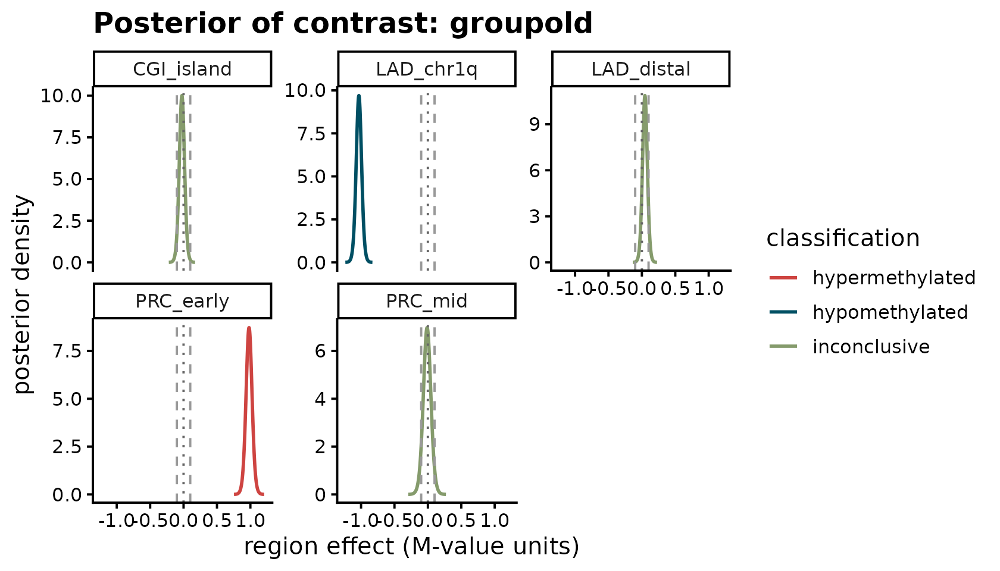
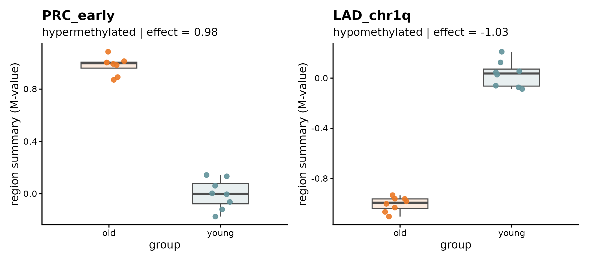
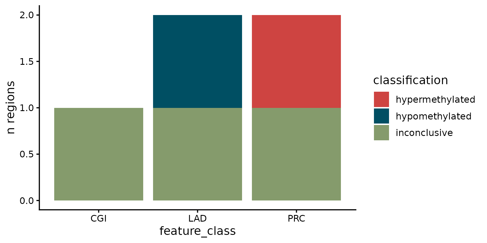

# Intro to BREAD

## What BREAD is for

Many methylation studies are not purely discovery-oriented. Instead of
asking *“which CpGs are significant genome-wide?”*, the question is
often:

- Are **PRC2 target regions** hypermethylated in old vs. young samples?
- Do **bivalent promoters** coherently lose methylation after treatment?
- Among my **predefined chromatin classes** (LADs, PMDs, CGIs, …), which
  show strong directional evidence at a biologically meaningful effect
  size?

Existing tooling is strong for genome-wide hypothesis testing, but
answering those questions directly benefits from:

1.  **region-centric** inference (one answer per region, not per CpG),
2.  **threshold-based** decisions on biologically meaningful effect
    sizes,
3.  **posterior probabilities** rather than p-values,
4.  *borrowing strength across probes inside a region.*

BREAD provides a minimal, interpretable Bayesian workflow for exactly
these targeted questions, built around `SummarizedExperiment` and
`GRanges`.

## Install and load

``` r
library(BREAD)
library(SummarizedExperiment)
library(GenomicRanges)
library(ggplot2)
library(patchwork)
```

## Build a toy young-vs-old methylation experiment

We simulate 60 CpG probes on chromosome 1 spaced every 1 kb, across 16
samples (8 young, 8 old). We define five regions of interest — a mix of
PRC-like, CGI-like, and LAD-like feature classes — and inject a strong
hyper or hypo signal into a few of them so we can see BREAD recover
them.

``` r
n_probes  <- 60L
n_samples <- 16L

# Probe-level GRanges (rowRanges of the SE)
probes <- GRanges(
  seqnames = "chr1",
  ranges   = IRanges(start = seq(1L, by = 1000L, length.out = n_probes),
                     width = 1L)
)
names(probes) <- sprintf("cg%04d", seq_len(n_probes))

# Sample metadata
coldata <- S4Vectors::DataFrame(
  group = factor(rep(c("young", "old"), each = n_samples / 2),
                 levels = c("young", "old")),
  sex   = factor(rep(c("F", "M"), length.out = n_samples)),
  row.names = sprintf("S%02d", seq_len(n_samples))
)

# Baseline M-values: noise centered at 0
X <- matrix(
  rnorm(n_probes * n_samples, mean = 0, sd = 0.3),
  nrow = n_probes,
  dimnames = list(names(probes), rownames(coldata))
)

# Regions we care about (biologically predefined sets)
regions <- GRanges(
  seqnames = "chr1",
  ranges   = IRanges(
    start = c(    1L, 10001L, 20001L, 30001L, 45001L),
    end   = c(10000L, 19000L, 28000L, 40000L, 55000L)
  ),
  feature_class = c("PRC", "CGI", "LAD", "PRC", "LAD")
)
names(regions) <- c("PRC_early", "CGI_island", "LAD_chr1q",
                    "PRC_mid",   "LAD_distal")

# Inject signal: in "old" samples, PRC_early gains ~1 M-value, LAD_chr1q loses ~1.
# CGI_island, PRC_mid, LAD_distal are left at baseline (should come out inconclusive).
old_mask <- coldata$group == "old"
probe_in <- function(gr) which(IRanges::overlapsAny(probes, gr))
X[probe_in(regions["PRC_early"]), old_mask] <-
  X[probe_in(regions["PRC_early"]), old_mask] + 1.0
X[probe_in(regions["LAD_chr1q"]), old_mask] <-
  X[probe_in(regions["LAD_chr1q"]), old_mask] - 1.0

se <- SummarizedExperiment(
  assays    = list(M = X),
  rowRanges = probes,
  colData   = coldata
)
se
#> class: RangedSummarizedExperiment 
#> dim: 60 16 
#> metadata(0):
#> assays(1): M
#> rownames(60): cg0001 cg0002 ... cg0059 cg0060
#> rowData names(0):
#> colnames(16): S01 S02 ... S15 S16
#> colData names(2): group sex
```

## Fit BREAD

One call maps probes to regions, summarizes them per sample, fits a
Bayesian region-level model, and classifies each region as *hyper*,
*hypo*, or *inconclusive*.

``` r
fit <- fit_bread(
  se,
  features    = regions,
  design      = ~ group + sex,
  contrast    = "groupold",
  assay_name  = "M",
  input_scale = "M",
  delta       = 0.10,
  prob_cutoff = 0.95,
  min_probes  = 3L,
  summary_fun = "mean",
  feature_class_col = "feature_class"
)
fit
#> <BreadFit>
#>   mode       : summary 
#>   backend    : conjugate 
#>   input_scale: M 
#>   assay      : M 
#>   contrast   : groupold 
#>   delta      : 0.1 
#>   prob_cutoff: 0.95 
#>   n_regions  : 5 (of  5  input)
#>   classifications:
#>     hypermethylated  1
#>     hypomethylated   1
#>     inconclusive     3
```

The `<BreadFit>` printout summarizes the pipeline: mode, backend,
contrast, thresholds, how many of the supplied regions survived
`min_probes`, and the distribution of classifications.

## Inspect the region-level results

``` r
res <- results(fit)
res[, c("region_id", "mean_effect", "ci_lo", "ci_hi",
        "p_gt_delta", "p_lt_neg_delta", "classification")]
#>    region_id mean_effect       ci_lo       ci_hi   p_gt_delta p_lt_neg_delta
#> 1  PRC_early  0.98017219  0.88465179  1.07569258 1.000000e+00   2.873411e-14
#> 2 CGI_island -0.02473473 -0.10797932  0.05850987 2.929870e-03   3.665676e-02
#> 3  LAD_chr1q -1.03250811 -1.11838170 -0.94663451 2.664535e-15   1.000000e+00
#> 4    PRC_mid -0.01130561 -0.13071647  0.10810526 3.282904e-02   6.745762e-02
#> 5 LAD_distal  0.04565912 -0.03097703  0.12229528 7.613802e-02   4.852137e-04
#>    classification
#> 1 hypermethylated
#> 2    inconclusive
#> 3  hypomethylated
#> 4    inconclusive
#> 5    inconclusive
```

For a quick vector mapping region → call:

``` r
classifications(fit)
#>         PRC_early        CGI_island         LAD_chr1q           PRC_mid 
#> "hypermethylated"    "inconclusive"  "hypomethylated"    "inconclusive" 
#>        LAD_distal 
#>    "inconclusive"
```

## Visualize

BREAD ships three plot helpers — all returning `ggplot` objects, all
themed with the embedded MetBrewer *Cross* palette via
[`bread_colors()`](https://baczemin.github.io/BREAD/reference/bread_colors.md).

### 1. Posterior of the contrast coefficient

The analytical posterior of each region’s `groupold` effect is a
location-scale Student-t. BREAD plots it with dashed guides at ±δ.

``` r
plot_region_posterior(fit)
```



### 2. Raw region-level values by group

Region-level summaries plotted against the first design variable.

``` r
p_hyper <- plot_region_data(fit, "PRC_early")
p_hypo  <- plot_region_data(fit, "LAD_chr1q")
p_hyper | p_hypo
```



### 3. Classification summary by feature class

``` r
plot_feature_set(fit, feature_class_col = "feature_class")
```



### Posterior samples

When you need draws (for custom plots, downstream uncertainty
propagation, or reporting),
[`posterior_draws()`](https://baczemin.github.io/BREAD/reference/posterior_draws.md)
samples from the analytical scaled-t:

``` r
d <- posterior_draws(fit, region_id = "PRC_early", n = 2000L, seed = 1L)
head(d, 4)
#>   region_id draw     value
#> 1 PRC_early    1 0.9519647
#> 2 PRC_early    2 0.9500557
#> 3 PRC_early    3 0.9982079
#> 4 PRC_early    4 0.9664424
quantile(d$value, c(0.025, 0.5, 0.975))
#>      2.5%       50%     97.5% 
#> 0.8828590 0.9810088 1.0720593
```

## What the model is doing (under the hood)

For each region *r*, BREAD (v1) fits a conjugate Normal–Inverse-Gamma
regression on the summarized region values:

$$y_{ir} \sim \mathcal{N}(X_{i}\beta_{r},\ \sigma_{r}^{2}),\quad\beta_{r} \mid \sigma_{r}^{2} \sim \mathcal{N}\left( \mu_{0},\ \sigma_{r}^{2}\Lambda_{0}^{- 1} \right),\quad\sigma_{r}^{2} \sim \text{Inv-Gamma}\left( a_{0},b_{0} \right).$$

The posterior has a closed form. After the update, the **marginal**
posterior of any single coefficient is a location-scale Student-*t*:

$$\beta_{r,k} \mid y \sim t_{2a_{n}}\!\left( \mu_{n,k},\ \frac{b_{n}}{a_{n}}\left\lbrack \Lambda_{n}^{- 1} \right\rbrack_{kk} \right),$$

which is what BREAD uses to compute posterior probabilities directly via
[`pt()`](https://rdrr.io/r/stats/TDist.html) /
[`qt()`](https://rdrr.io/r/stats/TDist.html) — no MCMC. This keeps v1
fast, deterministic, and trivially installable. Partial pooling across
regions and MCMC-backed priors are planned for the hierarchical mode in
v2.

Posterior probabilities that drive classification:

- $P\left( \beta_{r,k} > \delta \mid y \right)$ → if
  $\geq$`prob_cutoff`, classify as **hypermethylated**
- $P\left( \beta_{r,k} < - \delta \mid y \right)$ → if
  $\geq$`prob_cutoff`, classify as **hypomethylated**
- otherwise **inconclusive**.

You can customize the prior with
[`bread_prior()`](https://baczemin.github.io/BREAD/reference/bread_prior.md):

``` r
# A slightly tighter prior on coefficients
prior <- bread_prior(lambda0 = 0.1, a0 = 1, b0 = 1)
fit2  <- fit_bread(se, regions, ~ group, "groupold", prior = prior,
                   feature_class_col = "feature_class")
classifications(fit2)
#>         PRC_early        CGI_island         LAD_chr1q           PRC_mid 
#> "hypermethylated"    "inconclusive"  "hypomethylated"    "inconclusive" 
#>        LAD_distal 
#>    "inconclusive"
```

## Session info

``` r
sessionInfo()
#> R version 4.5.3 (2026-03-11)
#> Platform: x86_64-pc-linux-gnu
#> Running under: Ubuntu 24.04.4 LTS
#> 
#> Matrix products: default
#> BLAS:   /usr/lib/x86_64-linux-gnu/openblas-pthread/libblas.so.3 
#> LAPACK: /usr/lib/x86_64-linux-gnu/openblas-pthread/libopenblasp-r0.3.26.so;  LAPACK version 3.12.0
#> 
#> locale:
#>  [1] LC_CTYPE=C.UTF-8       LC_NUMERIC=C           LC_TIME=C.UTF-8       
#>  [4] LC_COLLATE=C.UTF-8     LC_MONETARY=C.UTF-8    LC_MESSAGES=C.UTF-8   
#>  [7] LC_PAPER=C.UTF-8       LC_NAME=C              LC_ADDRESS=C          
#> [10] LC_TELEPHONE=C         LC_MEASUREMENT=C.UTF-8 LC_IDENTIFICATION=C   
#> 
#> time zone: UTC
#> tzcode source: system (glibc)
#> 
#> attached base packages:
#> [1] stats4    stats     graphics  grDevices utils     datasets  methods  
#> [8] base     
#> 
#> other attached packages:
#>  [1] patchwork_1.3.2             ggplot2_4.0.2              
#>  [3] SummarizedExperiment_1.40.0 Biobase_2.70.0             
#>  [5] GenomicRanges_1.62.1        Seqinfo_1.0.0              
#>  [7] IRanges_2.44.0              S4Vectors_0.48.1           
#>  [9] BiocGenerics_0.56.0         generics_0.1.4             
#> [11] MatrixGenerics_1.22.0       matrixStats_1.5.0          
#> [13] BREAD_0.0.0.9000           
#> 
#> loaded via a namespace (and not attached):
#>  [1] sass_0.4.10         SparseArray_1.10.10 lattice_0.22-9     
#>  [4] digest_0.6.39       magrittr_2.0.5      evaluate_1.0.5     
#>  [7] grid_4.5.3          RColorBrewer_1.1-3  fastmap_1.2.0      
#> [10] jsonlite_2.0.0      Matrix_1.7-4        scales_1.4.0       
#> [13] textshaping_1.0.5   jquerylib_0.1.4     abind_1.4-8        
#> [16] cli_3.6.6           rlang_1.2.0         XVector_0.50.0     
#> [19] withr_3.0.2         cachem_1.1.0        DelayedArray_0.36.1
#> [22] yaml_2.3.12         S4Arrays_1.10.1     tools_4.5.3        
#> [25] dplyr_1.2.1         vctrs_0.7.3         R6_2.6.1           
#> [28] lifecycle_1.0.5     fs_2.1.0            ragg_1.5.2         
#> [31] pkgconfig_2.0.3     desc_1.4.3          pkgdown_2.2.0      
#> [34] bslib_0.10.0        pillar_1.11.1       gtable_0.3.6       
#> [37] glue_1.8.1          systemfonts_1.3.2   tidyselect_1.2.1   
#> [40] tibble_3.3.1        xfun_0.57           knitr_1.51         
#> [43] farver_2.1.2        htmltools_0.5.9     labeling_0.4.3     
#> [46] rmarkdown_2.31      compiler_4.5.3      S7_0.2.1-1
```
