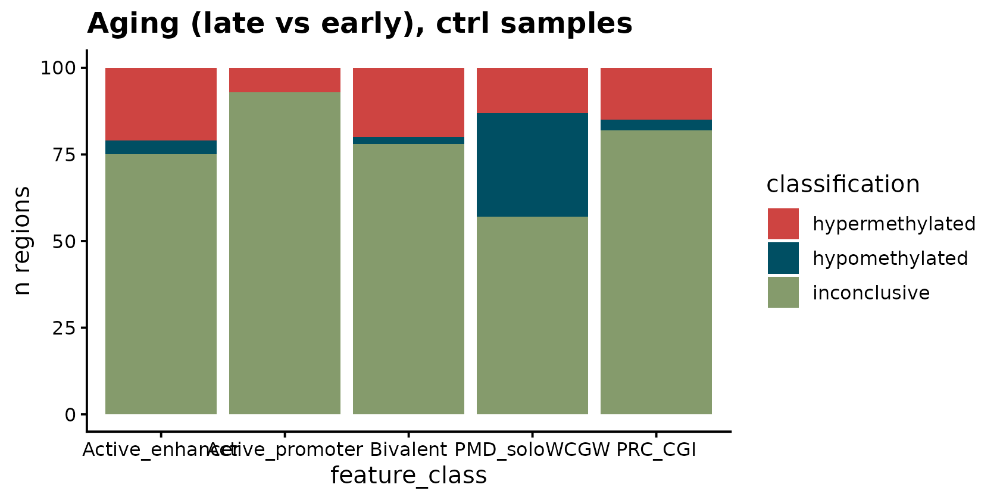
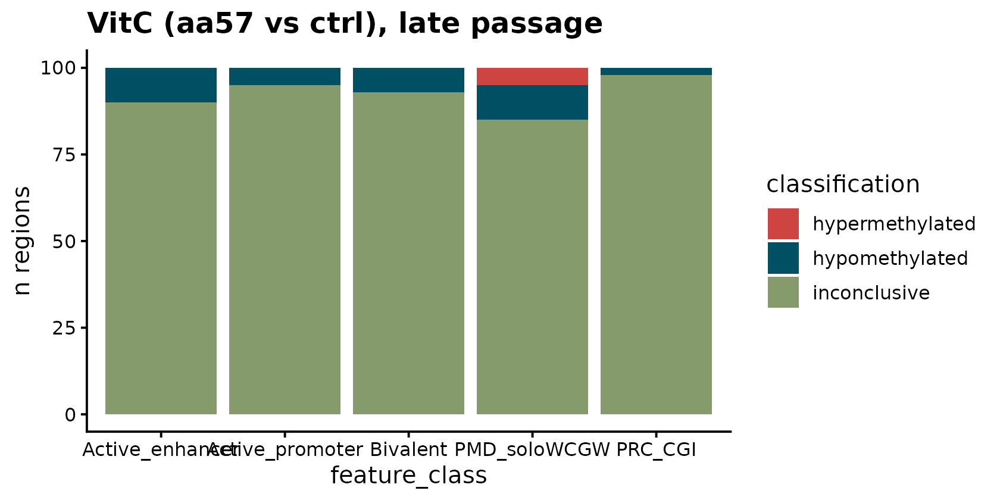
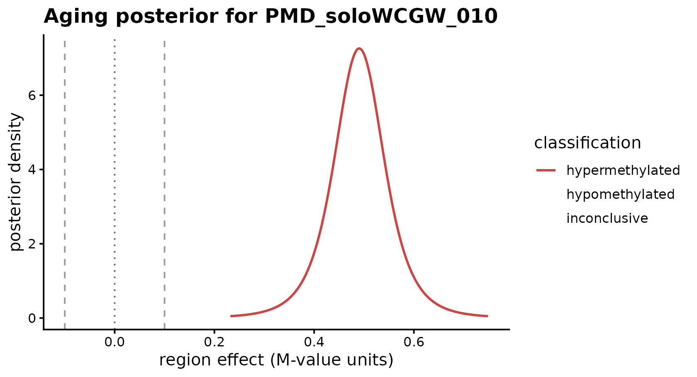
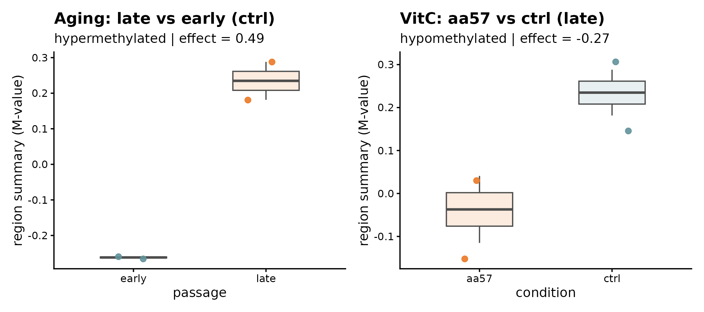
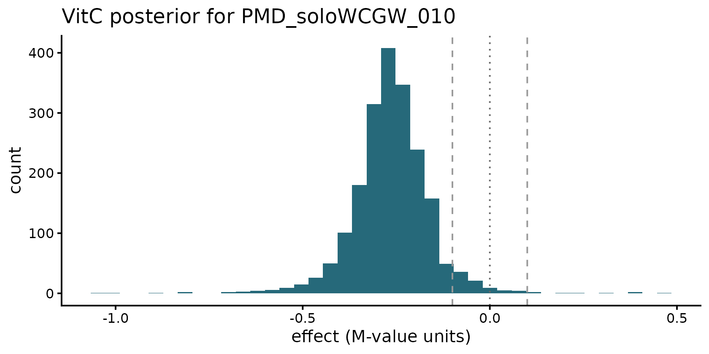

# BREAD on real EPICv2 data: vitamin C in serially passaged fibroblasts

## Biological question

Ascorbic acid (vitamin C) is a cofactor for TET dioxygenases, which
oxidize 5mC → 5hmC → 5fC → 5caC and drive active DNA demethylation. TET
activity is thought to protect CpG islands from aberrant age-associated
hypermethylation. In serially passaged human fibroblasts, two CpG sets
consistently change:

- **PRC-CGI** (Polycomb-marked CpG islands, H3K27me3 ∩ CGI) **gain**
  methylation with passage number;
- **PMD-soloWCGW** (late-replicating solo-WCGW CpGs within partially
  methylated domains) **lose** methylation with passage number.

The question the experiment asks: *does VitC supplementation attenuate
either signal?* A conventional probe-level DMP pipeline reports
significant CpGs; BREAD asks the complementary, region-centric question
directly:

> For each predefined feature region, what is the posterior probability
> that the methylation effect exceeds a biologically meaningful
> threshold?

## The packaged data

BREAD ships a small (~0.5 MB) subset of a real EPICv2 experiment from
our lab — 8 arrays on AG06561 fetal skin fibroblasts across a 2 × 2
design (condition × passage × 2 technical replicates). The data-raw
builder is `data-raw/make_vitc_extdata.R` (in the source repository).

``` r
library(BREAD)
library(SummarizedExperiment)
library(GenomicRanges)
library(ggplot2)
library(patchwork)

se  <- readRDS(system.file("extdata", "vitc_ag06561.rds", package = "BREAD"))
reg <- readRDS(system.file("extdata", "vitc_regions.rds", package = "BREAD"))
se
#> class: RangedSummarizedExperiment 
#> dim: 6716 8 
#> metadata(0):
#> assays(1): betas
#> rownames(6716): cg00003513 cg00004633 ... cg27639620 cg27642771
#> rowData names(7): Probe_ID CpG_Island ... H3K27AC H3K4ME3
#> colnames(8): 209725120091_R01C01 209725120091_R02C01 ...
#>   209725120091_R07C01 209725120091_R08C01
#> colData names(16): total_num batch_num ... sample_label group
```

``` r
as.data.frame(colData(se)[, c("condition", "passage", "replicate")])
#>                     condition passage replicate
#> 209725120091_R01C01      ctrl   early         1
#> 209725120091_R02C01      ctrl    late         1
#> 209725120091_R03C01      ctrl   early         2
#> 209725120091_R04C01      ctrl    late         2
#> 209725120091_R05C01      aa57   early         1
#> 209725120091_R06C01      aa57    late         1
#> 209725120091_R07C01      aa57   early         2
#> 209725120091_R08C01      aa57    late         2
```

``` r
length(reg); table(reg$feature_class)
#> [1] 500
#> 
#> Active_enhancer Active_promoter        Bivalent    PMD_soloWCGW         PRC_CGI 
#>             100             100             100             100             100
```

Five feature classes, 100 regions each, all on autosomes, each region
spanning ≥ 3 EPICv2 probes after a ±2 kb merge. `reg$feature_class` will
drive the
[`plot_feature_set()`](https://baczemin.github.io/BREAD/reference/plot_feature_set.md)
stratification below.

## Aging contrast in ctrl samples

Under the `ctrl` condition (no VitC), BREAD should recover the
well-known aging signatures: PRC-CGI hypermethylation and PMD-soloWCGW
hypomethylation.

``` r
se_ctrl <- se[, colData(se)$condition == "ctrl"]
fit_aging <- fit_bread(
  se            = se_ctrl,
  features      = reg,
  design        = ~ passage,
  contrast      = "passagelate",
  assay_name    = "betas",
  input_scale   = "Beta",
  delta         = 0.10,
  prob_cutoff   = 0.95,
  min_probes    = 3L,
  summary_fun   = "mean",
  feature_class_col = "feature_class"
)
#> Loading required namespace: GenomeInfoDb
fit_aging
#> <BreadFit>
#>   mode       : summary 
#>   backend    : conjugate 
#>   input_scale: Beta 
#>   assay      : betas 
#>   contrast   : passagelate 
#>   delta      : 0.1 
#>   prob_cutoff: 0.95 
#>   n_regions  : 500 (of  500  input)
#>   classifications:
#>     hypermethylated  76
#>     hypomethylated   39
#>     inconclusive     385
```

### Classifications by class

``` r
mp       <- unique(fit_aging@mapping[, c("region_id", "feature_class")])
res_a    <- merge(results(fit_aging)[, c("region_id", "classification")],
                  mp, by = "region_id")
table(res_a$feature_class, res_a$classification)
#>                  
#>                   hypermethylated hypomethylated inconclusive
#>   Active_enhancer              21              4           75
#>   Active_promoter               7              0           93
#>   Bivalent                     20              2           78
#>   PMD_soloWCGW                 13             30           57
#>   PRC_CGI                      15              3           82
```

As expected: - **PRC-CGI and Bivalent** regions skew strongly toward
`hypermethylated` with passage. - **PMD-soloWCGW** regions skew strongly
toward `hypomethylated`. - **Active promoters** and **active enhancers**
are largely `inconclusive` with this sample size (n = 2 per passage),
consistent with the weaker direct effect at those regulatory elements.

### Bird’s-eye plot

``` r
plot_feature_set(fit_aging, feature_class_col = "feature_class") +
  ggtitle("Aging (late vs early), ctrl samples")
```



## VitC contrast at late passage

Now condition on late passage and test whether ascorbic acid
supplementation demethylates any regions.

``` r
se_late <- se[, colData(se)$passage == "late"]
fit_vitc <- fit_bread(
  se            = se_late,
  features      = reg,
  design        = ~ condition,
  contrast      = "conditionaa57",
  assay_name    = "betas",
  input_scale   = "Beta",
  delta         = 0.10,
  prob_cutoff   = 0.95,
  min_probes    = 3L,
  feature_class_col = "feature_class"
)
fit_vitc
#> <BreadFit>
#>   mode       : summary 
#>   backend    : conjugate 
#>   input_scale: Beta 
#>   assay      : betas 
#>   contrast   : conditionaa57 
#>   delta      : 0.1 
#>   prob_cutoff: 0.95 
#>   n_regions  : 500 (of  500  input)
#>   classifications:
#>     hypermethylated  5
#>     hypomethylated   34
#>     inconclusive     461
```

``` r
res_v <- merge(results(fit_vitc)[, c("region_id", "classification")],
               mp, by = "region_id")
table(res_v$feature_class, res_v$classification)
#>                  
#>                   hypermethylated hypomethylated inconclusive
#>   Active_enhancer               0             10           90
#>   Active_promoter               0              5           95
#>   Bivalent                      0              7           93
#>   PMD_soloWCGW                  5             10           85
#>   PRC_CGI                       0              2           98
```

``` r
plot_feature_set(fit_vitc, feature_class_col = "feature_class") +
  ggtitle("VitC (aa57 vs ctrl), late passage")
```



VitC demethylation is broadly distributed but, with only two replicates
per arm, most regions land in the `inconclusive` class at
`prob_cutoff = 0.95`. This is BREAD doing its job — it does not claim
more certainty than the sample size supports.

## The biologically interesting intersection

The most interpretable cross-tab is *aging × VitC*: which regions that
hypermethylate with aging are demethylated by vitamin C?

``` r
a <- classifications(fit_aging)
v <- classifications(fit_vitc)
common <- intersect(names(a), names(v))
xt <- table(aging = a[common], vitc = v[common])
xt
#>                  vitc
#> aging             hypermethylated hypomethylated inconclusive
#>   hypermethylated               0             17           59
#>   hypomethylated                4              2           33
#>   inconclusive                  1             15          369
```

The **aging-hyper ∩ VitC-hypo** cell contains the candidate
*VitC-responsive aging hypermethylation* regions — the mechanistic story
the project is chasing.

``` r
protected <- names(a)[a == "hypermethylated" & v == "hypomethylated"]
length(protected)
#> [1] 17
# Feature-class composition of the protected set
table(mp$feature_class[mp$region_id %in% protected])
#> 
#> Active_enhancer Active_promoter        Bivalent    PMD_soloWCGW         PRC_CGI 
#>               4               1               6               5               1
```

The protected set is enriched in **PRC-CGI / Bivalent** regions —
consistent with vitamin C’s known role as a CpG-island guardian via TET
recruitment.

## Zooming in on one region

``` r
if (length(protected) > 0L) {
  rid <- protected[1]
  rid
  plot_region_posterior(fit_aging, region_id = rid) +
    ggtitle(sprintf("Aging posterior for %s", rid))
}
```



``` r
if (length(protected) > 0L) {
  rid <- protected[1]
  p_aging <- plot_region_data(fit_aging, rid) +
    ggtitle("Aging: late vs early (ctrl)")
  p_vitc  <- plot_region_data(fit_vitc,  rid) +
    ggtitle("VitC: aa57 vs ctrl (late)")
  p_aging + p_vitc
}
```



``` r
if (length(protected) > 0L) {
  rid <- protected[1]
  d <- posterior_draws(fit_vitc, region_id = rid, n = 2000L, seed = 1L)
  ggplot(d, aes(x = value)) +
    geom_histogram(fill = bread_colors("classification")[["hypomethylated"]],
                   bins = 40, alpha = 0.85) +
    geom_vline(xintercept = c(-0.10, 0, 0.10),
               linetype = c("dashed","dotted","dashed"),
               color = c("gray60","gray40","gray60")) +
    labs(title = sprintf("VitC posterior for %s", rid),
         x = "effect (M-value units)", y = "count") +
    theme_classic(base_size = 12)
}
```



## Caveats

- **n = 2 per arm.** The credible intervals are wide and many regions
  remain `inconclusive`. BREAD’s posterior probabilities are the honest
  answer given the data; lowering `prob_cutoff` to, say, `0.80` will
  promote more regions to `hyper` / `hypo` but also admit more false
  positives.
- Technical replicates, not biological. Real variance in the `aa57`
  effect across fibroblast lines is not captured by this experiment and
  would produce additional dispersion if included.
- Feature-class regions here are constructed from the EPICv2 manifest’s
  probe-level annotations (CGI, PMD, histone marks) by merging nearby
  annotated probes. Users should consider higher-resolution external
  references (ENCODE chromHMM, segway, compartment-aware WGBS-derived
  PMD calls) when the question demands it.

## Session info

``` r
sessionInfo()
#> R version 4.5.3 (2026-03-11)
#> Platform: x86_64-pc-linux-gnu
#> Running under: Ubuntu 24.04.4 LTS
#> 
#> Matrix products: default
#> BLAS:   /usr/lib/x86_64-linux-gnu/openblas-pthread/libblas.so.3 
#> LAPACK: /usr/lib/x86_64-linux-gnu/openblas-pthread/libopenblasp-r0.3.26.so;  LAPACK version 3.12.0
#> 
#> locale:
#>  [1] LC_CTYPE=C.UTF-8       LC_NUMERIC=C           LC_TIME=C.UTF-8       
#>  [4] LC_COLLATE=C.UTF-8     LC_MONETARY=C.UTF-8    LC_MESSAGES=C.UTF-8   
#>  [7] LC_PAPER=C.UTF-8       LC_NAME=C              LC_ADDRESS=C          
#> [10] LC_TELEPHONE=C         LC_MEASUREMENT=C.UTF-8 LC_IDENTIFICATION=C   
#> 
#> time zone: UTC
#> tzcode source: system (glibc)
#> 
#> attached base packages:
#> [1] stats4    stats     graphics  grDevices utils     datasets  methods  
#> [8] base     
#> 
#> other attached packages:
#>  [1] patchwork_1.3.2             ggplot2_4.0.2              
#>  [3] SummarizedExperiment_1.40.0 Biobase_2.70.0             
#>  [5] GenomicRanges_1.62.1        Seqinfo_1.0.0              
#>  [7] IRanges_2.44.0              S4Vectors_0.48.1           
#>  [9] BiocGenerics_0.56.0         generics_0.1.4             
#> [11] MatrixGenerics_1.22.0       matrixStats_1.5.0          
#> [13] BREAD_0.0.0.9000           
#> 
#> loaded via a namespace (and not attached):
#>  [1] sass_0.4.10         SparseArray_1.10.10 lattice_0.22-9     
#>  [4] digest_0.6.39       magrittr_2.0.5      evaluate_1.0.5     
#>  [7] grid_4.5.3          RColorBrewer_1.1-3  fastmap_1.2.0      
#> [10] jsonlite_2.0.0      Matrix_1.7-4        GenomeInfoDb_1.46.2
#> [13] httr_1.4.8          UCSC.utils_1.6.1    scales_1.4.0       
#> [16] textshaping_1.0.5   jquerylib_0.1.4     abind_1.4-8        
#> [19] cli_3.6.6           rlang_1.2.0         XVector_0.50.0     
#> [22] withr_3.0.2         cachem_1.1.0        DelayedArray_0.36.1
#> [25] yaml_2.3.12         S4Arrays_1.10.1     tools_4.5.3        
#> [28] dplyr_1.2.1         vctrs_0.7.3         R6_2.6.1           
#> [31] lifecycle_1.0.5     fs_2.1.0            ragg_1.5.2         
#> [34] pkgconfig_2.0.3     desc_1.4.3          pkgdown_2.2.0      
#> [37] bslib_0.10.0        pillar_1.11.1       gtable_0.3.6       
#> [40] glue_1.8.1          systemfonts_1.3.2   tidyselect_1.2.1   
#> [43] tibble_3.3.1        xfun_0.57           knitr_1.51         
#> [46] farver_2.1.2        htmltools_0.5.9     labeling_0.4.3     
#> [49] rmarkdown_2.31      compiler_4.5.3      S7_0.2.1-1
```
